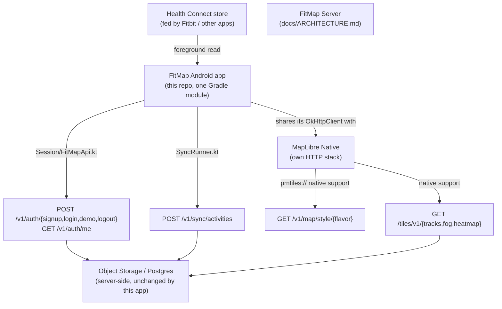

# FitMap for Android: Architecture

The canonical reference for *how the Android app is put together* — its shape, the decisions behind it, and the stack. `apps/android/docs/IMPLEMENTATION.md` picks up from here with the file-by-file "how it's built" detail; this document does not duplicate that. `docs/ARCHITECTURE.md` covers the system this app is one client of — the server, the three ingest paths, the shared style document — and is assumed background throughout.

> **Scope note.** This app is Path 2 of `docs/adr/0001-three-independent-ingest-paths.md` — an on-device ingest client reading Health Connect — plus a full map viewer against the same accounts and the same style document the web client uses. It does not record activities and never will (`docs/VISION.md` §1.1): Health Connect is a *read*, not a GPS logger the app runs itself.

---

## 1. Architecture Overview

The Android app is a **single Gradle module against the platform SDK directly** — no architecture framework (no MVVM, no Compose, no dependency-injection library), no networking framework (`OkHttp` calls built by hand, no Retrofit), and no local database (two `SharedPreferences` files hold everything the app persists). Five Activities, seven Kotlin files outside them, one `OkHttpClient` shared with the map SDK. This is a deliberate match to the app's actual size: five screens and five server calls do not carry the weight of a framework, and every dependency not taken is a version not to track and a surface not to secure.

The app has **no local write path of its own**. Everything it shows — the map, the tracks, the sync history — is a read against the same server the web client reads, and the one thing it *sends* (Health Connect sync batches) is normalized on-device and handed to the same ingestion pipeline every other path already runs through (`docs/IMPLEMENTATION.md` §4.0–§4.1). This keeps the client thin by construction: there is no activity model, no local cache to keep coherent, and no offline-write story to build, because the app is a viewer and a syncer, not a second source of truth.

**The sync path and the display path are two disjoint, one-way pipes that never intersect on-device.** `sync/SyncRunner.kt` reads Health Connect and posts to `POST /v1/sync/activities`; `map/MapOverlays.kt` reads map tiles from `GET /tiles/v1/{tracks,fog,heatmap}` — both always against `BuildConfig.API_BASE_URL`, i.e. the FitMap server, never Health Connect. There is no code path anywhere in this app that renders a Health Connect record directly onto the map, and no code path in the sync engine that reads a tile. Once an activity has been synced, the app has no memory of it having come from Health Connect at all — the map renders the account's server-side history exactly as it would for a file upload or a cloud-provider push, and would keep working identically if Health Connect were removed entirely and every activity arrived by upload instead.

### 1.1 Key decisions and their reasons

| Decision | Reason |
| :--- | :--- |
| Views + AppCompat, not Compose | The four screens predate the design freeze (root `docs/ROADMAP.md` Phase 3, after Mobile); Compose vs. Views is Phase 5's first open decision (`apps/android/docs/ROADMAP.md`, "Decide the UI toolkit"), not yet made |
| Bearer token (`Authorization: Bearer <session-id>`), not a cookie jar | Two separate HTTP stacks need the credential — the app's own client and MapLibre Native's internal tile fetcher, which never sees the app's cookie jar. A per-request interceptor reaches both; a cookie jar reaches only one — [ADR-0001](../../../docs/adr/0001-three-independent-ingest-paths.md), `apps/android/docs/ROADMAP.md` |
| One shared `OkHttpClient` for the app *and* for MapLibre Native | `HttpRequestUtil.setOkHttpClient` (`FitMapApplication.onCreate`) replaces the map SDK's own client with the app's, so one interceptor is the only place the token can go missing from |
| Foreground-only Health Connect sync — no background service, no `WorkManager` job | `ExerciseRouteResult.ConsentRequired` comes back for background reads regardless of grant state (measured, Phase 1) — a background sync would advance the watermark past routes it never actually read, producing a history complete except for the map |
| Session token in plain `SharedPreferences`, not an encrypted store | The file is already unreadable by other apps; the threat an encrypted store defends against already has everything else the app holds. Revocation, not encryption, is what bounds a leaked token — signing out deletes the server-side row |
| Callback-based HTTP for four of five endpoints; `suspend`/coroutines only for sync | Five call sites don't justify a coroutines runtime on their own — Health Connect's read API leaves no other choice for sync, so coroutines are pulled in for that alone |
| No ORM, no Retrofit, no query builder | Same reasoning as the server's own no-ORM decision (`docs/ARCHITECTURE.md` §2) scaled down: five endpoints and a handful of JSON shapes don't amortize a networking framework |
| `fitmap/` is its own Gradle build, not a module beside `poc-healthconnect/` | `poc-healthconnect/` is a throwaway Phase 1 diagnostic, deleted once its findings are recorded (`apps/android/docs/ROADMAP.md`); the real app was never meant to carry it |
| Host toolchain, not containerized | Health Connect testing needs a physical device over `adb`, and there is no emulator system image on this machine — a container buys nothing that isn't already true on the host (`apps/android/README.md`) |
| `minSdk` 34 | Android 14 is where Health Connect became part of the platform. Below it, Health Connect is a Play-installed APK the app would have to detect, route the user into installing, and re-check — a second provider state machine never exercised by Phase 1's findings |

### 1.2 Where this app sits in the wider system

This app is the smaller of the two boxes root `docs/ARCHITECTURE.md` §1.2 draws as "Mobile Apps" and "Path 2: Apple Watch, Galaxy Watch" — today it is Android only, iOS does not exist yet, and it is built first specifically so the Path 2 sync contract (`POST /v1/sync/activities`'s payload shape and idempotency semantics) is designed against the more constrained of the two platforms (`apps/android/docs/ROADMAP.md`, "Where this sits in the wider plan").

**All three ingest paths still converge on one pipeline.** This app's contribution is entirely on the "how bytes arrive" side of that boundary (`docs/ARCHITECTURE.md` §1.2): it reads Health Connect, normalizes to the wire shape `docs/IMPLEMENTATION.md` §4.0.3 defines, and posts it. Everything from parse onward is server code this app does not touch and does not need to know about.

### 1.3 Deliberately deferred

| Component | Add it when |
| :--- | :--- |
| Compose | The UI toolkit decision (Phase 5) lands on it — not blocked on the design freeze itself, and worth deciding early since it changes the cost of everything after it |
| A design system / token set | The design freeze (root `docs/ROADMAP.md` Phase 3) ships its output for this app to adopt — see `apps/android/docs/ROADMAP.md` Phase 5 |
| Date-range / type / hidden-track filters on the map | Phase 5's "Filter controls" item — fitting the web's date-range picker and eye-icon set onto a phone is a design problem before an implementation one |
| Background sync of any kind | Never, for Health Connect routes specifically — the platform constraint this app is built around, not a sequencing gap |
| An encrypted token store | A threat model beyond "physical access to the device's own private storage" is identified — not the case today |
| iOS client | Path 2's contract is proven out and stable against this app first (`apps/android/docs/ROADMAP.md`) |
| Automated instrumentation/unit tests | Never formally scheduled; today's verification is exclusively manual, device-level, and recorded narratively in `apps/android/docs/ROADMAP.md` — see `apps/android/docs/IMPLEMENTATION.md` §8 |

---

## 2. Technical Stack

* **Language**: **Kotlin**, targeting the platform SDK directly — `androidx.appcompat` Views (`AppCompatActivity`, `findViewById`), not Compose. AGP 9's built-in Kotlin support is used directly; the separate `org.jetbrains.kotlin.android` plugin is not applied (applying it alongside AGP 9's built-in support is an error).
* **Build**: Gradle 9.4.0 (Android Gradle Plugin), wrapped (`./gradlew`) so the wrapper pins the version rather than depending on whatever Gradle happens to be on the host. JDK 17 or 21 — the range the Android Gradle Plugin supports. `compileSdk`/`targetSdk` 37, `minSdk` 34 (§1.1). Not containerized: the SDK (`/opt/homebrew/share/android-commandlinetools`, platform + build-tools 37), `adb`, and the physical device Health Connect testing needs all live on the host, per `apps/android/README.md`.
* **Map rendering**: **MapLibre Native** (`org.maplibre.gl:android-sdk`) 13.6.1 — chosen at 11.8.0+ specifically because that's where built-in, native `pmtiles://` support landed (refined through 13.0.2's tile-compression handling and 13.3.0's ambient cache), so the app needs neither a custom PMTiles reader nor a server-side `{z}/{x}/{y}` re-tiling endpoint (`docs/ARCHITECTURE.md` §2's web-side pmtiles JS plugin has no Android equivalent to write). Consumes the exact style document `GET /v1/map/style/{flavor}` serves, via `Style.Builder().fromUri(...)` — nothing reimplemented (§2.1).
* **Networking**: **OkHttp** 4.12.0 directly — declared as an explicit dependency (not left as MapLibre's transitive one) because the app builds its own `OkHttpClient` and hands that same instance to the map SDK (`net/FitMapApi.kt`), so the version is a direct compile dependency, not an implementation detail of the map library. Pinned to the version MapLibre 13.6.1's own POM already resolves to. No Retrofit, no Moshi/Gson — five endpoints are read and written with `org.json` directly.
* **Health data**: `androidx.health.connect:connect-client` 1.1.0 (current stable at build time; the Phase 1 proof-of-concept that established this platform's actual behavior ran against the same version, so the shipped app is verified against the surface it targets, not a newer one that might behave differently).
* **Concurrency**: `kotlinx-coroutines-android` 1.10.2 + `androidx.lifecycle:lifecycle-runtime-ktx` 2.9.4, scoped narrowly to the sync run — every `HealthConnectClient` read is a suspend function, so this is a platform requirement, not a style choice. The `lifecycleScope` a coroutine launches into is what ties the sync run to `SyncActivity`'s own foreground lifetime.
* **Local persistence**: two `SharedPreferences` files, both `MODE_PRIVATE`, no schema migration story because there is no schema — `fitmap.session` (the bearer token and email) and `fitmap.sync` (the per-account watermark, §1.1). Nothing else is persisted on-device.

### 2.1 One style document, consumed unmodified

`buildStyle()` in the web client (`apps/web/src/map/style.ts`) remains the single definition of FitMap's map style, served as a document by `GET /v1/map/style/{flavor}` (`docs/ARCHITECTURE.md` §2.1). This app adds nothing to that pipeline: `MainActivity` calls `Style.Builder().fromUri(styleUrl())` with the served URL and renders exactly what comes back, archive URL included. Flavor selection is the one piece of client logic — `light` or `dark` of the five the API serves, chosen from `Configuration.UI_MODE_NIGHT_MASK` rather than an in-app preference, since the design pass (root `docs/ROADMAP.md` Phase 3) has not decided whether Android needs one (`apps/android/docs/ROADMAP.md` Phase 5).

Because MapLibre Native reads `pmtiles://` natively, the "why bake fog's inversion server-side" argument in `docs/ARCHITECTURE.md` §2.1 pays off a second time here for free: there is no shader to write against MapLibre Native's own bindings, because there is no shader on this client at all — fog and heatmap arrive as ready-to-draw RGBA PNGs the same way they do on web (`docs/IMPLEMENTATION.md` §4.2, §4.2.2).

**MapLibre Native's own HTTP layer is what fetches the style, the archive, and every tile** — a separate stack from the app's own `OkHttpClient`, unless explicitly replaced. `FitMapApplication.onCreate` does exactly that (`HttpRequestUtil.setOkHttpClient`), which is the mechanism the mobile auth decision in `apps/android/docs/ROADMAP.md` depends on: one client, one interceptor, both the app's API calls and the map's tile fetching carry the session credential the same way.
