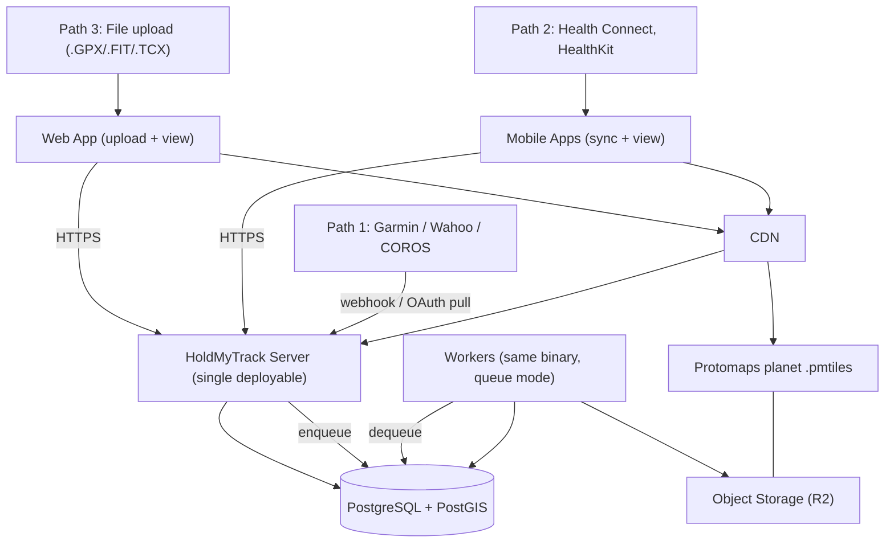

# HoldMyTrack: Architecture

The canonical reference for *how the system is put together* — the top-level shape, the key decisions behind it, the stack, and what's deliberately not built yet. `docs/IMPLEMENTATION.md` picks up from here with the schema and the feature-by-feature "how it's built" detail (ingest, fog, tiles, accounts, deployment); this document does not duplicate that, and that document no longer duplicates this.

> **Scope note.** HoldMyTrack mainly ingests activities it didn't record. The one exception is casual, GPS-only recording in the mobile app itself (`VISION.md` §1.1, §4.1; built on Android, `SPEC.md` FR-3.8) — everything about how an activity reaches and moves through the system beyond that capture step is unchanged: a stopped recording submits through the same ingest pipeline every other source already uses (§1.1 below). There is still no social graph — see `VISION.md` §5.8 for why that stays out of scope.

---

## 1. Architecture Overview

HoldMyTrack is a **modular monolith** backed by PostgreSQL/PostGIS, fed by three independent ingest paths. Coverage rendering is precomputed on ingest rather than assembled per request, which is the central architectural decision and the one that keeps the rest simple.

A second constraint now shapes every decision: **the service is free and community-funded** (`VISION.md` §6), so per-user cost must be bounded by design. That is not a deployment concern to handle later; it changes the schema, the retention policy and the tile strategy. See `IMPLEMENTATION.md` §5.7.

### 1.1 Key decisions and their reasons

| Decision | Reason |
| :--- | :--- |
| One language, one deployable | Two stacks means two pipelines and two dependency trees for one maintainer, with no measured need |
| Precomputed **raster fog pyramid**, not per-request `ST_Union()` | A union of thousands of polygons, per user, per viewport, is the #1 scaling bottleneck. Raster also gives smooth edges instead of hexagon serration — [ADR-0003](adr/0003-precomputed-raster-fog-pyramid.md) |
| Coverage stored as **slippy tiles**, not H3 | H3 res 10 is ~130–150 m across, not the ~15 m originally assumed; slippy tiles align 1:1 with the MVT/raster grid — [ADR-0003](adr/0003-precomputed-raster-fog-pyramid.md) |
| **Index raw points; simplify only for display** | Douglas-Peucker deletes intermediate points, leaving gaps in the fog trail |
| **Segment-rasterized** coverage, not point-sampled | 1 Hz at 40 km/h is ~11 m between fixes — gappy at fine resolution |
| Postgres job queue, no broker | Premature at this scale, and a broker is a recurring bill a free service should not carry |
| Privacy applied **at ingest** | Fog maps point at people's homes; render-time filtering leaks through any downstream bug — [ADR-0002](adr/0002-privacy-applied-at-ingest.md); hidden areas are user-chosen Private locations, not a blanket endpoint trim — [ADR-0010](adr/0010-private-locations-replace-endpoint-trim.md) |
| **Three independent ingest paths** | No single provider can revoke the product (`VISION.md` §4.1) — [ADR-0001](adr/0001-three-independent-ingest-paths.md) |
| **Planet-wide basemap**, not a regional extract | Users are everywhere; a regional extract makes "blank map" the default outside one metro |
| **Country/Region zoom tiers are live vector tiles**, not a second precomputed raster pyramid | Their cost scales with a fixed ~250-country/~4,600-region boundary dataset, not with a user's own activity history — the scaling problem the fog raster pyramid exists to avoid never applies here — [ADR-0008](adr/0008-vector-tiles-for-country-region-boundary-tiers.md) |
| **Web pages are server-rendered HTML**; React only for the map page | Each page is one layout with a few per-user values — a template, which only the server can fill without client JS; every page gets a real URL, one shared header, and no map bundle to load first — [ADR-0012](adr/0012-server-rendered-pages-react-for-the-map.md) |
| **Admin panel in the app**, granted only from the server's CLI | Operators need to see accounts and activity ids without raw SQL on production; a flag only the server's shell can set keeps the web from ever being an escalation path, and non-admins get a 404 — [ADR-0013](adr/0013-admin-panel.md) |
| **Localization**: in-house catalogs, the language decided by the server | Two languages and a few hundred strings don't need three i18n libraries; the server picks one language per request (account setting → `Accept-Language` → English) and the map app reads it from `<html lang>`, so the page and the app never disagree — [ADR-0014](adr/0014-localization.md) |

### 1.2 Target architecture

Everything server-side runs as one binary in two modes (`serve` and `work`) against one database. A CDN in front of the tile, raster and basemap routes does the job Redis was originally assigned, with less to operate and nothing to pay monthly.

**All three paths converge on one pipeline.** They differ only in how bytes arrive; from `IMPLEMENTATION.md` §4.1 step 2 onward the code is identical. This is the property that makes three paths affordable to maintain.

**Today's actual deployable surface is smaller than this diagram** — Path 1 (cloud connectors) and the iOS app don't exist yet (`docs/ROADMAP.md` tracks that gap), and the one live deployment, `https://holdmytrack.com`, is a single-VPS sandbox rather than Production (`docs/DEPLOY.md`, `IMPLEMENTATION.md` §5.8). This diagram is the target today's web app and Android app are one slice of, not a claim about what's live today.

### 1.3 Deliberately deferred

| Component | Add it when |
| :--- | :--- |
| Redis | Tile cache-hit measurements show the CDN is insufficient |
| Dedicated queue (SQS/RabbitMQ) | Postgres `FOR UPDATE SKIP LOCKED` throughput becomes the bottleneck |
| Separate render service | Export rendering starves the API of CPU |
| Read replicas | Read load, not write load, saturates the primary |
| Social graph, feed, segments | Never, until `VISION.md` §5.8's condition is met |

---

## 2. Technical Stack

* **Backend**: **Go** — one language for the API and the workers. The deciding factor is the `.FIT` binary parser: Path 3 is the unconditional ingest path (`VISION.md` §4.1) and it means streaming binary decode of tens of thousands of records per file, plus bulk-archive imports of thousands of files at once. Go also carries PostGIS-heavy tile serving under concurrency, the raster fog pipeline, and headless export rendering in a worker pool, from a single static binary in two modes. (Export rendering is client-side today, [ADR-0005](adr/0005-client-side-export-rendering.md); the headless worker-pool renderer is the design kept for when that hits its ceiling, `IMPLEMENTATION.md` §5.5.) Routing is stdlib `net/http`'s `ServeMux` (Go 1.22+ method+pattern routing), not a router dependency — nothing this app needs justifies one. Postgres access is `pgx/v5` directly, no ORM — PostGIS geometry columns are the deciding constraint, not preference (`IMPLEMENTATION.md` §3.3–§3.7's own geometry-heavy queries would fight an ORM more than they'd benefit from one). Migrations run through a small embedded runner (`services/server/internal/db`), not `golang-migrate`/`goose`/`tern` — see `services/server/README.md`'s "Open decisions" for why a dependency wasn't worth it at this size.
* **Database**: PostgreSQL 16 + PostGIS 3.4.
* **Job queue**: Postgres table with `FOR UPDATE SKIP LOCKED`. No broker until measured.
* **Frontend (web, Phase 1)**: server-rendered pages — Go's `html/template` (`services/server/internal/web`), one layout and one header shared by every page, `
` menus and plain form POSTs, no JavaScript by default ([ADR-0012](adr/0012-server-rendered-pages-react-for-the-map.md)). The map page is the one React app: React 19 + TypeScript; **MapLibre GL JS**. Vite 8; no SSR framework — the map is a single WebGL page with no SEO surface of its own. Verified versions (2026-09): `maplibre-gl` 6.9.0, `pmtiles` 4.5.0, `@protomaps/basemaps` 5.7.2. MapLibre is driven directly rather than through `react-map-gl`: the layer stack is imperatively ordered. **The web app is also an ingest client** — it owns Path 3 and the no-signup demo.
* **Mobile (Android built, iOS not started)**: native **Kotlin** (Android/Health Connect) and **Swift** (iOS/HealthKit). Both platforms' route APIs are native-only with no cross-platform escape hatch, so a wrapper framework would need native modules for the one thing that matters. **MapLibre Native** for rendering, consuming the same style document as the web client (§2.1).
* **Basemap**: self-hosted **Protomaps**, planet-wide in the target architecture (§5.4 of `IMPLEMENTATION.md`) — today's dev/demo extract is a small regional cut, not the full planet (`docs/DEPLOY.md` covers both paths). Self-hosting is three artifacts, not one: the `.pmtiles` archive **plus** font glyph PBFs and the sprite sheet. The Protomaps examples hotlink these from `protomaps.github.io`; production must not.
* **Object storage**: Cloudflare **R2** in production — the basemap archive and assets, raw ingest payloads from all three paths, fog raster pyramids, avatars. Locally, **RustFS** (S3-compatible; it replaced MinIO once MinIO stopped publishing free images) stands in for it, reached via `minio-go/v7` (chosen over the AWS SDK — purpose-built for S3-compatible endpoints, far less to pull in for the put/get/remove this needs). R2 specifically, for zero egress; on a free service that is not a preference but a requirement.

### 2.1 One style document, three renderers

`buildStyle()` in the web client is deliberately pure and DOM-free (`apps/web/src/map/style.ts`), and it is the single definition of the style. The same style drives MapLibre GL JS on web, MapLibre Native on mobile, and — if it's ever built — the headless export renderer (`IMPLEMENTATION.md` §5.5); today's export reuses the web client's own MapLibre instance. **The API serves it as a document** rather than each client reimplementing it — three hand-maintained copies of a 71-layer style would diverge.

`GET /v1/map/style/{flavor}` (`services/server/internal/mapstyle`) answers with that document. The Go side holds no style definition at all: `apps/web/scripts/build-style.mjs` renders `buildStyle()` to one JSON file per flavor, embedded via `go:embed`, and `npm run verify:style` fails if the committed JSON has drifted from `style.ts` — the divergence this section exists to prevent is caught by a check rather than by discipline. Asset URLs carry a placeholder origin that the server substitutes from `BASEMAP_ORIGIN` per request, so one artifact serves both a deployment that bundles the archive alongside itself and one that reads it from a CDN. The endpoint is unauthenticated: the document is derived from the public Protomaps basemap and carries no per-user data. It sends an `ETag` and answers `If-None-Match` with `304`, so a phone re-fetches ~100 KB of layer definitions only when the document actually changed.

The web client still calls `buildStyle()` in-process rather than fetching this — it already has the function, and a round trip before first paint buys it nothing.

This also retrospectively justifies `IMPLEMENTATION.md` §4.2's decision to bake the fog inversion server-side: a custom WebGL shader would otherwise have to be written twice, against two MapLibre bindings, and kept pixel-identical.