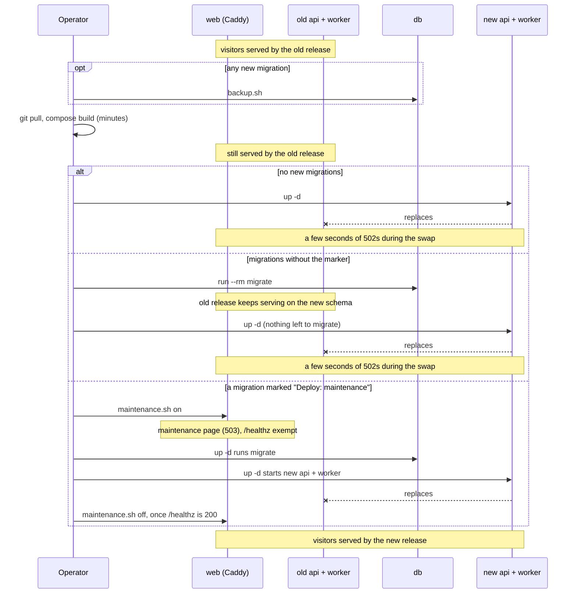

# Deploying HoldMyTrack — minimal single-VPS setup

The smallest deployment that's actually production-shaped: one small VPS running `compose.prod.yml` (Postgres+PostGIS, `api`, `worker`, and Caddy in front of the built frontend), plus Cloudflare R2 for object storage. See `docs/VISION.md` §4.3 for the cost model this is built around; spend caps and the compliance work (DPIA, EU-region hosting) are `docs/ROADMAP.md`'s Phases 5 and 6. This document only covers getting a working deployment live, not everything a real public launch needs. Redeploying holdmytrack.com afterwards is routine: in Claude Code, `/deploy` (`.claude/skills/deploy/SKILL.md`) walks §6–§8 and §10 for the commits since the running version.

## 1. Provision the VPS

Any small Docker-capable VPS works — 2 vCPU / 4 GB RAM is comfortable headroom for Postgres+PostGIS, `api`, `worker`, and Caddy together at low traffic. Install Docker and the Compose plugin (`docker compose version` should work), then clone this repo onto it.

## 2. Create the Cloudflare R2 bucket

1. Create an R2 bucket in the Cloudflare dashboard.
2. Create an R2 API token scoped to that bucket (Account → R2 → Manage API Tokens) — this gives you the access key, secret key, and the account-specific S3-compatible endpoint (`https://<account-id>.r2.cloudflarestorage.com`). None of this is the same as a Cloudflare account-wide API token.
3. No code change is needed for this — `internal/storage/storage.go` already talks to any S3-compatible endpoint via `minio-go`; local dev's RustFS container is a stand-in for exactly this.

## 3. Point DNS at the server

Add an `A` record for your domain (or a subdomain, e.g. `app.example.com`) pointing at the VPS's public IP. Caddy (step 6) needs this to resolve correctly *before* it first starts, or its automatic Let's Encrypt certificate request will fail. Also point `www.<your-domain>` at the same server (a `CNAME` to the apex is enough): Caddy always redirects `www` to the apex and requests a certificate for it, and so for any retired domain listed in `REDIRECT_DOMAINS`. With the zone on Cloudflare, keep these records DNS-only (grey cloud) — Cloudflare's proxy caps uploads at 100 MB.

## 4. Fill in the production env file

```
cp .env.prod.example .env.prod
```

Fill in every value — see that file's own comments for what each one means and why it has no default (unlike dev's `.env.example`, nothing here is safe to leave as a placeholder). `APP_BASE_URL` and `DOMAIN` both need the real domain from step 3; get `APP_BASE_URL`'s `https://` scheme right — `auth.go`'s session cookie derives its `Secure` flag from it, and password-reset emails link back into it.

**Worker concurrency.** `WORKER_CONCURRENCY` (default 4) is how many jobs the worker runs at once — imports, edits, story copies — taking accounts in turn and never two of one account's at the same time (`IMPLEMENTATION.md` §3.8). A job mostly waits on R2, so the bound is memory, not CPUs: 4 is comfortable on 2 vCPU / 4 GB. The worker's database pool is 4 connections per unit of it. `WORKER_RENDER_CONCURRENCY` (default 2) is how many renders run at once, in a lane of their own beside those, so a big import's renders never hold up a new upload; it adds 4 pool connections per unit too. A change to either needs only `up -d` for `worker`.

**Uploads per hour.** `UPLOADS_PER_HOUR` (default 100) is how many files one account may send to `POST /v1/activities/upload` in an hour (`docs/SPEC.md` FR-3.1). Leave it at 100. A load test's `seed` and `import` send more than that per account, so raise it for their run (`docs/PERFORMANCE.md`). A change needs only `up -d` for `api`, which also starts every account's count afresh.

**Sign in with Google (optional).** Leave `GOOGLE_CLIENT_ID` empty to run without it; the sign-in screen then shows only email and password. To turn it on:

1. In the Google Cloud console, create a project (or reuse one) and set up the OAuth consent screen: user type External, app name HoldMyTrack, the domain from step 3 as an authorized domain, and only the `openid`, `email` and `profile` scopes — none of them needs Google's app verification. Publish it ("In production"); in "Testing" only listed test users can sign in.
2. Under Credentials, create an OAuth client ID of type **Web application** with the authorized redirect URI `https://<your-domain>/v1/auth/google/callback`, exactly `APP_BASE_URL` plus that path. No JavaScript origins are needed, since the flow runs server-side.
3. Put the client ID and secret into `.env.prod` as `GOOGLE_CLIENT_ID`/`GOOGLE_CLIENT_SECRET` and leave `GOOGLE_REDIRECT_URL` empty; it defaults to that same URI. Recreate `api` (`up -d`) to pick them up; no rebuild is needed, because the web client asks the API at runtime whether to show the button.
4. For the Android app (ADR-0016), create a second OAuth client ID in the same project, of type **Android**: package name `dev.holdmytrack.android` and the SHA-1 fingerprint of the key the app is signed with. Create one per signing key — the release key, and each developer's debug key (`apps/android/holdmytrack/README.md` shows how to get its SHA-1). It has no secret and nothing goes into `.env.prod`: the app asks for tokens for the *web* client ID, which it reads from `GET /v1/auth/providers`, and the Android client only tells Google which app may ask. Without it, the app's Google account picker fails with a generic error.

**Sign in with Facebook (optional).** Leave `FACEBOOK_APP_ID` empty to run without it. Facebook never links to an existing account by email, and a new account it creates verifies its email by mail (`SPEC.md` FR-1.10, ADR-0015), so SMTP must work before you turn this on. Only a **verified business portfolio** can take the app Live (step 6), and verification needs business documents, so without one Facebook sign-in stays limited to people with a role on the app — `holdmytrack.com` runs with it off for that reason (`ROADMAP.md`). Meta renames dashboard labels from time to time; if one below doesn't match, search the dashboard for the setting.

1. At developers.facebook.com, log in and register as a developer (Get Started), then **My Apps → Create App**: name HoldMyTrack, a contact email, and the use case "Authenticate and request data from users with Facebook Login". Creating the app and testing it in Development mode don't need a business portfolio; publishing it does (step 6).
2. Under the use case's **Customize**, make sure the `email` permission is added next to `public_profile`. Both have standard access and need no App Review.
3. In **Facebook Login → Settings**, keep Client OAuth login, Web OAuth login and Enforce HTTPS on, and add `https://<your-domain>/v1/auth/facebook/callback` to **Valid OAuth Redirect URIs**, exactly `APP_BASE_URL` plus that path. For local dev also add `http://localhost:<API_PORT>/v1/auth/facebook/callback` (allowed over http while the app is in Development mode).
4. In **App settings → Basic**, copy the **App ID** and, after **Show** and re-entering your Facebook password, the **App secret** — treat it as a password: `.env.prod` only, never a committed file; **Reset** there if it leaks. On the same page, fill in App domains (the domain from step 3), a Privacy Policy URL, "Data deletion instructions URL" set to `https://<your-domain>/help#delete-account`, an app icon (1024×1024) and a category, and save.
5. Put them into `.env.prod` as `FACEBOOK_APP_ID`/`FACEBOOK_APP_SECRET`, leave `FACEBOOK_REDIRECT_URL` empty, and recreate `api` (`up -d`). The Android app needs nothing more: it runs this same web flow in a browser tab, through the same redirect URI (ADR-0016).
6. While the app is in Development mode, only people with a role on it (**App roles → Roles**) can sign in — test with one. Then switch it to **Live** (**Publish** in the app's left menu). Meta checks the fields from step 4 first, and requires Business Verification: the app has to be connected to a business portfolio that Meta has verified, whether or not the app uses any permission beyond `email` and `public_profile`. Removing the portfolio from the app doesn't lift this, and there's no individual-developer route. Verification takes one business document whose name matches the portfolio's; in the US the options offered are an IRS 147C letter (EIN confirmation), a business bank statement, a business tax document, or a "Doing Business As" (DBA) filing. Until then, leave `FACEBOOK_APP_ID` empty in `.env.prod` so the public site shows no Facebook button that only role holders could use.

## 5. Basemap

The basemap is the full Protomaps planet build (z0–15, ~138 GB), served unmodified from a public R2 bucket. The archive is deliberately excluded from every Docker build context (`apps/web/.dockerignore`), so the `web` image never has it baked in.

1. Create a second R2 bucket for the basemap (e.g. `holdmytrack-basemap`), separate from the app's private one, and connect a custom domain to it (e.g. `tiles.<your-domain>`, which needs the domain's DNS zone on Cloudflare). A custom domain is proxied through Cloudflare, which is what puts the CDN in front of the basemap; the bucket's `r2.dev` URL is rate-limited and meant only for trying things out.
2. Add a CORS rule to that bucket: allowed origins `https://<your-domain>` (plus `http://localhost:5173` if local dev should read the same archive, `docs/DEVELOPMENT.md`), allowed methods `GET, HEAD`, allowed headers `range, if-match`, exposed headers `etag` (`IMPLEMENTATION.md` §5.4). Then add a response header rule on the domain's zone (**Rules → Overview → Create rule → Response Header Transform Rule**): when Hostname equals `tiles.<your-domain>`, set static `Access-Control-Allow-Origin` to `*` and `Access-Control-Expose-Headers` to `etag`. R2 answers each request with its own `Origin` alone, but Cloudflare caches one copy of each file whatever the `Origin`, so without the rule the request that filled the cache decides the header every other origin gets: a copy cached with no header, or with another origin's, fails every sprite, font and tile load from the rest until it expires. `*` is safe because nothing sends credentials to the basemap (`apps/web/src/map/requestCredentials.ts`).
3. Pick a dated build key from `https://build-metadata.protomaps.dev/builds.json`, download it (`curl -C - -o planet.pmtiles https://build.protomaps.com/<YYYYMMDD>.pmtiles`), and check its md5 against the listed `md5sum`.
4. Upload under the build's dated prefix, with an R2 API token that can write to the bucket:
   ```
   aws s3 cp planet.pmtiles s3://holdmytrack-basemap/<YYYYMMDD>/basemap/basemap.pmtiles --endpoint-url https://<account-id>.r2.cloudflarestorage.com
   aws s3 cp --recursive apps/web/public/basemap/fonts s3://holdmytrack-basemap/<YYYYMMDD>/basemap/fonts --endpoint-url ...
   aws s3 cp --recursive apps/web/public/basemap/sprites s3://holdmytrack-basemap/<YYYYMMDD>/basemap/sprites --endpoint-url ...
   ```
5. Set `VITE_BASEMAP_ORIGIN` in `.env.prod` to the public origin plus that prefix (e.g. `https://tiles.holdmytrack.com/20260922`), with no trailing slash. It's a *build*-time value for the web bundle, and `compose.prod.yml` also passes it to `api` as `BASEMAP_ORIGIN` for the style document native clients fetch. Changing it later needs `docker compose -f compose.prod.yml build web` and an `up -d`, not just a restart.

Moving to a newer build repeats steps 3–5 under a new prefix. The old prefix stays readable until you delete it, so tabs already open keep working.

A deployment without R2 can serve the archive same-origin instead: leave `VITE_BASEMAP_ORIGIN` empty and uncomment `compose.prod.yml`'s `web` volume line, pointing it at the archive on the host. That needs the whole archive on the VPS's own disk.

**Satellite imagery (optional).** Leave `VITE_SATELLITE_TILES` empty to run without it; the map then has no Satellite choice (`docs/SPEC.md` FR-4.14). holdmytrack.com uses MapTiler Satellite on MapTiler's Free plan: 100k tile requests a month, non-commercial, and past that the imagery pauses until the next month instead of billing (ADR-0022). To turn it on:

1. Create a MapTiler Cloud account (cloud.maptiler.com) on the Free plan, with no payment method, so nothing can be billed.
2. Under **API keys**, create a key for HoldMyTrack and, under **Allowed HTTP origins**, add `https://<your-domain>` (plus `http://localhost:5173` if local dev should use it). The key ends up in the web bundle and the served style, readable by anyone, so the origin restriction is what keeps other sites from spending the quota. The Android app has no browser to send an origin, so it sends the deployment's own (`Origin: https://<your-domain>`) on every request that leaves the API, and the same key serves it.
3. Set in `.env.prod`:
   ```
   VITE_SATELLITE_TILES=https://api.maptiler.com/tiles/satellite-v2/{z}/{x}/{y}.jpg?key=<key>
   VITE_SATELLITE_TILE_SIZE=512
   VITE_SATELLITE_MAXZOOM=18
   VITE_SATELLITE_ATTRIBUTION=<a href="https://www.maptiler.com/copyright/">© MapTiler</a>
   ```
   Keep the tile size at 512, MapTiler's own: at 256 the map would fetch four times as many tiles for the same view, all counted against the quota. These are *build*-time values for the web bundle, like `VITE_BASEMAP_ORIGIN`, and `compose.prod.yml` also passes them to `api` as `SATELLITE_*` for the Android app's style document. Changing them needs `docker compose -f compose.prod.yml build web` and an `up -d`.
4. Check the usage page in MapTiler Cloud during the first weeks. Switching to another provider later (Esri World Imagery, MapTiler's paid Flex plan) only means changing these four values: the template, its tile size (Esri's are 256), its deepest zoom and its credit.

## 6. Bring it up

```
GIT_SHA=$(git rev-parse --short HEAD) docker compose -f compose.prod.yml --env-file .env.prod up -d --build
```

`GIT_SHA` is a per-invocation value, not deployment config — it isn't stored in `.env.prod`. It's baked into both the `api` and `web` images (`/healthz`'s `version` field and the frontend bundle, respectively) so a browser tab left open across a deploy can detect it's running stale — see `apps/web/src/ui/VersionBanner.tsx`. Omitting it still works (defaults to `unknown`), just without that detection.

This builds all four images, runs `migrate` once (api/worker wait for it to finish, exactly like the dev stack's own `migrate` service), and starts `db`, `api`, `worker`, and `web` (Caddy). Caddy requests its Let's Encrypt certificate for `DOMAIN` on first start — watch `docker compose -f compose.prod.yml logs web` if it doesn't come up within a minute or two.

Container logs are bounded in `compose.prod.yml` (`x-logging`): Docker's `local` driver, compressed, at most 5 files of 10 MB per container. Docker's default `json-file` driver never rotates, so without the limit `api`, `worker` and Caddy logs would grow until the disk filled. `docker compose -f compose.prod.yml logs <service>` reads them as usual, but only back to the oldest file kept. A change to the logging settings only applies to a recreated container, which the next `up -d` does.

**Postgres's memory** is set in `compose.prod.yml`'s `db` `command`: `shared_buffers=1GB` and `effective_cache_size=2560MB`, about 25% and 65% of a 4 GB droplet. The image's default is a 128 MB cache, and the map's queries, the first thing to run out under load (`PERFORMANCE.md`, 2026-10-09), would share it with the renders reading activity masks (ADR-0040). On a droplet of another size, scale both. A change restarts `db`, and `api` and `worker` fail requests for those seconds, so deploy it under maintenance mode (§7).

On a new (or recreated) database, seed it once `api` is up — `migrate` creates the Demo Customer's account row but none of its activities, and nothing in `up` runs these.

The country and region outlines (ADR-0034) are a file the seed reads from the app bucket, under the key `geo.BoundariesKey` names (`boundaries/overture-<release>-boundaries.csv.gz`), so it has to be there first. It's made **off the server** by `scripts/boundaries-extract.sh`, on any machine with the [duckdb](https://duckdb.org/docs/installation) CLI (`brew install duckdb`): it reads about 4.5 GB from Overture's public bucket, takes a few minutes, and prints how many countries and regions it kept (272 and 3,922 for 2026-09-23.0). Copy the file to the server and into the bucket:

```
scripts/boundaries-extract.sh ~/boundaries
scp ~/boundaries/overture-2026-09-23.0-boundaries.csv.gz holdmytrack:/tmp/
docker compose -f compose.prod.yml --env-file .env.prod run --rm -v /tmp:/in:ro rclone copyto /in/overture-2026-09-23.0-boundaries.csv.gz data:boundaries/overture-2026-09-23.0-boundaries.csv.gz
```

`seed-admin-boundaries` then replaces every outline and re-matches every activity in one transaction. That takes several minutes, and activities ingested meanwhile wait on it for their country matches, so on a database with users take a backup and turn maintenance mode on first (§7, §11). Run it again whenever a deploy brings a new `geo.BoundariesKey`; with the file already loaded it does nothing, and the tiers render blank until it has run once. It also empties the outlines the Country and Region tiles keep (`admin_tile_geoms`, `IMPLEMENTATION.md` §4.2.4), which the next request for each tile draws again from the new outlines. Delete the copy in `/tmp` afterwards.

The timezone polygons each activity's zone is looked up in (ADR-0035) are also a file in the app bucket, under the key `geo.TimezonesKey` names (`timezones/timezones-with-oceans-<release>.geojson.zip`). It's timezone-boundary-builder's release asset as published, renamed to carry its release, so there's nothing to make:

```
ssh holdmytrack 'curl -sSfL -o /tmp/timezones-with-oceans-2026d.geojson.zip https://github.com/evansiroky/timezone-boundary-builder/releases/download/2026d/timezones-with-oceans.geojson.zip'
docker compose -f compose.prod.yml --env-file .env.prod run --rm -v /tmp:/in:ro rclone copyto /in/timezones-with-oceans-2026d.geojson.zip data:timezones/timezones-with-oceans-2026d.geojson.zip
```

`seed-timezones` then replaces the polygons and re-matches every activity in one transaction, in a couple of minutes. Run it again whenever a deploy brings a new `geo.TimezonesKey`; with the file already loaded it does nothing, and until it has run once every activity shows its account's zone. It logs any zone the database's tz data doesn't know yet and leaves it out; pulling a newer `postgis/postgis` image (and recreating `db`) updates that tz data, after which `seed-timezones --force` brings those zones in. Delete the copy in `/tmp` afterwards. Then seed all three, boundaries and timezones before the demo, so its activities are matched as they're ingested:

```
docker compose -f compose.prod.yml --env-file .env.prod run --rm api seed-admin-boundaries
docker compose -f compose.prod.yml --env-file .env.prod run --rm api seed-timezones
docker compose -f compose.prod.yml --env-file .env.prod run --rm api seed-demo-customer
```

Skip them and "Try it now" opens an empty demo account (`SPEC.md` FR-2.2), Fog/Heatmap's Country/Region zoom tiers have no boundaries to draw, and every activity shows its account's timezone. All three are idempotent — safe to re-run on a later deploy, they skip whatever is already loaded — so running them after every deploy is harmless, just unnecessary. Boundaries first, so the demo's activities are matched to countries/regions as they're ingested (`docs/DEVELOPMENT.md`'s "Seeding a fresh database" has the detail). A deploy that changes the demo history itself (`services/server/internal/httpapi/demo_data/`) needs `seed-demo-customer --reset` once instead, since a plain re-run leaves already-seeded activities as they were.

A deploy that changes how Fog/Heatmap tiles are drawn (`services/server/internal/fog`, `IMPLEMENTATION.md` §4.2) needs every account's tiles re-rendered once, or they keep the old look: `docker compose -f compose.prod.yml --env-file .env.prod run --rm api rerender-coverage`, with `--masks` when the change is to the stroke itself (its width), to the tile size (`fog.TileSize`), or to which tiles a track reaches (`internal/tilemath`), which redraws every activity's stored masks first and takes a while. It only queues the renders, so the worker must be up; they finish in the background.

The deploy that brings migration 0033 needs `docker compose -f compose.prod.yml --env-file .env.prod run --rm api backfill-recorded-spans` once, after `up -d`: it fills each older activity's time as recorded (`IMPLEMENTATION.md` §4.6), re-reading every upload, which takes a few minutes. Until it has run, the Sync tab's overlap hint misses activities whose ends a Private location cut away. It's idempotent.

The demo history is picked from real activities on a deployment. To copy some out, with their ids from the admin panel's activity list:

```
mkdir -p /tmp/demo-export && chmod 777 /tmp/demo-export
docker compose -f compose.prod.yml --env-file .env.prod run --rm -v /tmp/demo-export:/out api export-demo-activities /out <activity-id> <activity-id> ...
```

That writes each activity as a GPX file of exactly what its owner sees on the map — clipped by their Private locations, with their track edits applied, never the original upload — plus each activity's photos into `photos/` (the stored, resized images, never an original) and `manifest.json` (names, types, descriptions and photos) into `/tmp/demo-export`, reading the database and storage only. Copy the files into `demo_data/`, the photos into `demo_data/photos/`, merging the manifest's `activities` entries into the one already there (its `stories` section lists the demo's Stories, by file), and review every track and photo before committing — they are going into a public repository.

To open the admin panel (`/admin`, `SPEC.md` FR-12), make your own account an admin. It has to exist first, so sign up on the site, then:

```
docker compose -f compose.prod.yml --env-file .env.prod run --rm api set-admin you@example.com true
```

`false` in place of `true` revokes it. This is the only way to grant or revoke admin; nothing on the web can.

Spots (`SPEC.md` FR-15) needs its places loaded, and then refreshed about once a quarter, the same way each time; until the first load the Layers menu's points of interest show none. The extract is made **off the server**: filtering the planet file takes more memory and disk than this box has. `scripts/spots-extract.sh` does it on any machine with [osmium-tool](https://osmcode.org/osmium-tool/) (`brew install osmium-tool`, `apt install osmium-tool`) and about 100 GB free. It downloads the current [planet file](https://planet.openstreetmap.org/pbf/) (95 GB in 2026-09, about 1.5 hours at 18 MB/s), checks its md5, filters it, and prints the place count by tag:

```
scripts/spots-extract.sh ~/spots-work    # result: ~/spots-work/spots.geojsonseq
```

It keeps every node, way and relation in the five categories, as points and areas, with the OSM id the import upserts by (`osmium export -u type_id`). Run it again after an interruption: it resumes the download, and skips it once a checked copy is there. Given a [Geofabrik](https://download.geofabrik.de/) extract's URL as a second argument, it makes a small regional file instead, for a dev database or a regional load, imported without `--planet`. Before importing a planet file, compare its total with the last run's. Then, on the server, take a backup (`./scripts/backup.sh`, §11), copy the file over and import it inside `tmux`, since a planet import outlasts a dropped SSH connection:

```
mkdir -p /tmp/spots && chmod 755 /tmp/spots   # put spots.geojsonseq here, world-readable
docker compose -f compose.prod.yml --env-file .env.prod run --rm -v /tmp/spots:/data:ro api import-spots --planet /data/spots.geojsonseq
```

It upserts every place by its OSM id, so a re-run with a newer extract updates the places already there. `--planet` says the file is the whole planet: after the upserts, every place the file didn't have is retired — hidden from everyone who hasn't captured it, never deleted (ADR-0027). Leave `--planet` off for a regional extract, or it would retire the rest of the world. If a planet run would retire more than 1% of the places on the map, it stops with `the file is missing too many places to be the whole planet` and retires nothing: the file is likelier cut short or mis-filtered than OSM down that much, so check the export (its line count against the last run's) before running again. The log's last line counts the places `imported`, `changed` (new, different, or back in OSM), `retired` and `skipped`. Only when something changed or was retired does it move every account's tile version, so browsers fetch the new places (`IMPLEMENTATION.md` §4.25); a refresh that changed nothing leaves their cached tiles alone. Delete `/tmp/spots` afterwards.

Bike paths, Shared paths and Mountain bike trails (`SPEC.md` FR-4.13) need their ways loaded the same way, and refreshed when Spots is; until the first load those three entries of the Layers menu draw nothing. `scripts/bike-paths-extract.sh` makes the file off the server, as `spots-extract.sh` does. Given the same work directory it reuses that script's checked planet download, so run the two one after the other:

```
scripts/bike-paths-extract.sh ~/spots-work    # result: ~/spots-work/bike-paths.geojsonseq
```

It keeps every way tagged `highway=cycleway`, `bicycle=designated` or a mountain-bike rating, as lines, and prints the count of each; the import keeps the last two only on cycleways, paths, footways and bridleways. Compare the total with the last run's, take a backup, then on the server, inside `tmux`:

```
mkdir -p /tmp/bike-paths && chmod 755 /tmp/bike-paths   # put bike-paths.geojsonseq here, world-readable
docker compose -f compose.prod.yml --env-file .env.prod run --rm -v /tmp/bike-paths:/data:ro api import-bike-paths --planet /data/bike-paths.geojsonseq
```

It upserts every way by its OSM id. With `--planet`, it then **deletes** every way the file didn't have — nothing refers to a bike path, so there's nothing to retire — and the same 1% guard applies: past it, it stops with `the file is missing too many ways to be the whole planet` and deletes nothing. Leave `--planet` off for a regional file. The log's last line counts the ways `imported`, `changed`, `deleted` and `skipped`; only a change or a deletion moves every account's tile version. Delete `/tmp/bike-paths` afterwards.

## 7. Maintenance mode

A deploy pulls and builds first, with the old containers still serving: building is the slow part, minutes on this VPS, and it leaves the running containers alone, since none of them mounts the source. What comes after the build depends on the new migrations, if any. Most work with the release already running (`DEVELOPMENT.md`'s "Writing a migration"), so they run with the site up:

```
./scripts/backup.sh
GIT_SHA=$(git rev-parse --short HEAD) docker compose -f compose.prod.yml --env-file .env.prod build
docker compose -f compose.prod.yml --env-file .env.prod run --rm migrate
GIT_SHA=$(git rev-parse --short HEAD) docker compose -f compose.prod.yml --env-file .env.prod up -d
```

`run --rm migrate` applies them beside the running `api` and `worker`, and exits non-zero if one fails, with nothing swapped yet. It has to come first: a plain `up -d` takes `api` and `worker` down as soon as it starts `migrate` and brings the new ones up only once it exits, so a slow migration would mean `502`s for as long as it runs. `up -d` then finds nothing left to migrate and swaps the containers. Without new migrations, skip the backup and the `run`.

A migration whose first line is `-- Deploy: maintenance — <why>` can't run beside the old code, and a deploy that brings one, or involves manual DB work, puts the site into maintenance mode so visitors see a friendly page instead of errors. DigitalOcean (and most VPS providers) have no Droplet-level maintenance toggle, so this lives in the app stack instead, and it goes on only once the build is done:

```
./scripts/backup.sh
GIT_SHA=$(git rev-parse --short HEAD) docker compose -f compose.prod.yml --env-file .env.prod build
./scripts/maintenance.sh on
GIT_SHA=$(git rev-parse --short HEAD) docker compose -f compose.prod.yml --env-file .env.prod up -d
./scripts/maintenance.sh off
```

The three paths side by side, with what visitors get at each step:



Running `backup.sh` (§11) first means a migration that goes wrong can be undone from a dump taken minutes earlier, not last night's. `maintenance.sh on`/`off` flip `MAINTENANCE_MODE` in `.env.prod` and recreate only the `web` (Caddy) container — a couple of seconds, no rebuild. `/healthz` is deliberately exempt from maintenance mode (see `apps/web/docker/Caddyfile`), so `curl https://<your-domain>/healthz` still reflects `api`/`db`'s real status; wait for it to return `200` before running `maintenance.sh off`. `./scripts/maintenance.sh status` prints the current value.

## 8. Verify

- `curl https://<your-domain>/healthz` should return `200`.
- Open the domain in a browser, sign up, upload a `.gpx` file, confirm it appears on the map — this exercises the full path: Caddy → `api` → Postgres → R2 (raw payload) → `worker` → R2 (fog/heatmap tiles) → back through Caddy to the browser.
- Switch to Fog, then zoom out below city zoom: any country the account has an activity in should render clear against the veil. If the whole world stays uniformly fogged (and Heatmap shows no country/region highlight either), `admin_countries`/`admin_regions` are empty — run step 6's `seed-admin-boundaries`, then hard-refresh; the tiles are queried live, so nothing else needs rebuilding.
- If satellite imagery is configured, open Overlays, choose Satellite, and confirm the imagery shows under the roads and labels with MapTiler's credit in the attribution. A map that loses its land and water but shows no imagery means the tile requests are refused: check the browser's network tab for a `403` (the key, or its allowed origins) and `curl https://<your-domain>/v1/map/style/light` for a `satellite` source with your URL.
- If Google sign-in is configured, click "Continue with Google" and confirm you land on the map signed in. A `redirect_uri_mismatch` page from Google means the authorized redirect URI in step 4 doesn't match `APP_BASE_URL` + `/v1/auth/google/callback` exactly; landing back on the sign-in screen with "Couldn't sign in with Google" means the callback failed, and `docker compose -f compose.prod.yml logs api | grep "google sign-in"` says why.
- If sign-in silently fails (redirected straight back to the sign-in screen after submitting), the most likely cause is `APP_BASE_URL` not actually being `https://` while the browser is on a plain `http://` connection, or vice versa — see step 4's note on the `Secure` cookie flag.

## 9. Before upgrading the Postgres image

The server passes each account's stored time zone straight to Postgres (`AT TIME ZONE users.timezone`, every per-day query), and the `postgis/postgis` image reads time zones from the operating system's own files (it's built `--with-system-tzdata`). Today's `16-3.4` image is Debian 11, whose files still carry the old names IANA has since replaced, like `Asia/Calcutta` for `Asia/Kolkata` and `Europe/Kiev` for `Europe/Kyiv`. Debian 13 moved those old names into a separate `tzdata-legacy` package that isn't installed by default. On an image built on it, any account still storing an old name would make those queries fail with an error.

New accounts can't get one: the server stores every time zone under its current name (`IMPLEMENTATION.md` §4.12). But an account that signed up before that change (2026-09-25) keeps the old spelling its browser reported until it next saves Settings. So before moving `db` to an image on Debian 13 or later, rewrite those, while the old image is still running:

```bash
docker compose -f compose.prod.yml --env-file .env.prod exec db sh -c 'psql -U "$POSTGRES_USER" -d "$POSTGRES_DB"'
```

```sql
UPDATE users u SET timezone = r.current
FROM (VALUES
  ('Africa/Asmera', 'Africa/Asmara'),
  ('America/Buenos_Aires', 'America/Argentina/Buenos_Aires'),
  ('America/Catamarca', 'America/Argentina/Catamarca'),
  ('America/Cordoba', 'America/Argentina/Cordoba'),
  ('America/Godthab', 'America/Nuuk'),
  ('America/Indianapolis', 'America/Indiana/Indianapolis'),
  ('America/Jujuy', 'America/Argentina/Jujuy'),
  ('America/Knox_IN', 'America/Indiana/Knox'),
  ('America/Louisville', 'America/Kentucky/Louisville'),
  ('America/Mendoza', 'America/Argentina/Mendoza'),
  ('America/Virgin', 'America/St_Thomas'),
  ('Asia/Ashkhabad', 'Asia/Ashgabat'),
  ('Asia/Calcutta', 'Asia/Kolkata'),
  ('Asia/Chungking', 'Asia/Chongqing'),
  ('Asia/Dacca', 'Asia/Dhaka'),
  ('Asia/Istanbul', 'Europe/Istanbul'),
  ('Asia/Katmandu', 'Asia/Kathmandu'),
  ('Asia/Macao', 'Asia/Macau'),
  ('Asia/Rangoon', 'Asia/Yangon'),
  ('Asia/Saigon', 'Asia/Ho_Chi_Minh'),
  ('Asia/Thimbu', 'Asia/Thimphu'),
  ('Asia/Ujung_Pandang', 'Asia/Makassar'),
  ('Asia/Ulan_Bator', 'Asia/Ulaanbaatar'),
  ('Atlantic/Faeroe', 'Atlantic/Faroe'),
  ('Europe/Kiev', 'Europe/Kyiv'),
  ('Europe/Nicosia', 'Asia/Nicosia'),
  ('HST', 'Pacific/Honolulu'),
  ('Pacific/Ponape', 'Pacific/Pohnpei'),
  ('Pacific/Samoa', 'Pacific/Pago_Pago'),
  ('Pacific/Truk', 'Pacific/Chuuk')
) AS r(old, current)
WHERE u.timezone = r.old;
```

That's the rename table in `services/server/internal/web/timezones_data.go` (`timezoneRenames`, tzdata 2026d) at the time of writing. If the table has been regenerated since, rebuild the list from it. Then check that nothing is left that the new image won't know: run `SELECT DISTINCT timezone FROM users` and look each result up in the new image's `pg_timezone_names`.

## 10. Publishing the Android APK

`https://<your-domain>/download/*` serves whatever is in `/srv/holdmytrack/downloads/` on the host, bind-mounted read-only into the `web` container (`compose.prod.yml`, `apps/web/docker/Caddyfile`), so publishing a new build is a copy with no rebuild or restart. Build against the deployment's own origin, then copy it up:

```
cd apps/android/holdmytrack
./gradlew :app:assembleDebug -Pholdmytrack.apiBaseUrl=https://<your-domain>
scp app/build/outputs/apk/debug/app-debug.apk <vps>:/srv/holdmytrack/downloads/holdmytrack.apk
```

The APK carries its own version — `versionName` (the release number) and the commit's short SHA, shown at the foot of the app's You tab — and a `versionCode` that is the commit count, so a newer build always installs over an older one (`apps/android/docs/IMPLEMENTATION.md` §8). Build from the commit you deployed and the app's SHA matches `/healthz`'s `version`.

It's served with `Cache-Control: no-cache`, so a replaced file is never masked by a cached copy. No page links to it: it's for testers handed the URL, while the app's public route is Google Play's closed test. This is a debug-signed APK: installable by sideloading, and it keeps Donate, which the Play build leaves out. The Play build is the release-signed bundle (`apps/android/holdmytrack/README.md`, Release build), and the two can't install over each other without uninstalling first. Google sign-in works in it only if that debug key's SHA-1 has an Android OAuth client (step 4).

## 11. Backups and the restore drill

`scripts/backup.sh` runs nightly: it dumps Postgres, copies the dump to a second R2 bucket, and keeps the newest three dumps in `/srv/holdmytrack-backups/postgres/`, so the last deploy can be undone without fetching one. It then syncs the app bucket's `raw/`, `photos/` and `avatars/` into the same bucket. `fog/` and `heatmap/` aren't copied, and the dump leaves out the data of `activity_tile_mask_data` (the activity masks' PNGs), because `rerender-coverage --masks` rebuilds them all (ADR-0029, ADR-0040), and of the country and region tile cache (`admin_tile_geoms`, `admin_tiles_built`), which tiles rebuild on request.

**The reference tables are backed up apart.** Places, bike paths, boundaries and timezones (`spots`, `bike_paths`, `admin_countries`, `admin_country_parts`, `admin_regions`, `admin_region_parts`, `admin_boundaries_source`, `tz_parts`, `tz_boundaries_source`) are most of the database, and only their import and seed commands write them (§6), a few times a year. So each run's dump leaves their data out too, and `backup.sh` dumps them on their own, data only, when they changed since the last such dump, judged by Postgres's count of rows inserted, updated and deleted in each, or when that dump is no longer in the bucket. Every run checks the bucket for it by name, so a reference dump deleted from outside — by hand, a lifecycle rule, a misused token — is replaced that same night. Most runs take none. `TRUNCATE` isn't counted, unlike the `DELETE` the imports and seeds use: after changing a reference table by hand, run `./scripts/backup.sh` by hand too. A restore needs the newest reference dump no newer than the dump it goes with. User tables point into them — a capture at a place, an activity at the countries it crossed — and their ids must be the ones those rows name, which re-running the imports wouldn't give. On the dev stack this made the nightly dump 23 MB against 640 MB of reference data. `scripts/restore-drill.sh` runs monthly and proves the copies restore. Both run rclone from `compose.prod.yml`'s `rclone` service, which `up` never starts, so nothing needs installing on the host.

**Set up.**

1. Create a second private R2 bucket (e.g. `holdmytrack-backups`), and an R2 API token with **Object Read & Write** on that bucket only. Don't use the app's token, and don't give this one access to the app bucket. Then a leaked app token can't delete the backups, and a mistaken command with this token can't touch the live data.
2. Fill in `.env.prod`'s `BACKUP_*` values (`.env.prod.example` explains each). Leave `BACKUP_S3_ENDPOINT` empty when both buckets are in the same Cloudflare account.
3. Run both scripts once by hand: `./scripts/backup.sh`, then `./scripts/restore-drill.sh`. The first backup copies every object, so it takes longest.
4. Schedule them in `/etc/cron.d/holdmytrack-backup`:
   ```
   17 3 * * * root /srv/holdmytrack/scripts/backup.sh --nightly >> /var/log/holdmytrack-backup.log 2>&1
   47 4 1 * * root /srv/holdmytrack/scripts/restore-drill.sh >> /var/log/holdmytrack-backup.log 2>&1
   ```
5. Rotate that log, which otherwise grows a little every night (more on the first run, which lists every object it copies), in `/etc/logrotate.d/holdmytrack-backup`:
   ```
   /var/log/holdmytrack-backup.log {
       su root root
       monthly
       rotate 6
       compress
       missingok
       notifempty
   }
   ```
   `su` is needed on Ubuntu, whose `/var/log` is group-writable by `syslog`: without it, logrotate skips the file as insecure. `logrotate -d /etc/logrotate.d/holdmytrack-backup` checks the rule without rotating anything.

**What's in the backup bucket.** `postgres/daily/` holds each night's dump for 14 days, and `postgres/weekly/` holds Sunday's for 8 weeks. `postgres/reference/` holds each reference dump that a kept dump still needs, and always the newest; this host keeps the ones its own three dumps need, in `postgres/reference/`. A run by hand, without `--nightly` — the one before a deploy (§6) — goes to `postgres/manual/` instead, kept 3 days: long enough to undo the deploy, and a busy deploy day doesn't fill the history with near-identical dumps. Only a nightly run updates the "Backup overdue" alert's timestamp (§13), so a manual one can't hide a cron job that stopped. `objects/` mirrors the app bucket's keys. When the sync would delete or overwrite an object there, it moves the old copy into `objects-deleted/<UTC stamp of that run>/` instead, where it stays for 30 days. An account deleted on request therefore stays in the backups for up to 8 weeks.

**The drill** takes the newest nightly dump from the bucket, with the reference dump it pairs with, and restores them the four-step way above into a throwaway container of the live `db` image, which has no network and is removed afterwards. It prints row counts next to the live database's. It then checks every object key the restored database refers to: each activity's raw payload, each photo and its thumbnail (at the photo's `image_key`, which for a photo from a copied Story is the sender's), each avatar. Every one must be in `objects/`, or in `objects-deleted/` if the app removed it after the dump. It fails, and records no success for the "Restore drill overdue" alert (§13), if the newest dump is more than 36 hours old, if `pg_restore` fails, if the restored database has no users or no countries, if its `activity_tile_mask_data` isn't empty (the dump is meant to leave its data out), or if any object is missing. When an object is missing, it also says whether the object is gone from the app bucket too. That would mean the database already pointed at nothing before the backup ran. Run the drill by hand after changing `backup.sh`, or after adding anything that stores objects under a new key.

**Restoring for real.** Take a manual `./scripts/backup.sh` first if the live database still runs, so the current state is kept too. Then:

```
./scripts/maintenance.sh on
docker compose -f compose.prod.yml --env-file .env.prod stop api worker
# The newest local dump, or fetch one: … run --rm rclone copyto backup:postgres/daily/<name> /backups/postgres/<name> (or manual/, for a deploy's)
# and its reference dump, the newest with a stamp no later than the dump's: … backup:postgres/reference/<ref> /backups/postgres/reference/<ref>
dump=/srv/holdmytrack-backups/postgres/<name>; ref=/srv/holdmytrack-backups/postgres/reference/<ref>
restore() { docker compose -f compose.prod.yml --env-file .env.prod exec -T db sh -c 'pg_restore -U "$POSTGRES_USER" -d "$POSTGRES_DB" --exit-on-error --no-owner "$@"' sh "$@"; }
docker compose -f compose.prod.yml --env-file .env.prod exec -T db sh -c 'dropdb -U "$POSTGRES_USER" "$POSTGRES_DB" && createdb -U "$POSTGRES_USER" -T template0 "$POSTGRES_DB"'
restore --section=pre-data < "$dump"
restore --data-only < "$ref"
restore --section=data < "$dump"
restore --section=post-data < "$dump"
```

Recreating the database from `template0` keeps the image's own PostGIS setup from colliding with the dump's. The restore goes in four steps — the schema, the reference data, the rest of the data, then the indexes and foreign keys — so every foreign key, added last, finds the rows it points at. On a new server, bring up `db` alone first (`up -d db`), then run the same commands. If objects were lost too, copy them back with `run --rm rclone copy backup:objects data:`. Use `copy`, never `sync`: `copy` doesn't delete anything in the app bucket. An object removed by mistake within the last 30 days is in `objects-deleted/`, under the stamp of the first backup that ran after it was removed. Then `GIT_SHA=$(git rev-parse --short HEAD) docker compose -f compose.prod.yml --env-file .env.prod up -d`, which also runs any migrations newer than the dump. Then run `run --rm api rerender-coverage --masks` (§6): the dump has no activity masks' PNGs, so Fog and Heatmap show none of the restored activities until it has redrawn them, and it also rebuilds tiles that were lost or are newer than the database. Check `/healthz` and the map, and finish with `./scripts/maintenance.sh off`.

## 12. Host hardening

Only 22, 80 and 443 should be reachable, SSH should take keys only, and security updates should install themselves. On DigitalOcean's Ubuntu 24.04 image, password login is already off (`50-cloud-init.conf`), and `unattended-upgrades` is installed and on. What's left is the following.

**A firewall in front of the server, not on it.** Docker publishes `web`'s ports through its own iptables rules, ahead of `ufw`'s, so `ufw` can't close a port a container publishes. If a service ever published a port by mistake, `ufw` would show it closed while it was open. Use the provider's firewall instead, which filters before traffic reaches the server. On DigitalOcean: **Networking → Firewalls → Create Firewall**. Set the inbound rules to SSH (TCP 22), HTTP (TCP 80) and HTTPS (TCP 443), all from any IPv4 and IPv6 address. Delete any other inbound rule the form starts with; a single "All TCP" rule opens every port and makes the others pointless. Keep the default outbound rules: the server needs to reach R2, Let's Encrypt, the package mirrors and the SMTP host. Apply it to the droplet. Restricting 22 to your own address is tighter, but a home address changes and the only fallback is then the provider's web console. With keys only, an open 22 is a small risk. To check, from another machine: `nc -z -w 3 <your-domain> <port>` connects to 22, 80 and 443, one port at a time (macOS's `nc` checks only the first port given), and on 5432 it waits the full 3 seconds. An instant `Connection refused` there means the packet reached the server, so the firewall isn't applied.

**SSH: keys only, root included.** Ubuntu leaves `PermitRootLogin yes`. Root can't log in by password while `PasswordAuthentication` is off, but a later drop-in that turns it back on would reopen that. sshd takes the first value it reads for each setting, and it reads `/etc/ssh/sshd_config.d/` in name order, so the `00-` prefix makes this file win over cloud-init's `50-`:

```
printf 'PermitRootLogin prohibit-password\nPasswordAuthentication no\nKbdInteractiveAuthentication no\n' > /etc/ssh/sshd_config.d/00-holdmytrack.conf
sshd -t && systemctl reload ssh
sshd -T | grep -Ei '^(permitrootlogin|passwordauthentication|kbdinteractiveauthentication) '
```

`sshd -t` checks the configuration before the reload, so a typo can't stop sshd. The last command should print `without-password` (sshd's older name for `prohibit-password`), `no` and `no`. Keep the current session open, and confirm that a new `ssh` still gets in before closing it.

**Reboot when an update needs it.** `unattended-upgrades` installs security updates daily, but a new kernel or a patched system library only takes effect after a reboot, and by default it never reboots. The stack comes back on its own after one (`restart: unless-stopped`). 05:30 server time falls after `backup.sh` (03:17) and the monthly drill (04:47):

```
printf 'Unattended-Upgrade::Automatic-Reboot "true";\nUnattended-Upgrade::Automatic-Reboot-Time "05:30";\n' > /etc/apt/apt.conf.d/52holdmytrack-reboot
apt-config dump | grep Automatic-Reboot
```

**Docker's build cache pruned weekly.** Every deploy builds on this server (§6), and Docker keeps every layer it built, so the cache grows with each one: 34 GB of this 77 GB disk after the first month. A weekly prune keeps the newest 5 GB of it, so a deploy still reuses its recent layers, and removes the untagged images rebuilds leave behind. It touches no container, volume or tagged image. Sunday 04:17 falls after `backup.sh` (03:17). In `/etc/cron.d/holdmytrack-docker-prune`:

```
17 4 * * 0 root (docker builder prune -f --keep-storage 5GB && docker image prune -f) >> /var/log/holdmytrack-docker-prune.log 2>&1
```

`docker system df` shows what the build cache holds now.

**Secrets readable by root only.** `chmod 600 .env.prod`. `backup.sh` itself keeps `BACKUP_DIR` at `700` and writes its dumps as `600` (§11).

## 13. Monitoring

Grafana Cloud's free tier holds the deployment's logs and metrics, with dashboards and alerts on them (ADR-0030). One collector on the server, the `alloy` service (`ops/alloy/config.alloy`), feeds it:

- **Logs** from every container in the stack, labeled `service` (`api`, `worker`, `db`, `web`, …), plus `level` for `api`'s and `worker`'s JSON lines. Before anything leaves the server, `internal/mail`'s lines (which name the recipient) and Postgres's `DETAIL` lines (which can quote an email address) are dropped, and every IP address in Caddy's logs is replaced with `redacted`.
- **The app's metrics** from `api` and `worker` (`GET /metrics` on port 9100, on the Docker network only): requests by route and status class with their timings, recovered panics, finished jobs by kind, outcome and failure code, and the queue's runnable jobs and the oldest one's age, by kind.
- **The host's metrics**: CPU, memory, swap, disk, network and OOM kills (`node_vmstat_oom_kill`).
- **Postgres's metrics**, database-wide: connections, size, locks, transactions.
- **Backup freshness**: `backup.sh --nightly` and `restore-drill.sh` write the time of their last successful run to `BACKUP_DIR/metrics/` (`holdmytrack_backup_last_success_timestamp_seconds`, `holdmytrack_restore_drill_last_success_timestamp_seconds`), and every `backup.sh` run the time its reference dump in the bucket was taken (`holdmytrack_backup_reference_timestamp_seconds`), which the dashboard's Last backup tile shows beside the nightly one.

Every series and stream carries `deployment="<your-domain>"`. The stack sends about 1,400 metric series, against the free tier's 10,000. Alloy itself uses about 70 MB of memory and is capped at 400 MB.

**Set it up.**

1. At grafana.com, create a free account and a stack, in the region closest to the server; it can't be moved later. In the stack, under **Alerting → Contact points**, test the default email contact point, or add one that reaches you (Telegram works well), before relying on any alert.
2. At grafana.com, under your organisation's **Security → Access Policies**, create a policy for the stack with only the `metrics:write` and `logs:write` scopes, and add a token to it. It's shown once; it goes into `.env.prod` and nowhere else.
3. From the stack's details page, note the **Prometheus** remote-write URL (ending in `/api/prom/push`) and its username (a number), and the **Loki** URL (ending in `/loki/api/v1/push`) and its username (a different number).
4. Fill in `.env.prod`'s monitoring values (`.env.prod.example` lists them), including `COMPOSE_PROFILES=monitoring`, which is what makes Compose start `alloy`.
5. Bring it up: `GIT_SHA=$(git rev-parse --short HEAD) docker compose -f compose.prod.yml --env-file .env.prod up -d`. That starts `alloy`, and recreates `api` and `worker` if they were built before `METRICS_ADDR` existed.
6. Check: `docker compose -f compose.prod.yml --env-file .env.prod logs alloy | grep -E 'level=(error|warn)'` should show nothing after its first minute, apart from a `diskstats` note about `/run/udev/data`. In the stack's **Explore**, Loki's `{deployment="<your-domain>"}` should show recent lines, and Prometheus's `holdmytrack_jobs_runnable` four series at 0.

**Alerts and the dashboard** are defined in the repository, not in Grafana's UI: `ops/grafana/apply.py` holds the alert rules, `ops/grafana/dashboard.json` the dashboard, and the script pushes both to the stack. Alerts go to the addresses in `ALERT_EMAIL` (several separated by `;`), through a contact point the script keeps for them, named `holdmytrack`. Every rule names that contact point directly, so a later change to the stack's default notification policy can't redirect them. Run it from any machine with Python 3, after creating a service account in the stack (**Administration → Users and access → Service accounts**, role **Admin**, which the alerting API needs) and adding a token to it:

```
GRAFANA_URL=https://<stack>.grafana.net GRAFANA_TOKEN=<service account token> ALERT_EMAIL=<address> ops/grafana/apply.py
```

It creates the `holdmytrack` contact point, a **HoldMyTrack** folder holding the alert group `holdmytrack`, and the **HoldMyTrack** dashboard, and prints the dashboard's link. Running it again updates all three in place. It replaces the whole group on every run, so a rule deleted from the script is deleted in Grafana too. The rules stay editable in the UI, for trying a change out, but the next run overwrites them. They are:

| Alert | Fires when |
| :-- | :-- |
| API answered with 5xx | any `5xx` response in the last 10 minutes |
| Jobs failed on our side | any job of a kind failed with `error_code` `internal` in the last 10 minutes |
| Job queue stuck | a kind's oldest runnable job has waited over 30 minutes, for 5 minutes |
| api or worker not answering | its metrics scrape failed for 5 minutes |
| Postgres down | the exporter can't reach it for 2 minutes, or reports nothing |
| No metrics arriving | nothing from the server for 10 minutes: the droplet, Docker or `alloy` is down |
| Disk over 85% full | for 15 minutes |
| Memory nearly exhausted | under 10% available for 10 minutes |
| Process killed for lack of memory | any OOM kill in the last 10 minutes |
| Site down from outside | under half the uptime checks of `/healthz` succeeded over 5 minutes, or the check reports nothing |
| Backup overdue | The nightly `backup.sh` last succeeded over 26 hours ago, or never |
| Restore drill overdue | `restore-drill.sh` last succeeded over 33 days ago, or never |

The two backup alerts read the files the scripts write after a successful run (§11), so on a server whose scripts haven't run since that was added, they fire until each script has run once. Run `./scripts/backup.sh` and `./scripts/restore-drill.sh` by hand to start them off.

**An uptime check from outside**, on `https://<your-domain>/healthz`, covers what nothing on the server can report: the droplet, Caddy or the certificate being down. `/healthz` answers `200` with `"status":"ok"` while `api` can reach the database, and `503` when it can't. It's a Synthetic Monitoring check in the same stack, and the "Site down from outside" rule above reads its results, so its alerts go to the same contact point. Create it before running `apply.py`, because that rule also fires when the check reports nothing:

1. In the stack, go to **Testing & synthetics → Synthetics → Checks**. The first visit offers **Get started**, which sets Synthetic Monitoring up. If that fails with "data source with the same name already exists", an earlier attempt left a broken `Synthetic Monitoring` data source behind, one the UI can't open or delete. Find its uid in `GET /api/datasources` and delete it with `DELETE /api/datasources/uid/<uid>`, using a service account token as for `apply.py`, then click **Get started** again. Then **Add new check**, type **HTTP**.
2. **Job name** `healthz` (the rule matches on it), **Target** `https://<your-domain>/healthz`.
3. Under the request and response options: valid status code `200`, and a body regex match on `"status":"ok"`.
4. **Probe locations**: two or three, near the server and elsewhere. **Frequency**: every 2 minutes. That's about 22,000 runs a month per location, so check the free tier's monthly limit before adding more.
5. Leave the check's own alerting off; the rule above is what alerts. **Save**, and its results show on the check's dashboard within a few minutes.

`/healthz` is exempt from maintenance mode (§7), so the check stays green through a deploy unless `api` itself is down.

## What this doesn't cover

Per `docs/ROADMAP.md`, still open beyond this minimal setup: per-user quotas and rate limits with a spend cap (Phase 5), and the compliance work (DPIA, EU-region hosting — Phase 6) a genuine public launch needs regardless of how small the deployment is. This document gets you to "it's live," not to "it's ready for the public."