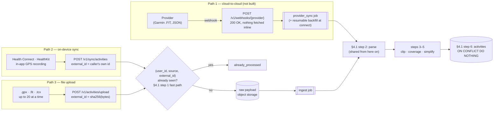
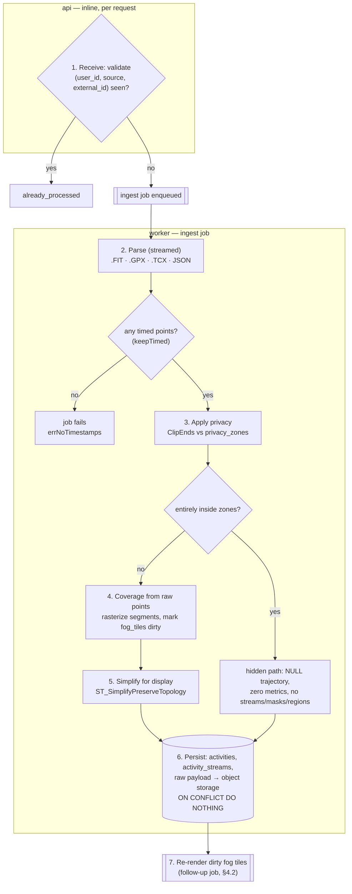

# HoldMyTrack: Implementation

> **Scope note.** Besides ingesting activities it didn't record, HoldMyTrack records casual GPS-only tracks in the Android app (FR-3.8), which submit through the same ingest pipeline as everything else. This document covers the database schema and each feature's own implementation detail (ingest, storage, analysis, fog rendering, tile serving) — see `docs/ARCHITECTURE.md` first for the system-level shape and the stack this all runs on.

---

## 3. Database Schema

The schema lives in `services/server/migrations/`: `0001_users_and_auth.sql` (§3.1, §3.9, §3.10, §3.16–§3.18), `0002_activities.sql` (§3.2–§3.4, §3.7), `0003_tiles.sql` (§3.6, §3.11), `0004_admin_boundaries.sql` (§3.12–§3.15), `0005_jobs.sql` (§3.8), `0006_demo_customer.sql` (the Demo Customer's row and Private locations, §4.10), `0007_map_version.sql` (`users.map_version`, §4.2.6) and `0008_stories.sql` (§3.19). The 32-file history that built it was collapsed into these six on 2026-09-26, ahead of the first real user, and every database was recreated from them. A second fold on 2026-09-27 took the never-used `user_tiles` table out of `0003_tiles.sql` (ADR-0018) and absorbed `0007_drop_heartrate.sql` into `0002_activities.sql`; existing databases were patched in place (`DROP TABLE user_tiles`, and the `0007` row deleted from `schema_migrations`) rather than recreated. From here on a schema change is a new numbered file, never an edit to one of these.

### 3.1 `users`

```sql
CREATE TABLE users (
    id                   UUID PRIMARY KEY DEFAULT gen_random_uuid(),
    email                VARCHAR(255) UNIQUE NOT NULL,
    password_hash        VARCHAR(255),
    last_seen_at         TIMESTAMPTZ,                        -- drives the dormancy policy, §5.7
    created_at           TIMESTAMPTZ  NOT NULL DEFAULT NOW(),
    demo_expires_at      TIMESTAMPTZ,   -- §4.10's no-signup demo; NULL for a real account, set
                                        -- for an ephemeral one (internal/worker/demo_purge.go
                                        -- sweeps once past)
    display_name         VARCHAR(255), -- §4.12 account settings
    country              CHAR(2),      -- ISO 3166-1 alpha-2; NULL means unset, defaults the UI
                                        -- to metric units
    avatar_key           TEXT,         -- object storage key; overwritten on re-upload, not
                                        -- accumulated per upload
    avatar_content_type  VARCHAR(64),
    avatar_updated_at    TIMESTAMPTZ,
    is_admin             BOOLEAN NOT NULL DEFAULT false, -- §4.20's admin panel; written only by
                                                         -- the `set-admin` CLI subcommand
    locale               VARCHAR(8),   -- §4.21's language: 'en' | 'ru'; NULL means automatic,
                                       -- the browser's Accept-Language
    map_version          BIGINT NOT NULL DEFAULT 0, -- §4.2.6's tile cache key; only ever goes up
    imports_seen_at      TIMESTAMPTZ NOT NULL DEFAULT NOW(), -- §4.0.1: a failed import that
                                        -- finished after this is flagged on the header's Sync
    deleted_at           TIMESTAMPTZ   -- §4.28: closed for deletion, waiting for the sweep
);
```

**No `tier` column.** There are no tiers; every account has every feature (`VISION.md` §6.2, ADR-0031). `last_seen_at` exists because storage is the cost that grows forever and dormant accounts are the largest recoverable share of it. `demo_expires_at` (§4.10's no-signup demo) means a demo account is a real row in this same table, not a separate mechanism. `display_name`/`country`/`avatar_key`/`avatar_content_type`/`avatar_updated_at` back §4.12's account settings page. External sign-in identities — Google (§4.15) and Facebook (§4.22) — live in §3.17's `user_identities`, not here (ADR-0015). `locale` is the Language setting (§4.21); NULL is "automatic". `deleted_at` marks an account its owner deleted, for the few minutes until the worker's sweep removes the row (§4.28).

### 3.2 `connections` — Path 1 OAuth state

```sql
CREATE TABLE connections (
    id                UUID PRIMARY KEY DEFAULT gen_random_uuid(),
    user_id           UUID NOT NULL REFERENCES users(id) ON DELETE CASCADE,
    provider          VARCHAR(32) NOT NULL,   -- 'garmin' | 'wahoo' | 'coros'
    provider_user_id  VARCHAR(255) NOT NULL,
    access_token      BYTEA NOT NULL,         -- encrypted at rest, never logged
    refresh_token     BYTEA,
    expires_at        TIMESTAMPTZ,
    scopes            TEXT[],
    connected_at      TIMESTAMPTZ NOT NULL DEFAULT NOW(),
    last_synced_at    TIMESTAMPTZ,
    last_record_at    TIMESTAMPTZ,            -- watermark: newest activity already ingested
    UNIQUE (user_id, provider),
    UNIQUE (provider, provider_user_id)       -- one provider account maps to one HoldMyTrack user
);
```

The second unique constraint matters: without it, two HoldMyTrack accounts can connect the same Garmin account and each receive the same webhook, doubling both storage and fog.

Tokens are encrypted at rest with a key outside the database. Deauthorization deletion (§7) is a hard requirement of all three activity providers, so disconnecting must delete the synced data, not merely the row here.

### 3.3 `activities`

```sql
CREATE TABLE activities (
    id                UUID PRIMARY KEY DEFAULT gen_random_uuid(),
    user_id           UUID NOT NULL REFERENCES users(id) ON DELETE CASCADE,

    -- Provenance. `source` is the ingest path; `source_detail` names the origin within it
    -- (a provider, an Android package, or an uploaded filename).
    source            VARCHAR(32)  NOT NULL,   -- 'upload' | 'garmin' | 'wahoo'
                                               -- | 'coros' | 'healthkit' | 'healthconnect'
                                               -- | 'recorded' | 'takeout' and 'timeline'
                                               -- (rows from before those imports went)
    source_detail     VARCHAR(255),
    external_id       VARCHAR(255),            -- provider activity ID, or HK/HC record UID

    activity_type     VARCHAR(50)  NOT NULL,   -- whatever the source reports, verbatim —
                                               -- not a controlled vocabulary; see §4.7
    distance_meters   NUMERIC(10,2),
    duration_seconds  INT,                     -- elapsed
    moving_seconds    INT,                     -- excludes stops; the basis for real pace
    elevation_gain_m  NUMERIC(8,2),
    avg_speed_mps     NUMERIC(6,3),
    started_at        TIMESTAMPTZ  NOT NULL,
    -- §4.30: the IANA zone it was recorded in ('Asia/Tokyo'), from its first recorded point;
    -- the account's zone where none is known. Its times show, and its days group, in this zone.
    timezone          TEXT         NOT NULL,

    -- Display geometry: simplified for rendering. Coverage is NOT derived from this
    -- column -- see §4.1. M dimension carries epoch seconds. Longitudes continue past ±180
    -- across the antimeridian rather than jumping back (§4.1).
    trajectory        GEOMETRY(LineStringM, 4326),
    raw_payload_key   TEXT,                    -- object storage key for the raw ingest payload:
                                               -- uploaded file (Path 3), provider push (Path 1),
                                               -- or synced point batch (Path 2). See §4.1 step 6.
    ingest_complete   BOOLEAN NOT NULL DEFAULT true, -- false from the insert until every step
                                               -- after it has run (0015); see §4.1 step 6.
    description       TEXT,                    -- §4.7.4; user-editable free text, NULL means
                                               -- never set. Never parsed from a GPX/TCX/FIT
                                               -- file or from Health Connect/HealthKit sync;
                                               -- Path 2's JSON wire format is the one ingest
                                               -- path that can set it at creation (§4.0.4,
                                               -- in-app GPS recording).
    name              VARCHAR(200),            -- §4.7.4; user-editable title,
                                               -- shown in place of started_at when set. Same
                                               -- "never at ingest except §4.0.4" rule as
                                               -- description above. NULL means never set.
    -- §4.7.7: the user's Edit track spec (keep/remove/drop/move, unix-ms point
    -- timestamps), replayed over the parsed, privacy-clipped raw points on every reprocess.
    -- NULL means never edited, or reset.
    track_edit        JSONB,
    edit_pending      BOOLEAN      NOT NULL DEFAULT false,  -- an `edit_track` job is queued/running
    -- §4.7.8: a piece of a split activity covers the raw points from split_from to split_to
    -- (unix ms, inclusive; NULL is that end of the recording). split_group is the id of the row
    -- first split, shared by every piece, no FK. All three NULL for an activity never split.
    split_group       UUID,
    split_from        BIGINT,
    split_to          BIGINT,
    created_at        TIMESTAMPTZ  NOT NULL DEFAULT NOW()
);

CREATE UNIQUE INDEX idx_activities_dedupe
    ON activities (user_id, source, external_id) WHERE external_id IS NOT NULL;
CREATE INDEX idx_activities_user_time   ON activities (user_id, started_at DESC);
CREATE INDEX idx_activities_spatial     ON activities USING GIST (trajectory);
CREATE INDEX idx_activities_type        ON activities (user_id, activity_type);
CREATE INDEX idx_activities_split_group ON activities (split_group) WHERE split_group IS NOT NULL;
```

**Removed: the `bbox BOX2D` column and its index.** `CREATE INDEX … USING GIST(bbox)` on a `BOX2D` column fails — PostGIS provides no default GiST operator class for `box2d`. It was also redundant: the GiST index on `trajectory` is a bounding-box index, so `trajectory && ST_TileEnvelope(...)` already gets an index-backed viewport filter.

### 3.4 `activity_streams`

Per-point route data, kept out of the hot query path so `activities` stays narrow.

```sql
CREATE TABLE activity_streams (
    activity_id  UUID PRIMARY KEY REFERENCES activities(id) ON DELETE CASCADE,
    point_count  INT NOT NULL,
    -- Parallel arrays, one entry per raw point. Compact, and cheap to slice.
    elapsed_s    INT[],
    elevation_m  REAL[],
    dist_m       REAL[]   -- cumulative distance at this point.
);
```

`heartrate` was dropped too (ADR-0017), deleting every stored reading: HoldMyTrack keeps no health data, only the geography (`VISION.md` §1.1), so no parser reads heart rate any more and the sync wire format no longer carries it. `elevation_m` stays — it is route data, used for elevation gain and GPX export.

**This table is the single largest storage line in the product** (`VISION.md` §4.3), so it is also the first place §5.7's retention policy applies.

Elevation is present whenever the source records it: an optional per-point field in GPX (`<ele>`), TCX (`AltitudeMeters`), FIT (`altitude`) and Health Connect routes (`altitude`). Heart rate that a file carries — GPX's `gpxtpx:hr` extension, TCX's `HeartRateBpm`, FIT's `heart_rate` field — is skipped by the parsers, and stays only inside the stored raw upload (§4.1), which nothing reads it out of.

### 3.6 `fog_tiles`

```sql
CREATE TABLE fog_tiles (
    user_id           UUID NOT NULL REFERENCES users(id) ON DELETE CASCADE,
    zoom              SMALLINT NOT NULL,
    tile_x            INT NOT NULL,
    tile_y            INT NOT NULL,
    object_key        TEXT,   -- the fog (coverage) raster
    heatmap_object_key TEXT,  -- §4.2.2 — the additive-intensity raster, added here rather
                              -- than a separate heatmap_tiles table because the two go
                              -- dirty together, from the same ingest events, every time
    dirty             BOOLEAN NOT NULL DEFAULT TRUE,
    rendered_at       TIMESTAMPTZ,
    dirty_gen         BIGINT NOT NULL DEFAULT 0,  -- bumped on every mark (0014), see below
    PRIMARY KEY (user_id, zoom, tile_x, tile_y)
);

CREATE INDEX idx_fog_dirty ON fog_tiles (user_id) WHERE dirty;
```

Every write that marks a tile dirty also increments `dirty_gen`. A render reads `dirty_gen` before gathering what it draws from, and clears `dirty` only if the value is unchanged when it stores the tile (`fog.upsertTileRendered`): a change landing mid-render — an activity deleted while its mask was being composited in — leaves the tile dirty for the render that change enqueued, rather than keeping the deleted track in Fog/Heatmap until something else touches the tile.

### 3.7 `privacy_zones`

```sql
CREATE TABLE privacy_zones (
    id          UUID PRIMARY KEY DEFAULT gen_random_uuid(),
    user_id     UUID NOT NULL REFERENCES users(id) ON DELETE CASCADE,
    center      GEOGRAPHY(Point, 4326) NOT NULL,
    radius_m    INT NOT NULL DEFAULT 200,   -- 50–2000, enforced by the API (private_locations.go)
    name        TEXT,                       -- optional label ("Home"); NULL when unset
    created_at  TIMESTAMPTZ NOT NULL DEFAULT NOW()
);

CREATE INDEX idx_privacy_user ON privacy_zones (user_id);
```

The user-facing name is **Private locations** (FR-8.1); the table keeps its original name. Private locations replaced a fixed endpoint trim (`users.privacy_trim_cm`, gone) — see §7 and ADR-0010.

### 3.8 `jobs`

The queue that §4.1 and `ARCHITECTURE.md` §2 both depend on.

```sql
CREATE TABLE jobs (
    id          BIGSERIAL PRIMARY KEY,
    kind        VARCHAR(32) NOT NULL,   -- 'ingest' | 'render_fog' | 'edit_track'
                                        -- | 'render_export' | 'reprivacy' | 'story_copy'
                                        -- | 'remove_activity_objects' (queued by
                                        -- 0028_drop_superseded.sql: the lone raw
                                        -- files of the rows it deleted)
                                        -- | 'provider_sync' | 'retention'
    user_id     UUID REFERENCES users(id) ON DELETE CASCADE,
    payload     JSONB NOT NULL,
    state       VARCHAR(16) NOT NULL DEFAULT 'pending',
    attempts    INT NOT NULL DEFAULT 0,
    last_error  TEXT,
    error_code  VARCHAR(32),            -- a failed ingest's reason, for translation (§4.21)
    run_after   TIMESTAMPTZ NOT NULL DEFAULT NOW(),
    locked_at   TIMESTAMPTZ,
    created_at  TIMESTAMPTZ NOT NULL DEFAULT NOW(),
    finished_at TIMESTAMPTZ,            -- set by the worker on 'done' or 'failed'
    raw         BYTEA                   -- a pending ingest's raw payload until the worker
                                        -- stores it (§4.1 step 1) (0020)
);

-- The partial index is what makes FOR UPDATE SKIP LOCKED cheap: the queue scan only ever
-- touches runnable rows, not the completed history.
CREATE INDEX idx_jobs_runnable ON jobs (run_after, id) WHERE state = 'pending';
-- Every other read is one account's (upload history, Upload menu, a job's status) (0016).
CREATE INDEX idx_jobs_user ON jobs (user_id, id);
-- When each account was last served, which the claim orders accounts by (0027).
CREATE INDEX idx_jobs_user_locked ON jobs (user_id, locked_at);
```

**A running job is still `pending`; `locked_at` is what marks it taken** (`internal/worker/worker.go`). The claim takes a runnable row whose `locked_at` is unset or older than `claimLease` (30 minutes) under `FOR UPDATE SKIP LOCKED`, stamps `locked_at` and increments `attempts` in that same short transaction, then runs the job outside it — the row lock alone ends at that commit, so a fresh `locked_at` is what keeps a second worker off a job still running. A stale one means the worker that claimed it died mid-run, and the job is claimable again. Attempts count at claim, so a job claimed `maxAttempts` (3) times without finishing is failed on its next claim (`internal`, "worker stopped while running this job 3 times") rather than handed out first on every restart. A panic inside a job is recovered and fails that job alone (`runJobSafely`) — one in the goroutines `internal/parallel`'s `ForEach` spreads a job's work over too, which no caller could recover, since `ForEach` returns it as the call's error. A job cut off by shutdown is released — `locked_at` cleared and its attempt given back — so the next start picks it up at once; outcomes are written on a context that outlives the shutdown. A failed job is not retried.

**Jobs run in three lanes** (`worker.Run`). The main lane runs every kind but the other two lanes' as `WORKER_CONCURRENCY` loops (default 4; `docs/DEPLOY.md` §4). The render lane runs `render_fog` alone as `WORKER_RENDER_CONCURRENCY` loops (default 2), so a big import's renders, minutes each, never hold up a new upload. The long lane runs `export` alone in one loop (§4.27). A lane is the list of kinds it takes, passed to `claimQuery` as a `text[]`, with the main lane taking every kind not on the list. A running render refreshes its claim like an export (`keepClaimed`), so a big account's first render isn't taken for abandoned.

**Which job is next is fair across accounts, per lane** (`claimQuery`). Each claim considers only one job per account: the account's next runnable job of the lane, by `run_after` then `id`, and none at all from an account that already has a job of that lane claimed. That keeps an account's own jobs of a lane in order and keeps one account from holding every loop of it. An account's jobs in different lanes do run side by side: its render beside its own ingest or track edit. That is safe because a tile marked dirty mid-render stays dirty (`dirty_gen`, §4.2), `EnqueueRenderFog` queues a new render behind a claimed one, and a Pending activity stays out of composites (`edit_pending`, §4.7.7). The track edit and reprivacy jobs render inline (`fog.RenderUser`), so a render job can meet one of those passes; one account's passes take a Postgres advisory lock (`lockRenders`) and run one at a time, since a stale pass storing its tile after a fresher one that already cleared the dirty flag would leave that tile stale. Accounts then go in order of when each was last served, its latest `locked_at` on that lane (`idx_jobs_user_locked`), never-served first, so a new user's single upload goes ahead of the thousandth file of someone else's import rather than behind all of them, and two accounts with queues alternate. The outer query repeats the "pending, not freshly locked" checks on `jobs` itself, not only inside its CTEs: under READ COMMITTED, `FOR UPDATE` re-checks just those against a row another loop claimed after the statement's snapshot, which is what keeps two loops off one job. A deleted account's jobs are never claimed (§4.28). A claim stays at about 11 ms against a 5,000-job backlog (`PERFORMANCE.md`, 2026-10-09 dev). Tested in `worker_test.go`: a busy account's next job waits while another account's is claimed; a 4-job account and a 2-job account queued after it alternate; four loops claiming at once take each of 30 jobs exactly once; a claimed render doesn't hold back the same or another account's ingest, the main lane never claims a render, and two render loops take two accounts' renders. The worker's database pool is sized to match (`db.OpenSized`, 4 connections per main or render loop), since each job can render 16 tiles side by side (§4.2).

### 3.9 `sessions`

Added with §4.9's real accounts (`migrations/0001_users_and_auth.sql`) — appended here rather than renumbered in among 3.1–3.8 so every existing cross-reference to those numbers elsewhere in this document stays correct.

```sql
CREATE TABLE sessions (
    id          UUID PRIMARY KEY DEFAULT gen_random_uuid(),
    user_id     UUID NOT NULL REFERENCES users(id) ON DELETE CASCADE,
    created_at  TIMESTAMPTZ NOT NULL DEFAULT NOW(),
    expires_at  TIMESTAMPTZ NOT NULL
);

CREATE INDEX idx_sessions_user ON sessions (user_id);
```

**The row's own primary key is the session cookie's value** — no separate hash-of-token layer. Judged sufficient for this app's current single-user threat model (§4.9); revisit the day that changes. Expiry is enforced in SQL (`expires_at > NOW()`) at read time, not left to the browser dropping an expired cookie on its own.

### 3.10 `password_resets`

Added with §4.11's password recovery (`migrations/0001_users_and_auth.sql`) — same shape and reasoning as `sessions` above, just for a much shorter-lived token.

```sql
CREATE TABLE password_resets (
    id          UUID PRIMARY KEY DEFAULT gen_random_uuid(),
    user_id     UUID NOT NULL REFERENCES users(id) ON DELETE CASCADE,
    created_at  TIMESTAMPTZ NOT NULL DEFAULT NOW(),
    expires_at  TIMESTAMPTZ NOT NULL
);

CREATE INDEX idx_password_resets_user ON password_resets (user_id);
```

### 3.11 `activity_tile_masks`

Added with §4.2.3's filter-aware fog/heatmap revision (`migrations/0003_tiles.sql`) — one crisp, unblurred contribution mask per activity per z14 tile it touches, rather than one aggregate raster per user. This is what lets fog/heatmap answer a date-range or hidden-activity filter by compositing a handful of small pre-rendered masks instead of re-parsing raw GPS files per request.

```sql
CREATE TABLE activity_tile_masks (
    activity_id      UUID NOT NULL REFERENCES activities(id) ON DELETE CASCADE,
    zoom             SMALLINT NOT NULL DEFAULT 14, -- always 14 today; kept for schema symmetry
                                                    -- with fog_tiles
    tile_x           INT NOT NULL,
    tile_y           INT NOT NULL,
    rendered_at      TIMESTAMPTZ NOT NULL DEFAULT NOW(),
    PRIMARY KEY (activity_id, zoom, tile_x, tile_y)
);

CREATE INDEX idx_activity_tile_masks_tile ON activity_tile_masks (zoom, tile_x, tile_y);

-- 0030: each mask's PNG.
CREATE TABLE activity_tile_mask_data (
    activity_id  UUID NOT NULL,
    zoom         SMALLINT NOT NULL,
    tile_x       INT NOT NULL,
    tile_y       INT NOT NULL,
    png          BYTEA NOT NULL,
    PRIMARY KEY (activity_id, zoom, tile_x, tile_y),
    FOREIGN KEY (activity_id, zoom, tile_x, tile_y)
        REFERENCES activity_tile_masks (activity_id, zoom, tile_x, tile_y) ON DELETE CASCADE
);
```

**A mask's PNG is in `activity_tile_mask_data`, not object storage** (ADR-0040, `migrations/0030_activity_tile_mask_data.sql`). It is a table of its own so `activity_tile_masks` stays the narrow index a render scans, and so the backups can leave the bytes out (`scripts/backup.sh`, `docs/DEPLOY.md` §11). The bytes go with their row, and so with their activity (§4.7.5's cascade).

`fog_tiles` (§3.6) is unchanged in shape and meaning — it stays the cached "everyone, whole history, nothing hidden" composite. What changed is only how that composite (and a filtered one) gets computed: by compositing these per-activity masks, not by re-parsing raw payloads.

### 3.12 `admin_countries`

Overture Maps' land-clipped countries and dependencies, from its divisions theme (OpenStreetMap's borders, ADR-0034), loaded by the `seed-admin-boundaries` subcommand (§4.2.4) and never derived from user data. `code` is the country's ISO 3166-1 alpha-2 code, or Overture's own `X`-prefixed one for a disputed area (`XW` West Bank), unique across countries and dependencies alike. `geom` is the outline simplified for the Country tiles, which draw it on every request; the full-detail outline is kept only in `admin_country_parts`, cut by `ST_Subdivide` into pieces of at most 256 vertices, which is what matching tests (§4.2.4), so a track crossing Norway's coast is an index lookup over a few small polygons rather than a test against the whole country.

```sql
CREATE TABLE admin_countries (
    id    SERIAL PRIMARY KEY,
    code  TEXT NOT NULL UNIQUE,
    name  TEXT NOT NULL,
    geom  GEOMETRY(MultiPolygon, 4326) NOT NULL
);

CREATE INDEX idx_admin_countries_geom ON admin_countries USING GIST (geom);

CREATE TABLE admin_country_parts (
    country_id INT NOT NULL REFERENCES admin_countries(id) ON DELETE CASCADE,
    geom       GEOMETRY(Polygon, 4326) NOT NULL
);

CREATE INDEX idx_admin_country_parts_geom ON admin_country_parts USING GIST (geom);
CREATE INDEX idx_admin_country_parts_country ON admin_country_parts (country_id);
```

### 3.13 `admin_regions`

Overture's land-clipped regions (its `region` subtype: states, provinces, and whatever a country's first level below the national one is), kept the same two ways: `geom` simplified for the Region tiles, the full detail in `admin_region_parts`. `overture_id` is Overture's division id, since not every region has an ISO 3166-2 code (Puerto Rico's municipalities have none); `code` holds one where it exists. A country or dependency with no region of its own (Aruba, Antarctica, a disputed area) gets one row that is the whole country, `overture_id` `country:<code>`, so the Region tier veils and reveals it too.

```sql
CREATE TABLE admin_regions (
    id          SERIAL PRIMARY KEY,
    country_id  INT NOT NULL REFERENCES admin_countries(id),
    overture_id TEXT NOT NULL UNIQUE,
    code        TEXT,
    name        TEXT NOT NULL,
    geom        GEOMETRY(MultiPolygon, 4326) NOT NULL
);

CREATE INDEX idx_admin_regions_geom ON admin_regions USING GIST (geom);
CREATE INDEX idx_admin_regions_country ON admin_regions (country_id);

CREATE TABLE admin_region_parts (
    region_id INT NOT NULL REFERENCES admin_regions(id) ON DELETE CASCADE,
    geom      GEOMETRY(Polygon, 4326) NOT NULL
);

CREATE INDEX idx_admin_region_parts_geom ON admin_region_parts USING GIST (geom);
CREATE INDEX idx_admin_region_parts_region ON admin_region_parts (region_id);
```

`admin_boundaries_source` is one row naming the extract the outlines were loaded from, so the seed can skip a re-run with the same one (§4.2.4).

### 3.14 `activity_country` / 3.15 `activity_region`

One row per (activity, country/region) its trajectory touches — computed once by `internal/geo.MatchActivity`, called from `ingest.Process` right after the activity is persisted (§4.2.4), and redone for every activity by `seed-admin-boundaries` whenever it loads new outlines. This is what lets the Country/Region tile queries do a cheap indexed lookup instead of the geometry test itself at request time (ADR-0008).

```sql
CREATE TABLE activity_country (
    activity_id UUID NOT NULL REFERENCES activities(id) ON DELETE CASCADE,
    country_id  INT NOT NULL REFERENCES admin_countries(id),
    PRIMARY KEY (activity_id, country_id)
);

CREATE INDEX idx_activity_country_country ON activity_country (country_id);

CREATE TABLE activity_region (
    activity_id UUID NOT NULL REFERENCES activities(id) ON DELETE CASCADE,
    region_id   INT NOT NULL REFERENCES admin_regions(id),
    PRIMARY KEY (activity_id, region_id)
);

CREATE INDEX idx_activity_region_region ON activity_region (region_id);
```

`ON DELETE CASCADE` on `activity_id` means deleting an activity needs no matching cleanup code elsewhere: its membership rows disappear with it, and since the tile queries read this table live rather than a cached aggregate, the country/region re-locks on the very next request with nothing to invalidate.

Matching runs against `activities.trajectory` — the already-persisted, simplified display geometry — not the raw pre-simplification points `activity_tile_masks` uses. Country/region polygons are kilometers across, so `simplifyToleranceDeg`'s ~3 m tolerance cannot plausibly change which one a segment intersects, and reading the already-persisted column avoids a second geometry pass in Go. Every polygon touched gets a row however briefly the trajectory crossed it, matching that a visit's size or duration doesn't matter, only whether it happened.

### 3.16 `email_verifications`

Added with email verification (FR-1.8, `migrations/0001_users_and_auth.sql`, §4.9) — the same shape and reasoning as `password_resets` above, with a longer TTL (`auth.go`'s `emailVerificationTTL`), since confirming a signup is less time-sensitive than resetting a credential. The same migration added `users.email_verified BOOLEAN NOT NULL DEFAULT false`; demo accounts never read it (`httpapi.requireVerified`).

```sql
CREATE TABLE email_verifications (
    id          UUID PRIMARY KEY DEFAULT gen_random_uuid(),
    user_id     UUID NOT NULL REFERENCES users(id) ON DELETE CASCADE,
    created_at  TIMESTAMPTZ NOT NULL DEFAULT NOW(),
    expires_at  TIMESTAMPTZ NOT NULL,
    email       VARCHAR(255) NOT NULL   -- the address this link confirms (0013)
);

CREATE INDEX idx_email_verifications_user ON email_verifications (user_id);
```

### 3.17 `user_identities`

The external identities an account signs in with (§4.15's Google, §4.22's Facebook), in a table of their own so each provider is a row rather than a column (`docs/adr/0015-identities-table-and-facebook-sign-in.md`). `subject` is the provider's own stable account id — Google's id_token `sub`, Facebook's app-scoped user id — never the email, so either side can change its address without breaking the link. The primary key makes one external account map to one HoldMyTrack account; `UNIQUE (user_id, provider)` limits an account to one identity per provider, and doubles as the index for "which identities does this account have" (`sendPasswordReset`, §4.11; §4.15's unverified-account case). Cascade-deleted with the user, like `sessions`.

```sql
CREATE TABLE user_identities (
    user_id    UUID NOT NULL REFERENCES users(id) ON DELETE CASCADE,
    provider   TEXT NOT NULL CHECK (provider IN ('google', 'facebook')),
    subject    VARCHAR(255) NOT NULL,
    created_at TIMESTAMPTZ NOT NULL DEFAULT now(),
    PRIMARY KEY (provider, subject),
    UNIQUE (user_id, provider)
);
```

### 3.18 `auth_handoffs`

One-time sign-in codes for a native app — `migrations/0001_users_and_auth.sql`, ADR-0016. When the Android app runs §4.22's Facebook flow in a browser tab, the callback stores a row here instead of setting a session cookie in that tab, and redirects to `holdmytrack://oauth?code=<id>`. `challenge` is the S256 hash of a verifier only the app holds; `POST /v1/auth/handoff` deletes the row in the same statement that reads it and starts a session only if the verifier matches and `expires_at` (two minutes) hasn't passed. Rows nobody redeemed are purged on the next insert (`createHandoff`), so there's no sweeper. Cascade-deleted with the user.

```sql
CREATE TABLE auth_handoffs (
    id         UUID PRIMARY KEY DEFAULT gen_random_uuid(),
    user_id    UUID NOT NULL REFERENCES users(id) ON DELETE CASCADE,
    challenge  TEXT NOT NULL,
    expires_at TIMESTAMPTZ NOT NULL
);
```

### 3.19 `stories` / `story_activities`

Stories (§4.23, FR-14, ADR-0020) — `migrations/0008_stories.sql`. A Story is the account's own, cascade-deleted with the user; `name` is 1–200 characters (a `CHECK`, behind the handler's own validation), `description` `NULL` when never set. `updated_at` moves on a rename, a new description or a membership change. `story_activities` is the membership, cascading from both sides: deleting an activity takes it out of every Story, a Story left empty stays, and deleting a Story deletes no activity. The primary key serves "a Story's activities"; `idx_story_activities_activity` serves the activity-delete cascade.

```sql
CREATE TABLE stories (
    id           UUID PRIMARY KEY DEFAULT gen_random_uuid(),
    user_id      UUID NOT NULL REFERENCES users(id) ON DELETE CASCADE,
    name         VARCHAR(200) NOT NULL CHECK (char_length(name) BETWEEN 1 AND 200),
    description  VARCHAR(2000),
    created_at   TIMESTAMPTZ NOT NULL DEFAULT NOW(),
    updated_at   TIMESTAMPTZ NOT NULL DEFAULT NOW()
);

CREATE TABLE story_activities (
    story_id     UUID NOT NULL REFERENCES stories(id) ON DELETE CASCADE,
    activity_id  UUID NOT NULL REFERENCES activities(id) ON DELETE CASCADE,
    PRIMARY KEY (story_id, activity_id)
);
```

### 3.20 `spots`

Spots (§4.25, FR-15, ADR-0021) — `migrations/0009_spots.sql`. The same for every account: outdoor places from OpenStreetMap, filled by the `import-spots` subcommand and upserted on `(osm_type, osm_id)`. `category` is one of five (a `CHECK`). The text columns are OSM's own tags, each `NULL` when it has none: `name`, `address` (built from `addr:*`, §4.25), `description`, a memorial's `inscription` and `memorial` type, `start_date` as written, and `wikipedia` as "lang:Title". `geom` is the place's area — its OSM outline, or a 30 m circle around a place mapped as a single node — always a `MultiPolygon` in 4326, like `admin_countries.geom`.

```sql
CREATE TABLE spots (
    id           BIGSERIAL PRIMARY KEY,
    category     VARCHAR(16) NOT NULL
                 CHECK (category IN ('playground', 'dog_park', 'monument', 'viewpoint', 'history')),
    name         TEXT,
    address      TEXT,
    description  TEXT,
    inscription  TEXT,
    memorial     TEXT,
    start_date   TEXT,
    wikipedia    TEXT,
    geom         GEOMETRY(MultiPolygon, 4326) NOT NULL,
    osm_type     VARCHAR(8) NOT NULL CHECK (osm_type IN ('node', 'way', 'relation')),
    osm_id       BIGINT NOT NULL,
    UNIQUE (osm_type, osm_id)
);
CREATE INDEX idx_spots_geom ON spots USING GIST (geom);
```

### 3.21 `spot_captures`

Spot captures (§4.25, FR-15.6, ADR-0023) — `migrations/0011_spot_captures.sql`. One row per account and place it captured with the Android app's capture mode; the primary key keeps the first capture, and a row goes with its account or its place.

```sql
CREATE TABLE spot_captures (
    user_id      UUID NOT NULL REFERENCES users(id) ON DELETE CASCADE,
    spot_id      BIGINT NOT NULL REFERENCES spots(id) ON DELETE CASCADE,
    captured_at  TIMESTAMPTZ NOT NULL DEFAULT NOW(),
    PRIMARY KEY (user_id, spot_id)
);
```

### 3.22 `activity_photos`

Activity photos (§4.27, FR-16, ADR-0024) — `migrations/0012_activity_photos.sql`, `image_key` added by `0025_photo_image_key.sql`. One row per photo; the images themselves are in object storage at `image_key` and `image_key || '-thumb'`. An upload's key is `photos/{user_id}/{id}`; a copied Story's photo (§4.23, ADR-0036) is a row of the recipient's that keeps the original's key, so several rows can name the same files, and a file goes only with the last row naming it. A row goes with its account or its activity.

```sql
CREATE TABLE activity_photos (
    id                  UUID PRIMARY KEY DEFAULT gen_random_uuid(),
    user_id             UUID NOT NULL REFERENCES users(id) ON DELETE CASCADE,
    activity_id         UUID NOT NULL REFERENCES activities(id) ON DELETE CASCADE,
    taken_at            TIMESTAMPTZ,            -- the file's EXIF capture time; NULL when it had none
    route_at            TIMESTAMPTZ NOT NULL,   -- where on the track
    content_type        VARCHAR(32) NOT NULL,   -- image/jpeg | image/webp, sniffed
    thumb_content_type  VARCHAR(32) NOT NULL,
    width               INT NOT NULL,
    height              INT NOT NULL,
    bytes               INT NOT NULL,           -- the resized copy and its thumbnail together
    caption             TEXT,
    created_at          TIMESTAMPTZ NOT NULL DEFAULT NOW(),
    image_key           TEXT NOT NULL           -- where the images are; shared by a copy's row
);

CREATE INDEX idx_activity_photos_activity ON activity_photos (activity_id);
CREATE INDEX idx_activity_photos_user ON activity_photos (user_id);
CREATE INDEX idx_activity_photos_image_key ON activity_photos (image_key);
```

**No position column.** `route_at` is a moment on the activity's `trajectory`, whose M dimension is epoch seconds (§3.3); the position is that moment's point on the track, worked out on every read. A stored point would go stale when Edit track (§4.7.7) or a Private location change (§7) rebuilds the track, and would keep a position a Private location added later should hide. `taken_at` is kept apart from `route_at` because moving a photo by hand changes only where it sits, not when it was taken.

### 3.23 `exports`

Downloading your data (§4.29, FR-1.12) — `migrations/0019_exports.sql`. One row per request; the archive's zip parts are in object storage at `exports/{user_id}/{id}/{n}.zip`. A row goes with its account, or with the hourly sweep once it expires.

```sql
CREATE TABLE exports (
    id            UUID PRIMARY KEY DEFAULT gen_random_uuid(),
    user_id       UUID NOT NULL REFERENCES users(id) ON DELETE CASCADE,
    job_id        BIGINT REFERENCES jobs(id) ON DELETE SET NULL,
    lang          VARCHAR(8) NOT NULL,   -- the request's language, for the email and README
    requested_at  TIMESTAMPTZ NOT NULL DEFAULT NOW(),
    ready_at      TIMESTAMPTZ,
    expires_at    TIMESTAMPTZ,
    part_sizes    BIGINT[]               -- bytes of each part, in order
);

CREATE INDEX idx_exports_user ON exports (user_id, requested_at DESC);
CREATE INDEX idx_exports_expiry ON exports (expires_at) WHERE expires_at IS NOT NULL;
```

**No state column.** Until `ready_at` is set, where a request stands is its job's: pending is "preparing", failed (or gone) is "failed". Ready lasts until `expires_at`.

### 3.24 `tz_parts`

The world's timezone polygons, from timezone-boundary-builder's `timezones-with-oceans` release (ADR-0035), loaded by `seed-timezones` (§4.30) and never derived from user data. Each polygon is cut by `ST_Subdivide` into pieces of at most 256 vertices, as `admin_country_parts` is (§3.12), so finding a point's zone is an index lookup. `tz_boundaries_source` holds the loaded file's name, as `admin_boundaries_source` does.

```sql
CREATE TABLE tz_parts (
    tzid TEXT NOT NULL,                       -- IANA name, e.g. 'Asia/Tokyo', 'Etc/GMT+5' at sea
    geom GEOMETRY(Polygon, 4326) NOT NULL
);

CREATE INDEX idx_tz_parts_geom ON tz_parts USING GIST (geom);

CREATE TABLE tz_boundaries_source (
    only_row  BOOLEAN PRIMARY KEY DEFAULT TRUE CHECK (only_row),
    name      TEXT NOT NULL,
    loaded_at TIMESTAMPTZ NOT NULL DEFAULT NOW()
);
```

### 3.25 `story_sends` / `story_copies` / `received_origins`

Sending a copy of a Story (§4.23, FR-14.7, ADR-0036) — `migrations/0026_story_copies.sql`. `story_sends` is the recipient's inbox: a copy offered and not yet answered, one row per Story and recipient however often it's sent, gone with the Story or either account. `story_copies` records, per sent Story and recipient, the Story the copy made, so the next accepted send of the same Story adds to it; it goes with either Story. `activities.origin_id` is the original activity a copy descends from, however many copies removed, with no foreign key since the original may be deleted while its copies stay; `NULL` on an original. `received_origins` is every original an account has received a copy of, kept after the copy is deleted.

```sql
CREATE TABLE story_sends (
    id            UUID PRIMARY KEY DEFAULT gen_random_uuid(),
    story_id      UUID NOT NULL REFERENCES stories(id) ON DELETE CASCADE,
    recipient_id  UUID NOT NULL REFERENCES users(id) ON DELETE CASCADE,
    sent_at       TIMESTAMPTZ NOT NULL DEFAULT NOW(),
    UNIQUE (story_id, recipient_id)
);

CREATE TABLE story_copies (
    source_story_id  UUID NOT NULL REFERENCES stories(id) ON DELETE CASCADE,
    recipient_id     UUID NOT NULL REFERENCES users(id) ON DELETE CASCADE,
    copy_story_id    UUID NOT NULL REFERENCES stories(id) ON DELETE CASCADE,
    PRIMARY KEY (source_story_id, recipient_id)
);

ALTER TABLE activities ADD COLUMN origin_id UUID;

CREATE TABLE received_origins (
    user_id    UUID NOT NULL REFERENCES users(id) ON DELETE CASCADE,
    origin_id  UUID NOT NULL,
    PRIMARY KEY (user_id, origin_id)
);
```

### 3.26 `admin_tile_geoms` / `admin_tiles_built`

The Country and Region tiles' outlines, each already transformed and clipped to one tile (§4.2.4, `migrations/0031_admin_tile_geoms.sql`). They're the same for every account, built on a tile's first request and emptied by `seed-admin-boundaries`. `admin_tiles_built` marks a tile as built, including one with no outline in it.

```sql
CREATE TABLE admin_tile_geoms (
    layer     TEXT NOT NULL,      -- 'countries' or 'regions', the tile's MVT layer
    zoom      SMALLINT NOT NULL,
    tile_x    INT NOT NULL,
    tile_y    INT NOT NULL,
    admin_id  INT NOT NULL,       -- admin_countries.id or admin_regions.id, by layer
    geom      GEOMETRY NOT NULL,  -- ST_AsMVTGeom's output, in the tile's 4096-unit grid
    PRIMARY KEY (layer, zoom, tile_x, tile_y, admin_id)
);

CREATE TABLE admin_tiles_built (
    layer   TEXT NOT NULL,
    zoom    SMALLINT NOT NULL,
    tile_x  INT NOT NULL,
    tile_y  INT NOT NULL,
    PRIMARY KEY (layer, zoom, tile_x, tile_y)
);
```

---

## 4. Core Technical Workflows

### 4.0 The three ingest paths

They differ only in how bytes arrive. All converge on §4.1 step 2.



**Path 1 — cloud-to-cloud. Not built yet** (`docs/ROADMAP.md`, "Path 1"); this is the design it is to follow, and only its `connections` table (§3.2) exists. OAuth connect, then webhook-driven where the provider supports it. Never poll on a schedule: a webhook returns `200 OK` in milliseconds and enqueues a `provider_sync` job; nothing is fetched inline. Providers deliver either a file (Garmin pushes `.FIT`) or structured JSON, so the parse step is per-provider and everything after it is shared. Backfill of history at connect time is a separate, rate-limited, resumable job — it is the largest single fetch the system ever performs.

**Path 2 — on-device sync.** A native app reads the platform health store and uploads normalized points.

* **iOS/HealthKit** exposes `HKWorkoutRoute`; full geometry is available to a native app.
* **Android/Health Connect** is constrained in three ways, each verified on a device rather than taken from documentation: `READ_EXERCISE_ROUTES` cannot be requested programmatically (the user grants it manually in Health Connect settings); **routes written by other apps cannot be read in the background** — `ExerciseRouteResult.ConsentRequired` is returned even with "Always allow" (measured on a Pixel 10a against a Fitbit-fed store: the same 46 sessions read as 23 routes in the foreground and none in the background, while the other 23, indoor workouts, read `NoData` both times, so "no route" and "not readable now" never have to be conflated); and **only the last 30 days are readable at all** unless `READ_HEALTH_DATA_HISTORY` is granted, which an app built around accumulated history has to ask for (it is a time window over data types already declared, not a further data type). Android sync is therefore **foreground-only**, and for **Samsung Health specifically, route geometry is not exposed at all**, so Galaxy Watch sync yields summary metrics and no map.

  Do not build a background route sync for Android; it cannot work. A sync that reliably fetches everything except the map is worse than none: the routes it couldn't read would arrive as activities with nothing to draw.

**Path 3 — file upload.** `.GPX`, `.FIT` and `.TCX` files, up to 20 at a time; a `.zip` is refused (ADR-0039). Unconditional: no API terms, no licence, no permission model. This path also serves the **no-signup demo** (§4.10, §7) — an ephemeral real account behind the scenes, so this same path runs completely unchanged for a demo visitor; nothing here has a demo-specific branch.

```http
POST /v1/activities/upload        # multipart, Path 3
POST /v1/sync/activities          # batched normalized points, Path 2
POST /v1/webhooks/{provider}      # Path 1, not built yet
```

All three are idempotent on `(user_id, source, external_id)`, and this is a hard invariant, not an optimization: whatever arrives twice from any source — a re-uploaded file, a redelivered webhook, a re-synced batch — must be processed at most once, not once per arrival. Retries are normal, not exceptional — mobile uploads get interrupted and providers redeliver webhooks. The guarantee has to hold under concurrent duplicates, not just sequential ones: a receive-time existence check (§4.1 step 1) is a fast path, not the enforcement. The actual guarantee is `idx_activities_dedupe` (§3.3) plus an upsert-on-conflict at persist time (§4.1 step 6), so two copies of the same activity racing through two separate jobs still land as one row.

#### 4.0.1 Import UI: the header's Upload menu, the `/sync` page, and "View on map"

**Built.** Importing on the web has two halves, each answering one question: the header's **Upload** menu is what's being imported right now, on every page, and the `/sync` page is what every finished import came to (SPEC FR-3.4, FR-3.9). An import moves from the first to the second when it finishes, whether it succeeded or failed; a failure the account hasn't seen yet is a red dot on the header's **Sync** item, the page's own link, beside Upload. The map's own panel has no import tab: its tabs are all about what the map shows under them.

- **Both entry points go multi-file**: the menu's `<input type="file" multiple>` and files dropped on the map both reach the same queue in `static/upload.js`.
- **Up to 20 files** per batch — a batch over that is rejected client-side in full (not silently truncated to 20) with a note in the menu: *"Too many files selected (N): choose up to 20 at a time."*
- **A `.zip` isn't imported** (ADR-0039). The script doesn't send one and notes it by name (`upload.zip_refused`); the server answers one sent anyway with `415` and `error.upload_zip` (`handleUpload`). A file over `maxUploadBytes` (16 MiB) is refused with `413` rather than read up to the limit; the request body itself is bounded just above that.
- **100 files an hour per account.** `handleUpload` first counts the request against `Server.uploadLimiter`, the same in-memory fixed-window `fixedWindowLimiter` as the auth and Story-send limits (`auth.go`), keyed on the account. Past the limit it answers `429` with `error.upload_rate_limit` before reading the body, so a refused request costs no memory. `UPLOADS_PER_HOUR` (`config.go`, default 100) replaces it through `SetUploadsPerHour`, for a load test's target (`docs/DEPLOY.md` §4). It lives in the `api` process, so a restart starts every count afresh.
- **Never blocking** — no modal, no locked UI during transfer or server-side processing. Each file uploads via its own request (an `XMLHttpRequest`, for its upload-progress event, which `fetch` doesn't reliably have) and is its own row until the server has it.
- **The map's refresh waits for the import to finish, not for the upload request.** The request resolving only confirms the job was *enqueued* — the worker hasn't parsed the file or inserted its `activities` row yet — so the Upload menu fires `hmt:imports-changed` both then and whenever an import it's following finishes (below), and the map refreshes each time.
- **Explicitly not WebSockets or SSE** — the Upload menu polls `GET /v1/uploads/active`. `GET /v1/activities/status/{external_id}` (§4.1's single-item lookup) still exists, answering from the caller's own jobs only (`unknown` for another account's — an upload's `external_id` is its file's SHA-256, so anyone holding a file could otherwise learn whether someone had uploaded it); nothing on the web calls it.
- **The persistent upload history**, built as `GET /v1/uploads?limit=&offset=&source=` (`services/server/internal/httpapi/uploads.go`) — `LIMIT`/`OFFSET` pagination, not the keyset pagination §4.7's histogram uses, since this is genuinely the one place in the upload flow pagination is justified the way §4.7's own list dropped it. Reads the `jobs` table directly (`kind = 'ingest'`) rather than a dedicated uploads table — every upload already is an `ingest` job, and `jobs` already carries filename (`payload->>'source_detail'`), external id, source, state, error and submission time. A `LEFT JOIN` against `activities` on `(user_id, source, external_id)` — `source` read from the job's own payload, not hardcoded to `'upload'`, so a phone sync's row joins its activity too — is what turns a `"done"` row into "9 Sep · 34.7 km" rather than a bare status, and the `activity_id` a row's "View on map" targets. The row carries the job's `finished_at`, so a client can show when each import was synced. A second cheap query (`uploadsProcessingCountQuery`) returns the *global* pending-job count regardless of which page or `source` filter is open — the Android app's Sync screen needs the true number, not an artifact of whichever page happens to be on screen. Cross-checked directly: uploaded a small batch, confirmed the response's `total`/`processing` counts and each row's status/date/distance against the `jobs`/`activities` tables by hand before wiring the frontend to it.
- **A phone sync's title can't be its filename.** `syncItem` (§4.0.3) sets `source_detail` to `external_id + ".json"` for every synced activity — a Health Connect session UUID or a GPS-Logger-minted UUID, never meant to be read (`apps/android/docs/IMPLEMENTATION.md` §6). `importTitle` (`imports.go`) names such an import after its source instead ("Health Connect", "GPS Logger"), for the Upload menu and the `/sync` page alike.

**Imports still in progress, and failures not yet seen** (`services/server/internal/httpapi/imports.go`). `GET /v1/uploads/active` lists the account's imports that still have a pending job, for the header's Upload menu. A request that enqueues several jobs at once stamps them with one batch (`ingest.Job.Batch`, a random id): `handleSyncActivities`, per request. `activeImportsQuery` groups the `ingest` jobs by batch — a job without one, a single uploaded file, is a group of its own — keeps the groups with a pending job, and counts each group's finished and total jobs, so a phone sync of 34 activities reads as one row, "Health Connect · 12 of 34", even after a reload, and leaves the list when its last job finishes. `importTitle` names the row: an uploaded file's name, else — a phone sync, whose `source_detail` is a platform id — its source ("Health Connect", "GPS Logger", `imports.source.*` in the server's catalog). The same response carries `unseen_failures`: failed ingest jobs whose `finished_at` (set by the worker when a job ends either way, `migrations/0010_imports.sql`) is after the account's `users.imports_seen_at`. Opening `/sync` moves that to now (`markImportsSeen`). The migration starts every existing account at the time it ran, so no older failure reads as unseen. Tested against a real database (`imports_test.go`): the grouping and its counts, a finished batch and file left out, a phone sync named after its source, another account's jobs never shown, and a failure unseen until `/sync` is opened.

**The header's Upload menu** (`templates/header.html`, `static/upload.js`, `static/header.css`, SPEC FR-3.4) is a `<details>` like the Info and account menus, rendered for a signed-in real account only — a demo one gets a disabled button — and driven by a plain script both page shells load (`layout.html`, `app/app.html`), so it works the same on the map and on every server-rendered page. Its words are the server's catalog (`upload.*`), rendered into a `<script type="application/json">` inside the menu, phrased so the script needs no plural rules. The script keeps what this page is sending (`transfers`, one XHR at a time for per-file progress, the same `POST /v1/activities/upload` and the same 20-file cap as before) and what `GET /v1/uploads/active` says is still processing, reading that every 2 s while anything is in flight and every 20 s otherwise (a phone sync can start at any time), and at once when the menu opens. A row leaving that list, or its finished count going up, fires `hmt:imports-changed` on `window`, as does each upload landing; `MapView.tsx` listens and runs the same refresh a finished upload always has (`handleUploaded`). Files dropped on the map go the other way: `MapView`'s drag handlers on `.map-root` show a `.map-drop` cover while files are dragged over it (counting enter/leave, since each child the drag crosses fires its own) and dispatch the dropped `FileList` as `hmt:upload-files`, which the script queues as if chosen. The script's own messages — already uploaded, a `.zip` not sent, too many files, a refused upload — are notes in the menu, dismissed one by one. `unseen_failures` isn't the menu's: the script shows it as the red dot on the header's Sync item (`[data-sync-link]`, a plain link to `/sync` after the Upload menu, with a "Failed imports: N" tooltip), the only thing the menu says about finished imports. On a phone the dropdown spans the screen under the header rather than hanging off a mid-header trigger.

**The `/sync` page** (`internal/httpapi/sync_page.go`, `templates/pages/sync.html`, SPEC FR-3.9) is server-rendered like `/profile` (§4.19): the account's finished ingest jobs (`syncHistoryQuery`: `state` `done` or `failed`, most recently finished first by `finished_at`, 20 a page by `?offset=`, joined to the resulting activity the way `uploadsListQuery` is). A row's title is `importTitle`'s, its `SyncedAt` the job's `finished_at` in the account's timezone (`web.LocalTime`), a Ready row's detail the activity's day in its own timezone (§4.30, computed in the query) and its distance in the account's units (`web.ShortDate`, `web.FormatDistance`), and a Failed row's detail `jobErrorMessage`. "View on map", on a Ready row only, is a plain link, `/?activity=<id>&day=<YYYY-MM-DD>`, the day worked out here so the map can narrow to it without a lookup of its own. On the map side `App.tsx`'s `takeActivityParam` reads and strips both parameters once at load, like `?private-locations`, and `MapView` hands them to `viewActivityOnDay` — `viewActivityOnMap`'s own path from the day on (below): the Activities tab, the day selected if it isn't already, the activity focused once the list has it. The first list's usual fly to the most recent activity stands aside (`hasFlownToActivitiesRef` starts true), and the pending focus waits for the map as well as the list, since on arrival the list can land before the map has loaded and a fly then has nothing to move. Nothing still pending is listed — that's the Upload menu's — so the page needs no polling and no script. Rendering it calls `markImportsSeen` (not for a demo session, which can't import). `sync_page_test.go` checks a Ready row's link, a Failed row, a pending one left out, failures seen once the page has rendered, and a signed-out visit redirected to sign in.

**"View on map"** (a `/sync` row's link, `/?activity=…&day=…`) lands in `MapView.tsx`'s `viewActivityOnDay`, which reuses `focusActivity` (§4.7's row-click focus) rather than a second fly-to mechanism. The one thing a row click doesn't handle is the activity not being in the selected date range (an old upload, a Health Connect backfill): then `changeSelectedRange` narrows to its day first — in the account's timezone, which is how the server reads a bare `from`/`to` and how the link carries it; a UTC day would put an evening activity west of Greenwich a day late, outside the one-day range, and the list would come back empty — and a `pendingFocusIdRef` effect calls `focusActivity` once that range's refetch has actually landed the id (and the map has loaded). It also restores Normal map mode first if Fog/Heatmap was active, since neither has a per-track focus. `changeSelectedRange({from: day, to: day})` replaces the selection rather than extending it.

#### 4.0.3 `POST /v1/sync/activities` — Path 2's batched sync endpoint

**Built.** `internal/httpapi/sync_activities.go`. Takes a JSON body `{source, activities: [{external_id, activity_type, points: [{lat, lon, elevation_m, time}], name, description}]}` and returns one result per activity (`"enqueued"` / `"already_processed"` / `"rejected"`, with an error string on rejection) rather than a single pass/fail for the whole request — a batch is not all-or-nothing, the same "one bad entry doesn't abort the rest" treatment §4.0.1's zip upload already gives a mixed-quality archive. `source` is checked against an allowlist (`"healthconnect"`, `"healthkit"`, `"recorded"` for §4.0.4's in-app GPS recording) — Path 1 and Path 3's file upload have their own endpoints and their own `source` values, so this list doesn't need to anticipate those. `name`/`description` are optional and empty for Health Connect/HealthKit sync, which never sends them; `activity_type`/`name`/`description` are all validated against the same `maxActivityTypeLen`/`maxActivityNameLen`/`maxActivityDescriptionLen` bounds `handleUpdateActivity` (§4.7.4) enforces for an edit after the fact — `activity_type`'s check matters specifically for §4.0.4's in-app recording, the one client that can send an arbitrary custom value here rather than a normalized one. `external_id` must match `syncExternalIDPattern` (letters, digits, `.`, `_`, `-`, not starting with `.`, at most 200) — a platform record UUID fits easily — since it goes into the raw payload's object key and into two `VARCHAR(255)` columns (`source_detail` is the id plus `.json`): a `/` or `..` would nest or escape the key, and an over-long id was accepted as `enqueued` only for the worker's insert to fail.

**No Path-2-specific branch in `ingest.Process`.** `internal/parse` gained a `.json` case (`ParseJSON`, dispatched by `ByExtension` the same way `.gpx`/`.tcx`/`.fit` already are) that decodes the wire shape above straight into the same `Activity`/`Point` structs the file parsers produce — there is no format-specific parsing left to do for Path 2 since the on-device app already read raw samples out of the platform health store itself, only a field-for-field reshape. Each activity's `{activity_type, points}` is re-marshaled and persisted to object storage exactly like a Path 3 raw file, then read back through the same `parseByExtensionReader` call `ingest.Process` already made — §4.0's "differ only in how bytes arrive, converge on §4.1 step 2" holds literally, not just in spirit.

**Idempotency uses the caller's own id, not a content hash.** Every other path (`ingest.EnqueueRaw`, `internal/ingest/enqueue.go`) derives `external_id` from `sha256` of the raw bytes, because a plain file upload has no better-known identity. Path 2 activities already carry a stable id from the platform health store — a Health Connect session UUID, eventually a HealthKit workout UUID — which *is* the record's real identity; hashing the synced JSON instead would mint a new "activity" on every retry that happened to reserialize a field differently, defeating ROADMAP.md's resumable-retry requirement rather than serving it. `ingest.RawItem` carries an optional `ExternalID` for exactly this, and the object-storage key is scoped by source when it's set (`raw/{userID}/{source}/{externalID}{ext}`) rather than the flat content-addressed `raw/{userID}/{hash}{ext}` scheme — a caller-supplied id is only unique within its own source's namespace, unlike a content hash.

**Bounds**, the same "cap before reading the body fully" posture §5.1 states for Path 3: `maxSyncBatchActivities` (100 activities per request — a page of a foreground sync run, not a claim a real history is smaller), `maxSyncPointsPerActivity` (50,000, matching §5.2's own "100-mile ride at 1 Hz is 36,000+ points" ceiling for file formats), `maxSyncBodyBytes` (64 MiB). An activity needs at least 2 points to be accepted here — the same floor `ingest.Process` itself enforces on the raw points, before clipping — but this is a coarse pre-check, not a guarantee: an activity that clears it can still fail the deeper trim-based check asynchronously in the worker, exactly as already happens for Path 3.

**`POST /v1/sync/known` — what the account already has.** `handleSyncKnown`, beside the sync handler, takes `{source, external_ids: [...]}` and returns `{known: [...], processing: [...]}`: the ids of those the account already has from that source, and, of those, the ones whose `ingest` job is still `pending` — queued or running, sent but not on the map yet. The Sync sheet shows those as on their way rather than leaving them out, and asks again every 2 s until each has finished (`apps/android/docs/IMPLEMENTATION.md` §5.1); a job that ended, `done` or `failed`, isn't processing, and a failed one that made no row isn't known either, so the phone offers it again. The Android Sync sheet keeps no cursor (`docs/SPEC.md` FR-3.6) — it lists what's on the phone minus this answer each time it opens — so the server is the one record of what was sent, and a reinstall or a second phone agrees with it. `ingest.KnownExternalIDs` (`internal/ingest/enqueue.go`) counts an id as known when an `activities` row carries it, in whatever state — one whose ingest hasn't finished included, since its job is still at work — or when a `pending` `ingest` job carries it in its payload, so a session sent a moment ago doesn't come back while the worker catches up. A deleted activity's row is gone and its job `done`, so its id isn't known any more and the phone offers it again. `source` is checked against the same allowlist and every id against `syncExternalIDPattern`; at most `maxKnownIDs` (5,000) ids per request, far over three months of a phone's sessions, under the default 1 MiB JSON body limit. Demo accounts get `403` (`requireNotDemo`), as for the sync itself.

**Verified against a live `db`/`minio`/`api`/`worker` stack**, not just unit tests: signed up a test user, posted a 3-point batch and confirmed `{"status":"enqueued"}`; confirmed the activity reached `state = 'done'` and appeared correctly in both `GET /v1/activities` and `GET /v1/uploads` (source-joined filename `hc-run-001.json`); read the row back from Postgres directly and confirmed `source = 'healthconnect'`, `external_id = 'hc-run-001'` (not a hash), and `raw_payload_key = 'raw/{userID}/healthconnect/hc-run-001.json'`; re-posted the identical batch entry and confirmed it returned `"already_processed"` rather than a second row; confirmed a batch of 101 activities is rejected in full with a 400, and confirmed the route requires an authenticated session.

#### 4.0.4 In-app GPS recording (Android)

**Built.** No new endpoint and no schema migration, per [ADR-0007](adr/0007-in-app-gps-recording-submits-directly.md): a finished recording is normalized to the exact same wire shape §4.0.3 already accepts and posted to the same `POST /v1/sync/activities`, under `source = "recorded"` — the one server-side change was adding that value to `syncSources` (`internal/httpapi/sync_activities.go`). The client implementation — `apps/android/holdmytrack`'s `recording/` package, the deferred, user-ticked sync, and the account-scoping and demo-gating fixes it needed — is documented in `apps/android/docs/IMPLEMENTATION.md` §7, not here; this section covers only what the server needed to change to accept this path.

`external_id` is a UUID the app mints at recording start, not a platform record id — unlike Health Connect/HealthKit, there is no platform health store handing this activity an identity, so the client has to originate one itself. Idempotency (`(user_id, source, external_id)`) works exactly the same either way; a retried submit of the same recording is recognized rather than duplicated.

**This is the one ingest path that sets `name`/`description` at creation, not just through a later edit.** The recording screen's Name/Description fields ride along in the same batch entry `parse.JSONActivity` already carries (§3.3's `activities.name`/`description` columns), so the activity is titled from the moment `ingest.Process` first inserts it rather than needing a follow-up `PATCH /v1/activities/{id}` (§4.7.4) the way every other ingest path does. Health Connect/HealthKit sync leaves both fields empty, exactly as before — nothing about their payload changed.

**`activity_type` is free text on this path, not the fixed vocabulary Health Connect sync normalizes onto** (§4.7's `health/ExerciseTypes.kt` mapping doesn't apply here — there's no platform exercise-type field to normalize from). `syncItem` validates its length against the same `maxActivityTypeLen` (50, matching the `VARCHAR(50)` column) `handleUpdateActivity` already enforces for an edit, added specifically because this path is the first one a client can hand an arbitrary string to — unvalidated, an over-length custom type would have failed as a raw column-width error deep in the worker instead of a clean `400`-shaped rejection here.

**Verified against a live `db`/`api`/`worker` stack**: posted a 3-point batch with `source: "recorded"`, a `name` and a `description`, confirmed `{"status":"enqueued"}`; read the row back from Postgres and confirmed `source = 'recorded'` and both `name`/`description` persisted exactly as sent, alongside the usual computed `distance_meters`; re-posted the identical entry and confirmed `"already_processed"`; confirmed an unrecognized `source` value still `400`s with the (now three-way) allowlist message. Client-side verification, including the deferred-sync flow, Delete, and the demo-gating and account-scoping fixes, is recorded in `apps/android/docs/IMPLEMENTATION.md` §7.5.

### 4.1 Ingestion pipeline

The order of these steps matters.



1. **Receive** — via any of the three paths above. Validate, check for an existing match on `(user_id, source, external_id)` as a fast path (§4.0's idempotency invariant), enqueue an `ingest` job, return. Nothing heavy happens inline. This check is an optimization, not the guarantee — see step 6. The job carries its raw payload inline, in `jobs.raw` (`ingest.EnqueueRaw`, `internal/ingest/enqueue.go`): a request makes one existence query for everything it brings and one multi-row insert, and never writes to object storage, so a 100-activity sync batch answers as quickly as a single file. The bytes get their own column rather than a place in `payload`, which the Upload menu's and `/sync`'s queries read on every row. The worker writes them to the job's `raw_payload_key` and clears the column (`ingest.PromoteRaw`) before step 2; a retry after a failed write finds them still there. A job whose payload is already in storage (the demo presets') has nothing inline, and the step is a no-op.
2. **Parse** — stream `.FIT` binary or `.GPX`/`.TCX` XML, or map a provider's JSON. **Never load a whole file into memory**: a 100-mile ride at 1 Hz is 36,000+ points across a dozen channels, and a bulk archive is thousands of those. No parser checks ranges, so `ingest.go`'s `keepValid` first drops every point no place on Earth has (a NaN or infinite coordinate, latitude beyond ±90, longitude beyond ±180) and clears an elevation that isn't finite — one such point broke the tracks tile query for every tile its bounding box covered, drew masks out to the edge of the world, made the stats responses unencodable, and as an end point escaped Private-location clipping. Every parser leaves a missing timestamp as the zero `time.Time`; `keepTimed` then drops untimed points and fails the job (`errNoTimestamps`) when none is left. Without it a timestamp-less GPX (a planned route) was persisted starting on 0001-01-01 — outside every date range the map filters by, so "View on map" could never show it. `ParseFIT` treats a record field narrower than its type, and each type's FIT "invalid" value (`0x7FFFFFFF` for a position, written before GPS lock), as absent: a record with no valid position is no point at all, rather than a read past the field's end or a point near (180, 180). `ParseGPX` reads only the recorded line, in time order, since step 3 clips from whichever points come first and last: `<wpt>` waypoints are never points, `<rtept>` route points are used only for a file with no `<trkpt>`, each `<trkseg>` is kept whole with segments ordered by their first timestamp, and a point whose `lat` or `lon` is missing or unreadable is skipped rather than read as 0.
3. **Apply privacy** — clip the raw point list against the account's `privacy_zones` (§7) **before anything is persisted or indexed**. Privacy applied at render time leaks through any bug in the render path; privacy applied at ingest cannot.
4. **Compute coverage from the raw points** — rasterize each *line segment*, not each point, into the coverage mask (§4.2), and mark touched `fog_tiles` rows dirty. `computeTouchedTiles` runs before the activity is persisted and fails the job (`too_large`) once a track has touched more than `maxActivityTiles` (20,000) z14 tiles, checked as it walks: each tile is a mask to render and store, and a track zigzagging between far-apart points could otherwise reach millions, held in memory and rendered one by one on the single worker. A 10,000 km road trip is around 12,000.
5. **Simplify for display only** — `ST_SimplifyPreserveTopology`, stored in `activities.trajectory`.
6. **Persist** — summary metrics to `activities`, sensor arrays to `activity_streams`, and the raw ingest payload to object storage (the uploaded file for Path 3, the provider's push for Path 1, the synced point batch for Path 2), keyed by `activities.raw_payload_key`. This, not `activity_streams`, is what makes retroactive re-clipping possible (§7) — it is the only place full raw points survive past this job, since `activity_streams` stores elapsed time and sensor channels but not position. The `activities` insert is `ON CONFLICT (user_id, source, external_id) DO NOTHING`, matching `idx_activities_dedupe` (§3.3) — this, not step 1's check, is what actually enforces §4.0's idempotency invariant under concurrent duplicates. The row commits first and the rest of the job — streams, masks, region matching, dirty tiles, the render — runs after it, so a new row is inserted with `ingest_complete = false` and set `true` only at the end (a track entirely inside Private locations, which has none of those, is complete as inserted). A conflict on a row still `false` is an earlier run of the same ingest that was cut off or failed partway, not a repeat: the job carries on with that row, every step being safe to run again, and step 1's fast path doesn't count such a row, so uploading the file again resumes it.
7. **Re-render dirty fog tiles** — as a follow-up job (§4.2), one per account: `EnqueueRenderFog` adds none while the account already has a `render_fog` job waiting unclaimed, since that job reads the dirty flags only once it's claimed, after this ingest's marks have committed. A claimed one may have read them already, so it doesn't count. A bulk import of hundreds of activities so queues one render behind its ingests rather than one per activity.

**Step 3 is `internal/ingest/clip.go`'s `ClipEnds`, and it's point-density-independent.** The zones are read by `LoadZones` when the job *runs*, not when it's enqueued, so a location saved while an upload waits in the queue still applies to it. Leading points inside any zone are dropped and replaced by one point on the zone's edge, found by bisecting the segment that leaves it against "inside any zone" (so overlapping circles need no special case), with time and elevation interpolated along with position; trailing points likewise. Interpolating rather than snapping to the nearest real point is the lesson the former fixed endpoint trim learned the hard way: a sparse recording (an errand drive logged every 100+ m) would otherwise leave far more than the radius unclipped at that end. A track that only passes *through* a zone mid-way is left whole, by design — passing through reveals neither end of the track, which is what a zone protects, and splitting would need a multi-part trajectory that every track consumer would have to handle. A track entirely inside zones returns nil and is persisted with a NULL `trajectory`, zero metrics, and no streams, masks, or region matches (`ingest.Process`'s `hidden` path; `trajectorySQL` builds the NULL) — dropping it instead would lose it for good, even after the location hiding it is deleted. Covered by `internal/ingest/clip_test.go`.

**A track across the antimeridian continues past ±180.** `loadClippedPoints` runs `unwrapLons` (`internal/ingest/antimeridian.go`) over the parsed points before anything else sees them: each longitude moves by whole turns of 360° to within 180° of the one before, the first into −180…180. A track from 179.95 to −179.98 near Taveuni becomes 179.95 to 180.02, a short step, rather than a segment back across every longitude — which used to be drawn round the world, and whose masks walked a tile in every one of z14's 16,384 columns (a four-point track kept the worker busy for over a minute). The trajectory (step 5) is stored in this form, so its plain bbox is the short one (§4.7) and MapLibre on both clients draws its points and pace bands (§4.3.1) the short way. Where the track meets the world's own −180…180, it's wrapped back: `tilemath.SegmentTilesBuffered` wraps a column past the world's edge to the other side's, and `fog.projectToTile` draws a tile from the copy of the track a world's width away when that's the one that reaches it (only such a copy: the rasterizer pays for a path even a world off its canvas); the tracks tile (§4.3) and Country/Region matching (§4.2.4) read `geo.WrappedSQL`, `ST_WrapX` twice, which cuts it into a part each side; a written GPX (the data export, §4.29, and the demo's, §4.10) takes `parse.WrapLon` of each point. Distances already measured each step the short way (haversine), and a Private location's distance test does too. A moved point (§4.7.7) may come from either side, so `TrackEdit.Apply` unwraps again after it and `Validate` takes a longitude up to ±540. `migrations/0024_antimeridian_reprocess.sql` gave every activity stored before this, whose trajectory still spans more than 180° the long way, a `reprivacy` job (§7), which rebuilds it from the raw payload. Tested by `antimeridian_test.go` in `internal/ingest` (the unwrap either way across, and a crossing's few tiles in the first and last columns) and `internal/fog` (a mask on each side), and `internal/geo`'s `TestMatchAcrossTheAntimeridian`.

### 4.2 Fog of War — precomputed raster mask

**Storage.** Coverage is a **bitmap**, not a set of cells — a per-user, per-viewport `ST_Union()` of thousands of polygons on every tile request would be a hard scaling wall a bitmap avoids entirely. For each z14 tile the user has touched, render a 128×128 single-channel PNG (`fog.TileSize`). At z14 (~2,446 m across) a 128 px tile is **~19 m/px**; the clients draw it at 512 px, so a pixel is about 4 screen pixels wide at every zoom below 14, where they draw it as a square, and grows from there, where they smooth it (`raster-resampling` stepped at `PIXELS_MAX_ZOOM` = 14, ADR-0038). ADR-0037 records why not 512 px (~4.8 m/px) and what was compared, and ADR-0041 why 128 rather than 64. Resolution is a rendering parameter rather than a storage explosion.

**Rendering a tile.** Draw every trajectory clipped to the tile envelope, stroked at the reveal radius (**~48 m** either side, `strokeRadiusPx` = 2.5 px at z14 — a band of about 100 m), into the alpha channel, anti-aliased (`gg`). Nothing blurs it afterwards: references feather a reveal's edge over roughly 1–4 px at display resolution, and at 128 px the stroke's anti-aliased edge is that edge — a fringe of lighter squares from afar, a smooth gradient from zoom 14 in. Points within half a pixel of the last one drawn are skipped (`minStepPx`): GPS jitter while standing still makes segments a hundredth of a pixel long, and `gg`'s stroker drew nothing for a whole track with such segments in it — a walk on the Demo Customer account vanished until it did (`TestActivityMaskSurvivesJitter`; 300 random jittery walks all draw at 128 px). Half a pixel is about 10 m, a tenth of the stroke's width, so it changes nothing visible.

Rendering a tile needs the *raw* points of every activity crossing it — `activities.trajectory` is the simplified display geometry (`docs/ARCHITECTURE.md` §1.1's "index raw points; simplify only for display" decision), and `activity_streams` has sensor channels, no position. §4.2.3 covers how this is actually served: a mask rendered per activity per tile at ingest time, so rendering cost stays proportional to just the activity that changed, not a per-request re-parse of every raw payload touching the tile.

**The radius is ~48 m either side**, wider than the references' road-hugging ~20–40 m (§4.2.1). That narrower reveal left a daily-walked neighbourhood still fogged between the streets walked, since blocks are often 100–150 m deep; ~100 m of band opens it while streets a block apart stay separable. Much wider starts merging parallel streets into one blob. Heatmap draws from the same per-activity masks, so a heat line is the same width. Changing the radius changes every stored mask (§4.2.3), so it takes `rerender-coverage --masks` (below).

**Pyramid.** Generate z13 down to z0 by successive 2×2 downsampling from z14 (`fog.downsampleQuadrants`, for Fog and Heatmap alike): each parent pixel is the **brightest** of its four children, not their mean, read straight from the children. A mean dimmed a track once it was thinner than a pixel, so a small place far from home read as a faint hair at the zoom that fits it and home together. With the max, anywhere visited stays fully clear (Heatmap keeps its hottest pixel) at every level, and since a pixel is already about 4 screen pixels wide once the client draws the tile, a far-away track stays a plainly visible line of square pixels without widening it. Above z14 the client overzooms the z14 raster, which is exactly right — the mask is a soft alpha channel, so bilinear magnification looks better than hexagon edges.

**Re-rendering after a drawing change.** A change to how tiles are drawn (this pyramid, the stroke, the Heatmap coloring) doesn't reach tiles already rendered, or browsers that cached them. `rerender-coverage [--masks] [--user <id>]` (`ingest.RerenderCoverage`) marks every account's z14 tiles dirty and queues one `render_fog` job per account; the worker re-renders each and its pyramid and bumps its tile version (§4.2.6). Queued rather than rendered in the command, so it never races the worker over the same tiles; run once per such deploy (`docs/DEPLOY.md`). A change to the stroke itself, or to which tiles a track reaches (`tilemath.SegmentTilesBuffered`), also needs every activity's stored masks redrawn: `--masks` first runs `ingest.RerenderActivityMasks` for each activity — the points it's shown with (`DisplayedPoints`: the upload clipped to Private locations, its track edit applied), drawn at the current stroke, masks dropped for tiles it no longer reaches, old and new tiles marked dirty. It re-parses every upload, so eight of an account's activities are redrawn at a time (`rerenderParallelism`, through `internal/parallel`'s `ForEach`), each storing its masks side by side as well; `MarkFogTilesDirty` takes its rows in tile order, so activities redrawn together never deadlock on tiles they share. Pending activities, and any without a stored upload, are logged and left for their own reprocess. A change to `TileSize` (ADR-0041) needs `--masks` too, and until it has run, a tile or mask of the old size is refused when read (`decodeGray`, `errTileSize`): a pyramid render with such a child fails, and a z14 render skips such a mask with the unreadable ones, rather than reading past a smaller tile's end or drawing it squashed into a corner.

**Invalidation.** Ingest marks touched tiles `dirty`; a worker re-renders them and walks the pyramid upward. The walk runs off the same flag: storing a tile marks its parent dirty in the same transaction, and `RenderUser` renders every dirty tile at z14, then at each level up to z0. A level's tiles render side by side, up to 16 at a time (`internal/parallel`'s `ForEach`, `renderParallelism`), and the next level up starts only once they're all stored, since its tiles are built from them; a tile's fetches of masks not yet in the database, `RenderActivityMasks`' per-tile drawing and `RemoveActivityMasks`' removes run side by side the same way. Within a tile, its Fog and Heatmap PUTs go side by side (`storeTilePair`), and a pyramid tile reads its four children's keys in one query and fetches their up to eight images side by side (`loadChildren`), so a z14 tile costs a query and one round of PUTs and a pyramid tile a query, one round of GETs and one of PUTs. With up to about 128 requests in flight per render, the object-store client keeps 128 idle connections rather than minio's 16 (`storage.New`), so they aren't opened afresh, a TLS handshake each to R2. The work is mostly object-storage round trips, so side by side is what makes a render fast rather than the CPU (`PERFORMANCE.md`, the 2026-10-08 baseline and the 2026-10-09 and 2026-10-10 dev measurements). A pass cut off partway leaves the parents of what it rendered dirty, so the next one finishes the pyramid. A new activity dirties a handful of z14 tiles, so incremental cost is near-constant regardless of history size.

**Touched-tile membership is buffered by the stroke's own drawn width, not just where a bare coordinate floors to.** `internal/ingest.computeTouchedTiles` (step 4 above) and `internal/fog.RenderActivityMasks` (§4.2.3) both walk `tilemath.SegmentTilesBuffered`, not the coordinate-only `tilemath.SegmentTiles`: a point or segment within `fog.TileMarginPx` (`strokeRadiusPx`, 2.5 tile-local px at z14, ~48 m) of a tile boundary gets the neighboring tile(s) across that boundary added to the touched set too, not just whichever tile its bare coordinate floors into. Without this, a route running close enough to a z14 boundary has part of its drawn stroke geometrically inside a tile no mask was ever rendered for, and `gg`'s rasterizer silently clips that overflow at the canvas edge instead of it appearing next door. Found live on the Demo Customer account (a Dog Walk on 2026-09-17, two consecutive trajectory points sitting at tile-local x ≈ 511.6 of the then 512, right on the z14 4471/4472 boundary, with the segment between them running the full length of that boundary). Confirmed fixed the same way live: re-seeded the account and re-rendered — the activity's own crisp mask now covers both 4471 and 4472 (previously only 4471), with real stroke pixels along the *left* edge of 4472 where that edge was previously fully blank. The walk itself uses the segment's exact pixel coordinates, a tile column at a time: the part of the segment inside a column, widened by the margin, spans a range of rows, all of them in. A Bresenham line between the endpoints' tile indices skips tiles a long slanted segment cuts across near a corner, which a sparse drive, legs of a kilometre or more, showed as a cleared route broken off at tile edges. Covered by `internal/tilemath/tilemath_test.go` and `internal/ingest/touched_tiles_test.go`.

**Volume.** A user covering a whole city touches a few hundred z14 tiles; a well-travelled user, a few thousand. Single-channel PNGs of mostly-empty coverage compress to a few KB. Total per-user storage is measured in megabytes.

**Serving.** The stored mask is a coverage alpha channel, but MapLibre cannot invert or colourise it at render time, so the tile route emits a **ready-to-draw PNG**: the veil's colour in RGB, `alpha = veil opacity × (255 - coverage)`. It does that without decoding the mask (`internal/fog/tint.go`): the stored mask is an 8-bit grayscale PNG, and an 8-bit palette PNG stores its pixels the same way, one byte each, so the route rewrites the stored bytes as one — the header's colour type changed, a 256-entry palette (`PLTE`) and its alphas (`tRNS`) inserted before the image data, which is copied untouched. The palette holds the veil colour at each mask value's alpha, and is built once per veil. A tile with no stored mask uses an all-zero mask encoded once. Decoding, colouring and encoding an RGBA PNG on every request is what had saturated the API's CPUs; the rewrite costs under a microsecond a tile (`BenchmarkFogTile`; `PERFORMANCE.md`, 2026-10-08 and 2026-10-09 dev). Tested against the per-pixel formula for all 256 mask values, both veils and the heat ramp, to within rounding (`tint_test.go`). The veil is picked per request by `?theme=` (`fog.VeilForTheme`): `dark` gets the dark-basemap veil, anything else the light-basemap one. Theme is part of the URL so a cache keeps one variant per theme, and storage holds only the single-channel master. Browsers and the app keep each tile under the account's tile version (§4.2.6).

**Two veils, each the opposite of its basemap** (`fog.LightVeil`, `fog.DarkVeil` in `internal/fog/raster.go`). Over the light basemap the veil is the app's dark ink (`--fm-ink`, `#202B25`) at 0.82; over the dark basemap it is a cream mist in the app's light background (`--fm-bg`, `#F7F4EC`) at 0.6. A veil close in lightness to its basemap barely reads as covered at all — white over this app's cream basemap was "hardly distinguishable," as was the dark veil over the dark basemap — so each theme gets the opposite. Unexplored ground reads as hazy; explored ground shows the basemap as it is. The web map (`fog.ts`) and the Android app (`MapOverlays.kt`) ask for `theme=dark` on the dark and black flavors, and draw the Country/Region fills (§4.2.4) in the same two colour/opacity pairs.

```http
GET /tiles/v1/fog/{z}/{x}/{y}.png?theme=dark
```

Authorization follows §7 — the user is derived from the session, never from a parameter.

**Client compositing**, identical on MapLibre GL JS and MapLibre Native — this is Fog mode specifically; §4.2.2 covers how Heatmap mode composites differently:
1. Base layer — self-hosted Protomaps basemap. Choose a **rich, saturated flavor**: a washed-out base leaves the least to reveal once fog covers the rest — this reasoning predates the fog-colour change above and holds regardless of which colour the veil itself is.
2. Fog layer — the fog RGBA tiles as a plain `raster` source, inserted **beneath the basemap's first symbol layer** so place labels stay legible on top of the fog. At full strength those labels read brighter than the veil and pull the eye off the cleared ground, so Fog mode dims every basemap symbol layer to `text-opacity`/`icon-opacity` 0.4 (`apps/web/src/map/mapMode.ts`'s `setMapMode`) and resets both to unset — the Protomaps style never sets either — on leaving it.
3. Track layer — vector tracks from `/tiles/v1/tracks/{z}/{x}/{y}.mvt`, over cleared regions.

> **Why the inversion is server-side.** The original spec said "a full-viewport dark rectangle whose alpha is driven by the *inverse* of the coverage raster". MapLibre cannot express that. Verified against `@maplibre/maplibre-gl-style-spec` 26.4.2 (2026-09-08): `paint_raster` offers only `raster-opacity`, `raster-hue-rotate`, `raster-brightness-min`/`-max`, `raster-saturation`, `raster-contrast`, `raster-resampling` and `raster-fade-duration`. There is no `raster-color` / `raster-color-mix` — Mapbox GL has it, MapLibre issue #4479 is open. Baking the inversion server-side keeps every client on a stock `raster` layer, and avoids writing the shader twice against two bindings.

#### 4.2.1 Reference implementations — measured, and where we deviate

Three Fog of World screenshots (`reference/fog-of-war-example*.{webp,jpg}`) were sampled to pin these numbers down rather than guess them.

| Property | Measured | Decision |
| :--- | :--- | :--- |
| Fog colour | White. Fogged ≈ RGB (193, 192, 188); revealed ≈ (63, 66, 58) | Not white: a veil opposite to the basemap in lightness — `#202B25` over the light basemap, `#F7F4EC` over the dark one (above) |
| Fog opacity | ~0.66, consistent to ±0.02 across all three | `0.82` for the dark veil, `0.6` for the cream one (above) |
| Desaturation | Saturation falls 0.15 → 0.03 under fog | **Not a separate effect.** A 66% white blend produces exactly this arithmetically |
| Edge softness | 1–4 px transition at display resolution | Adopt — the anti-aliased stroke edge at 128 px, drawn larger by the client (ADR-0037, ADR-0041) |
| Reveal radius | Hugs the road centreline, ~2–3 lane widths | Deviate — ~48 m either side (below) |
| Label handling | Labels drawn **over** the fog | Adopt — fog below the first symbol layer |

**Where we deliberately deviate: vector by default.** All three references composite fog over *aerial* imagery, and that is where their impact comes from. Protomaps is vector-only, and metered imagery is a per-request bill a free product can't leave open-ended. **Decision: the fog is designed over the vector basemap**, with a flavor with strong landuse, water and road-casing colour, and the fogged state treated as "the same map, drained of colour" rather than "the map, hidden". Satellite imagery exists only as the optional base map of §4.26, and over it Fog takes the cream veil, since imagery reads dark.

**These references set the mechanic, not the visual bar.** Matching the table reaches parity on behaviour; the differentiation comes from render quality on top of it.

#### 4.2.2 Heatmap mode

The third of the three modes `VISION.md` §4.2's Core Features table names (Fog of War, heatmap, and track/normal modes). Reuses fog's raster pipeline rather than building a second one — the underlying question is the same shape, "how much of this tile's ground has this user's history touched," just answered two different ways.

**Fog answers a binary question per pixel; heatmap answers a graded one, and that difference is why heatmap can't just recolour the fog mask.** Fog's stroke pass sets a pixel to "revealed" — effectively a max, not a sum — precisely so a well-travelled street and a once-ridden one look identical (§4.2.1: the reveal mechanic depends on that). Heatmap needs the opposite: additive accumulation, one pass per trajectory segment through a pixel, so a daily commute glows brighter than a road ridden once — the entire point of a heatmap.

**Storage: a second raster per tile, accumulated additively, not a second pipeline.** Same z14 tile grid as fog, same ~19 m/px resolution, same segment-rasterization at ingest (§4.1 step 4) — but each stroke adds to a running intensity value per pixel instead of setting a flag. That needs more headroom than fog's effectively-1-bit-per-pixel semantics: a wider accumulator internally, log- or sqrt-scaled down to the 8-bit single-channel PNG actually stored, the same compression Strava-style heatmaps need so a handful of very-hot pixels (a driveway everyone crosses, a commute ridden daily) don't blow out the visible range for everything else.

`fog_tiles` (§3.6) gains a second object key for this — `heatmap_object_key` alongside the existing one, sharing the same `(user_id, zoom, tile_x, tile_y)` row, the same `dirty` flag, and the same re-render job, since one ingest event dirties both rasters for the same tile at the same time. Not a separate `heatmap_tiles` table: that would duplicate the entire dirty-tracking scheme for data invalidated by exactly the same events. **Unlike `object_key`, `heatmap_object_key` is not an all-time aggregate** — §4.2.3 covers the rolling window it's actually built from, and why that has to be re-derived on a schedule, not just on ingest events the way Fog's own aggregate is.

**Serving: a baked colour ramp, for the same reason fog's inversion is baked server-side.** MapLibre still has no `raster-color`/`raster-color-mix` (§4.2's own verified note against `@maplibre/maplibre-gl-style-spec` 26.4.2 — MapLibre issue #4479 is still open), so a client-side gradient from a single grayscale channel isn't an option here either. The heat ramp — transparent at zero, through a couple of hue stops, to a saturated hot colour at the high end — is baked into the served tile server-side, as the palette of the same rewrite fog's veil uses (§4.2's "Serving", `fog.HeatmapTile`; `heatmapNRGBA` gives each of the 256 entries). Both are a plain precomputed-aggregate lookup at request time (§4.2.3) — the ramp is the only thing this step does at all:

```http
GET /tiles/v1/heatmap/{z}/{x}/{y}.png
```

Same authorization rule as fog and tracks: the user comes from the session, never a parameter (§7).

**Client compositing — one more mode, not a fourth layer stacked on the other two.** The three modes are mutually exclusive views of the same underlying history, switched by a single on-map toggle, not independent checkboxes:

- **Normal** — base layer + track vector layer only. This is what already ships today; it needed no new work to exist as a "mode."
- **Fog** — base layer + fog raster (§4.2's veil for the basemap's theme), track layer hidden.
- **Heatmap** — base layer + heatmap raster in place of the fog layer, track layer hidden.

Track lines are redundant over either raster — the raster already encodes where (and, for heatmap, how much) — and drawing both reads as visually noisy rather than additive, undercutting the fog/heatmap effect rather than complementing it. Both modes hide the track layer.

**Privacy is unaffected, not just inherited.** Both rasters are computed from the same privacy-clipped point stream (§4.1 step 3 runs before step 4, for both) — heatmap doesn't see anything fog doesn't. The `reprivacy` job (§7) that re-renders a fog tile when a Private location changes re-renders its heatmap tile alongside it, for the same reason `heatmap_object_key` lives on fog_tiles' row rather than a separate table: the two go dirty together, from the same events, every time.

**Built, with concrete adopted values, recorded the same way §4.2.1 recorded fog's.** The accumulator isn't "all tracks share one canvas" (that would just reproduce fog's max, per the reasoning above) — each track renders to its own temporary stroke mask (same stroke radius as fog, so the two mechanics agree on "how wide is a route") and the masks sum into a shared float accumulator, pixel by pixel. The sum is normalized against **`users.heatmap_cap`**, a per-account value (`migrations/0001_users_and_auth.sql`, default 8.0 for a fresh account), then compressed with **sqrt**, not log, so a single pass already reads as visibly warm rather than needing to approach the cap to show up. Colour ramp (`heatmapRamp`, applied when a tile is served), linearly interpolated between stops: transparent at zero → deep red RGB(179, 38, 30) at alpha 170 by 2% (5/255) → orange RGB(232, 116, 26) at 45% (alpha 215) → bright yellow RGB(255, 216, 74) at 100% (alpha 255). The 2% stop is a visibility floor: with the cap at the account's busiest tile, a place crossed once stores an intensity of about 5–20, which an earlier ramp drew about 15% opaque — a remote place visited once all but disappeared on the cream basemap. Now anywhere visited is plainly visible and frequency changes the colour; only the faintest fringe of the anti-aliased edge stays below the floor, which keeps the edge soft. Red through yellow was chosen to stand off the cream land and yellow roads, which the earlier rust-to-yellow ramp sat too close to.

**Heatmap quiets the basemap under the heat**, the way Fog quiets its labels: `heatmap.ts` adds a `background` layer (`heatmap-dim`) beneath the heat layers — cream `#f7f4ec` at 0.45 on the light flavors, black at 0.35 on the dark ones and satellite (`isDarkBase`) — which `setMapMode` shows in Heatmap only. The map-image export (`exportMap.ts`) builds it the same way, so an exported Heatmap looks like the screen.

**`heatmap_cap` is adaptive, not the fixed constant it started as.** `internal/fog.RecomputeHeatmapCap` sets it to the account's own single most-touched z14 tile: how many currently-in-window activities cross it (`COUNT(DISTINCT activity_id)`, grouped by tile, over `activity_tile_masks`). A percentile statistic was tried first and rejected, live against the Demo Customer account: of its 1,140 distinct touched z14 tiles, 1,100 are touched exactly once, and the two genuinely hot tiles (591 and 498 touches) are under 0.2% of that population — any percentile at or below the 99.7th still lands inside the once-touched mass, nowhere near reachable at the 90th-95th range a less extreme account might tolerate. The max targets the actual problem directly instead: the account's single most-used spot is the one place that should read as fully hot only at its true busiest, with everything else scaled down relative to it. It's also hard to spoof — the count is per-*activity*, not per-point, so one activity idling or jittering in place can't inflate it, only genuinely many separate activities crossing the same tile can.

Two guards keep this from misfiring: below `minTouchedTilesForAdaptiveCap` (20) distinct touched tiles, an account hasn't built up enough history for its own max to mean anything yet, so the recompute leaves the current cap alone rather than let two early activities sharing one tile set it to 2. And because the cap is baked into the stored heatmap PNG (not applied at request time), changing it means re-rendering every one of the account's tiles — `heatmapCapChangeThreshold` (15%) skips the update, and the re-render, when the new value wouldn't move the picture enough to justify it.

`internal/worker`'s `recomputeHeatmapCaps` runs this daily for every user with any in-window activity, and once at worker start — the same cadence as `ageOutHeatmapWindow`, run independently: whichever of the two happens to run first on a given day, the other self-corrects on its own next tick from whatever `in_heatmap_window` state exists by then, so there's no ordering dependency between them. When a user's cap actually changes, the sweep updates `users.heatmap_cap`, marks every one of that user's `fog_tiles` rows dirty (every touched tile already has one, from the first ingest that touched it), and enqueues the same `render_fog` job ingest already uses — Fog's own tiles get needlessly rebuilt alongside Heatmap's in that pass, since one `dirty` flag covers both rasters together, but that's the existing shared-dirty-flag cost every other dirty-marking path already pays, not something new here.

Verified directly, not assumed: a pixel crossed by one activity, then a second activity through the exact same pixel, measurably brightened and gained opacity on re-render (a real RGBA delta, decoded from the actual served PNG) rather than staying at a single on/off state — and the same pixel in fog's own tile was unaffected by the second pass, confirming the two rasters are computed independently from the same input rather than one leaking into the other.

#### 4.2.3 Per-activity masks: the ingest-time building block behind both rasters

Fog and Heatmap ignore the Activities panel entirely — no date range, Type/Distance filter, or hidden-track set narrows either one; both are switched to from the map-mode toggle, which also hides the panel and date picker while either is active (`apps/web/src/map/MapView.tsx`'s `changeMapMode`). Fog shows the account's true all-time coverage; Heatmap shows a fixed rolling window ending now (`fog.HeatmapWindowDays`, currently 365 days, not user-configurable) so a route no longer visited can cool off instead of staying maximally hot forever — see §4.2.2's own note on why heatmap needs a window fog deliberately doesn't.

Both still rely on the same **crisp (unblurred) mask per activity, per z14 tile it touches** (`activity_tile_masks` — `services/server/migrations/0003_tiles.sql`), rendered once at ingest from the points already in memory (`internal/fog.RenderActivityMasks`, called from `ingest.Process` right after persisting the activity) — no raw-payload re-fetch, and ingest-time rendering cost is proportional to just that one activity's own tiles, independent of how many *other* activities already touch them. `RenderActivityMasks` encodes each mask in memory and upserts the rows and their PNGs (`activity_tile_mask_data`, §3.11) in one transaction, with no object-storage write. `renderAndStoreTile` reads a tile's masks and their bytes in one query (`LEFT JOIN activity_tile_mask_data`), so a z14 tile costs one SQL read rather than a round trip per mask (ADR-0040). A mask that can't be read (no bytes, as after a restore until `rerender-coverage --masks`, or bytes that don't decode) is left out of the tile rather than failing it, and `RenderUser` logs once per pass how many it skipped. `RemoveActivityMasks` deletes the rows, which takes their bytes. Tested in `mask_data_db_test.go`: a z14 render reads a stored mask with no object fetch, a row without its PNG is skipped and counted, and the bytes go with a removed mask and a deleted activity. This is what makes deleting an activity cheap and correct: `renderAndStoreTile` always fully recomposites a dirty tile from whichever `activity_tile_masks` rows still reference non-Pending activities, never an incremental subtraction, so a delete just means one fewer row feeding that composite rather than a raw-payload re-fetch and re-parse of every other activity sharing the tile (payloads expire on a retention schedule — that path isn't always even possible).

**Both `GET /tiles/v1/fog/{z}/{x}/{y}.png` and `GET /tiles/v1/heatmap/{z}/{x}/{y}.png` are now a plain lookup** — `object_key`/`heatmap_object_key` respectively, off the same `fog_tiles` row, with no per-request compositing of any kind. They differ only in what `renderAndStoreTile` fed into each column: Fog's composite always includes every non-Pending activity's mask; Heatmap's only includes masks whose activity's `started_at` falls inside the rolling window (`fog.HeatmapWindowDays`) *as of that render*. A map cancels in-flight tile requests whenever it's zoomed or panned past them, so when the lookup or object fetch fails because the client has already gone (`clientGone`, `tile_mask.go`) the handler answers `499` without logging, which keeps routine panning out of the error logs and out of the request metrics' `5xx` class. The vector-tile handlers — tracks, Country/Region (§4.2.4) and Spots (§4.25) — answer a cancelled query the same way.

**Heatmap is a lookup because compositing the window live is too slow.** Measured against the Demo Customer account's home tile (591 of 611 activities), compositing per request took ~12.6 seconds per tile and ~56.5 seconds at low zoom, and a short-lived cache can't absorb it: a window ending at `time.Now()` is a new key on every request. Reusing Fog's own precomputed-lookup shape costs only that the rolling window moves on a schedule rather than continuously — see below.

**Keeping the window current without a live per-request check**: an activity entering the window (a fresh upload) is handled by the exact same ingest-time dirty-marking Fog already has — nothing new there. An activity *leaving* the window is a pure function of time passing, which ingest/delete events have no reason to ever notice, so window membership is a stored fact rather than something recomputed against "now" at render time: `activities.in_heatmap_window` (`migrations/0002_activities.sql`), read directly by the query above. Ingest sets it from `started_at` against the same 365 days, so an import of years-old history starts outside the window rather than as current heat. `internal/worker`'s `ageOutHeatmapWindow` runs daily (`heatmapAgingInterval`), and once when the worker starts — a ticker's first tick is a whole interval away, and a worker restarted on every deploy might otherwise never reach it — finds whichever activities have just crossed the boundary (`in_heatmap_window AND started_at < now - 365d`), flips each one's flag, and re-renders only *that activity's own* touched tiles (`ingest.ActivityTiles`, the same per-activity lookup `handleDeleteActivity` uses) — never a whole-account sweep. This is deliberately per-activity and daily rather than per-account and weekly: activities age out on whatever calendar day happens to be 365 days after they were originally created, which are already scattered across the year, so the daily sweep's workload is naturally small and spread out on its own, with no artificial staggering needed. The trade-off is explicit: an aged-out activity takes up to a day to cool off, not exactly 365 days to the hour — accepted, since nothing about this feature is watched closely enough in real time for the difference to matter.

**A Private location change re-renders masks from freshly clipped points, never from the existing ones.** Masks are composited from what's already rendered, not re-derived from raw points on each read, so nothing notices a location changed underneath them on its own. The `reprivacy` job (§7) re-runs each affected activity through `ingest.reprocessActivity` — the same function Edit track uses (§4.7.7) — which re-renders its masks, drops the masks of tiles it no longer touches, and dirties old ∪ new tiles; `fog.RenderUser` runs for the whole batch at once — twice, around the reprocessing (§4.2.5).

**Refreshing an open page.** The Fog/Heatmap tile URLs change only with the account's tile version (§4.2.6), so MapLibre never asks for a tile twice on its own; the client re-points every coverage source (Fog, Heatmap, and their Country/Region tiers) at `…?cv=<tile version>` whenever coverage changed under it (`apps/web/src/map/coverageVersion.ts`, `refreshFogLayers`/`refreshHeatmapLayers`; sources re-created by a theme swap come back at the current version). The hard part is knowing *when*: an upload or delete only enqueues the re-render. `GET /v1/coverage/status` (`internal/httpapi/coverage.go`) answers it — `{"rendering": true}` while the account has any `ingest`, `edit_track`, `reprivacy`, `story_copy` or `render_fog` job still in state `pending` (a claimed job stays `pending` until marked done or failed, so running jobs count). `ingest` is in the list because the client's upload refresh fires as soon as an upload is accepted, before the file is parsed and before the `render_fog` job it will enqueue even exists. `useCoverageRefresh.ts` polls it after `MapView.tsx`'s `handleUploaded` (which the delete path also goes through), and once on its own as soon as the map exists, so a page opened while the account's jobs are still draining gets its final refetch too; that first watch refetches nothing if its first read finds nothing pending and the page's own tile version current. Reads go every 2 s for about 3 minutes, then every 10 s (`coveragePoll.ts`), a failed read included, until one reads false — a large import can keep the single worker busy far longer than 3 minutes, so the watch never gives up — and refetches then. The hook also returns the latest read's `rendering`, which `MapView.tsx` turns into a pill under the mode toggle in Fog and Heatmap modes (`.coverage-notice`, `SPEC.md` FR-4.2 behavior 6), on a line of its own above `ZoomLevelNotice`'s. Every call restarts the watch instead of joining one in flight, so a second upload or delete landing just after a read came back "done" can't be missed. Track edits and Private location changes go through the same watch, started when a row goes Pending and again when it stops (§4.2.5). The response also carries `version` — the account's `users.map_version` (§4.2.6) — and `tile_version`, the same value as the opaque key tile URLs carry. While the watch waits, the client refetches whenever `version` changes, not only once rendering is over: a reprocess renders twice before its job finishes, and the first render (Pending activities left out) is only ever shown if picked up mid-job. It moves at the end of each render pass (and with any request-time change, §4.2.6), so a reprocess triggers a refetch part-way through; the final refetch at drain puts everything right. The first read after a page load only sets the baseline. Verified live through the UI: uploading a second, parallel track through the Import panel refetched the Fog and Heatmap tile it crosses with new content (and every tile it doesn't cross byte-identical); deleting it through the toolbar refetched the same tile byte-identical to its pre-upload original.

#### 4.2.4 Country/Region zoom tiers

Below a threshold zoom, Fog and Heatmap's per-pixel raster (§4.2, §4.2.2) is replaced entirely by a coarser whole-polygon reveal: a country or state/region renders as fully "unlocked" the moment the account has a single activity anywhere inside it, however small or brief. The two tiers are switched purely by MapLibre `minzoom`/`maxzoom` on the layers themselves (`apps/web/src/map/zoomTiers.ts`; `apps/android/...MapOverlays.kt` mirrors the same four constants) — never layered together and never reconciled against each other: at country/region zoom there's no fine-grained detail visible to contradict, so the coarse reveal already is the whole truth at that scale. A MapLibre layer draws at `minzoom` ≤ zoom < `maxzoom`, so each tier's zoom band is:

| Zoom | Normal | Fog | Heatmap |
| :-- | :-- | :-- | :-- |
| below 3 | basemap only | **Country tier**: every country the account has never been in is veiled (§4.2's veil: `#202b25` at 0.82, or `#f7f4ec` at 0.6 on a dark flavor); a country with even one activity is fully clear | **Country tier**: every country with an activity in the last 365 days is a flat red fill (`#b3261e` at 0.55, the ramp's single-visit colour), not graded |
| 3 to under 4 | basemap only | **Region tier**: the same, by state/province | **Region tier**: the same, by state/province |
| 4 to under 7 | tracks | Region tier | Region tier |
| 7 and up | tracks | **Per-pixel tier**: the fog raster — clear exactly where a track has passed | **Per-pixel tier**: the heatmap raster, graded by how often a place was crossed |

**The level in view is named on screen** (`ui/ZoomLevelNotice.tsx`): a Country or Region fill with no label read as a bug to someone who didn't know that zoom draws whole countries. `zoomTiers.ts`'s `zoomTier(zoom)` maps a zoom to the same three bands the layers switch on; the notice reads it on `zoomend` (not mid-gesture, so a pinch through two levels names only where it lands) and, in Fog or Heatmap, shows `map.level.<mode>.<tier>` whenever the mode or tier changes, fading after 3 s. `MapView` renders it inside `.map-toggles`, as a `flex-basis: 100%` line, so it sits under the toggles however many rows they wrap to on a phone; like them it takes no pointer events.

Tracks never draw in Fog or Heatmap at any zoom (FR-4.2, FR-4.3); the tiers only exist in those two modes. Fog is always all-time; Heatmap, including its Country/Region fills, only counts activities inside its rolling 365-day window, so a country whose only activity aged out shows no fill.

**Boundary data**: `admin_countries`/`admin_regions` (§3.12–§3.13) hold Overture Maps' land-clipped countries, dependencies and regions — OpenStreetMap's borders, ADR-0034 for the choice. `scripts/boundaries-extract.sh` cuts them out of one pinned Overture release with DuckDB (`scripts/boundaries-extract.sql`), off the server, into a gzipped CSV in the column order the seed's `COPY` takes, the geometry as hex WKB: the land outline of every `country`/`dependency`/`region`, the English name where Overture has one, and no region that is the code-less second drawing of a disputed one (a region with no ISO 3166-2 code that lies more than half inside one with a code: 7 in 2026-09-23.0, Aksai Chin and Western Sahara among them). The file goes into the app bucket under `geo.BoundariesKey` by hand (`docs/DEPLOY.md` §6). `seed-admin-boundaries` (`internal/geo/seed.go`) reads it from there, or from `--file`, and in one transaction: `COPY`s it into a temporary table; refuses it if it has fewer than 250 countries or 3,500 regions, since a cut-short file would otherwise erase the rest of the world; makes each outline valid and polygonal (`ST_MakeValid`, `ST_CollectionExtract`); replaces every row — `activity_country`/`activity_region` first, then the outlines — storing each outline simplified for its tiles (`ST_Simplify`, then made valid again: 0.05°, about 5 km, for countries, drawn below z3, and 0.01°, about 1 km, for regions, drawn to z6 — each under a pixel where it's drawn; the islets this drops are smaller still, and a country it would erase whole, like Vatican City, keeps its full outline) and, in full detail, cut into `ST_Subdivide` pieces of at most 256 vertices; gives every country with no region one region that is all of it; re-matches every activity; records the file's name in `admin_boundaries_source`; and bumps every account's tile version (§4.2.6). A run whose file is the one already recorded does nothing, unless `--force`.

**Matching**: `internal/geo.MatchActivity` runs once per activity, called from `ingest.Process` right after the row is persisted, and inserts into `activity_country`/`activity_region` (§3.14–§3.15) the country or region of every full-detail piece the activity's trajectory intersects (`SELECT DISTINCT … FROM admin_country_parts`), the trajectory wrapped into −180…180 first (`geo.WrappedSQL`, §4.1), never testing the simplified outlines the tiles draw. `seed-admin-boundaries` runs the same two queries over every activity at once.

**What it costs**, measured on the 2026-09-23.0 extract (521 MB gzipped, 272 countries and 3,922 regions): the seed took 6 minutes on a development laptop, almost all of it in `ST_MakeValid` and `ST_Subdivide`, and re-matched 1,682 activities in under a second. The four tables hold about 660 MB: 1.4 MB and 13 MB of simplified outlines (70,000 and 708,000 vertices, against Natural Earth's 95,000 and 437,000), 114 MB and 529 MB of pieces. The reload's deleted rows take as much again until autovacuum reclaims them. The heaviest tiles draw about as fast as Natural Earth's did: the world's z0 Country Fog tile in 230 ms (110 KB), a z3 Region Fog tile over Europe in 150 ms (214 KB), everything deeper in under 25 ms. Simplifying the tiles' outlines to 200 m instead had made the z0 tile take 1.4 s.

**Serving**: vector tiles (MVT), not a precomputed raster — see ADR-0008 for the reasoning. Four endpoints, mirroring `handleTracksTile`'s query-per-request shape:

```http
GET /tiles/v1/country-fog/{z}/{x}/{y}.mvt
GET /tiles/v1/country-heatmap/{z}/{x}/{y}.mvt
GET /tiles/v1/region-fog/{z}/{x}/{y}.mvt
GET /tiles/v1/region-heatmap/{z}/{x}/{y}.mvt
```

Fog's query returns the **locked** set — countries/regions with no matching `activity_country`/`activity_region` row for the current user (not Pending — §4.2.5) — rendered as a flat fill in fog's own veil colour (`LightVeil`/`DarkVeil`'s colour and opacity for the basemap's theme, identical to the raster tier's, so nothing shifts hue crossing the zoom boundary); unlocked polygons are simply absent from the tile, same "no veil = revealed" semantic as the raster tier. Heatmap's query returns the **unlocked** set — with a matching row *and* `in_heatmap_window` true, so a country visited only long ago cools off at this tier exactly as it already does at city zoom — rendered as a flat fill in the heatmap ramp's single-visit colour (`#b3261e`) at a fixed opacity (0.55), on both clients, so nothing shifts colour crossing into city zoom: "you've been here," not graded by how much — a whole-country intensity gradient would be a second scoring dimension nobody asked for.

**The outlines are drawn once per tile, for every account** (`serveAdminTile`, `migrations/0031_admin_tile_geoms.sql`, §3.26). Transforming and clipping the outlines (`ST_Transform`, `ST_AsMVTGeom`) is most of a tile's cost, and its result is the same for every account. The 2026-10-09 dev measurement (`PERFORMANCE.md`) had it at 85 of 86 ms for the world's z0 Country tile and 29 of 30 ms for a z4 Region tile. So the first request for a tile stores its clipped outlines in `admin_tile_geoms` and marks the tile in `admin_tiles_built` (`buildAdminTile`), and every request after reads them back. The mark goes in first, in the same transaction, with `ON CONFLICT DO NOTHING`, so a second request building the same tile at once waits for the first and leaves it be. Only tiles up to the source's own maxzoom are kept, z3 for Countries and z7 for Regions (`cacheMaxZoom`, matching `zoomTiers.ts`); a deeper one, which no client asks for, is drawn live, so a request can't fill the table with tiles nothing draws. A built tile then costs about 1–2 ms, the z0 Country tile included.

**Which outlines a tile shows is the account's own**, chosen per request by one `visited` CTE: the distinct `activity_country.country_id` (or `activity_region.region_id`) of the account's non-Pending activities, the in-window ones for Heatmap. It starts from the account's own activities rather than from every account's matches in the tile's outlines, so its cost is that account's history alone; never the `ST_Intersects` geometry test itself, which only ever runs once, at ingest. The features come in outline order, so a built tile is byte for byte the tile drawn live. Tested in `admin_tiles_test.go`: each of the four tiles, built on its first request, equals the live query's, and a built tile is read back rather than drawn again.

**`seed-admin-boundaries` empties both tables** (`TRUNCATE`), last thing in the transaction that replaces the outlines (§4.2.4's seed above). Its lock then holds tile requests back only until the commit, and a tile built meanwhile waits for it and is drawn from the new outlines, since `buildAdminTile` reads them in a statement after its mark.

**Deletion**: `ON DELETE CASCADE` on `activity_country`/`activity_region` means `handleDeleteActivity` needs no new code — a deleted activity's membership rows disappear with it, and the next tile request simply sees a different `visited` set. The kept outlines aren't anyone's, so nothing in them changes either.

#### 4.2.5 Pending activities drop out of every map read (FR-5.15)

An activity is Pending (`activities.edit_pending`) while an Edit track (§4.7.7) or Private location (§7) reprocess is queued or running. Its geometry and masks are the pre-reprocess ones, or half-rewritten, so every map read leaves it out with `AND NOT edit_pending`: the tracks tile (§4.3), `renderAndStoreTile`'s composite (Fog and Heatmap, every pyramid level), the heatmap cap (`fog.RecomputeHeatmapCap`), and the four Country/Region tier queries (§4.2.4). The Activities list itself still returns it, with `pending: true`.

**Two renders per reprocess, in the job.** `EnqueueTrackEdit` and `EnqueueReprivacy` set the flag and, in the same transaction, mark every z14 tile the activities' current masks cover dirty (`markPendingTilesDirty` — `MarkFogTilesDirty`'s upsert fed from `activity_tile_masks`). The job then runs `fog.RenderUser` first, which drops them from Fog/Heatmap; reprocesses; clears `edit_pending` (the same conditional UPDATE as before — not while a later `reprivacy` job still covers the activity); and runs `fog.RenderUser` again, which brings them back with their new masks. A failed track edit clears the flag and renders too, so the activity returns with its old masks. Both renders run inside the one job rather than as `render_fog` jobs, so each is done before the step after it. A `render_fog` job left by an earlier upload can still run beside it in the render lane (§3.8); `fog.RenderUser` takes the account's advisory lock, so the two passes run one after the other rather than racing over the same dirty flags. The cost is one extra render of the affected tiles per reprocess.

**Pending now clears a moment before the rasters are current** — the reverse of the ordering this replaced, which rendered first and cleared last so the client could refetch Fog/Heatmap the instant a badge cleared. The client uses `/v1/coverage/status` instead (§4.2.3): the reprocess job stays `pending` in `jobs` until its second render has finished, so "rendering: false" is the real signal.

**The web client** hides a Pending track itself the moment the list shows it (`pendingIds` joins `mapHiddenIds` in `MapView.tsx`), rather than waiting for a tracks-layer refetch, so every fly-to fit also skips it. The user's own hidden set is left alone, so an activity hidden before it went Pending is still hidden afterwards. A row newly seen Pending refreshes the tracks layer and starts the coverage watch; a row that stops being Pending refreshes the tracks layer, totals, histogram and bands, and starts the watch again. None of this moves the camera (§4.7's range fly).

**Verified live** against the dev stack with a throwaway account (6 GPX walks near one spot) and a 200 m Private location over five of them. With the worker stopped: all five went Pending and the z14 tile's tracks MVT dropped from 448 B to empty. With the reprocess job held back and only a render let through, the Fog tile over them went from 14,162 revealed pixels to 0. Once the job finished, the tile was back to exactly 14,162, the badges cleared, and `version` had moved with each tile write in between. An Edit track reset took the same path. In headless Chromium, the page stayed put through four Pending polls and the finish, with the Pending tracks absent and then back.

#### 4.2.6 Caching: one tile version per account

Every per-user tile route — Fog, Heatmap, their Country/Region tiers (§4.2.4), tracks (§4.3) and Spots (§4.25) — can be kept by the browser or the app for good, keyed on the account's **tile version**. None of them go through a shared cache: the app's origin isn't behind Cloudflare (`docs/ARCHITECTURE.md` §1.2), and a tile is the account's own coverage, which points at where they live, so only that account's own browser or phone may keep it. Tiles stay behind the session, like every other `/v1` route.

**The version.** `users.map_version` (`migrations/0007_map_version.sql`) is a counter, bumped by `fog.BumpMapVersion` whenever what any of those tiles would return may have changed. It's a counter, not a timestamp, because it must never repeat. The latest `fog_tiles.rendered_at`, the first version, went backwards when the Demo Customer's reset deleted its `fog_tiles`, and a key once used for one tile's content must never come back for different content. The worker bumps it at the end of every `fog.RenderUser` pass that stored anything, including one that failed part-way, since its tiles are already overwritten. That covers ingest, delete, Edit track, Private locations, heatmap aging and the heatmap cap, which all end in a render. What happens at request time and isn't followed immediately by a render bumps as well: `EnqueueTrackEdit` and `EnqueueReprivacy` (Pending drops tracks from the tracks tiles at once), deleting an activity (its track is gone before the render runs), editing an activity (`activity_type` is in the tracks tile, and no render follows at all), a Settings save that changes the timezone (a tracks URL's `from`/`to` dates then stand for different instants), a change to a Story's activities (a tracks URL's `story` then stands for a different set, §4.23), and the Demo Customer's reset. The Spots import bumps every account's version at once (§4.25): the places are everyone's. Content served under a version is never older than that version, because every change happens before its bump, so a tile fetched between a change and its bump is just newer than its label.

**On the wire.** `fog.TileVersion` is the first 8 characters of the account's id, a dot, then `map_version` (`6892cb72.5`). With the prefix, two accounts signed in one after the other on the same browser or phone never share a key. A tile request carrying the caller's own version as `cv` is answered `Cache-Control: private, max-age=31536000, immutable`. Without one (an older client, or none read yet), or with another account's, the answer is `private, no-cache` (`httpapi/tile_cache.go`'s `setTileCacheControl`). The server doesn't check that `cv` is the current version: a client that sends a stale one only caches what it asked for under that stale key.

**Where clients get it.** The web's app shell renders it as `<meta name="tile-version">` (`web.AppPage.TileVersion`), so the first tiles are cacheable with no status round trip, and `GET /v1/coverage/status` returns it as `tile_version` after that (§4.2.3). `coverageVersion.ts` holds it for every coverage URL and `tracks.ts` adds it next to its own per-page `v`: `v` still tells refreshes apart within the page, so a refresh after a change the page hasn't read a new version for yet (a type edit) doesn't reuse the cached tile. `v` carries the page's load time ahead of its counter, since every page counts from 1: with a bare counter, a second tab that had cached `cv=X&v=2` before the change would serve that tile to the first tab's own `v=2` after it. Android keeps the last version it read in `Session.tileVersion`, attaches the overlays at it on a cold start (so what MapLibre Native already holds draws at once), then reads the status once and fetches everything again only if it moved (`MapFragment.checkTileVersion`). Verified against the dev stack: tile routes answer `immutable` for the caller's own `cv` only; an upload, a type edit, a timezone change and a delete each moved the version (a Settings save with the same timezone didn't); and after a browser reload, the map's tracks tiles came from the browser's cache, with no spatial queries reaching Postgres (six on the first load).

What this doesn't remove is the first request for each tile per device and version: Fog/Heatmap still read the stored mask from object storage per request, though recolouring it is now a byte rewrite rather than an image encode (§4.2's "Serving"), and one upload still invalidates every tile the account has. A per-tile rather than per-account key is the next step if that shows up in measurements.

### 4.3 Track vector tiles

Tracks — unlike fog — remain a live query, because they must respond to filters that cannot be precomputed.

```http
GET /tiles/v1/tracks/{z}/{x}/{y}.mvt?from=2025-01-01&to=2025-12-31&types=run,ride
```

```sql
SELECT ST_AsMVT(t, 'tracks', 4096, 'geom')
FROM (
    SELECT id,
           activity_type,
           ST_AsMVTGeom(
               ST_Transform(ST_Force2D(trajectory), 3857),
               ST_TileEnvelope($1, $2, $3),
               4096, 64, true
           ) AS geom
    FROM activities
    WHERE user_id = $4
      AND NOT edit_pending
      AND trajectory && ST_Transform(ST_TileEnvelope($1, $2, $3), 4326)
      AND started_at BETWEEN $5 AND $6
      AND activity_type = ANY($7)
) t;
```

Apply zoom-dependent simplification inside `ST_AsMVTGeom` and keep tiles under ~50 KB. A track stored continuing past ±180 (§4.1) is drawn through `geo.WrappedSQL`, a part each side of the antimeridian, since PROJ wraps a longitude past 180 when projecting to 3857 and would otherwise join the parts round the world again; a tile on the far side matches it through the tile's envelope moved 360° either way (`trajectory && ST_Translate(env, ±360, 0)`), each an index lookup. The browser and the app keep each tile keyed by the full query string, which carries the tile version as `cv` (§4.2.6); filter combinations are few in practice.

`handleTracksTile` runs `parseActivityFilter` and applies it server-side. `apps/web/src/map/tracks.ts`'s `trackTileURL()` takes the current range, and `MapView.tsx` calls `refreshTrackLayer` whenever `selectedRange` changes — `ensureTrackLayer` alone can't do this, since its `addSource` call only runs once and is a no-op once the source exists. Every refresh also bumps a module-level version sent as `v` (ignored by the handler), so the tile URL is new each time: beyond the source's maxzoom (14), MapLibre's worker slices overzoomed tiles out of their z14 parent and caches each slice keyed on the tile ids and request URL (`_getOverzoomTile`, maplibre-gl 6.9.0). With an unchanged URL it fetched the new z14 tile and then served the old slices, so after an Edit track the track kept its pre-edit shape close in until a zoom change (found live). An absent filter means "no restriction" by convention (§4.0), so the tracks layer must always send `from`/`to` explicitly to stay in sync with the Activities list beside it. `types` stays client-side only (`activityFacets.ts`/`setHiddenTracks`), matching DISTANCE, which this endpoint has no equivalent parameter for at all.

#### 4.3.1 Pace-colored segments

A second, small GeoJSON layer (`apps/web/src/map/trackBands.ts`), drawn over the shared MVT tracks layer above for whichever single activity is currently selected (`selectedActivities.size === 1` in `MapView.tsx`) — not a change to that layer, since a vector-tile source can't carry the per-vertex color this needs. `GET /v1/activities/track-metrics/{id}` (`internal/httpapi/activities.go`) computes it at read time, no schema change: `trajectory`'s own vertices (`ST_DumpPoints`, the same shape `simplifyXY` produces at ingest) give position and a timestamp (the M ordinate, read in whole seconds) per simplified vertex, and speed is derived directly from consecutive ones (`ingest.HaversineM`/`Δt`). The response is `{activity_id, points: [{lon, lat, speed_mps}]}` and nothing else — it doesn't join `activity_streams` at all, and carries no heart rate (ADR-0017).

The frontend bins each activity's own min/max speed (not a fixed scale — "where in this run was I fastest" is a question about that run) into 5 bands, blue (slowest) to red (fastest), and renders one merged `LineString` feature per contiguous run of same-band vertex pairs, colored via a plain `'line-color': ['get', 'color']` — no `line-gradient`/`lineMetrics` needed, since each feature already carries its own resolved color. Pace is the only metric, so there is no toggle; there is also no legend and no readout of exact values — the bands are a relative picture of the route, nothing more. The Android app draws the same bands the same way (`map/TrackBands.kt`, `MapOverlays.setTrackBands`).

Row-click focus (`focusedActivityId`) is what this layer keys off of; it is cleared not only by focusing a different activity but also by **clicking away** — one plain (non-layer-scoped) `map.on('click', ...)` handler in `tracks.ts` hit-tests the click and calls either `onSelect(id)` or `onClickAway` (wired to `setFocusedActivityId(null)` in `MapView.tsx`) depending on the result — a single query decides both outcomes, rather than a layer-scoped `onSelect` listener and a separate plain `onClickAway` listener each running their own, which could only ever agree by construction anyway (see the tolerance note below for why they were merged for real).

The hit-test queries a **small box around the click** (`map.queryRenderedFeatures([[x - 4, y
- 4], [x + 4, y + 4]], { layers: [TRACKS_LAYER_ID] })`, `CLICK_TOLERANCE_PX = 4`), not the bare pixel — with `NORMAL_WIDTH` at 2.5px, an exact-pixel query leaves almost no margin for error: a click a few pixels off a second activity's thin line, while a first one is already focused, would miss the second activity entirely and clear the first activity's focus instead of leaving it alone. The box is large enough that a few-pixel miss still lands inside it, small enough not to casually pick up an unrelated, more-distant track — a tolerance problem, not a race between two competing hit-tests.

**Known limitation, not yet worked around**: because this reads the *already-simplified* `trajectory` rather than the raw points, vertex density follows Douglas-Peucker's geometric-deviation rule, not speed variation — a segment with little directional change (a straight road, a short slow segment that doesn't cover much distance) can be simplified down to very few or even zero surviving vertices, regardless of how much its speed actually changed there. Confirmed directly: a synthetic two-segment activity (slow, then fast, both on a slightly winding path) simplified down to 8 vertices, *all* from the fast segment — the entire slow segment's own speed was invisible in the resulting bands. A more winding real-world route (three segments, more heading variation) kept 16 vertices spanning all three speeds correctly. The mechanism itself — banding, merging, coloring — was confirmed correct in both cases; it's specifically the *source resolution* that can be too coarse on a geometrically simple track. **Recomputing colors against raw points alone would not fix this** — a band segment can only be as fine-grained as the *line's own vertices*, so re-matching the same sparse simplified vertices against better data still produces the same sparse bands. Fixing it properly means re-parsing the raw payload from object storage on request (derived data re-parses the original rather than reading `activity_streams` back out, as Edit track and Private locations already do, §4.1) and drawing the band segments along *that* full-resolution polyline instead of `trajectory` — replacing the geometry this layer renders, not just the color matched to it. For the one focused activity, that denser overlay would still fully cover the plain simplified track underneath, same as today; every other activity stays exactly as simplified as it already is. Not done here — a typical activity is a few thousand points at 1 Hz, cheap enough to re-parse for one on-demand focus click, but it's still a real added cost per click for a limitation that doesn't show up on every activity, only geometrically simple ones.

#### 4.3.3 Interactive frame-and-capture map export

`VISION.md` §4.2's "Export" pillar, first slice — see §5.5 for why this is client-side rather than a server-side render. The user frames a region of the live map manually rather than exporting an automatic fit of whatever happens to be on screen. `ExportControl.tsx` — a camera icon in MapLibre's own top-right control stack under zoom and locate, named "Export map image" by its `aria-label`/`title` — toggles `ExportFrame.tsx` straight onto the map as a Custom frame (70% of the map container, centred on the current view); there is no separate picker step. The frame's toolbar carries a native `<select>` for the shape: Custom first, then one `<optgroup>` per `EXPORT_PLATFORMS` entry (Instagram/Facebook/X) with one option per `EXPORT_PRESET_ROWS` row that platform has (Square/Portrait/Landscape/Story), all from `apps/web/src/map/exportPresets.ts` — dimensions curated from Hootsuite's social-media-image-sizes guide, profile-picture sizes excluded. The Custom option is labelled with its own output size too (`Custom · 1234×751` — the frame's rounded CSS pixel size), from the same `customOutputSize` in `exportPresets.ts` that `exportFramedImage` uses, so the label re-renders with each resize and always matches what Capture would produce. Switching shape keeps the frame's center and fits the new aspect ratio inside the frame's current size (`frameSize` in `MapView.tsx`), capped at 80% of either container dimension.

**The frame is anchored to the map, not the screen.** Its state (`FrameGeometry`) is a map position for its center plus a width/height in CSS pixels. `ExportFrame.tsx` re-projects the center with `map.project` on every MapLibre `move` event (which also fires for zoom and rotate) and on `resize`, and writes the result straight onto its root element as `--frame-cx`/`--frame-cy` rather than through React state, so panning never re-renders the component. The CSS pixel size never changes with zoom: panning carries the frame along with the map, while zooming changes how much map the frame holds, not how big it looks. The frame can end up partly or wholly outside the viewport after a pan; capture doesn't depend on it being visible (below).

**It blocks nothing on the map.** The `.export-frame` wrapper and the `.export-frame__box` — interior included — are `pointer-events: none`, so pan, wheel zoom and clicks reach the map inside the frame as well as outside it. The only hit targets are four 12px `.export-frame__edge` strips straddling the dashed border (drag to move the frame; its center is clamped to the container during the drag so an edge always stays grabbable), four `.export-frame__handle` corner handles (drag to resize, with the opposite corner fixed and the dragged corner kept inside the map; a preset's aspect ratio stays locked, following whichever axis the pointer pushed further, since its output size is fixed regardless; minimum 80px), and the toolbar. Drags use pointer capture with start state in a ref, `DateRangeSlider.tsx`'s established pattern. The toolbar (shape dropdown, Close, Capture) is centred just above the frame's top edge, and gets `.export-frame--toolbar-inside` — tucking it inside the top edge — whenever the projected top edge is within the toolbar's height of the map's top.

Clicking the frame's capture button calls `exportFramedImage` (`apps/web/src/map/exportMap.ts`), which:

1. Builds a second, temporary, hidden `MapLibreMap` via `renderOffscreen`, in an off-screen container (`position: fixed; left: -99999px` — not `display: none`, which leaves an element with no real layout box for WebGL to size a canvas against). The container *is* the frame: sized to the frame's own CSS pixel size, centred on the frame's own map position, at the live map's `zoom`/`bearing`/`pitch` — so it shows exactly the framed extent with labels and line widths in the same proportions as on screen, whether or not the frame is still inside the live viewport. Resolution comes from MapLibre's `pixelRatio` option, set to output width ÷ frame width: the output is a preset's exact declared pixel dimensions, or for Custom the frame's own rounded CSS pixel size (`customOutputSize` in `exportPresets.ts`), i.e. a `pixelRatio` of 1. Outputs stay under MapLibre's default 4096px `maxCanvasSize`. The instance is constructed with `canvasContextAttributes: { preserveDrawingBuffer: true }` (nested there, not a top-level `MapOptions` field, in the installed maplibre-gl 6.9.0 — confirmed against its own type declarations), which the live map deliberately never sets itself, confining that real, if usually small, perf cost to the temporary instance.
2. Once `'load'` fires, replays the exact same calls `MapView.tsx`'s `reattachOverlays` already makes against the live map — `ensureFogLayer`/`ensureHeatmapLayer`/`ensureTrackLayer`, `setMapMode`, `setHiddenTracks` — so Normal/Fog/Heatmap and the current date-range/hidden-track filters all export faithfully with no new rendering logic. Waits for `'idle'` plus a 150ms settle buffer (the same margin `docs/DEVELOPMENT.md`'s `isStyleLoaded()` gotcha already established for "a just-finished render isn't always actually finished"). A hidden browser tab doesn't render at all, so a capture started in a background tab only completes once the tab is visible again.
3. Redraws the offscreen canvas onto a 2D canvas of the exact output size (absorbing any rounding pixel between the backing canvas and the target) and bakes attribution into it (§5.6), then the HoldMyTrack logo/wordmark (below).
4. Reads `finalCanvas.toBlob('image/png')`, tears the offscreen instance and container down. `MapView.tsx` triggers the browser download via a blob URL and a synthetic `<a download>` click — no server round trip, so no cost to rate-limit — named `holdmytrack-{date}.png` regardless of preset.

Attribution/logo bake-in belongs on the *final* canvas in step 3, not the offscreen `renderOffscreen` canvas from step 1 — the final scale to exact output dimensions happens after that step, so a mark drawn any earlier could land a pixel off in position or size in the actual output.

**The HoldMyTrack watermark.** `drawWatermark` in `exportMap.ts` draws the header's own brand — the header's mark (a bundled PNG per base, `logo-on-light.png`/`logo-on-dark.png`, rendered by `brand/make_icons.py` in the color of the "Track" beside it) plus a "HoldMy" (regular) / "Track" (800 weight) wordmark in the header's Fraunces serif — in the bottom-left corner, the opposite end of the attribution's lower strip. Both marks size off one shared `stripMetrics` (font size and corner margin scaled from the final canvas's shorter side, clamped), the wordmark at 1.15× the attribution's font size and the logo at 1.7× the wordmark's; `drawAttribution` returns its plate's bottom edge so the watermark ends on the same line. Unlike attribution it has no backing plate — the whole mark is drawn at 0.7 alpha straight onto the map, a signature rather than a banner — so the wordmark's colors follow the export's basemap flavor instead: the header's own `#4a5750` ink and `#9a6b1e` amber on light flavors, lightened counterparts on `dark`/`black`. The logo is same-origin (a Vite-bundled asset), so drawing it doesn't taint the canvas `toBlob()` reads. Canvas `fillText` doesn't wait for a web font, so `document.fonts.load` is awaited for both weights first; neither that nor the logo's `decode()` can fail the export — an unloaded font falls back to `serif`, an undecodable logo leaves the wordmark alone. It's always drawn, with no user toggle, on purpose. The point is free brand exposure on images that get shared, fitting `VISION.md` §6's no-ad-budget model. Verified live: captured Custom exports on the light and dark flavors (and Instagram Story/X Landscape during development) through a running dev server — watermark bottom-left and attribution bottom-right on one bottom edge, legible on both flavors without a plate.

**Not in this slice**: pace-colored segments (§4.3.1 — a single-focused-activity view, narrower than "export my map"), vector/SVG output (raster only), animated reveals (`VISION.md` §4.2's other "Export" item, unbuilt), and full mobile-touch polish of the frame's own handles/toolbar layout (the drag/resize interaction is pointer-events-based — mouse and touch unified — from the start, but comfortable touch-target sizing and small-screen toolbar layout are deferred to the mobile-browser-support pass `docs/ROADMAP.md` Phase 3 already tracks).

### 4.5 Per-activity pace, and distance trends

Deliberately narrow: pace shown as route context on a single activity (§4.3.1's bands, derived from the display trajectory), and a plain distance/time rollup over a period. Anything further is the health or fitness advisor territory `VISION.md` §1.1 rules out.

**Moving time and cumulative distance come from ingest.** `internal/ingest`'s `computeMetrics` computes `movingS` for §3.3's `moving_seconds` (a point-to-point speed threshold, ~1.8 km/h, excludes a segment below it from moving time) and a per-point cumulative-distance array (`dist_m`, §3.4) in the same pass that walks every point for `distanceM` — no second scan. Trends reads the first; neither is user-visible on its own.

**Trends** — count/distance/moving-time/elevation-gain per week or month, `GET /v1/activities/trends?bucket=week|month` — is shown on the Profile page below the activity grid (§4.8; `activityTrends`, the same query the endpoint runs): it needed no schema change and reuses §4.8's stat-query shape. One bar per period, a log scale against the window's busiest (so one huge week doesn't flatten every other bar), the Week/Month switch a pair of links (`?bucket=`). A bar's breakdown is its native tooltip on hover; since a touch screen never shows those, a few lines of script show the tapped (or clicked) bar's breakdown in a line under the chart, and a second tap hides it — the tap fallback the React chart had (§5.9).

### 4.6 Overlapping activities

The same ride can reach an account by more than one path: recorded on a watch and synced through Health Connect, then uploaded as the watch's own `.fit`. Three copies have three different `external_id`s, so the unique index in §3.3 doesn't catch them. Nothing on ingest does either (ADR-0039): the user picks what comes in, and a hint says when a candidate would be a second copy of something already there. Built in `internal/ingest/overlap.go`.

**The rule** is time overlap: same user, and the two time ranges overlap by at least 80% of the longer one's duration (`overlapMinShare`). One person is not on two rides at once, so the stretch of time an activity covers is the one thing every copy of it agrees on. Activity type and distance are deliberately not compared: sources disagree on both for the same ride — `"walking"` against `"hiking"`, or a type-less `"unknown"`; distance from a watch, a phone, a smoothed export or a wheel sensor, a few percent apart. Start-time drift between sources (a late GPS lock, trimmed auto-pause) is absorbed by the overlap fraction. Measuring against the *longer* duration keeps back-to-back recordings with a few seconds of clock skew, an auto-detected ten-minute walk inside a two-hour hike and a day hike inside a multi-day log apart. Anything with no duration overlaps nothing. `overlapMatches` is the rule in Go, for tests.

**`POST /v1/activities/overlaps`** (`internal/httpapi/overlaps.go`, SPEC FR-3.7) takes `{"spans": [{"key", "start", "end"}]}`, up to 5,000 (`maxOverlapSpans`), and answers `{"overlaps": [{"key", "activity_id", "name", "activity_type", "started_at", "timezone"}]}`: for each span that overlaps a live activity of the account's, the one it overlaps the most, ties to the earliest. `ingest.Overlaps` does it in one query, the spans `unnest`ed and joined to `activities` on a start-time range, so the lookup stays a range scan on `idx_activities_user_time`: an overlap needs ≥ f·max and ≤ max − |Δstart|, so |Δstart| ≤ (1−f)·max, and since min ≥ f·max the longer one is at most D/f for the span's duration D — together |Δstart| ≤ (1−f)/f · D (`overlapStartSlack`, a quarter of D at f = 0.8). The exact test is applied to that range in SQL. The Android Sync tab sends every row it lists and marks the ones answered (`apps/android/docs/IMPLEMENTATION.md` §5.1).

### 4.7 Activity listing and filtering

The Activities panel needs to browse, filter and multi-select a user's own history — a different, larger question than the endpoints around it answer. `GET /v1/activities/status/{external_id}` reports what happened to *one* upload; `GET /tiles/v1/tracks/{z}/{x}/{y}` renders geometry for whatever's in view. Neither lists activities as rows with metadata. The three endpoints below cover that, and all three are built — `apps/web`'s header and Activities panel (its date slider included) read them and nothing else.

```http
GET /v1/activities?from=2026-06-01&to=2026-09-18&types=ride,run
```

- **Filters**: `from`/`to` (inclusive date range), `types` (comma-separated) and `story` (one Story's activities, §4.23), all optional — an absent filter means "no restriction," the same convention §4.3's tracks query already uses for its own `from`/`to`/`types`/`story`.
- **Sort**: newest first.
- **No pagination.** See below for why.
- **Response**: `{"activities": [...]}`, where each row carries `id`, `started_at`, `timezone` (the zone it was recorded in, which every time of the activity is shown in, §4.30), `activity_type`, `distance_meters`, `duration_seconds` and `bbox` — what the panel renders, plus the one thing it needs to point the map at a row. `bbox` is `[west, south, east, north]` (GeoJSON's ordering), computed per row with `ST_XMin(trajectory)` and friends, and `null` when the row has no trajectory. Longitude goes the shorter way round (`activityBBoxColumns`): a box over 180° wide is read again off `ST_ShiftLongitude(trajectory)`, which moves the western hemisphere's points past 180, and the narrower of the two is kept, so a track across the antimeridian (points at 179.9 and −179.9) is 179.9…180.1 with east past 180 rather than the whole globe. MapLibre fits that form as it is on the web, and `LatLngBounds.from` takes it on Android, where it refuses only east below west. A group of activities is framed the same way: `unionBBox` (`apps/web/src/map/bbox.ts`) and Android's `map/BoxUnion` try each box's west edge as the start, move every other box to begin at or after it, and keep the narrowest, so New Zealand and Hawaii frame the Pacific between them. Tested by `activity_bbox_test.go` (a crossing track, one across Greenwich and one in the Pacific), `apps/web/tests/bbox.test.mjs` and `BoxUnionTest`. It is not a stored column: PostGIS caches a geometry's bounding box in its header, so reading it costs nothing like a scan, and §3.3's note on why the `BOX2D` column was removed applies equally to adding a new one. Full geometry still never travels this way — that is §4.3's tiles. **`duration_seconds`, not `moving_seconds`**: the ingest pipeline populates `moving_seconds` now (§4.5's ingest-gap fixes), but only for activities ingested since — anything older still has it `null`, and this list serves every activity through the same row shape, so it stays on `duration_seconds`, which has no such gap. `moving_seconds` is for callers that can accept that split, like §4.5's own trends. The metric fields stay nullable rather than defaulting to `0` — a file that carried no distance is not a zero-distance activity, and the UI shows an em dash for the difference. **`private`** is `trajectory IS NULL`, an activity entirely inside Private locations — §3.3's only cause of a missing trajectory. Its stored metrics are zeros from an empty point list, so `ActivityRow.tsx` shows a Private badge in their place, and `activityFacets.ts` treats it like a row with no distance: no Distance slider bound, out once a distance filter is on.

**Built**, in `internal/httpapi/activities.go`. The `from`/`to`/`types` parsing is shared code with §4.3's tracks query (`parseActivityFilter`), so the "absent means no restriction" convention cannot drift between the map and the list.

**Pagination was considered and dropped.** A row-wise keyset cursor, `(started_at, id) < ($cursor_ts, $cursor_id)` — chosen over `started_at < $cursor_ts` alone because duplicate start times are real here (the same ride ingested from two files lands as two rows sharing a `started_at`), and a timestamp-only cursor either drops or repeats one at a page boundary — isn't worth it: the Activities panel's TYPE and DISTANCE filters, computed client-side over the panel's own rows, need the *whole* current range at once (their checkbox counts and slider bounds), and the map already draws every matching track regardless of what the list had paged in, so a cursor was never actually letting anyone skip work. Phase 1 has one seeded user with activity counts in the hundreds to low thousands at most; a real multi-user phase is what's likely to make this worth revisiting.

**A row's primary line is `activities.name` when set, otherwise the full start datetime.** `activities.name VARCHAR(200)` (§3.3, `migrations/0002_activities.sql`) is nullable and set by a person, either via `PATCH /v1/activities/{id}` (§4.7.4, the same mechanism as `description`) or at creation by in-app GPS recording (§4.0.4). No file parser reads a name out of the source file (GPX's `<name>`, TCX's `<Notes>` and FIT's string fields are all ignored; `parse.go` leaves `Name` empty for every file format), so an uploaded or Health Connect activity has none until someone edits it. Sorting ignores the column: `listActivitiesQuery` orders by `started_at DESC, id DESC`.

Two more things the screen needs that a list endpoint alone doesn't cover. They are separate endpoints, as expected — their query shapes have nothing in common with a paginated list, or with each other:

- **The range summary** ("1,284 km · 186 activities · 42 h · 9,120 m up") — an aggregate (`SUM`/`COUNT`) over the same filter, not per-row data.

  **Built**: `GET /v1/activities/summary?from=&to=&types=`, taking exactly the filter shape the list takes — the totals have to describe the same set of activities the list is showing, which only holds if both read the same filter through the same parser. One query, one row: `{"count", "distance_meters", "duration_seconds", "elevation_gain_m"}`. These `COALESCE` to `0`, where the list's per-row metrics stay null, because the two nulls mean different things — "this activity recorded no distance" is genuinely unknown, while "these activities add up to nothing" is a real zero. No client reads it at present: the web's Activities tab shows its rows, and the header badge their count, without a distance total.

  **Default range: the 5 most recent activity-days, not all-time.** "What did I do lately" is what opening the map asks, and a whole history's tracks at once is slow to draw and fit; five recent days also leaves both of the slider's knobs inside its 15-day window. The list, the header badge and the slider all read the same two dates from one place (`apps/web/src/map/MapView.tsx`'s `selectedRange`) rather than each deciding independently what the active range is, and it all matches the histogram endpoint's own account-local-day buckets below — `dateMath.ts`'s `todayLocal()` (the browser's own calendar day, not UTC) is what a zero-activity account's degenerate range fallback resolves to; real activity-day data always takes precedence once there is any.

  Changing the range clears the row selection, the focused row, the hidden-track set, and the TYPE/DISTANCE filters (§4.7.1 below) together — all could otherwise silently describe activities the new range doesn't list, and a stale DISTANCE band in particular could exclude everything if the new range's real min/max don't overlap it.

  **The camera flies once per user-picked range, not once per list.** `MapView.tsx`'s range fly keys on the query the list was fetched for (`useActivityList`'s `loadedKey`), not on the `activities` array. The array is new on every reload of the same range too: the 2 s Pending poll, each finished upload, a Private location change. Keyed on the array, a batch of uploads or Pending rows pulled the camera back to fit them again and again (reported live). A new key only flies when `changeSelectedRange` set `flyToNextRangeRef`, i.e. the user moved a knob or paged with one pulled along. The default range re-deriving after an upload or sync produces a new key too, and doesn't fly. "View on map" clears the flag, since its own focus flies to the one activity. The first list the page gets — even an empty one — is the first-load fly to the most recent activity (skipping Pending and trackless rows), so an account's first upload doesn't fly either.

  **The effect computing the default "5 most recent activity-days" (`MapView.tsx`) must re-derive when an account's activity data actually changes, not run only once.** Guarding purely on `selectedRange !== null` would freeze a zero-activity account's degenerate `{today, today}` fallback (every demo account, on first load — §4.10, since `recentDays[0]` is `undefined` with no activity-days to slice) forever — that value still satisfies the guard, so a real upload landing afterward would never trigger the effect to reconsider it. It does hold still while the Edit window is open (`editOpen` guards it and is a dependency, so it catches up on close): a big zip lands newer activity-days on every poll tick, and re-deriving then slid the range past the activity being edited, dropping it from the list — and the window closes itself once its activities are gone from the list, so it kept vanishing until the whole zip had finished (reported live).

  Re-guarded on a `userChangedRangeRef` instead — set only inside `changeSelectedRange` (a real, deliberate pick on the slider), so the effect keeps reconsidering the default for as long as the user hasn't actually chosen one themselves, however many uploads land in the meantime. It can't simply depend on `visibleDays` directly to notice new data, though: paging (Earlier/Later) changes `visibleDays` exactly as much as a genuine upload does, and must never re-pick the selection out from under someone who's just browsing, not uploading. `useActivityDays.ts` now exposes `generation` — its internal reload nonce, bumped only by `reload()` (an actual refetch, called after an upload) and never by `panBy` (which only moves an anchor over already-loaded data) — and the effect depends on that instead, reading `visibleDays` fresh from the closure without it being a dependency at all. Verified live, in both directions: a brand-new demo account uploading a file dated weeks in the past now sees it appear with no reload, while a real account that has already picked a range keeps it exactly as set through both a page and a subsequent upload.
- **The activity-day histogram** — a per-day count/distance aggregate across the account's whole history, independent of whatever range is currently selected: what the date slider's slots are. A `GROUP BY date_trunc(...)` query, unrelated in shape to the other two.

  **Built**: `GET /v1/activities/histogram`, taking neither the list's filter nor a hardcoded window, in two modes — `?days=&before=` (activity-day pages, what the web's date slider and the Android app's footer read) and `?from=&to=` (a calendar window, the default); see the two notes below. No `types` filter: this is the whole history a range is picked from, so narrowing it by the list's own filter would hide the very days a range could move to.

  **The bucket is a day**, not a week — each activity's **own local day**, `localStartedAt::date` (`started_at AT TIME ZONE timezone`, §4.30), never UTC's or the account's. Every bucketing query here (`activityHistogramQuery`, `activityDayPageQuery`, `activityStatsAggregateQuery`, `activityLongestStreakQuery`, `activityTrendsQuery`, all in `internal/httpapi/activities.go`) groups by it, and every date bound is a local date compared against it: `parseActivityFilter`'s `from`/`to` (both inclusive, `inDateRange`, shared by the list, the summary and the tracks tiles), the histogram's window and `before`, the graph's year. The account's zone (`auth.go`'s `locationFromContext`, §4.12) is left with one job here: deciding today's date for the "today" anchors (`time.Now().In(loc)`).

  **A bounded window, not the whole history at once.** An unbounded window would make the query grow forever, so `from`/`to` are optional query params, defaulting to the trailing twelve months when both are absent, and the response always carries `earliest` — this user's first activity's own local day, computed independently of the requested window (`MIN(localStartedAt)::date`) — so the client knows where paging back has to stop.

  Only days that have activities come back: `GROUP BY day` produces no row for an empty day, so the response stays proportional to what a user recorded rather than to how long the window is.

  **The slider pages by activity-day, and the endpoint has a second mode for it.** A slot per calendar day would spend most of the track on days with nothing recorded, so the slider has **one slot per day that has activity, packed** — adjacent slots are adjacent *recorded* days, whether their real dates are a day or a year apart.

  That changes what a request means. "One window of days" is a count of real days, not a width of calendar time, and a calendar window can't express it: with a sparse history a client would have to guess a `from`/`to`, count what came back, and widen the guess until it had enough — several round trips per page, and a differently-wrong first guess for every user. Both options were on the table and the widening loop is the one that was rejected. So:

  ```http
  GET /v1/activities/histogram?days=45&before=2025-06-30
  ```

  returns the `days` most recent distinct days-with-activity strictly before `before` (omit `before` for the most recent overall), ascending, same body as the other mode — one page is exactly that many days however sparse the history is, no widening. `earliest` is reused unchanged as the stop condition: paging back has arrived at the beginning when the oldest day in hand *is* `earliest`. There is deliberately **no `after=` counterpart** — a client starts at the newest end and only ever walks backwards, so everything between its window and today is already in hand by construction.

  The `from`/`to` calendar-window mode stays, and stays the default: §4.8's year-grid activity graph lays days out against real elapsed time, and the Android app reads it too. The `before` anchor is a local date compared against each activity's own local start, like the days it pages through.

- **The date slider** (`apps/web/src/ui/DateRangeSlider.tsx`, over `apps/web/src/ui/useActivityDays.ts`) — the one date-range control, on the Activities tab alone (`ActivitiesPanel.tsx` renders it at the top of that tab's branch, above the Type/Distance row). The other tabs aren't about a stretch of time, so nothing on them is filtered by one; `selectedRange` lives in `MapView`, so switching tabs and back keeps it. On a phone the same element is pinned to the bottom of the screen (§5.9).

  **`useActivityDays` owns the loaded run of activity-days and the window's position within it.** Pages of `PAGE_SIZE` (240) days come from the endpoint's `days`/`before` mode, newest first, and the window (`visibleDays`) is `WINDOW_DAYS` (15) of them; more history is prefetched once the window is within one window's width of the loaded edge, so Earlier normally lands on days already in hand. The position is an anchor date rather than an index, since prepending a page shifts every index. Paging never writes to the selection: paging all the way back to a user's very first activity leaves `selectedRange` exactly as it was.

  **A 15-activity-day window, knobs on slot boundaries, stepped 5 at a time.** Stretched across a whole history, a ~270px track leaves a few pixels per day, so the knobs crowd together and a single day can't be picked. The track shows `WINDOW_DAYS` (15, ~18px a slot on a 390px phone) instead. Knob positions are slot *boundaries* — `start` is where the first selected day's slot begins, `end` where the last one's ends, so `end - start` is the number of selected activity-days — and `moveKnob` keeps them at least one slot apart. That's what makes a one-day selection reachable and unambiguous: its knobs sit one slot (~18px) apart rather than on the same spot, drawn as 14px-wide, 26px-tall pills so even that closest pair reads as two knobs with a gap. The selection itself stays in dates (the draft is a `DateRange`), and boundaries are derived from the window each render: a date before it is off-screen left, one after it off-screen right — unless there's no history on that side, so the default selection's `to` of today, with nothing recorded today, still puts the end knob on the right edge. A knob that didn't move keeps its own date, which may be off-screen or fall between two activity-days. Earlier/Later move the window `STEP_DAYS` (5) per press and repeat while held (400ms delay, then every 180ms); a knob sitting exactly on the edge being moved toward is pulled along, which is how a selection grows past the window — the knob on the side being moved toward can never scroll out of view, only the far one, which simply isn't drawn until the window comes back to it, its date still in the label. The pull lands on the moved window's new edge day, which only exists once useActivityDays has re-sliced (or fetched) it, so a pan is recorded in `panRef` and applied by an effect on the window's first/last day; a gesture that ends before that lands defers its commit to the same effect. The repeat timer outlives the render that started it, so everything it reads (`onPan`, the window, the selection) comes from a ref updated every render. Buttons disable at the first and the most recent activity day (`canPanEarlier`/`canPanLater`), styled as a tinted chip when enabled and a faint outline when not; a hold that reaches either end stops and commits itself, since a button that becomes disabled mid-press never receives its `pointerup`. A selection set from elsewhere — `/sync`'s "View on map" narrowing to one day — moves the window with it: `viewActivityOnDay` calls the hook's `reveal(day)`, which waits for the first page, loads older pages until the day is in hand, and anchors the window so the day sits in its middle where there's room (at the edge for the account's first or latest days); without it both knobs sat off the window's edges and the track looked empty.

  **Range shift (FR-6.7): the selection's own length, in activity-days.** The inner ‹ › call useActivityDays' `shift(range, dir)`, which runs `rangeShift.ts`'s pure `shiftRange` over the loaded dates (unit-tested in `tests/rangeShift.test.mjs`) and then moves the window as little as it takes to show the result, or to its leading edge when the result is wider than the window. Activity-days rather than calendar days, like every other slider step, so a shift can't land on an empty stretch. When the days it needs are older than what's loaded, `shiftRange` answers `'load'`: the hook asks for the next page and returns null, so that press does nothing. The prefetch keeps that rare, since it only happens for a range wider than what's left loaded. `canShift` drives the buttons' disabled state and counts not-yet-loaded history as somewhere to go. In the slider the buttons reuse Earlier/Later's press-and-hold (`startRepeat` takes the step as a function), drafting each step and committing on release. One row, « ‹ track › »: Earlier/Later take double chevrons and sit outside, and the shift buttons share their look (`.date-range-slider__page--shift`, 4px narrower to leave the track more width).

  **Hand-rolled pointer handling, not DistanceFilter's two stacked native range inputs.** Stacked inputs always hand a drag to whichever input is on top, so with the knobs close together a drag meant for the start knob moved the end one (found by testing exactly that). `DateRangeSlider` handles pointers on the whole 28px track instead: a press moves whichever knob is nearer to the pressed boundary (an off-screen knob counts as sitting on the edge it went past), jumping it there, and a drag carries it — so the knobs can be narrow without being hard to grab. Each knob is a focusable `role="slider"`. Knob drags and held buttons render from a local draft and call `onChange` only on release, so the activity list is refetched once per gesture, not once per day passed. The selected dates show under the track (`format.ts`'s `formatDayLabel`). A `.date-range-slider__tick` sits on every slot boundary, typed by `ticksOf` from the two neighbouring days: `month` (taller) where their `YYYY-MM` differs, `gap` (two hairlines, an axis break) where they're more than a calendar day apart, `day` otherwise. Packed slots look like an unbroken run without the gap mark. Ticks between the knobs get `--selected` and take the accent; they're `pointer-events: none`, so the track stays one pointer target.

#### 4.7.1 TYPE and DISTANCE filters

The Activities panel has two filters: TYPE rows (with per-type counts) and a DISTANCE dual-handle slider bounded by the range's real minimum and maximum. **Built, entirely client-side** (`apps/web/src/ui/activityFacets.ts`), over the same unpaginated list response the panel already holds for the current date range — no new endpoint, no new query parameters. Narrowing either updates what the panel renders, what the map draws (unioned into the same track-hiding filter the eye icon uses), and the ACTIVITIES badge's count. "Reset filters" clears both instantly, since there is nothing to refetch. TYPE labels are humanized for display (`snake_case` spaced out and title-cased) but never remapped to a fixed vocabulary — `activity_type` "is not a controlled vocabulary" below still holds; formatting is not normalizing.

The slider is two `<input type="range">` with `step="any"`: distances are meters with centimeters (a 16,093.44 m ride), and the default step of 1, counted from the minimum, can't land on the maximum — a knob dragged back to the end stopped short of the longest activity and kept it filtered out. `nextDistanceFilter` turns a knob's move into the next filter, the knobs never crossing, and returns null — no filter — once both are back at the bounds (`tests/activityFacets.test.mjs`).

TYPE rows are real checkboxes in a scrolling list (§4.7.6), not a fixed category list — rows show only values actually present in the current range's own data, never a hardcoded vocabulary.

#### 4.7.2 `activity_type` is not a controlled vocabulary

Revising §3.3's comment: `activity_type` is whatever the source reports, not the small fixed set the old `-- 'run' | 'ride' | 'hike' | ...` comment implied. Garmin/FIT's `sport`/`sub_sport`, TCX's `Sport` attribute, and GPX's optional `<type>` element each use their own vocabulary, and values like "Gravel" existing alongside "Ride" from the same source are real, not a data error. The product's answer: show it, don't normalize it — a filter list is built from whatever distinct values a given user's own activities actually contain, never a hardcoded set.

**Resolved for all three formats**, verified directly against `internal/parse` and against a live upload through the real HTTP endpoint (not just unit tests) for GPX and FIT — TCX's live path was already covered. GPX reads its optional `<trk><type>` element (`internal/parse/gpx.go`). FIT reads the `session` message (global message 18, not `record`) and resolves `sport`/`sub_sport` (fields 5/6) through `internal/parse/fit_sport.go`'s lookup tables — transcribed programmatically from python-fitparse's `profile.py` (itself generated from Garmin's own FIT SDK `Profile.xlsx`), not typed by hand, since a wrong numeric mapping in ~110 enum values is exactly the kind of error that can't be caught by inspection. `sub_sport` wins when it says something `sport` doesn't (`gravel_cycling` over plain `cycling` — confirmed live: a real `.fit` upload with sport=cycling, sub_sport=gravel_cycling lands as `activity_type = 'gravel_cycling'`), falling back to `sport` when `sub_sport` is `0` ("generic") or unset.

#### 4.7.3 Row interactions and a resizable panel

Each row (`apps/web/src/ui/ActivitiesPanel.tsx`) has three independent interactions: hovering it, clicking its text, and its checkbox.

**Row-click focus and the checkbox group are two independent pieces of state, not one shared `Set`.** `MapView.tsx` keeps `checkedActivityIds` (the checkbox group, additive/subtractive, `toggleActivityChecked`) and `focusedActivityId` (the row-click focus, `string | null`, replace-on-click, `focusActivity`) as two separate `useState`s that never write to each other in either direction:

- **Hover** (`onMouseEnter`/`onMouseLeave` on the row) previews that one track — widened on the map via the `hover` feature-state, camera untouched, cleared the instant the pointer leaves.
- **The row's text** (`focusActivity`) *selects* the row: it replaces `focusedActivityId` with just that one id and flies the camera to it immediately — clicking a different row simply replaces the value, dropping the previous row's highlight for free. A click on the list's own empty space (the `<ul>` itself, or one of its `.activities-panel__note`s) calls `clearFocus`, the panel's counterpart to `tracks.ts`'s `onClickAway` on the map; rows fill the list's width, so a click on one never reaches that handler as its target.
- **The checkbox** (`.activities-panel__checkbox`, `toggleActivityChecked`) *adds or removes* just that id from `checkedActivityIds` — the multi-select mechanic — and does nothing else: no map emphasis, no row highlight, no fly. Doing any of those for a group reads as N selections at once and moves the camera on every tick, so the group is just what the header toolbar acts on (§4.7.6), and Focus on map is the one way to fly to it.
- **What's emphasized on the map** (`tracks.ts`'s `setSelectedTracks`, the `selected` feature-state) is `focusedActivityId` alone, and so is each row's own `.activities-panel__row--selected` class (`focusedId === id`). `setSelectedTracks` and `setHoveredTrack` diff against the ids they last set, kept per tracks-source object, so a theme swap's fresh source starts with none and `reattachOverlays` sets the focused track's state again. The pace bands draw only metrics whose `activityId` is the focused one, so moving focus never shows the previous activity's bands while the new ones load.
- **Hovered and selected tracks look different** (`SPEC.md` FR-4.1's state table). A normal track is 2.5px in the track gold (`#b07e2e`, `--fm-accent`); `hover` widens it to 5px in the darker `--fm-accent-strong` (`#93691f`); `selected` widens it to 4.5px in the track gold and adds a halo: a second layer, `tracks-casing`, directly beneath `tracks-line` on the same source, drawing every track 7.5px wide in the ink color (`#202b25`) at opacity 0 unless its `selected` feature-state is set, and `selected` also lifts the line's own opacity from 0.9 to 1. Dark rather than white because tracks mostly run along the basemap's white streets, where a white halo vanished (tried first). The halo layer takes the same hidden-track filter (`setHiddenTracks`) and mode visibility (`mapMode.ts`) as the line layer, so a hidden or Fog/Heatmap-mode track leaves no halo behind. Hovering a selected track shows both — the hover line inside its halo. A focused track's colored bands (6px, `trackBands.ts`) sit on top, leaving a hairline of halo at their edges. Selected tracks aren't raised above overlapping ones: `line-sort-key` is a layout property, and feature-state only drives paint.
- Pace-colored segments (`trackBands.ts`, §4.3.1) key off `focusedActivityId` directly — checking a box alone never shows bands, only a row click does.

**Hover is centralized in `tracks.ts`** so the map's own mousemove-driven hover and a row's own hover apply the same feature-state through one function, `setHoveredTrack(map, activityId | null)` — the map's mousemove/mouseleave report up through an `onHover` handler (mirroring `onSelect`) into `MapView.tsx`'s `hoveredActivityId` state, and a single effect is the only caller of `setHoveredTrack`, fed by both a row's hover and the map's own. Centralizing it there is what stops the two input sources from clobbering each other's idea of what's currently hovered.

**No checkbox action moves the camera** — not a row's checkbox, not `selectAll`, `invertSelection` or `clearSelection` (§4.7.6). Every fly to an activity is either a selection (`focusActivity`, from a row or a track) or the toolbar's Focus on map; both exclude `mapHiddenIds`, since flying to something not drawn looks like flying to empty water.

**The panel is resizable, not a fixed 320px** — a full timestamp title ("Sep 11, 2026, 09:00 AM") plus its TYPE label needs the room. `panelWidth` is local state in `ActivitiesPanel.tsx` (260–560px, default 380px) rather than lifted to `MapView.tsx`, on the same reasoning as `typeFilterOpen` — nothing outside this component's own layout needs to know it — and isn't persisted across reloads, since no other UI preference here is either. The drag handle uses Pointer Capture (`setPointerCapture`), the same pattern `DateRangeSlider.tsx` uses for its own drag, so the drag keeps tracking if the cursor leaves the narrow hit target mid-gesture. One gotcha worth not rediscovering: the handle has to sit fully inside the panel's own box (`right: 0`), not straddle its edge with a negative offset — the panel has `overflow: hidden` for its scrolling list, which clips (and makes unclickable) anything positioned outside that box.

#### 4.7.4 Edit activity type, name, and description (FR-5.10)

**Built directly on §4.7.2's own resolution, not in tension with it.** §4.7.2 already decided `activity_type` is whatever the source reports, not a controlled vocabulary — a user-typed rename is architecturally identical to what ingest itself already writes there, so nothing about that decision needed revisiting to let a user edit it after the fact. `description` is a nullable `TEXT` column on `activities`, free text — longer-form, shown only as a hover tooltip, never the row's visible title. `name` (`migrations/0002_activities.sql`, `VARCHAR(200)`, nullable) is a later revision of §4.7's original "no name column" call, and stays deliberately narrower than what that section rejected: a name exists only once a person types one in here, exactly like `description` — no parser reads one out of a source file, and adding this column didn't reopen that question. A row with a name shows it as the primary line in place of `started_at`; a row without one falls back to `started_at`.

**`PATCH /v1/activities/{id}`** (`internal/httpapi/activities.go`'s `handleUpdateActivity`) follows `internal/httpapi/account.go`'s `handleUpdateSettings` shape rather than inventing a new one: full-replace-on-save (one Save button commits `activity_type`, `name`, and `description` together, not per-field), `NULLIF($n, '')` for "empty name/description means cleared," and ownership-scoped exactly like `track-metrics/{id}` (`WHERE id = $1 AND user_id = $2`, rows-affected checked to return a `404` indistinguishable from "doesn't exist" for a non-owned id). `activity_type` has no such empty-means-unset escape hatch, since the column stays `NOT NULL` — an empty value is rejected with a `400`, not silently kept unchanged; `name`, like `description`, is optional and may be cleared. `maxActivityTypeLen` (50, matching the column's own `VARCHAR(50)`), `maxActivityNameLen` (200, matching `name`'s own `VARCHAR(200)` — a single-line title bound, deliberately shorter than description's), and `maxActivityDescriptionLen` (2000, a generous-but-real free-text bound, a bound to reject an obvious mistake, not to opine on reasonable length) are all enforced server-side and mirrored client-side in the dialog, so a caller sees the limit before submitting, not only after a rejected request.

`listActivitiesQuery` and the new single-row `activityByIDQuery` share one `scanActivityRow` helper (same column order, same bbox-from-four-nullable-floats reconstruction) rather than duplicating the scan — the endpoint that lists activities and the endpoint that returns one freshly-edited activity were always going to need the exact same row shape.

**Frontend: the Edit window's Activity tab (`EditActivityWindow.tsx`), reached from the header toolbar's Edit icon (`.activities-panel__edit`) over whatever is currently checked (FR-5.6) — there is no per-row edit control.** The window's other tab is §4.7.7's track editor; the two share one Save and one Cancel. Save writes the fields only when they differ from what's saved (for a group, when a type is set and any activity's differs), then the track edit if the Track tab made one, then closes; a write that fails partway keeps the window open. `fieldWrites` works out the writes from what the server holds — `written`, each activity's fields as this window last wrote them, else the `activities` prop — so a retry sends only the activities not yet written or changed since, and a Cancel after a partial save still reports `saved` so the list reloads. Its `activities` prop is always an array, never a single `Activity`, and it branches on length: exactly one checked activity edits Type, Name, and Description together, the same as before this became a toolbar action; more than one checked edits **Type only**, since there's nothing consistent to set across several different activities' names/descriptions in one request — the Name and Description `<input>`/`<textarea>` render `disabled`, each with a `title` tooltip explaining why, rather than silently doing nothing or (worse) overwriting every checked activity with one shared name. A group whose types differ (`mixedTypes`) starts the Type field at `''`, which `ActivityTypePicker` shows as its `emptyLabel`, "Mixed types", and which Save reads as "keep each one's own": seeded from the first activity instead, the field would count as a change against every activity with another type, and a Save made for the Stories tab alone would retype the whole group to the first one's. A group that shares one type starts on it. Saving a single activity is one `updateActivity` call; saving a group is one call **per checked activity, sequentially** (the same "hand-picked group, not bulk-import scale" reasoning §4.7.5's delete already uses) — and since the endpoint is a full replace, each of those per-activity calls resends that activity's own current `name`/`description` unchanged alongside the new shared `activityType`, or the backend would silently clear them. Confirmed directly with the user rather than assumed: the description shows as a **hover tooltip only** (the row's own `title` attribute — no second visible line). The window floats over the map's top-left as a plain `<section>` (the `.edit-track` card, which it grew out of), not the modal `<dialog>`/`showModal()` this form started as: the Track tab edits on the map, and a modal makes everything outside it inert, the map included. What the modal gave for free is rebuilt where it's needed: `MapView` makes the panel and timeline inert while the window is open (§4.7.7's `.edit-track-lock`), and a document-level Escape cancels. The Type field is `ActivityTypePicker.tsx`, the same `SearchPicker.tsx` combobox Settings uses for Country and Timezone (§4.12): a trigger showing the current type, and a popover with a search input over a list of this account's existing types — `facets`, the same set §4.7.6's header toolbar builds its TYPE checkboxes from (`activityFacets.ts`), reused as-is rather than recomputed — each shown via `formatActivityType` with how many loaded activities use it on the right. It's open-ended, since activity_type is free-form: `SearchPicker`'s `createOption` adds a last "Add “…”" row whenever the search text doesn't exactly (case-insensitively) match an existing type's value or label, so the search field doubles as the field for entering a new one, and a value nobody has used before ("Solowheel", "Roadtrip") saves exactly as typed; text past `MAX_ACTIVITY_TYPE_LEN` offers no Add row. A current value missing from the loaded facets is listed anyway, so the current choice is always visible. Search ranks an exact whole-label match first ("walk" → Walk before Dog Walk). The field sits in a `<div>` with the label referenced by id rather than a wrapping `<label>`, which would forward clicks inside the popover to the trigger. Escape in the picker closes only the picker — `SearchPicker` calls `preventDefault()`, and the window's Escape handler skips an event already handled; a second Escape cancels the window.

**On save, the caller just calls `useActivityList`'s `reload()`** (`MapView.tsx`'s existing `reloadActivities`, passed down as `onActivityUpdated`) rather than patching the local array in place — the same "just refetch" convention an upload completion already uses (`handleUploaded`). This list is small (hundreds to low thousands of rows per account, per §4.7's own scaling note), and a full refetch is simpler to reason about than optimistic patching at that scale. Once it lands, `activityFacets.ts`'s TYPE chips, the row's own label (`activity.name` when set, `started_at` otherwise — `ActivitiesPanel.tsx`), and the hover tooltip all recompute for free from the refreshed `activityType`/`name`/`description` — no changes needed to the filter mechanism itself, confirming §4.7.2's design was already general enough for this. Sort order is untouched regardless of what a row displays: `listActivitiesQuery`'s `ORDER BY started_at DESC, id DESC` never reads `name`.

**Explicitly unaffected, and verified live, not just reasoned about:** Trends is already type-agnostic (§4.7.2) — renaming `activity_type` never triggers or needs a recompute of it. Fog of War and Heatmap key off trajectory and activity id, never `activity_type` — switching to Fog mode immediately after a rename renders that activity's coverage exactly as before. Uploading the same file again is a pure no-op on an existing row (`ON CONFLICT ... DO NOTHING`), so a manual edit can never be silently overwritten by re-syncing the same file later.

#### 4.7.5 Delete an activity — a full purge, not a soft delete (FR-5.11)

**Most of "purge everything" is free.** `activity_streams` and `activity_tile_masks` are both `ON DELETE CASCADE` back to `activities.id` (confirmed by reading every migration, not assumed), so a plain `DELETE FROM activities WHERE id = $1 AND user_id = $2` removes both along with the row itself. Trends is live-aggregated (`SUM`) over whatever rows remain at query time, not cached anywhere. Activity masks are rows too (§3.11), bytes included. Object storage has no foreign keys, so it's the one thing the cascade can't reach: the raw upload blob needs explicit cleanup, following `demo_purge.go`'s existing shape (best-effort, logged, non-blocking, storage cleanup before the DB delete). One real edge case worth handling rather than documenting away: `raw_payload_key` (`raw/{userID}/{sha256(bytes)}{ext}`) is content-addressed but not source-scoped, so two distinct activities can share a key if their raw bytes are byte-identical (e.g. the same file uploaded once and then again in a copied Story) — `handleDeleteActivity` checks `SELECT EXISTS(... WHERE raw_payload_key = $1 AND id != $2)` before removing the blob, so a sibling activity's still-referenced raw file is never deleted out from under it. The activity's photos (§4.27) are the third: their rows cascade, and their image keys are read first (`activityPhotoKeys`) so the images can be removed after the `DELETE` — after, not before, since a copied Story's photo in another account can share them (§3.22), and `ingest.RemoveUnreferencedPhotoFiles` removes only the keys no row names any more.

**The one piece that wasn't free, and the reason this needed real investigation before being built:** the *unfiltered* Fog/Heatmap view reads a precomputed per-user, per-tile cache (`fog_tiles` + its object-storage PNGs) that `internal/fog.RenderUser` builds by fully recompositing from whatever `activity_tile_masks` rows currently exist for a tile — but the only thing that ever marks a tile dirty or enqueues that render is ingest (`ingest.MarkFogTilesDirty`/`ingest.EnqueueRenderFog`, both now exported specifically so this handler could reuse them rather than duplicate their SQL). Nothing about deleting an activity would, on its own, tell that cache anything changed — the cascade removes the `activity_tile_masks` rows, but the already-rendered cache PNGs would keep showing that activity's coverage as a stale artifact indefinitely. The fix needs no new compositing logic, because `RenderUser`'s own render is already "idempotent and complete per tile, not incremental" (its own doc comment) — it fully re-derives a tile from whatever masks exist *now*, so simply re-triggering the same dirty-mark-and-enqueue machinery ingest already uses, this time from `handleDeleteActivity`, produces a correct result. Concretely: `activityFogTiles` reads back the deleted activity's own touched z14 tiles from `activity_tile_masks` (its primary key leads with `activity_id`, so this is an index-only lookup) *before* the cascade removes that information, then — after the `DELETE` — those tiles are marked dirty and one `render_fog` job is enqueued for the user, same as a fresh upload triggers. This one trigger fixes both rasters: `renderAndStoreTile` (§4.2.3) rebuilds `object_key` and `heatmap_object_key` together from whichever masks remain, so a delete needs no raster-specific handling of its own.

**Verified live, not just reasoned about — the critical check:** uploaded two activities with overlapping z14 tile coverage, confirmed both visible on the unfiltered Fog tile, deleted one, and confirmed the served tile PNG actually changed (286 bytes differed, localized to where the deleted track had been) rather than staying stale. Deleted the second, and confirmed the tile became a single uniform fog color across all 262,144 pixels — exactly what a tile with zero activity coverage renders as, matching a never-touched tile. Also confirmed: the DB cascade (`activities`/`activity_streams`/`activity_tile_masks` all gone), a `404` for an already-deleted id, a bogus id, and another account's activity (never a `200` leaking whether it exists), and that a sibling activity survives a delete untouched.

**Frontend: the header toolbar's Delete icon (`.activities-panel__delete`) is the only delete entry point — there is no per-row delete control.** Deleting one activity means checking just its own box first, the same as any other single-item action: rows carry no action icons, and every action is check-then-toolbar (`ActivitiesPanel.tsx`). Confirmed directly with the user, not assumed: a delete has no undo, so clicking Delete opens a `ConfirmDialog.tsx` — deliberately generic, not delete-specific, a native `<dialog>` shown with `showModal()`, so a future destructive action can reuse it rather than growing its own confirm UI. On confirm, `MapView.tsx`'s `handleActivitiesDeleted` reuses `handleUploaded` verbatim (deleting changes distance/duration totals and the histogram, unlike editing, which needs only a plain `reload()`), and additionally clears `focusedActivityId` if it pointed at any now-deleted activity — left dangling, the colored-zone-segments/pace-profile effect would keep trying to fetch `track-metrics` for an activity that no longer exists. `checkedActivityIds`/`hiddenActivityIds` are cleared too for tidiness, though a dangling id in either is already harmless (both are filtered against the freshly-reloaded activities list wherever they're read). Always takes an array of ids, even for a group of one — there is no single-id variant, so one combined refresh happens regardless of how many activities were deleted at once.

#### 4.7.6 Filter row and header toolbar — Type dropdown, select-all, group actions (FR-5.2/FR-5.7/FR-5.12/FR-5.13)

**Every single-item action lives in this toolbar — rows carry no action controls of their own at all** (the mockup-driven redesign). A row is only its checkbox and its text; editing, deleting, or hiding one activity means selecting it (or checking just its own box), the same toolbar as acting on a group. Rows carry no Visible/Edit/Delete icons of their own, so there are no row-level columns for the toolbar to line up with: it is a plain compact strip, not a header mirroring the row's own flex geometry.

**Distance is its own always-visible control, not folded into the Type dropdown** — a control reachable without a click shouldn't be buried behind one. The two filters share one row between the date slider and the toolbar (`.activities-panel__filters`, which carries the padding and bottom rule): the Type dropdown trigger at the left, then `DistanceFilter.tsx` taking the rest of the row (`flex: 1`), the trigger centered against its label/track/bounds stack. Type sits here rather than in the toolbar, which keeps the toolbar to selection and the actions on it. `DistanceFilter` is guarded by the same `bounds && bounds.min < bounds.max` check as before — returns `null` rather than rendering anything when there's nothing meaningful to show a slider over, leaving Type alone on the row.

**The toolbar, left to right**: the select-all checkbox, and beside it a ▾ (`.select-menu__trigger`) opening the mail-app menu of All, None and Invert (`.select-menu__panel`, in Add to story's `.story-menu__panel`/`__item` look, anchored to the checkbox's left edge and dismissed like the Type dropdown) — Invert named in a menu rather than drawn as a glyph of its own, which no one could read; a flex spacer (`flex: 1; min-width: 0`) pushing the rest right; four icon actions over the toolbar's target (below) — Show/hide (`.activities-panel__visibility`), Edit (`.activities-panel__edit` — the Edit window, whose Track tab replaced a separate Edit track button), Add to story (`AddToStoryMenu.tsx`'s `.activities-panel__add-story`, §4.23), Delete (`.activities-panel__delete`); a 1px vertical divider; and one accent-tinted Focus-on-map icon (`.activities-panel__focus`) set apart from the other three as the toolbar's primary, non-destructive action. All four icon buttons share one visual family (a tinted 30×30 chip) except Focus, whose accent tint marks it as the one action that isn't editing, hiding, or deleting anything.

**The toolbar acts on a *target*: the checked group when anything is checked, else the selected row alone** (`MapView.tsx`'s `toolbarTargetIds`, passed to the panel as `targetIds`). Checked wins rather than the two being unioned: the group is built deliberately one tick at a time, while a row gets selected just by looking at it, so a union would sweep whatever the user last clicked into a Delete. The cost is that a selected row can be bold on the map while the toolbar acts on a different, checked group — so every toolbar button's `title`/`aria-label` names the target ("3 checked activities", or the selected row's own label in quotes), with `activities.no_target` explaining how to get one while they're disabled, and the footer's "N selected · X km" summary and the Delete confirmation describe the same target. A checked row filtered out by TYPE/DISTANCE isn't part of what the panel lists, so a target with no listed rows disables the toolbar the same as no target at all.

**The Type dropdown holds an "All types" convenience row above the per-type checkboxes.** Its own checked state reflects `excludedTypes.size === 0`; clicking it loops `onToggleType` over every currently-excluded type, re-including all of them — a select-all, not a real toggle (it never excludes everything), consistent with how "Reset filters" elsewhere in this panel also only ever clears forward, never the reverse. Below it, TYPE's own checkbox-list markup (`.activity-filters__type-list`/`__type-item`, `checked` meaning "shown", scrolling via `max-height: 12rem; overflow-y: auto`) is unchanged, inline in `ActivitiesPanel.tsx` itself. `.activities-panel__type-panel` anchors `left: 0` under its trigger, which sits at the filter row's left edge — anchored by its right edge instead, the 13rem panel would be pushed past the panel's left side and clipped by its `overflow: hidden`.

**The header's master checkbox is a real tri-state control, not two swapped button labels.** `allChecked`/`someChecked` are computed from the listed rows' checked count against the currently *listed* (already TYPE/DISTANCE-filtered) `activities.length` — `indeterminate` has no JSX prop (it's a DOM property, not an HTML attribute), so a ref + a `useEffect` sets it imperatively whenever `someChecked` changes. Clicking it when unchecked-or-indeterminate calls `onSelectAll`; clicking it when fully checked calls `onClear`. The invert-selection icon beside it calls `onInvertSelection` (`MapView.tsx`'s `invertSelection`), which sets the checked group to the listed rows not currently in it — scoped to listed rows like `selectAll`, so a checked row hidden by TYPE/DISTANCE is dropped rather than kept checked out of sight. None of the three moves the camera. Flying on any of them would zoom out to the whole range for clicks that only mean to edit the group. Checking is only ever about what the toolbar acts on now; Focus on map is one click away for looking at it.

**Group visible (FR-5.12) — confirmed directly as a toggle, not an "isolate" pattern.** The alternative considered was showing only the checked group and hiding everything else, a "solo" pattern from layer-based tools — rejected because it also changes *unchecked* rows' state, a bigger behavior change than this needed to be. `MapView.tsx`'s `toggleGroupVisibility`: if any target id is currently in `hiddenActivityIds`, remove every target id from it (show all of it); otherwise add every target id (hide all of it). This is FR-5.8's entire hide/show mechanism now, not a bulk version of a separate per-row toggle — `tracks.ts`'s layer-filter application and Fog/Heatmap's hidden-activity exclusion (§4.2.3) read `hiddenActivityIds` exactly as before, unaware the trigger changed. A hidden row's title/meta text dims (`opacity: 0.55`) in place of the eye icon it no longer has, plus a standalone `.activities-panel__hidden-badge` ("Hidden") rendered as a sibling of `.activities-panel__text` rather than nested inside it, so the badge itself stays at full opacity while the text around it dims — the dim alone proved too subtle to notice at a glance when reported live, hence the added badge.

**Delete (FR-5.13, unified with FR-5.11) reuses the same `DELETE /v1/activities/{id}` per activity, not a new bulk endpoint.** `ActivitiesPanel.tsx`'s confirm handler awaits each `deleteActivity(id)` call **sequentially**, not `Promise.all` — a checked group is a handful of rows a user selected by hand, not a bulk-import-scale operation, so there's no latency reason to parallelize, and sequential avoids N concurrent deletes each independently marking/enqueueing against the same user's `fog_tiles` rows at once. Once the deletes finish, one call to `onActivitiesDeleted(ids)` (§4.7.5's `handleActivitiesDeleted`) does the combined refresh — never one refresh per deleted activity, even for a group of one. It runs in a `finally` with the ids that did land, so a failure partway still drops those from the list and the checked group, and the dialog's retry (it stays open with the error) deletes only the rest instead of failing on the first one's 404. `ConfirmDialog` can't be closed while `onConfirm` runs — its `cancel` event (Escape) is prevented and the backdrop is ignored — and its `useBackdropClose`, which `StoryDialog` shares, closes only on a press and release outside the dialog's box, not on its padding or a drag out of a field. The confirm message pluralizes correctly for a one-activity group ("its track…") versus a larger one ("their tracks…").

**Edit (FR-5.10) is a real bulk capability behind this same toolbar icon, not a relocated single-row button** — see §4.7.4 for the exact single-vs-group split.

**Focus on map (FR-5.7) is a toolbar icon.** A fly to fit the toolbar's target (`onShowSelected`), disabled when there is none, set apart with a divider and an accent tint; the footer holds only the "N selected · X km" summary text.

**Verified live**: checking 0/1/many rows correctly gates all four icon buttons' `disabled` state. Edit with exactly one checked opens the full dialog; with two or more, only Type is editable and saving left each activity's own name/description untouched. Delete's confirm dialog names the correct count/distance and singular/plural wording for both a group of one and several. Group visible hides/shows exactly the checked activities and dims their rows. Focus on map flies to fit the checked group with the footer's old button gone. The Type dropdown's "All types" row clears every exclusion in one click. Confirmed no horizontal overflow at a 390px mobile viewport, with the mobile-only touch-target sizing (34×34) applying to all four toolbar icon buttons.

#### 4.7.7 Edit track — chop, cut, delete and move points (FR-5.14)

**The edit is a spec replayed over the raw payload, never a rewrite of it.** `activities.track_edit` (`migrations/0002_activities.sql`) holds `{keep: [t0, t1], remove: [[a, b], …], drop: [t, …], move: {"t": [lon, lat], …}}` — every timestamp a point's in unix milliseconds (`ingest.TrackEdit`, `internal/ingest/edit.go`), `move`'s as object keys since JSON has no other kind. A point survives when it's inside `keep` (inclusive; absent keeps everything), outside every `remove` range (inclusive), and not in `drop`; a survivor whose timestamp is in `move` then takes that position, keeping its time and elevation. Apply moves after filtering, so a move of a point the rest of the spec removes is inert rather than an error, and the second Private location clip below runs on moved positions — a first point dragged into a Private location is clipped like any other. `Validate` refuses a move off the map (longitude outside ±180°, latitude outside ±90°). The raw payload in object storage is untouched, so "Reset to original track" is just a NULL spec and a reprocess. Timestamps rather than indices because indices into the clipped point list shift whenever a Private location changes, and the `reprivacy` job (§7) replays the same stored edit over a differently-clipped list. That needs timestamps that never run backwards and span some time at all (`ingest.EditableTimestamps`); a planned route with no times, or a file whose clock jumps backwards, is refused with a `409` rather than edited ambiguously. Repeated timestamps are tolerated — points sharing one are simply kept or dropped together.

**Reprocessing is ingest's own pipeline with an UPDATE at the end, not a second implementation.** `ingest.Process` was split into `loadClippedPoints` (§4.1 steps 2–3) and `prepareTrack` (metrics, simplification, stream arrays — steps 5–6's inputs), and both `Process` and `reprocessActivity` (`edit.go`) call them. `reprocessActivity` is shared by the `edit_track` job and the `reprivacy` job (§7): it loads the activity's `source_detail`/`raw_payload_key`, clips against the owner's *current* Private locations, applies the spec (the new one for an edit; the stored `track_edit` for reprivacy, which leaves that column as it is), clips the result's ends against the same locations again (`ClipEnds` trims only the run inside a location at each end, so deleting or chopping away the first point outside one — a stray fix beside home — would otherwise put the points behind it on show; a user's edit is checked for fewer than two points before this second clip, since one that leaves only points inside a location hides the track rather than being refused; `DisplayedPoints` clips twice the same way, via `TrackEdit.ApplyClipped`), and in one transaction updates the `activities` row (distance, duration, moving time, elevation gain, `started_at` — a Chop can move it — `trajectory`, `track_edit`, `in_heatmap_window` recomputed against the new `started_at`), upserts `activity_streams`, and clears `activity_country`/`activity_region` (`geo.MatchActivity` is insert-only, so an edit that removed a track's only point inside some region would otherwise leave that region unlocked forever). After the commit: `fog.RenderActivityMasks` for every tile the edited points touch (overwriting in place, so a tile the track still crosses never has a moment with no mask for this activity), then `fog.RemoveActivityMasks` for tiles the old masks covered and the new ones don't (rows first, then objects), `geo.MatchActivity`, and the same `MarkFogTilesDirty(old ∪ new)` delete already uses (§4.7.5) — which neither renders nor clears `edit_pending`; its callers do both, in the order §4.2.5 describes (render with the activity left out, reprocess, clear, render again). A Cut's joining segment is ordinary walked distance in `computeMetrics`; the time gap it spans falls below `movingSpeedThresholdMps` for any realistic cut, so it counts toward `duration_seconds` but not `moving_seconds`.

**`edit_pending` is set together with the enqueue, and cleared on any failure.** `POST /v1/activities/track-edit/{id}` (`internal/httpapi/track_edit.go`, `requireNotDemo`) validates the spec (a backwards range or a move off the map is a `400`; more than 10,000 remove/drop/move entries is rejected as absurd), then `ingest.EnqueueTrackEdit` flips `edit_pending`, marks the activity's tiles dirty (§4.2.5) and inserts the job in one transaction — `WHERE ... AND NOT edit_pending`, so an already-pending activity and someone else's activity get the same indistinguishable `409`. `ProcessTrackEdit` clears the flag and re-renders if anything fails (including an edit that leaves fewer than two points, reachable only through the API directly), leaving the activity's previous track, spec and coverage in place; the job itself is still marked `failed` with its error. An activity deleted while its job was queued makes the job a successful no-op. `GET /v1/activities` gains `pending` (`edit_pending`) and `edited` (`track_edit IS NOT NULL`) per row.

**The editor reads full-resolution points, clipped the same way the job will clip them.** `GET /v1/activities/track-points/{id}` re-parses the raw payload, clips it against the account's current Private locations — the raw payload still holds the hidden ends, and returning them would hand the client exactly the places FR-8.1 exists to hide; an activity entirely inside them is a `409` — and returns `[lon, lat, t_ms]` triples (coordinates rounded to 1e-6°, ~0.1 m) plus the stored spec, *un*applied, so the client can both show the current track and offer Reset. `activities.trajectory` couldn't serve this: it's the simplified display geometry, and `activity_streams` has no positions (§3.4). Both routes are `/activities/track-*/{id}` rather than `/activities/{id}/…` because Go's `ServeMux` rejects `/activities/{id}/points` as conflicting with the existing `/activities/track-metrics/{id}`.

**Frontend: the session is a stack of ops replayed over the original points** (`apps/web/src/ui/editTrackOps.ts`, pure and unit-tested by `tests/editTrackOps.test.mjs` via `npm run test:unit`). `TrackEditor.tsx` — the Edit window's Track tab (§4.7.4) — holds `base` (the stored spec it opened with) and `ops: EditOp[]` — `chop` (a keep range), `cut` (a remove range spanning the points strictly between the knobs), `drop` (one timestamp), `move` (one timestamp and the `[lon, lat]` it was let go at, rounded to the points' 1e-6°; a later move of the same point wins), `reset` (discard everything before it, including `base`). What's drawn is always `applyEdit(points, foldEdit(base, ops))`, the same predicate as the server's `TrackEdit.Apply`, so Undo is `ops.pop()` and nothing is snapshotted; the window's Cancel unmounts it without sending anything; its Save sends `foldEdit(base, ops)` once (or `null` when it folds to empty), after the Activity tab's fields — the editor reports that pending edit up through `onChange` (null while there are no ops), since the Save button is the window's, not its own. It mounts the first time the Track tab opens and stays mounted behind the Activity tab, so switching tabs keeps the ops; `active` false turns Delete point and Move point off (`pointMode`, one of the two or neither; map clicks and drags would otherwise change points behind a hidden tab) and unhooks Cmd/Ctrl+Z, which belongs to the text fields there. The knobs are stored as timestamps rather than indices so a Delete point click that shifts every later index leaves them on the same points, and they return to the ends after every Chop/Cut. The slider runs over point index, not distance: the stretch being cut is usually stationary — many points over almost no distance — and a distance axis would squash it into one pixel. The map overlay is its own GeoJSON source (`apps/web/src/map/trackEdit.ts`: kept line, dashed removal preview, every point, the two knobs), owned by the editor rather than `MapView`'s `reattachOverlays` — it re-adds itself on `styledata` for as long as the session lasts. Delete point mode attaches its own map click handler for the session and picks the nearest point within a few pixels. Move point mode attaches `onTrackEditPointDrag` instead: a `mousedown`/one-finger `touchstart` on a point (the same nearest-point pick) calls `preventDefault` and turns `dragPan` off until it ends, as the Private locations handle does (§7) — and, for the same reason, a drag ends on the document's `pointerup`, `pointercancel` or the window's `blur`, not only the map's own `mouseup`/`touchend`. Each move sets `TrackEditor`'s `dragging`, which draws that point (and so its line segments) under the pointer over the replayed points without committing anything; letting go pushes one `move` op, and letting go unmoved pushes none. Its effect depends only on the mode, `busy` and the map, so a re-render mid-drag never re-attaches it — detaching abandons a drag in progress rather than committing it.

**`MapView.tsx` owns the window and entering and leaving the session.** `editWindowIds` is the window: while it's set, `tracks.ts`'s click/hover handlers go quiet (a click would otherwise change focus under the window, and during a session read as a click-away), the map-mode toggle and track-metric card are hidden (the window takes the toggle's top-left spot), and the Activities panel, its date slider included, is `inert` through a `display: contents` wrapper (`.edit-track-lock`) — changing the range or selection underneath an open window would pull its activities away. The window closes itself if a reload no longer lists one of its activities. `editingActivityId` is the session, set when the Track tab first opens (`startEditTrack`) and cleared with the window: it hides the shared tracks and bands layers outright (`setMapMode`'s `editingTrack` argument, so a theme swap's `reattachOverlays` keeps them hidden) and flies with the same `fitToSelection` a row click uses. The Track tab's disabled reason (`editTrackUnavailable`: not exactly one activity, Pending, or no track) is computed here too. While any listed row is `pending`, an effect re-reads the list every 2 s (`EDIT_PENDING_POLL_MS`), keyed on `activities` so each landed reload schedules the next and polling stops by itself. A reprocess counts as finished when a row seen pending is no longer pending, *or* when an activity applied from this tab (`awaitingEditIdsRef`) first shows up not pending in a list fetched after the Save — the second is the common case, not an edge: the job is often done within milliseconds of the worker claiming it, before the list reload Save triggers has come back, so the row is never seen pending at all. Detecting only the first missed it live, leaving a focused activity's bands drawing its pre-edit shape over the edited track. The effect only acts on a newly fetched list (it compares `pendingIds` by identity), never on a re-run caused by the map or range changing against a list that may predate the Save. On completion the tracks layer, totals, and histogram are refreshed, and so are all six coverage sources (Fog, Heatmap, and their Country/Region tiers) — through §4.2.3's coverage watch rather than at that moment, since Pending clears just before the job's last render (§4.2.5): their tile URLs are otherwise fixed and set once, so MapLibre would keep the tiles it already had forever. `coverageVersion.ts` holds the account's tile version, which `useCoverageRefresh` sets from `GET /v1/coverage/status` (`setTileVersion`), `refreshFogLayers`/`refreshHeatmapLayers` re-point each source at `…png?cv=<version>` (§4.2.6), and `ensureFogLayer`/`ensureHeatmapLayer` create sources at the current version so a theme swap doesn't fall back to the old URL. Uploads and deletes use the same version, through a completion signal of their own — see §4.2.3's "Refreshing an open page". `trackMetricsVersion` is bumped too, so a focused activity's bands refetch against its new points; while the focused activity is pending its bands aren't drawn at all, since the metrics in hand describe the old points and the bands paint wider than, and on top of, the track. A pending row is dimmed with a Pending badge, its text button disabled, its checkbox disabled unless already checked, and Delete is disabled while it's checked, as is the Edit window's Track tab.

**Verified live** against the dev stack with a throwaway account and a synthetic GPX (a 300-point walk plus a 200-point stationary jitter tail): Chop from the API took distance 1,080 → 420 m and duration 499 → 299 s with 300 points streamed; a second edit while pending got `409`; the z14 Fog tile covering the tail changed in exactly one 18×21 px patch at the tail between the chopped and reset states; Reset restored 1,080 m; Cut + Delete point left 399 of 500 points; an edit leaving one point failed with `edit_pending` cleared and the previous spec intact; a backwards range was a `400`. In the browser (headless Playwright): the editor opened with the panel inert, the mode toggle gone and the tracks layer hidden; Chop → Cut → two Delete point clicks went 500 → 300 → 201 → 200 → 199 points, and four Undos walked back 200 → 201 → 300 → 500 with Undo then disabled; Cancel after further edits sent no request and restored the tracks layer; Apply showed the Pending badge and, ~2.4 s later, the row and the panel's "loaded" total updated to 0.4 km.

#### 4.7.8 Split an activity, and merge it back (FR-5.17)

**A piece is a row over the same raw payload, narrowed to a stretch of it — not a copy of its points.** `migrations/0021_activity_split.sql` adds `split_group`, `split_from` and `split_to` to `activities` (§3.3). A split leaves the original row the part up to the split point and inserts a row for the part from it, both pointing at one `raw_payload_key`. `ingest.SplitRange` (`internal/ingest/split.go`) is the stretch: both ends inclusive, so the two pieces share the point they meet at and the track has no gap; a nil end is the recording's own. Everything that turns the raw payload into points goes through it, right after the Private location clip and before the track edit: `reprocessActivity`, `DisplayedPoints` (so the data export, the demo export and `rerender-coverage` see each piece's own points) and the editor's `GET /v1/activities/track-points/{id}`, all via `LoadPiecePoints`. `SplitRange.Apply` clips the narrowed points' ends against the zones again, since a split made at home leaves a new end inside a Private location the way a Chop does (§4.7.7). The range sits outside `track_edit`, so Reset (a NULL spec) returns a piece to its own stretch rather than the whole recording, and a later reprivacy pass keeps it. Sharing the raw payload is already safe to delete: `handleDeleteActivity` removes the blob only when no other row references it (§4.7.5).

**Split rides on the track edit.** `POST /v1/activities/track-edit/{id}` takes an optional `split_at` (a point's unix ms) beside `edit`. `checkSplit` loads the piece's points and has `CheckSplit` work each side out the way the job will (narrowed, clipped, edit applied, clipped again), refusing with `400` (`error.split_too_close`) when a side has fewer than two points once the edit is applied. A side that has them, but that the Private location clips leave with nothing, is a warning instead: a `422` with `{"error": "split_hides_part", "message"}` (the `photo_needs_place` shape, §4.27), unless the request carries `allow_hidden: true`. The web's `saveActivityTrackEdit` turns it into `SplitHidesPartError`, and `EditActivityWindow.tsx` asks before resending with the flag. That part is then kept with no geometry, as an activity entirely inside Private locations already is (§7). `reprocessActivity` counts a user edit's points on the piece's own stretch with no Private location clip, so the hidden part goes through as hidden rather than failing as an edit leaving less than a line. The warning is reachable from the editor, whose preview shows points the edit's second clip hides (§4.7.7): found on a real walk ending at home with a stray fix outside the circle, deleted, where 175 of its 267 shown points sat inside. `EnqueueTrackEdit` then does the split inside its own transaction, after flipping the row Pending: `insertSplitPiece` checks `split_at` is strictly inside the row's range (`ErrSplitConflict`, a `409`, otherwise), inserts the new row Pending with the same source, `source_detail`, raw payload, type, name, description and `track_edit`, sets `split_group` on both (the first row's id) and narrows the original's `split_to`, copies its `story_activities` rows, and moves the `activity_photos` whose `route_at` is after the split point. The new row's `external_id` is the original's with `#split:<ms>` appended (the original's own part before any earlier suffix, cut to 200 characters), or NULL with it. A re-import of the file or record still matches the original row on `idx_activities_dedupe` (§4.6, FR-3.5) and stays a no-op, and the pieces never collide with each other. One `edit_track` job carries both ids (`EditJob.SplitID`): `processTrackEdit` reprocesses each with the same spec, and clears both rows' `edit_pending` on success or failure. A split's job that fails leaves the new piece with no geometry and not Pending, which Merge can always fold back in. The original keeps the earlier part, so a split group's first row is always its earliest piece.

**Merge is `POST /v1/activities/track-merge` with `{ids}`** (`handleActivityTrackMerge` → `ingest.MergePieces`), one transaction. It locks the rows and requires every id to be this account's, live, not Pending, in one `split_group`, and to meet end to end once sorted by `split_from`; anything else is `ErrSplitConflict` → `409`. The earliest piece survives, which is the group's first row whenever that's included, so the original `external_id` stays. The others' photos and Story memberships move to it. Every piece's tiles are marked dirty while their masks still exist, the others are deleted (the cascade takes their streams, masks and region rows), and the survivor takes the joined range, NULL at both ends making it an ordinary activity again (`split_group` cleared too). It goes Pending with an ordinary `edit_track` job for the merged spec.

**`MergeEdits` folds the pieces' specs into one that shows exactly what they showed.** Each piece's spec only ever acted inside its own range, so each part of it is narrowed to that range first: a Remove range is clipped to it, and a Drop or Move outside it, inert there, is left out — a split copies the original's whole spec onto both pieces, so most of it is outside one piece or the other. A piece's Keep becomes Remove ranges over the stretch of its range it cut away, except at the merged range's outer ends, where it stays a Keep (open ends become 0 and 2⁵³−1, JavaScript's largest exact integer, since the editor replays the stored spec in the browser). The shared point at a split survives only if neither piece removed it. Unit-tested in `split_test.go` by applying each piece's spec over its range and comparing with the merged spec over the whole track.

**Frontend.** In `editTrackOps.ts`, `{kind: 'split', t}` is an op that `foldEdit` skips. `splitPoint(ops)` reads it out, and `TrackEditor.tsx` reports it beside the edit (`onChange({edit, splitAt})`). `EditActivityWindow.tsx`'s Save passes it to `saveActivityTrackEdit` as `split_at`. `splitIndex` places the Split button's point at the one knob moved off its end, or nowhere; one split per session, and once it's made the other ops are disabled until Undo. `setTrackEditData` takes a split index (the made split, or the previewed one while Split is hovered) and draws the second piece on its own `track-edit-second` layer. The list rows carry `split: {group, from, to}` (`GET /v1/activities`), what a client needs to tell which checked rows can merge; Merge has no control in either client yet (`ROADMAP.md`), so the web doesn't read it.

**The overlap hint (§4.6) knows nothing about splits.** A whole copy of a split ride, synced again from another source, overlaps neither part by 80% of the longer of the two, so it isn't marked (`KNOWN_ISSUES.md`). A later copy of just one part is, since that part and the copy overlap almost entirely.

**Verified live** against the dev stack with a throwaway account and a 60-point synthetic GPX, in headless Playwright: one knob moved, hovering Split drew the two pieces in two colors, Split showed its note and disabled the other edits, and Save gave two rows, 250 s and 340 s, adding up to the original 590 s and 2,417.82 m. `TestSplitAndMerge` (`internal/httpapi/split_db_test.go`) covers the same path over the API, with a Chop saved alongside the split, the Story membership, the re-upload staying `already_processed`, the refused merges, and a merge giving back the one activity with its Chop.

### 4.8 Activity graph — a private, per-user contribution grid

**Built, single-user.** A GitHub-style daily contribution grid (`VISION.md` §4.2's "Activity graph" row) — one cell per day, a full calendar year per block, color intensity by that day's activity. Distinct from §4.7's date slider in purpose, not just appearance: the slider is an interactive filter that drives what the map and list show right now; this is a retrospective, whole-year-at-a-glance artifact — closer to a personal streak tracker than a control. There is no per-day click-to-filter here — the whole interaction is look, not narrow.

**Scoped by `user_id` throughout, not single-user.** Every backend query below is scoped by a `user_id` parameter, so this works unchanged for the seeded placeholder account, a demo account, or a real registered account (§4.9) alike.

**Intensity is a toggle between count and distance, not a composite "effort" score.** A "SHADE BY" control switches the whole grid between the two, one at a time — it is not a blend (the page's `?shade=` link, `profile_page.go`'s `shadeLevel`). Folding duration, distance and "load" into one number is rejected for the same reason given elsewhere in this document — `training load` isn't built and isn't currently planned, so inventing a one-off formula here just to pick a color would mean redefining it twice. Count's three non-empty levels are the literal "one, two, three or more" the grid's own legend states; distance has no equivalent natural small- integer scale, so its levels are quantile thresholds (`distanceThresholds`) over that year's own active days — relative to what a *walker's* busy day looks like when shading a walker's year, and to a cyclist's when shading a cyclist's, rather than one fixed distance reading as "quiet" for one and "empty" for the other.

**Reuses the histogram's day buckets for the grid cells** — the query behind `GET /v1/activities/histogram`'s calendar-window mode (`dailyTotals`, `activities.go`), no new query for the cells themselves. The earliest activity (`earliestActivity`, which the histogram also reports as `earliest` for the date slider's paging limit, §4.7) bounds how many stacked year blocks the page renders, from the current year back to the year of the user's first activity, so a history-less year is never drawn empty.

**One genuinely new endpoint for the stat cards.** The page shows four all-time stat cards — Activities, Distance, Active Days, Longest Streak — and repeats the same four as a per-year subtotal under each year's own grid, stacked most-recent-first (not a year switcher — every year renders at once, one block per year). Count and distance are trivial `COUNT`/`SUM` aggregates (`activityStatsAggregateQuery`, `services/server/internal/httpapi/activities.go`); **active days** is that same query's `COUNT(DISTINCT day)`; **longest streak** — the longest run of consecutive calendar days with at least one activity — is real new work, a gaps-and-islands query (`activityLongestStreakQuery`): `day` minus its own row number (as whole days, `ROW_NUMBER() OVER (ORDER BY day)`) is constant across a run of consecutive dates and changes at every gap, so grouping by that expression groups exactly the consecutive runs, and the largest group is the longest streak. `GET /v1/activities/graph-stats?year=` runs both queries twice — once over `[year-01-01, year+1-01-01)`, once with no bound at all for all-time — rather than one combined query, since the streak needs its own CTE regardless and combining wouldn't save a round trip. Cross-checked directly against manual SQL over the seeded data (count, distance and active-days matched exactly; the longest-streak query was verified by hand against the same account's own sorted list of active dates) before wiring the frontend to it. The endpoint stays for API clients; the Profile page itself no longer calls it (below), and neither does the Android app's Profile screen, which reads the histogram's calendar window and Trends and derives the same numbers on the phone (`apps/android/docs/IMPLEMENTATION.md` §2.6).

**The page is server-rendered, from three queries however many years it shows** (`internal/httpapi/profile_page.go`, `templates/pages/profile.html`, ADR-0012). `buildProfile` runs `dailyTotals` once, from January 1 of the first activity's year to the end of this one, and derives every year's four numbers and the all-time cards from those days in Go (`statsOf`): count and distance are sums, active days is the number of days, the longest streak the longest run of consecutive dates — the same answers `activityStats`' SQL gives, since a bucket is exactly the day those queries group by (checked live against `graph-stats` for every year, all-time included). Plus the earliest activity, and Trends. The grid is HTML — a CSS grid of spans, column by column, Sunday to Saturday, `buildYearGrid` — each day's detail in its `title` tooltip; the shading toggle is a pair of links (`?shade=count|distance`, each keeping Trends' `?bucket=`). Shading by distance is in thirds (`distanceThresholds`), and the month labels sit over their columns. Numbers are formatted by `internal/web/format.go`, a port of the web app's `format.ts`/`units.ts` (miles for US/LR/MM).

**An avatar, "Account since," connected-sources count, Edit profile, and Manage sources are all deliberately not built here** — real-accounts chrome, out of this section's scope. The page shows only the activity grid with its four all-time stat cards, and Trends (§4.7's FR-9 section) below it; that's this section's whole scope, not everything a full profile page could eventually hold. Showing a fabricated name or "account since" date here would be the same kind of dishonesty already rejected for Donate and the account menu — a control drawn as if something real sits behind it when nothing does.

**At `/profile`, reached from the header's account menu**, a page like any other — its own URL, refresh and Back behave normally, and a "← Back to map" link sits above the content. It sends an account that shouldn't be there where it belongs, like the map does (`pageAccount.home()`: sign-in, the verify-email page, or first-run Settings).

### 4.9 Real accounts — simple email+password

**Built.** Email+password with server-side sessions, owned end to end by this server — matching Path 3's own bias against a vendor who can revoke it (§4.0). Sign in with Google (§4.15) is an optional second way into the same accounts and sessions, never a dependency of this one. `internal/httpapi/auth.go` holds this alongside §4.10's demo and §4.11's password recovery. `migrations/0001_users_and_auth.sql` added the `sessions` table; `users.email`/`password_hash` already existed, unused, from the original seed migration.

**Endpoints**: `POST /v1/auth/signup`, `POST /v1/auth/login`, `POST /v1/auth/logout`, `GET /v1/auth/me`. Every other route is now wrapped in `requireAuth`, a middleware that resolves the session cookie to a `userID` and attaches it to the request context (`userIDFromContext`) rather than changing every handler's signature — a smaller diff than threading a parameter through roughly ten handlers and their registrations.

**Sessions are an opaque cookie, not a JWT.** `sessions(id UUID PK DEFAULT gen_random_uuid(), user_id, created_at, expires_at)` — the row's own primary key *is* the cookie value, no separate hash-of-token layer. Judged sufficient for this app's current single-user personal threat model; revisit the day that changes. 30-day TTL, checked in SQL (`expires_at > NOW()`) rather than trusted from the cookie's own stated expiry, so a replayed stale cookie past its expiry still fails. `handleLogout` deletes the row server-side, not just the browser's copy, so a captured-but-unexpired token stops working immediately.

**Signup always creates a new account.** `handleSignup` is a plain `INSERT`, including the very first signup on a deployment; no seeded row is ever claimed, and a demo account is never converted into a real one (`docs/SPEC.md` FR-2.1–FR-2.3).

**Credentialed CORS.** Cookies require the server to reflect a specific `Access-Control-Allow-Origin` (not `*`, which credentials forbid) plus `Access-Control-Allow-Credentials: true` plus `Vary: Origin` — `corsAllowedOrigins` in `server.go` is an explicit allow-list of the origins expected to send credentialed requests (the dev server, and the two ports `apps/web/tests/smoke.mjs`/`build.mjs` spawn for themselves). The deployment needs no entry here: it serves the app and the API from one origin (§5.8), and a same-origin fetch is never a cross-origin request.

**MapLibre's own tile fetches needed separate credential wiring.** Fog, heatmap and tracks tiles are all fetched by MapLibre's internal machinery, which never goes through `api.ts`'s fetch wrapper — `useMapInstance.ts` (and the export's offscreen map, `exportMap.ts`) supplies `transformRequest` to attach `credentials: 'include'` to those requests directly. `map/requestCredentials.ts` decides which: a request whose origin is the API's own, compared as origins, since a production build's API base is `""` (same origin) and every URL starts with that. Everything else goes without the cookie — the basemap CDN's fonts and sprites and the satellite imagery send `Access-Control-Allow-Origin` but no `Access-Control-Allow-Credentials`, and the browser refuses a credentialed request to either (`tests/requestCredentials.test.mjs`).

**Frontend**: the sign-in, sign-up, password-reset and email-verification screens are server-rendered pages (§4.19's "The auth pages"), not part of the React app. What React keeps is `apps/web/src/auth/AuthContext.tsx` (a small Context so the components that format a distance — through `units.ts` — don't need `user` prop-drilled down through `MapView`) and `App.tsx`'s session check: `getCurrentUser()` on load, then either the map or a redirect — to `/signin` with no session, to `/verify-pending` for an unverified real account. `App.tsx` models auth state as `'checking' | SessionUser`, so "haven't asked yet" renders nothing rather than a flash of anything; `SessionUser` is `AuthUser | DemoUser` (`api.ts`), a discriminated union rather than a boolean `isDemo` flag — see §4.10 for why.

**Deliberately simple, matching the instruction that built it.** Password reset is built — §4.11; Sign in with Google is built — §4.15. **Email verification is also now built** (`docs/SPEC.md` FR-1.8, `migrations/0001_users_and_auth.sql`): `users.email_verified` defaults `false`; `email_verifications` mirrors `password_resets`' shape (a `gen_random_uuid()` row id used directly as the token, 24h TTL — longer than a reset link's, since confirming a signup is less time-sensitive than a credential reset). `requireVerified` (auth.go) wraps every route that needs a confirmed account, returning `403 {"error":"email_not_verified"}` for a real, unverified account — a demo account always passes, since the gate is not meant for one (§4.10). `POST /v1/auth/verify-email` consumes the token and mints a fresh session exactly like `reset-password` does, so the link works regardless of which browser/device opens it. On the web the emailed link is `APP_BASE_URL/verify?token=…` (the map page also forwards the older `/?verify_token=…` form), a page that verifies and signs in the same way, and an unverified account is held on `/verify-pending` (§4.19). `POST /v1/auth/resend-verification` and `PATCH /v1/auth/email` are plain `requireAuth`, deliberately not `requireVerified` — they exist specifically to help an account that hasn't verified yet. An email change is pending, not applied: `changeEmail` leaves `users.email` and `email_verified` alone and sends a link to the new address, whose `email_verifications` row carries that address; `verifyEmail` applies the row's `email` in one transaction with the account row locked. Applying it at once let any account take an address nobody had proven — keeping its real owner from signing up, and handing that owner, after a password reset, an account whose Google or Facebook sign-in still belonged to whoever made the change — and a link sent to the old address could race a change and mark the new one verified. `SKIP_EMAIL_VERIFICATION` (config.go) bypasses the whole gate at signup time — defaults `true` in local dev's `compose.yaml` for `apps/web/tests/smoke.mjs`/`build.mjs`'s fixture account (no mailbox to fetch a token out of in CI), always `false` in `compose.prod.yml`. Rate limiting covers the endpoints that send mail or create accounts: §4.10's demo endpoint, §4.11's forgot-password endpoint, and `resendVerificationLimiter` — shared by resend and change-email, keyed per-account rather than per-IP. Sign-in counts only its failures (`signInFailuresByEmail`, 10 in 15 minutes, and `signInFailuresByIP`, 50, keyed by `clientIP`), checked before the password is compared, so guessing one account's password from many addresses stays near a thousand tries a day, while its owner keeps Forgot password and Google/Facebook for the at most 15 minutes they're locked out of password sign-in.

**Test suites need to authenticate too.** `smoke.mjs`/`build.mjs` each spawn their own dev/ preview server and a fresh Playwright browser context with no session cookie — with a signed-out visit to the map redirected to `/signin`, both suites sign in a dedicated `smoke-test@holdmytrack.local` account via `context.request` (signup, or login if a prior run already claimed that email) before navigating. Since the email-verification gate above would otherwise leave that fixture account stuck on the verify screen with no mailbox to fetch a token from, `SKIP_EMAIL_VERIFICATION` defaults `true` in local dev's `compose.yaml` specifically so this keeps working — a real deployment (`compose.prod.yml`) never sets it. A Docker-only gotcha worth documenting: reaching `api` over service-name DNS (`http://api:8080`) is *cross-site* from the test's own dev server (`http://localhost:5180`) as far as `SameSite=Lax` cookies are concerned — different hostnames, even both being local — so the browser silently drops the session cookie on every request after sign-in, and the suite hangs waiting for a map that never authenticates. `test` uses `network_mode: "service:api"` instead, so both are reachable as `localhost` at different ports only — the same relationship real dev already has between the `web` and `api` services — plus adding the two suites' ports to `corsAllowedOrigins`.

### 4.10 The no-signup demo

**Built.** `VISION.md` §8.2's no-signup demo: a read-only, fully populated example account (FR-2.1). Reuses §4.9's entire auth/session/upload/ingest/fog pipeline unchanged, behind a real account, rather than a second, from-scratch client-side parse-and-render path that would mean reimplementing GPX/FIT/TCX parsing and fog rasterization a second time, in a different language, with two implementations to keep in sync forever after.

**`POST /v1/auth/demo` (`handleDemoStart`, auth.go) opens a session against one persistent, shared account** — a fixed `DemoCustomerUserID` constant (`demo_presets.go`), not a fresh row per visitor. Its `demo_expires_at` (`migrations/0006_demo_customer.sql`) is a fixed far-future timestamp rather than `NULL`: `isDemo := demoExpiresAt != nil` (auth.go) needs it non-`NULL` to keep the account read-only (`requireNotDemo`) and exempt from email verification (`requireVerified`), while a value that far out never matches the purge sweep's `< NOW()` condition below, so the account is never deleted. `demoSessionTTL` (24h) bounds each visitor's own session cookie — a fresh `POST /v1/auth/demo` call opens another session against the same account, and any number of visitors hold one at once, all seeing identical data. Its `email` (`demo-customer@holdmytrack.invalid`) is a synthetic, `.invalid`-TLD placeholder; `handleMe` strips it to `""` before it ever reaches the frontend.

**`requireNotDemo` (auth.go) rejects upload, sync, edit, delete, avatar, and settings for a demo session regardless of what a client attempts**; `requireVerified` still passes a demo session through for everything else (list, tiles, the activity graph), since the verification gate was never meant to apply to one. `ActivitiesPanel.tsx`'s `readOnly` prop (driven by `MapView.tsx`'s `isDemo`) disables, rather than hides, the corresponding controls — with a `title` explaining why, as the header does its Upload button (`header.html`, §4.0.1) — so a demo visitor sees that editing/deleting/uploading exist rather than wondering. Either way this is a UX courtesy, not the actual enforcement, which is `requireNotDemo` alone.

**The account's history is seeded once, out of band, not per request.** `demo_presets.go`'s `SeedDemoCustomer`, invoked by the `seed-demo-customer` subcommand in `cmd/holdmytrack/main.go` at deploy time, walks the embedded `demo_data/` directory (`//go:embed demo_data` — today twenty-three real activities exported from `holdmytrack.com`, five with photos (seven, one, eight, three and three), and seven Spots captures, and twenty-two routes of trips to Niagara Falls, Rome, Tallinn and Vietnam drawn in gpx.studio and given timestamps by distance (a pace per activity type), since ingest rejects an untimed file, which together replaced 611 synthetic GPX files generated in gpx.studio around Cleveland, OH; `manifest.json` alone is enough to keep the directory embeddable, since `go:embed` refuses one with no embeddable files) and ingests each one through the same real `internal/ingest.Process` pipeline a real upload uses. Any format `parse.ByExtension` reads is accepted (`.gpx`, `.tcx`, `.fit`, `.json`); anything else in the directory fails the seed up front rather than part-way. `demo_data/manifest.json` carries what a raw file can't. Its `activities` section, keyed by filename, has a display name (no file parser sets `parse.Activity.Name`) and an activity type (a synced activity's type arrives in the sync request, not inside the JSON payload, so it's passed as `ingest.Job.ActivityType`), applied after every `Process` call, including an `ON CONFLICT` no-op, so re-runs keep the names in place. An entry's `photos` are that activity's photos (§4.27): each names its image and thumbnail in `demo_data/photos/` (`.jpg` or `.webp`, the content type taken from the extension) and carries `route_at`, `taken_at`, `caption`, `width` and `height`. `seedDemoPhotos` stores both images under the account's `photos/` prefix and upserts the `activity_photos` row, its id `md5('demo-photo/' || user_id || '/' || file)::uuid`, so a re-run updates the same photo rather than adding another; `route_at` lands on the same spot because the GPX keeps the track's timestamps. The images are files in a subdirectory, which `demoFiles` skips, so they're never taken for activities. Its `stories` section lists the account's Stories (§4.23), each a name, a description and its activities by filename; once every file is in, `seedDemoStories` matches each by name in one transaction — creating it, or setting its description and exactly its activities, so a re-run fixes drift the way it does names; dating it (`created_at` and `updated_at`) the day after its last activity ended, as an owner would make one after the trip, since Stories are listed newest first and would otherwise read in reverse manifest order — and bumps the tile version (§4.2.6) if any Story's activities changed; a Story the manifest doesn't name is left alone. Its `spot_captures` section lists the account's captures (§4.25), each a place's `osm_type`/`osm_id` — the import's upsert key, the same on every deployment that loaded the place, where `spots.id` isn't — a `captured_at` and, for a reader only, the place's name; `seedDemoCaptures` upserts each at the manifest's time and logs and skips a place the deployment hasn't loaded, since a development stack often has no places at all. A manifest entry, photo image or Story activity with no matching file fails the seed, as does a photo with no `route_at` or size, an image listed twice, a caption over the API's limit, a Story the API would refuse (no name, over-length name or description, no activities) or two with one name, a capture with no place or time or two of one place, and `demo_presets_test.go` checks the committed directory satisfies all of it; `TestSeedDemoStories` covers creating, the dating, an idempotent re-run and fixing drift, and `TestDemoPhotosRoundTrip` takes a photo through the export and the seed twice, into another account, checking its images, place, caption and that it stays one photo; `TestDemoCapturesRoundTrip` does the same for captures. `ON CONFLICT (user_id, source, external_id) DO NOTHING` (§4.1's idempotency invariant) makes re-running the command safe — already-ingested files are skipped, not duplicated, which is what makes a one-time-at-deploy seed workable: re-running it after a redeploy just confirms everything is still there. Seeding per visitor was rejected outright — `handleDemoStart` returning only after hundreds of sequential parse+DB+fog-render steps (611, for the synthetic history) would make "Try Demo" take minutes.

**Changing the history means `--reset`, since the skip that makes re-runs safe also makes them blind to edits.** `seed-demo-customer --reset` runs `resetDemoCustomer` before seeding. It first quiesces the worker for the account: a previous seed can leave a `render_fog` job queued behind its ingests, and one already running rewrote the account's `fog_tiles` rows and objects right after they'd been deleted — the queued ones are dropped and a running one (a claim only sets `locked_at`; the job stays `pending` until it ends, so running means pending with a `locked_at` under 10 minutes old) is waited out. Then it sweeps the account's `raw/`, `fog/`, `heatmap/` and `photos/` prefixes, then in one transaction deletes the account's remaining pending jobs, its `activities` (cascading streams, masks, country/region rows and photos), its `stories`, its `spot_captures` and its `fog_tiles` rows — per user, not per activity, so they'd otherwise keep tiles only the old history reached — and sets `users.heatmap_cap` back to its column default, since the old history's cap would scale the new one's heatmap until the daily sweep (`internal/worker/heatmap_cap.go`) recomputed it. **The history is meant to be real activities picked from a live deployment**: `export-demo-activities <out-dir> <activity-id>...` (`demo_export.go`) writes each activity as a GPX file of exactly the points its owner sees — `ingest.DisplayedPoints`: the raw upload parsed, clipped against the owner's Private locations and with the stored track edit applied, the same full-resolution points the displayed trajectory is simplified from — named `<start date UTC> <name or type>.gpx` (suffix `-2`, `-3`, ... rather than overwriting), copies its photos' stored images — already resized with their EXIF stripped by the upload (§4.27), never an original — into `<out-dir>/photos/` as `<GPX name> <n>.jpg` and `<GPX name> <n>-thumb.jpg` (`exportDemoPhotos`, in route order, `route_at` clamped to the exported track's span as every read clamps it to the drawn track), and merges its name, type, description and photos into `<out-dir>/manifest.json`'s `activities`, keeping any `stories` already there. A capture belongs to the account, not an activity, so `exportDemoCaptures` picks them by time: every capture the owner made from the run's first exported point to its last, which takes in a place captured between two of a trip's activities — so a trip is exported in one run — leaving out any place that reaches into one of the owner's Private locations, as a playground by their home would give it away; they're merged into `spot_captures` one per place; the seed applies name and description after every `Process` call. The original upload never leaves the deployment: `demo_data/` is committed to a public repository, so what the owner's zones and edits removed must be absent from the file itself, not just hidden behind the demo account's own zones or a replayed edit. The GPX keeps position, elevation and time (to the millisecond) at full precision, and nothing else — no heart rate (`export.WriteGPX`, shared with Download your data; `gpx_test.go` round-trips it through `parse.ParseGPX`), so the demo re-derives the same metrics and trajectory — unless the demo account's own Private locations clip it further, so check that no exported track ends inside one. An activity with an edit still pending, or hidden entirely, fails the export. Two people's recordings of the same outing both stay when seeded together (§4.6), so export only one of them.

**The account's Settings-page profile is preset too, not left at column defaults** (`migrations/0006_demo_customer.sql`, in the same `INSERT` that creates the fixed `DemoCustomerUserID` row): `display_name = 'Demo User'`, `country = 'US'`, `timezone = 'America/New_York'`. Country/Timezone were chosen to match the synthetic history's Lakewood/Cleveland, OH coordinates, rather than leaving a "Try Demo" visitor looking at a Cleveland-based history rendered in metric units on UTC-bucketed days, and still match: the real history is recorded in the same area. Its Private locations are that migration's three — "Home," "Eva's school," "Sonya's school," each `radius_m = 305`, the closest whole-meters value to 1000 ft (it redisplays as 1001 ft) — where the real history actually starts and ends. Ingest clips against them like any account's (FR-8.1), though the exported files are already clipped by their owner's (above).

**`internal/worker/demo_purge.go`, on a ticker in `worker.Run`'s sweeps goroutine** (5 minutes, far coarser than the job-queue poll), deletes DB rows in batches of 100 via `DELETE FROM users WHERE demo_expires_at < NOW()` — which never matches the shared demo account, by design, since its `demo_expires_at` is fixed in the year 9999. The cascade (every `user_id` foreign key is `ON DELETE CASCADE`) and object-storage sweep (`raw/{userID}/`, `fog/{userID}/`, `heatmap/{userID}/`, via `Store.RemoveByPrefix`) this sweep performs would only ever fire again if a future change reintroduced per-visitor demo rows.

**Rate-limited per IP (`demoLimiter`, auth.go)** — 5 session starts per hour, a plain in-memory fixed-window counter with lazy eviction of stale entries, not a library, since this is the one endpoint of the whole "no rate limiting" gap that couldn't be left alone: it's reachable with no session or credentials at all. Keyed by `clientIP`: in production every request reaches `api` through Caddy, so `r.RemoteAddr` is Caddy's container address for every visitor, and a limit keyed on it alone was one limit shared by the whole site. `clientIP` takes the last `X-Forwarded-For` entry — Caddy, trusting no proxy ahead of it, discards a client's own value and sets the address it was connected from — but believes the header only from a private or loopback peer, so a caller reaching the server directly is keyed on its own address and can't claim another. `forgotPasswordLimiter` (§4.11) keys the same way.

**Signing up from a demo session is an ordinary new account, not a conversion.** `handleSignup` treats it exactly like a cold signup: a plain new row, gated by email verification like any other. The shared demo account belongs to no one visitor and is untouched either way — there is nothing to carry forward, since nothing done in a demo session was ever that visitor's own data.

**The account menu's "Create your own account" (`templates/header.html`, a demo session only) opens the same sign-up page a new visitor uses, rather than a second form.** In a demo session the menu's header shows the account's display name ("Demo User", set by `migrations/0006_demo_customer.sql`) where a real account shows its email — not a "save this" prompt, since the shared account is read-only and nothing done in it is the visitor's to save. The item links to `/signup`; that page, seeing a demo session, offers "← Back to the map" in place of the sign-in page's "Try it now" (starting a second demo mid-demo would just abandon the first). A successful sign-up replaces the demo session cookie with the new account's.

**`SessionUser` is a real discriminated union, `AuthUser | DemoUser` (`api.ts`), not `AuthUser` plus an `isDemo: boolean` flag.** `DemoUser` is deliberately empty — a demo session carries nothing else worth exposing — which is what lets `'email' in user` narrow a `SessionUser` correctly with no explicit tag needed. The backend's wire format is unaffected (`{email, isDemo}` JSON); the boolean survives only inside `api.ts`'s own parsing, deciding which of the two shapes to construct — `login`/`signup` return a plain `AuthUser` (a successful one is never a demo account) and `startDemo` a plain `DemoUser`.

**Entry point**: the sign-in page's "Try it now — no signup" button, a form posting to `POST /demo` (§4.19), which applies `demoLimiter` exactly as `POST /v1/auth/demo` does (both call `allowDemo`), starts the session and redirects to the map. `App.tsx` needs no special-casing to treat a demo session as authenticated, since resolving `getCurrentUser()` to a `DemoUser` is already a normal, non-null `SessionUser`.

**Verified live**, against a 611-activity demo history: `holdmytrack seed-demo-customer` against a fresh stack ingested all 611 activities (`ingested: 611, already_present: 0, failed: 0`); running it again was a clean idempotent no-op (`ingested: 0, already_present: 611`). `export-demo-activities` against a local stack wrote two GPX uploads and one in-app recording (`.json`) with a collision suffix and a manifest; with those as `demo_data/`, `seed-demo-customer --reset` reported `activities_removed: 611` then `ingested: 3`, the recording kept its `walking` type from the manifest, a manifest name was applied, `heatmap_cap` was back to 8, and a plain re-run was `already_present: 3`; `--reset` with the original files restored all 611 and their names. `POST /v1/auth/demo` from two separate cookie jars returned distinct session tokens for the same account id, and `GET /v1/activities` returned the identical 611 rows through either session. `POST /v1/activities/upload`/`sync/activities`/`PATCH`/`DELETE` on a demo session all return `403 {"error":"demo_read_only"}`. The purge worker's own query matches zero rows for this account. The 6th demo-start from one address in an hour returns `429`.

Starting a demo session, like any other sign-in, lands on the map with no saved camera position in the URL — the sign-in pages redirect to a bare `/` — see §4.13's account of why that matters for a shared account with real, unchanging history.

### 4.11 Password recovery

**Built.** The one remaining gap §4.9's own doc comment named from the start: "no password reset (no email-sending infrastructure exists to build either on)." That was the actual blocker — a short-lived opaque token and a new endpoint pair follow patterns this codebase already had (`sessions`, `migrations/0001_users_and_auth.sql`); what's genuinely new is that the app has to send an email for the first time.

**`internal/mail` (new package) — a generic SMTP client, not a vendor's HTTP API**, decided directly: works with any SMTP-speaking service via env vars alone, including a personal Gmail account through an app password (which this app's own real user already has — no new account to provision just to send one kind of email), rather than tying the app to one named transactional-email provider. Stdlib `net/smtp` + `crypto/tls` only — the well-known manual STARTTLS dance net/smtp has no convenience wrapper for, but zero new go.mod dependencies. `SMTP_HOST` unset (compose.yaml's own default) selects a `logSender` instead of a real one — not a stub to replace later so much as a deliberate dev/test mode: the reset flow is fully exercisable, including reading the real emailed link back out of `docker compose logs api`, with no real credentials configured at all. Only off a real deployment, though: under an `https://` `APP_BASE_URL` the `logSender` logs that a message wasn't sent, with its recipient and subject but never its body — a live reset or verification link in the logs opens the account to anyone who can read them — and `serve` warns at start that mail is off. Wiring real `SMTP_*` values into `/.env` afterward is a configuration step for whoever runs this deployment; nothing in code can provision an email account's app password on its own.

**`password_resets`** (`migrations/0001_users_and_auth.sql`) mirrors `sessions` exactly: the row's own `gen_random_uuid()` primary key *is* the token, no separate hashing layer, same single-user threat model that decision was already made for. `passwordResetTTL` (1 hour, auth.go) is deliberately much shorter than `sessionTTL`/`demoSessionTTL` — the standard expectation for a reset link, since it's usually emailed somewhere less secure than the session cookie it's standing in for.

**`POST /v1/auth/forgot-password`** always responds `200` with the same generic body whether or not the email matches a real, claimed account — `handleLogin`'s own "don't leak which emails are registered" reasoning, reapplied. Matches only non-demo rows with a password or a linked external identity — `demo_expires_at IS NULL AND (password_hash IS NOT NULL OR EXISTS (… user_identities …))` — so a Google- or Facebook-only account can set a first password this way (§4.15, §4.22), while the unclaimed placeholder row and demo accounts, whose email is the internal synthetic one nobody can type in anyway (§4.10), stay excluded. Rate-limited per IP with the same `fixedWindowLimiter` §4.10's `demoLimiter` already introduced (a second instance, `forgotPasswordLimiter` — the type was already generic, so this needed no new code beyond the instance itself): the other endpoint reachable with no credentials at all that has a real-world side effect a script could otherwise abuse — mail-bombing an arbitrary address through this app.

**`POST /v1/auth/reset-password`** looks up the token, generic error if missing or expired (same non-leaking reasoning), and on success: sets the new password, deletes *every* outstanding `password_resets` row for that account (not just the one used — a reset retires every other still-live link too), deletes *every* `sessions` row for that account (a password reset is exactly the moment an already-compromised session should stop working), then starts one fresh session for the browser completing the reset — auto-signed-in, same as signup/login/demo already are.

**Frontend: `/forgot` and `/reset` pages** (§4.19). `/forgot` is an email-only form; submitting it shows "Check your email" — a static "if an account exists…" message matching the backend's own non-leaking response, since there is nothing more specific to say. The emailed link is `APP_BASE_URL/reset?token=…`, a cold landing page reached from an email client: a new-password form carrying the token in a hidden field, which on success ends every other session (as above) and signs this browser in. Emails sent before the pages existed linked to `/?reset_token=…`; the map page's `App.tsx` forwards that to `/reset?token=…` until the Go server serves `/` itself.

**Verified live**, both backend and frontend: requested a reset for the real account, read the logged link, confirmed `docker compose logs api` carries the real token; completed it via curl end to end — old password then fails, new one works, a session cookie captured *before* the reset is dead afterward (checked directly, not inferred), reusing the same token a second time is rejected, an expired token (inserted directly) is rejected; the per-IP `429` fires the same way `demoLimiter`'s already does; a nonexistent email gets the identical response as a real one. Then the full click-through in a live browser: "Forgot password?" → submit → "Check your email" → cold-navigate to the logged link (not a reload — a fresh `page.goto`, matching what actually clicking an emailed link does) → "Set a new password" renders with the token already stripped from the visible URL → submit → redirected into the app, signed in under the reset account's real email.

### 4.12 Account settings (Avatar, Name, Country, Timezone, Language)

`users` carries `display_name`, `country` (`CHAR(2)`, ISO 3166-1 alpha-2), `avatar_key`/`avatar_content_type`/`avatar_updated_at` and `timezone` (`TEXT NOT NULL DEFAULT 'UTC'`), all in `migrations/0001_users_and_auth.sql` — this is the first UI that lets anyone change any of them. The page links to the map's Private locations (§7) rather than editing them.

**Timezone decides "today"** for §4.7's day queries, and is the fallback zone for an activity whose own isn't known (§4.30); each activity otherwise groups by its own zone. This section covers how the value itself gets set and edited. Auto-resolved client-side at signup (`Intl.DateTimeFormat().resolvedOptions().timeZone`, filled into the sign-up page's hidden `timezone` field by a one-line script — §4.19) and passed to `createAccount`, as the optional `timezone` field of `POST /v1/auth/signup` is too; `auth.go`'s `handleSignup` validates it via `time.LoadLocation` and falls back to `'UTC'` on anything missing or invalid, rather than rejecting the signup over a browser quirk — a sensible default, not an authoritative fact about the account, the same treatment `docs/BRAINSTORM.md`'s Country-at-signup idea proposes for that field. `time/tzdata` is blank-imported in `cmd/holdmytrack/main.go` so `time.LoadLocation` works regardless of whether the deployed distroless image happens to carry `/usr/share/zoneinfo`. Unlike Country, there is no "unset" state — the column is `NOT NULL DEFAULT 'UTC'`, and `handleUpdateSettings` rejects an empty/unloadable value with a 400 rather than treating it as "clear," since the Settings field always submits its own current selection. The Settings page's Timezone field lists CLDR's canonical zones, generated once from `Intl.supportedValuesOf('timeZone')` into `internal/web/places_data.go` (below).

`authInfo`/`requireAuth` (`auth.go`) load `users.timezone` into the request context alongside `userID`/`isDemo`/`emailVerified` in the one shared per-request query, via `timezoneFromContext`/`locationFromContext` — every handler that needs today's date in `activities.go` reads it from there rather than re-querying `users` itself.

**`GET /v1/account/settings/options`** (`settings_options.go`) is the Settings lists as JSON, for the Android app: `web.CountriesIn` in the request's language, `web.TimezoneGroups` for the account's own zone (each region labelled through `tz.region.*`) — the same functions `renderSettings` calls — and `i18n.Supported`, so the app can only offer what `saveSettings` accepts. Behind `requireVerified`, so the demo account can read it (its screen shows the fields, disabled).

**Language** (`users.locale`, `migrations/0001_users_and_auth.sql`) is the fifth setting, but not a field on the web page: the header's language menu writes it (§4.21's `POST /language`), and the page form passes `saveSettings` a nil `locale`, which leaves it as it is. `PATCH /v1/account/settings` takes it as `locale` for the Android app's Settings screen. What it controls, and how the server resolves it, is §4.21.

**One `authResponse` shape everywhere, not just for `handleMe`.** `loadAuthResponse(ctx, userID)` (auth.go) is now the single place that builds it, and signup, login, demo-start, reset-password, and `handleMe` all call it instead of hand-building a response from just the fields each happened to already have. Deliberate: a naive version would have a fresh signup report Go zero values rather than the real column defaults (the timezone captured at signup, say), looking like every setting had been explicitly cleared rather than never touched. The trade is one extra `SELECT` per auth endpoint, accepted for that consistency.

**`internal/httpapi/account.go`** — `PATCH /v1/account/settings` (and the Settings page's form, through the same `saveSettings`) is a full replace of `display_name`/`country`/`timezone` together, not per-field auto-save, matching the Settings page's own single Save button. Requires `country` and validates it against `^[A-Z]{2}$` (an empty value is a `400 "country is required"` — see the first-run gate below for why) — the Settings page only ever sends a code from its closed list, so this is a format check, not a second copy of the ISO list to validate against.

Avatar is three more endpoints, not folded into the settings PATCH, since it's a different content type entirely: `POST /v1/account/avatar` (multipart, field `"file"`) sniffs the real content type via `http.DetectContentType` against an allowlist (`image/png`, `image/jpeg`, `image/webp`) — **never** trusts the client's claimed extension or declared Content-Type, since that's exactly what `GET /v1/account/avatar` serves the file back as; a mismatch here would let an upload masquerade as an image type it isn't. Stored at a **fixed** per-user key (`avatars/{userID}`, `storage.Store.Put` — the same client §4.0's raw-payload uploads already use), unlike upload.go's content-hashed `raw/{userID}/{hash}{ext}` keys — a re-upload overwrites the previous avatar in place, so there is exactly one blob per account ever, nothing orphaned to clean up. `storage.Store` gained a plain `Remove(ctx, key)` for this (`DELETE /v1/account/avatar`) — the existing `RemoveByPrefix` is built for a list-then-bulk-delete case (a demo account's whole `raw/{userID}/` tree), overkill for a single already-known key. `GET /v1/account/avatar` serves the stored bytes back with the stored `Content-Type` and a week-long `Cache-Control`, made safe by `loadAuthResponse`'s own `avatar_url` carrying a `?v=<avatar_updated_at unix seconds>` cache-busting param — a stale cached copy at the *old* URL is simply never requested again once the avatar actually changes, so aggressive caching costs nothing. Confirmed live: uploaded a PNG, fetched it back with the right `Content-Type`; re-uploaded a second image and confirmed the first was fully replaced, not left behind; uploaded a non-image with a spoofed `.png` filename and confirmed it was rejected (`415`) regardless.

**The page is a server-rendered form** (`internal/httpapi/settings_page.go`, `templates/pages/settings.html`, §4.19) — it was a React view with searchable combobox pickers until the move (ADR-0012). Four forms, each posting to the server and redirecting back (PRG, with `?saved`/`?avatar`/`?avatar-removed` as the confirmation): Name, Country and Timezone together (`POST /settings`); the avatar (`POST /settings/avatar`, multipart — a one-line script submits it as soon as a file is picked and hides the Upload button, which is what submits it without script); and its removal (`POST /settings/avatar/remove`). All three call the same cores as the JSON endpoints — `saveSettings`, `setAvatar`, `removeAvatar` in `account.go`, which is now thin JSON shells around them plus `writeProfile` — so validation and storage can't drift between them. A failed form re-renders at the failure's status with the message and the values that were submitted; a demo session sees every field disabled with a note, and a hand-made POST from one gets a 403. Below the forms, and not one of them, sits the Theme control (System / Light / Dark, `SPEC.md` FR-4.12, §4.18): `static/theme.js`, which writes `hmt_theme` in localStorage and `<html data-theme>` on a click, so it posts nothing, works for a demo session, and stays hidden without script.

**Country and Timezone are `<select>`s with a searchable picker over them.** Country lists `web.Countries` by name (249 ISO 3166-1 codes, generated into `internal/web/places_data.go`), starting on a disabled "Choose a country" when none is saved — it's `required`, so the browser won't submit without one. Timezone lists `web.TimezoneIDs` — the zones browsers know (CLDR's list, as `Intl.supportedValuesOf('timeZone')` reports it, the same set the React picker read live), under IANA's current names; Go's `time` package can load zones but not enumerate them, hence a list, generated by `internal/web/gentimezones` (below) — grouped into `<optgroup>`s by top-level region and sorted within each by today's offset, west to east, then by place among zones sharing one, labelled with that offset first ("(GMT−04:00) - New York", computed per request, so a DST zone reads by whichever side of its change today falls on — the offset leads so the sorted list reads as a column); a saved zone Go can't load has no offset and sorts last. Under the select, "Local time: Sep 28, 14:05" is the current date and time in the chosen zone — the account's saved one rendered server-side by `web.LocalTime`, then kept current by an inline script that re-renders it with `Intl.DateTimeFormat` (same shape, the page's language) on every change of the select and every 30 seconds, and hides it for a zone the browser doesn't know. `UTC` is always offered (CLDR's list lacks it, but it's what an account gets when signup couldn't read the browser's zone), and so is the account's own saved zone if the list lacks it. `static/search-picker.js` then turns each `<select data-search-picker>` into the map app's `SearchPicker` (`apps/web/src/ui/SearchPicker.tsx`, the Edit window's Type) — a plain-script port with the same markup, keys and ranking (exact label or exact term first, then a word starting with the query, then anything containing it, list order kept within each), less `createOption`'s "Add" row, since both lists are closed; both are drawn by one `static/search-picker.css`, which the map app's shell and the pages' layout both load. The select stays in the form, hidden, as the value's holder: a pick sets it and fires its `change` (which the local-time line listens to), so the POST is the one a script-less browser sends, and without script the native select is the field. The picker reads the rest from the markup: `data-search-label`/`data-no-matches` on the select, and per option `data-detail` (a country's code, shown muted on the right), `data-exact` (the same code — typing "de" ranks Germany first) and `data-keywords` (a zone's IANA id). Browsing the Timezone list shows its `<optgroup>`s as region headings; search results drop them and show the region as each row's detail instead. The select's `required` moves to a submit check, since a hidden required control can't show the browser's own message, and a disabled fieldset (the demo account) disables the trigger.

**Current names, not the browser's.** CLDR keeps the first spelling it adopted for a zone, so browsers report — and the React picker listed — names IANA has since changed: `Asia/Calcutta` (now `Asia/Kolkata`), `Europe/Kiev` (`Europe/Kyiv`, the spelling Ukraine asked for), `Asia/Saigon`, `Asia/Rangoon`, `America/Godthab`, `America/Buenos_Aires`. `gentimezones` maps the CLDR list through the renames in IANA's `backward` file into `timezones_data.go`, which also carries the rename table (30 entries as of tzdata 2026d). Only the two `backward` sections that rename one location are used; the sections that merge distinct places into a neighbour with identical clocks (`Europe/Vaduz` → `Europe/Zurich`) are not renames, and following them would relabel a country, and the pre-1993 section also maps abbreviations to arbitrary cities (`EST` → `America/Panama`). Where a link carries a `#= TARGET1` note, that's the real new name (`Pacific/Truk` → `Pacific/Chuuk`, not the `Pacific/Port_Moresby` it links to for old parsers' sake). `normalizeTimezone` passes every zone through `web.CurrentTimezoneName` before it's stored — signup, the Google sign-in's `?tz=`, Settings, and the JSON API alike — since browsers keep sending the old spellings. An account saved before that keeps its old id until it next saves Settings; both spellings load and compute identically in Go and Postgres, and Settings shows the saved one under its current name, selected. No migration: there was no production data to rewrite.

**Frontend: `units.ts` (new) is a hook, not a prop.** `useUnitSystem()` reads `useAuth().user .country` directly and resolves `'metric' | 'imperial'` via a small `IMPERIAL_COUNTRIES` set (`US`, `LR`, `MM` — the three countries where everyday distance is customarily miles/feet). Every component that displays a distance/pace/elevation calls this itself rather than receiving it as a prop threaded down from `MapView` — avoids prop-drilling through chains like `MapView → ActivitiesPanel → DistanceFilter` for a value that only ever changes when Settings saves a new Country.

**`format.ts`'s formatters own their unit suffix**, rather than having one appended by every caller: `formatDistance` and `formatTotalDistance` take a `UnitSystem` and return the full string ("12.3 km" / "7.6 mi"), never a bare number a caller then appends a hardcoded `"km"` to; `distanceValue`, `unitLabel` and `elevationUnitLabel` serve the places that set the number and the unit apart. Every caller reads the system through `useUnitSystem()`, and so does the map's `ScaleControl` (`useMapInstance.ts`), so the scale bar and every distance on screen always agree.

**The map's own `ScaleControl` now tracks Country live, via MapLibre's own `setUnit`, not a rebuilt control.** `useMapInstance.ts` keeps the control instance in a ref, seeds it from a new `scaleUnit` option at construction, and a second effect (deliberately separate from the mount effect, which only ever runs once per map instance) calls `scaleControlRef.current?.setUnit(scaleUnit)` whenever it changes — `MapView.tsx` passes `useUnitSystem()`'s value through. Confirmed live: saved Country as `US`, watched the scale bar switch to feet/miles with no reload; switched to `DE`, watched it switch back to meters/ km, still with no reload.

**Verified live, end to end**: signed up, opened Settings from the account menu, uploaded an avatar (confirmed it appears immediately in the account-menu button, everywhere, with no reload), set Name and Country (`US`), saved — confirmed the Activities panel's row distances, its footer's "loaded"/selected-group summaries, the distance-filter slider, and the Profile page's stat cards and Trends tooltip all switched to miles/feet immediately. Also confirmed no console errors across the whole flow.

**First-run gate: Settings before the map, derived from the data, no new column.** A real, verified account whose `country` is empty has never saved Settings, and every app page sends it there: `pageAccount.home()` (`auth_pages.go`) returns `/settings` for it, so the map and Profile (`appShell`) redirect to it, as does sign-in. An "onboarded" flag would be redundant: since `PATCH /v1/account/settings` and `POST /settings` both reject an empty Country, an empty one can only mean Settings has never been saved. On that page the form is in onboarding mode (`settingsForm.Onboarding`): a welcome title and intro, no back link, and "Save and continue", after which the save redirects to the map instead of back to Settings. A demo account is never gated. (It was a React render branch in `App.tsx` while Settings was a React view.)

**Profile and Settings are reachable from each other through the header's account menu**, like everything else — plain links to `/profile` and `/settings`. Each has a "← Back to map" link; Settings drops it during onboarding (below), when there's no map to go back to yet.

### 4.13 Map opening view and camera position (FR-4.5)

`MapView.tsx` resolves the opening camera in a fixed order, each step a separate one-shot effect guarded by its own ref: a saved/shared URL position, then the account's single most-recent activity, then its Country setting, then a fixed world view (`WORLD_VIEW`, `config.ts`) — never the browser's geolocation permission, which stays scoped to FR-4.7's separate, user-clicked "Find my location" control (`useMapInstance.ts`'s `GeolocateControl`).

**The URL hash is read once per mount, not once per page load.** `parseHash(window.location.hash)` runs when `MapView` mounts, not as a module-level `const`: read once per page load, a fresh session remounting `MapView` in the same tab would inherit the previous session's last camera position and skip its own fly-to-most-recent-activity step, since FR-4.5's "a saved URL position wins" rule would apply to stale data. `MapView.tsx` reads the hash in a `useState(() => ...)` lazy initializer (per mount). The other half of the fix, clearing the hash at every sign-in, sign-up, demo start and sign-out, is now structural: each of those is a server-rendered page or form that ends in a redirect to a bare `/` (§4.19), so there's no hash to inherit.

**The zero-history fallback effect uses `useActivityDays()`'s `earliest`/`ready`, not `activities.length === 0`, to detect "genuinely no history."** `activities` is scoped to `selectedRange`, which degenerates to `{today, today}` for a brand-new account regardless of whether it actually has any history at all (§4.7's own note on the same trap for the default-range effect) — `earliest` stays permanently `null` only for an account with no activities ever, which is the real signal this fallback needs.

**`countryView.ts` (new)** is a hand-authored `Record<ISO 3166-1 alpha-2, ViewState>`, generated once, offline, from Natural Earth's Admin-0 country polygons: `ST_PointOnSurface(geom)` per ISO code (not `ST_Centroid`, which can land outside a concave or archipelago shape) for the point, and a zoom derived from the polygon's own bounding-box extent so a small country lands close and a large one lands wide. A handful of countries needed a hand override rather than the derived value: every antimeridian-crossing country (Russia, the United States, Fiji, Kiribati, New Zealand, Antarctica) breaks the bbox-extent calculation outright at the ±180° seam, and three more (France, the Netherlands, Norway) bundle a far-flung overseas dependency into the same Natural Earth polygon as the mainland — France and the Netherlands still centroid correctly onto the mainland but with a wildly oversized derived zoom, while Norway's centroid lands on Svalbard instead. Scoped to exactly the codes the Settings page's Country list (`internal/web/places_data.go`) can write into `users.country`; a handful of small territories in that list had no polygon there and simply have no entry, falling through to `WORLD_VIEW` like an unset country does. `countryView(country)` mirrors `units.ts`'s `unitSystemForCountry` null-handling convention (`''` or an unmapped code both resolve to `null`).

**`WORLD_VIEW` (`config.ts`) replaced `DEFAULT_VIEW`**, a hardcoded Columbus, OH point that predated this fallback chain entirely and had no design rationale behind it beyond "roughly the centre of the [dev] extract" — it served as the no-hash opening view before fly-to-most-recent-activity existed, and remained the silent, undocumented result of every zero-history load afterward, with no fallback logic at all. `WORLD_VIEW` (`{ longitude: 10, latitude: 15, zoom: 1.3 }`) is deliberately zoomed out far enough to keep every continent in frame, and is now the one fallback used both by the resolution chain's last tier and by `MapView`'s own no-hash-at-all default.

**Signed-out browsing is unaffected** — there is no `MapView` mount without an active session at all (`App.tsx` sends a signed-out visitor to `/signin` before rendering anything), so this resolution chain never runs for a signed-out visitor. Anonymous map browsing is deliberately not offered, in favor of pushing new visitors toward the one-tap Demo account (`VISION.md` §8.2), which shows the actual product rather than a bare basemap. The Android app follows the same rule: a signed-out launch lands on `SignInActivity` and never creates a map (`apps/android/docs/IMPLEMENTATION.md` §1.2).

---

### 4.14 Public About, Help, Contacts and Privacy policy pages, and the Android test suite (FR-10)

**Built**, as the first server-rendered pages (§4.19, ADR-0012): templates in `services/server/internal/web/templates/pages/` (`about.html`, `help.html`, `contacts.html`), served by `httpapi`'s `staticPage` at `/about`, `/help` and `/contacts`, and the privacy policy (`privacy.html` and `privacy.ru.html`) at `/privacy` (SPEC FR-10.6). Their content is the same for everyone; only the shared header differs, showing the account menu to a signed-in visitor and "Sign in" otherwise. No script, so a crawler reads them as served and a visitor doesn't download the map bundle to read a page of text.

**The export guides' screenshots** are `static/guides/*.webp`, served through `asset` like any static file. They were taken from a real Pixel over adb (`screencap`) with the status bar's demo mode on, then cropped to drop the status and gesture bars, scaled to 540 px wide, and given an outline around what to tap. Anything identifying was painted over before they were saved, since they ship in a public repository: the account photo in an app's top bar, the account menu's name and email (replaced by grey bars), and any file list, by saving into an empty folder. Retaking one means doing the same again, and looking at the result before committing it.

**"Try the demo" links to `/signin`, it doesn't start a demo.** A link that opened a demo session on page load would be followed by any crawler that runs JavaScript and would use up `demoLimiter`'s 5-per-hour-per-IP budget (§4.10) for nothing, so starting a demo stays behind the sign-in screen's own button.

**About is also the front page.** A visit to `/` with no session gets About's content (`appShell` renders `about` with `/`'s own title), not a redirect to `/signin`: `/` is the URL people type and share and the one search engines weigh most, and a sign-in form is the wrong thing for it to rank as. `/about` stays — it's what the header's Info menu links to for a signed-in account, for whom `/` is the map — with its canonical link pointing at `/` (`PageData.CanonicalPath`), so the two are one page to a search engine; `public/sitemap.xml` lists `/`, `/help`, the export guides, `/contacts` and `/privacy`. The front page carries a schema.org `WebApplication` as JSON-LD (the `head` block in `about.html`; its URLs come from `APP_BASE_URL`, and a test parses it as JSON), and every indexable page carries link-preview tags with a large image: `static/og-image.jpg`, 1200×630, a real Fog of War view of the demo account's Cleveland walks with the logo, tagline and a one-line pitch over it — rendered with the app itself and composited in a browser, so regenerating it is a screenshot away. `/signup` is `noindex`: `/signin` links to it and is the one sign-in page results should show.

**Help explains the app, in the app's own terms** (`help.html`, SPEC FR-10.2): the map — its modes, zoom tiers and Layers — the date slider, editing and deleting, Stories, photos, points of interest, importing, export, the Profile page, and settings and privacy. Its numbers are the product's own — the 365-day Heatmap window, the zoom tiers (`zoomTiers.ts`: countries below zoom 3, states/regions from 3 to 6, streets from 7; described by what's on screen, since users never see a zoom number), the 20-file/16 MB upload limits, the 50 m–2 km Private-location radius, the 2,000-photo limit — so a change to any of them means an edit here too. It is indexable and in `public/sitemap.xml`; `public/robots.txt` keeps crawlers off `/v1/` and `/tiles/`.

**The Android test suite is a page with its own sample files** (`testing.html`, SPEC FR-10.7). It's served by `unlistedPage`, which is `staticPage` with `PageData.NoIndex` set, and it isn't in `web.InfoLinks` or `public/sitemap.xml`. Its expected results quote the Android app's `res/values/strings.xml` and the server's catalog (`ingest_error.*`, `error.upload_empty`) word for word, so a change to either that a test describes means an edit here too. The samples are `static/testing/`, embedded and served through `asset` like any static file, each linked with a `download` attribute naming it, since a phone's browser would otherwise open a `.gpx` or `.json` as text. They're written by `cmd/make-testing-files` (`go run ./cmd/make-testing-files` from `services/server`) from the Demo Customer's `demo_data/` (§4.10). The GPX files and the setup zip are its files as they are. The TCX and FIT files are its tracks re-encoded, the FIT one by a small encoder of its own (file_id, records and a session, with FIT's CRC-16). The broken files are cut, stripped of their times, or written out by hand. The photos are its WebP photos re-encoded as JPEG, with an EXIF block giving only DateTimeOriginal and OffsetTimeOriginal. `main_test.go` regenerates everything into a temporary directory and fails if a byte differs from what's committed, and parses each file to check it fails, or doesn't, the way the page says. `pages_test.go`'s `TestTestingPage` checks the page is `noindex` and that every file it links to is served.

**The privacy policy restates facts other parts of the system own**: the processors (DEPLOY.md's providers, ADR-0030's Grafana Labs), the cookies (§4.19, ADR-0025), the session lifetimes (`auth.go`'s `sessionTTL`, `demoSessionTTL`), the backup window (ADR-0029), and what the Android app reads. A change to any of them — a new third party the browser loads from, a new cookie, a moved region — is a change to both `privacy` templates, with their "Last updated" date moved too. It names DigitalOcean and the US as where the data is: a deployment elsewhere edits those lines.

**Linked from** every page's header — its Info menu: About, Help, Contacts, Privacy (`web.InfoLinks`) — and footer, the map page's included, since it renders the same header (§4.19). The Info menu stays visible at phone widths: with Import and Export out of the header there's room for it. About carries a `#funding` section id, which Donate links to while donations aren't open (§4.16).

### 4.15 Sign in with Google (FR-1.9)

**Built, web and Android** (Android's half is at the end of this section). `internal/httpapi/google_auth.go`, with the parts it shares with §4.22's Facebook flow — the round-trip cookie, the callback's checks, the session start — in `internal/httpapi/oauth.go`. The OAuth 2.0 authorization-code flow with PKCE, run entirely server-side: `GET /v1/auth/google/start` redirects to Google, Google redirects back to `GET /v1/auth/google/callback`, and the callback ends in the same `startSession` every other sign-in path uses — so from the moment the session cookie is set, nothing downstream (`requireAuth`, `GET /v1/auth/me`, the pages' own session lookup) knows or cares how the account signed in. Why server-side instead of Google's JS button, and why no library: `docs/adr/0009-google-sign-in-server-side-code-flow.md`.

**Config** (`internal/config/config.go`): `GOOGLE_CLIENT_ID`, `GOOGLE_CLIENT_SECRET`, `GOOGLE_REDIRECT_URL`. An empty client id turns the whole feature off: `GET /v1/auth/providers` returns `{"google": false}`, start/callback return `404`, and the sign-in pages never render the button — the same "empty is a working default" stance as `SMTP_HOST` (§4.11). The redirect URL defaults to `APP_BASE_URL + /v1/auth/google/callback`, right for any deployment where Caddy serves the app and the API on one origin (ADR 0006). Local dev overrides it to `http://localhost:8080/v1/auth/google/callback`, because Vite (5173) and the API (8080) are separate origins there; the session cookie still reaches the app, since cookies are scoped by host, not port.

**Round-trip state lives in one cookie, not a table** (`oauth.go`'s `beginOAuth`/`readOAuthCallback`). `holdmytrack_oauth` holds `state.verifier.tz.challenge` — the random `state`, the PKCE verifier (both 32 random bytes, base64url), the browser's timezone for a brand-new account, and an app's `app_challenge` when a native app started the round trip (empty otherwise; §4.22's Android flow). A cookie with only the first three parts, set before the fourth existed, still reads as a browser's. `HttpOnly`, `SameSite=Lax` (the callback is a top-level cross-site navigation from `accounts.google.com`, which `Strict` would strip the cookie from), `Path=/v1/auth/google`, 10-minute max age, `Secure` derived from `APP_BASE_URL` exactly as the session cookie's is. The callback clears it before doing anything else (`MaxAge: -1`; until this was shared with Facebook it passed a `-1ns` duration that rounded to `0` seconds, which overwrote the cookie with an empty value instead of deleting it), and compares `state` in constant time.

**No JWKS, no JWT library.** The `id_token` is received directly from `https://oauth2.googleapis.com/token` over TLS, which OpenID Connect Core §3.1.3.7 accepts in place of verifying its signature. `parseGoogleIDToken` decodes the payload and checks what still applies: `iss` is `accounts.google.com` (with or without `https://`), `aud` is this client id, `exp` is in the future, `sub` is present, and `email_verified` is true (accepting a JSON boolean or the string `"true"`). The access token is discarded — nothing here calls a Google API on the user's behalf. The token endpoint and its `http.Client` (10 s timeout) are fields on `googleOAuth`, so `google_auth_test.go` can point them at an `httptest` server.

**Account resolution (`resolveGoogleUser`) is one transaction**, in this order:
1. A `user_identities` row (§3.17) with `provider = 'google'` and this `sub` → that account. Deliberately by sub, not email: a Google account can change its address, and a HoldMyTrack account can change its own (FR-1.8) without losing the link.
2. A non-demo account with the same email (`FOR UPDATE`) → linked by inserting its `'google'` identity row. If that account's `email_verified` was false, the transaction also sets it true, clears `password_hash`, and deletes its other identities (a Facebook link, §4.22), `sessions`, `password_resets` and `email_verifications`: the classic pre-account-takeover case is someone registering a victim's address with a password before the victim ever arrives, and an unverified password proves nothing about who owns the mailbox. A verified account keeps its password. An account already linked to a *different* sub is refused rather than relinked. Dropping the other identities matters since §4.22 creates unverified accounts: without it, someone could create a Facebook-linked account under a victim's address and get back in after the victim signs in with Google.
3. Otherwise `INSERT` a new account with `email_verified = true`, `display_name` from the `name` claim (trimmed, truncated to the column's 255 characters), and the timezone from the cookie (validated with `normalizeTimezone`, falling back to UTC like `handleSignup`).

A unique-violation race (two first-time callbacks for the same Google account at once) simply fails one of them, which lands on the generic error redirect and works on retry.

**Every failure redirects to `APP_BASE_URL/signin?error=google`**, whatever the cause — the detail goes to the log (`google sign-in failed: …`), not the URL, for the same reason `checkPassword` never says which half of a credential was wrong. The sign-in page shows a generic "Couldn't sign in with Google. Please try again." (It was `/?auth_error=google` while sign-in was a React screen; `App.tsx` still forwards that form.)

**Google-only accounts and passwords.** `handleLogin` already treats a `NULL` `password_hash` as an ordinary mismatch, so nothing changed there. `sendPasswordReset` (§4.11) matches accounts with a password *or* any `user_identities` row instead of `password_hash IS NOT NULL`, so a Google-only account can set a first password through Forgot password, while the unclaimed seed row (neither set) stays excluded.

**Frontend**: the sign-in and sign-up pages show the button when `s.google.enabled()` — the same check `GET /v1/auth/providers` reports — as a plain `<a href>` to the start endpoint (the shared `templates/auth.html` `providers` partial, which also renders §4.22's Facebook button): a full-page navigation, with no Google script loaded on the page, above the email/password fields and an "or" divider. A one-line script appends `?tz=<browser timezone>` to its `href`, the role the sign-up form's hidden timezone field plays; without the script a new account starts on UTC. It also appears on the sign-up page a demo session reaches through "Create your own account": completing it replaces the demo session cookie with the new account's, which is exactly what "save this" means.

**Android: Credential Manager and `POST /v1/auth/google/token`** (ADR-0016). The app gets an ID token from Credential Manager's account picker and posts it with its timezone as `{id_token, tz}`; `handleGoogleToken` answers with the same session JSON as `POST /v1/auth/login` (`writeSession`). The token is requested for the *web* client ID — Credential Manager's `serverClientId` — so its `aud` is the one `parseGoogleIDToken` already checks. The app reads that ID from `GET /v1/auth/providers`, which reports it as `google_client_id` when Google is on.

Unlike the web flow's token, this one arrives from a client, so `verifyGoogleIDToken` (`google_idtoken.go`) checks its signature first, with the standard library: the header's `alg` must be `RS256` (never `none` or `HS256`), its `kid` names a key from `https://www.googleapis.com/oauth2/v3/certs`, and `rsa.VerifyPKCS1v15` checks the signature over `header.payload`. Then come the claim checks and `resolveGoogleUser`, exactly as above. `googleKeySet` caches the keys for the certs response's `max-age` (an hour if it has none). An unknown `kid` triggers a refetch, since Google publishes a new key before signing with it, but at most once a minute, so a forged token can't make every request cost a fetch. Every failure is a `401` with the sign-in page's "Couldn't sign in with Google" text, the cause in the log.

Google Cloud needs an **Android OAuth client** for the app (package plus signing-key SHA-1) next to the web client, or Credential Manager fails with a generic error (`docs/DEPLOY.md`). The Kotlin side is `apps/android/docs/IMPLEMENTATION.md`'s.

### 4.16 Donate button — Open Collective (FR-11)

**A link out, not a payment integration.** The header's Donate (`templates/header.html`, §4.19) is an `<a>` to `https://opencollective.com/<slug>/donate`, opened in a new tab. It leads with Lucide's `Heart` outline (§4.17), inlined as SVG in `currentColor` so it takes the button's text color. Under the 768px phone breakpoint the button is the heart alone (`.donate-button__label` hidden, `aria-label="Donate"` keeping its name): measured with Playwright at a 390px viewport, the header was already 420px wide with the word alone and 440px with the heart added, and heart-only brings it to exactly 390px. Open Collective handles tiers, one-off vs. monthly, card/PayPal and receipts, and publishes every contribution and expense on the collective's public ledger — the "verifiable accounting" `VISION.md` §6.1 asks for — so there is no endpoint, no webhook, no schema, and no payment data anywhere in this system. The fiscal host is Open Source Collective (US): no legal entity of our own, expenses reimbursed against published receipts.

**The slug is a code constant, not config.** `web.OpenCollectiveSlug` (`services/server/internal/web/web.go`) names which collective funds the project — a fact about the project, not about a deployment, so it isn't threaded through compose/`.env.prod`. It is `""` until the collective exists and its host has approved it; while empty, Donate links to About's funding section (`/about#funding`) rather than to a 404. The intended slug, `holdmytrack`, was unclaimed on 2026-09-24.

**About's own "donations are not open yet" line is edited by hand at launch**, alongside setting the slug. Verified live (headless Playwright, slug temporarily set, back when Donate was React's): the header's Donate rendered as an `A` with `href="https://opencollective.com/holdmytrack/donate"` and `target="_blank"`, visually unchanged from the button.

### 4.17 Icons — Lucide

Every UI icon in the web client comes from Lucide (`lucide-react`, ISC), imported per icon so only the ones used are bundled: `Heart`, `Camera`, `X`, `User`, `ChevronDown`/`Up`/`Left`/`Right`, `Search`, `Eye`/`EyeOff`, `Pencil`, `Waypoints` (Edit track), `Trash2`, `Focus` (focus the checked group). One family means one geometry: a 24-unit grid, a 2-unit stroke in `currentColor`, round caps and joins. So **CSS never sets `stroke`, `stroke-width` or `fill` on an icon** — doing so is what made the old hand-drawn set drift apart — and color comes from the element's `color`. Sizes come in two steps: 16px for actions, 14px for carets and chevrons (the phone Activities sheet's expand chevron is 20px, since it's that sheet's whole touch target). One SVG is deliberately not an icon: Google's sign-in mark (the sign-in pages' `templates/auth.html`), which Google's branding rules require unmodified. The map's zoom and geolocate buttons are MapLibre's own controls, outside this set. The Android app uses the same set, as vector drawables converted from `lucide-static` at the same version (`apps/android/docs/IMPLEMENTATION.md` §1.3), so a new icon here is the same Lucide name there, and a Lucide upgrade is both.


### 4.18 Design tokens — spacing, radius, type, weight, elevation

`tokens.css` (`services/server/internal/web/static/`, the one copy — below) holds a scale for each kind of value, next to the `--fm-*` palette, and every declaration draws from them rather than picking its own number: spacing `--fm-space-2`…`--fm-space-32` (2, 4, 6, 8, 10, 12, 16, 20, 24, 32px — named by value, so a reader needn't look it up), radius `--fm-radius-xs`/`sm`/`md`/`lg`/`pill` (2, 6, 8, 12, 999px), type `--fm-text-3xs`…`--fm-text-2xl` (9, 10, 11, 12, 13, 14, 16, 20px), weight `--fm-weight-regular`/`semibold`/`bold`/`heavy` (400, 600, 700, 800) and elevation `--fm-shadow-sm`…`xl`. Each scale was drafted from the values the stylesheet already used most, and every in-between value snapped to the busier neighbouring step (14px padding to 16, 12.5px text to 13, 5–7px corners to 6), so the migration moved nothing by more than 2px; before/after screenshots of every screen at desktop and phone width were compared by eye. A new value that isn't on a scale is a design decision to make deliberately — add a step, or pick the nearest one — not a literal to drop in. Deliberate exceptions stay literal: 1px hairlines, layout dimensions (the phone footer's 76px height and the sheet's 49px peek), shadows that aren't elevation (the selected row's accent bar, 1px inner outlines, the export frame's halo, the phone sheet's upward shadow), and sizes set to a shape rather than read as text (the wordmark, flag emoji and fallback letters, avatar initials). **One copy of the tokens, for every page.** They were `index.css`'s `:root`, with the server-rendered pages keeping a hand-synced copy of the palette. Once every page, the map's shell included, was served by the Go server (§4.19), they moved to `tokens.css`, served at `/static/` and loaded first by both `templates/layout.html` and `templates/app/app.html`; `index.css`, `header.css` and `pages.css` define none of their own. The React app therefore depends on the page it mounts into for its tokens — which is always the Go server's shell, in dev (through Vite's proxy) as in production. `pages.css` still uses a reading-page type scale of its own (16px body text) — long-form pages, not the app's interface. The Android app carries the same palette, fonts and spacing, radius and type scales into its Material 3 theme (`apps/android/docs/IMPLEMENTATION.md` §1.3), so a change here needs the matching change in its `res/values` too.

**Two palettes, light and dark (`SPEC.md` FR-4.12, ADR-0019).** Only the colors change between them; every scale above is shared. `tokens.css` defines the light palette on `:root` and the dark one twice with identical values — under `:root[data-theme='dark']` (an explicit choice) and under `@media (prefers-color-scheme: dark)` for `:root:not([data-theme='light'])` (System, following the OS) — and sets `color-scheme` to match, so native controls follow. `data-theme` is written by a small script in `<head>` (`templates/theme.html`, ahead of the stylesheets, so a dark choice never paints light first) from the `hmt_theme` localStorage key, which the Settings page's Theme control (`static/theme.js`, loaded by that page alone — §4.12) sets or clears. It is a script rather than something the server renders from a cookie because `RenderPublic`'s pages are one cached copy for every visitor. The map is never on the same page as the control, so a pinned choice reaches it at page load; while it's open, the React app's `useTheme` (`apps/web/src/ui/useTheme.ts`) follows the OS preference, and `MapView.tsx` swaps the basemap flavor with `setStyle(…, { diff: false })` — overlays come back through the usual `styledata` reattach, with fog at the new theme's veil (§4.2). The URL's `&theme=` pins only `white`, `black` or `grayscale` (`viewState.ts`'s `pinnedFlavor`), and only until the theme next changes; `light` and `dark` there are ignored and dropped from the hash, since they are the two the theme already picks between — which also clears the `&theme=light` every URL carried while the flavor was URL-only. Tints of the ink (`rgb(var(--fm-ink-rgb) / N%)`) flip with the palette, as text and hover tints should; shadows and backdrops use `--fm-shadow-rgb`, dark in both, and text on a filled accent uses `--fm-on-accent`, white on the light palette and near-black on the dark one's brighter amber. MapLibre's own controls take the palette too (`index.css`), with their dark SVG icons inverted by `--fm-control-icon-filter` in the dark palette. The dark palette's text and accent colors are at least 4.5:1 against its surfaces (ink 12.6:1, secondary 7.2:1, muted 5.2:1, accent 7.0:1); `--fm-ink-faint` stays decorative, as it is in the light palette. The Android app's `res/values-night/colors.xml` carries the dark palette under the same names.
### 4.19 Server-rendered pages (ADR-0012)

**Built** for every page: About, Help and Contacts (§4.14), the auth pages (below), Settings (§4.12), Profile (§4.8), the admin panel (§4.20), and the React app's own shell (below). Every page is Go `html/template` output with the one shared header; React is the map page alone.

**Rendering is its own package, session lookup is not.** `internal/web` (`web.go`) owns the templates and `Renderer`: at startup it parses every `templates/pages/*.html` together with every `templates/*.html` (the layout, the header, and partials shared between pages, like `auth.html`'s Google button) into one template set per page, plus one more for the app shell (`templates/app/app.html`, its own root rather than a page inside the layout), so a template error fails `serve` on start rather than a request later. `Render` executes into a buffer first (a template error becomes a clean 500, not half a page), fills the shared fields (Info menu entries, the Donate URL, the canonical link from `APP_BASE_URL`), and sends `Cache-Control: no-store`, since the header names the signed-in account — except through `RenderPublic`, below. Which page, which user and which language is `httpapi`'s job: `pageAccount` (`auth_pages.go`) is an optional-auth lookup — the session query `requireAuth` runs, then `loadAuthResponse`, as `GET /v1/auth/me` does — returning nil instead of a 401, and counting an unverified account as signed in, since the header only needs a name; `pageLang` turns it and the request into the page's language (§4.21). Routes are registered in `server.go`'s `registerPages`, outside `/v1`.

**Signed-out pages are cached.** A page with no session behind it and nothing request-specific in it — the front page, About, Help, Contacts; `staticPage` and `appShell` choose — goes through `Renderer.RenderPublic`, which renders it once per page, path and language, keeps the bytes (`sync.Map`; never in dev, where templates reload), and sends them `Cache-Control: public, max-age=300` with `Vary: Cookie, Accept-Language`. That's what a crawler or a first-time visitor gets, so the server renders each of those pages once per language per deploy rather than once per request; `Vary: Cookie` stops a browser reusing its signed-out copy after signing in, when the request carries a session cookie and the header should show the account, and `Accept-Language` a shared cache handing one language's copy to a browser asking for another.

**The header** (`templates/header.html`, styled by `static/header.css`) is the one header every page has, the React app's shell included (below) — brand, tagline, Donate, the language menu (§4.21), the Info menu, and the account menu: the account's email (a demo session's display name, followed by "Create your own account" → `/signup`), Profile, Settings, Admin for an admin only (`web.User.IsAdmin`, §4.20), and Sign out. The menus are `<details>` dropdowns, which open and close with no script — the one thing they don't do is close on an outside click. Signed out, the account menu is a "Sign in" link to `/signin`. The menu has no "Map" item: the brand logo is the way back to the map, as it is on most sites. `header.css` holds only header rules, under the header's own class names, because the app shell loads it above the React app and it mustn't restyle anything below; the pages' content styles are `pages.css`, and the `--fm-*` tokens both draw on are `tokens.css` (§4.18), loaded first on every page. The map page has no header of its own: Import is in the Activities panel (§4.0.1), and Export is a map control (§4.3.3, `ExportControl.tsx`).

**Sign out is a form POST, `POST /logout`**, not a link: a GET that ended a session could be triggered from any other site. It shares `endSession` with `POST /v1/auth/logout` (delete the session row, clear the cookie) and then redirects to `/` (303).

**Every `/v1/` request body is bounded.** `ServeHTTP` caps any body at `maxJSONBodyBytes` (1 MiB) unless its handler sets a larger limit of its own — a multipart upload (file, archive, photo, avatar) or a phone sync (§4.0.3). Handlers decode JSON straight from the body and check lengths afterwards, so without the cap one huge field was held whole in memory first; the largest legitimate JSON body, a Story's 10,000 activity ids or a 10,000-entry track edit, is a few hundred KB.

**No page may be framed.** Every response the Go server sends carries `Content-Security-Policy: frame-ancestors 'none'` and `X-Frame-Options: DENY`, plus `X-Content-Type-Options: nosniff` and `Referrer-Policy: strict-origin-when-cross-origin` (`setSecurityHeaders`, applied in `ServeHTTP`): framed invisibly by another site, a signed-in page's buttons could be clicked through, and that click is same-origin, so neither `SameSite` nor the origin checks below would stop it. Caddy adds `Strict-Transport-Security` (it terminates TLS) and `nosniff` on the files it serves itself.

**Forms are checked for same origin.** A plain form POST is exactly what a hostile page can send, so every page form sits behind `sameOrigin`, which requires the `Origin` header — or, from a browser that omits it, `Referer` — to match `APP_BASE_URL`'s origin, and refuses a request carrying neither (403). The JSON API's writes get a looser check in `ServeHTTP` (`crossSiteAPIWrite`): a POST, PATCH or DELETE under `/v1/` whose `Origin` is neither `APP_BASE_URL`'s nor on the dev CORS allowlist is refused (403), and one with no `Origin` — the native apps send none — passes. `SameSite=Lax` keeps the session cookie off a cross-site request but not off its response: an auto-submitted `enctype="text/plain"` form, its field shaped into a JSON body, could sign a victim's browser into an attacker's account through `/v1/auth/login`. For the same reason the emailed `/verify` link doesn't replace a session the browser already holds for a different account; it verifies and goes to the map.

**The auth pages** (`auth_pages.go`; `docs/SPEC.md` FR-1's page table) — `/signin`, `/signup`, `/forgot`, `/reset?token=`, `/verify?token=`, `/verify-pending` and `POST /demo` They share their behavior with the JSON endpoints the Android app calls by calling the same functions: each JSON handler in `auth.go` was split into a thin decode/encode shell around an account core — `createAccount`, `checkPassword`, `allowDemo`, `requestPasswordReset`, `resetPassword`, `verifyEmail`, `resendVerification`, `changeEmail` — that returns an `accountError` (status plus a catalog key and its arguments, §4.21) for anything the person should see, and a plain error for infrastructure failures. The JSON side writes it with its status as a plain-text body in the request's language (`writeAccountError`), the page side re-renders the form at that status with the message in the page's language and the typed email kept (`renderAuthError`); an infrastructure failure is logged and shown as "Something went wrong on our side." A malformed, non-UUID token reads as the ordinary "invalid or expired" 400, never reaching Postgres as a type error. A successful form starts the session and redirects (`signIn`): to `/verify-pending` for a real account whose email isn't verified, otherwise to `/`. `pageAccount` is the pages' session lookup — the same query `requireAuth` runs plus `loadAuthResponse` for the header — and its `home()` is where `/signin`, `/signup` and `/verify-pending` send an account that shouldn't be on them. `GET /verify` has an effect, being the link people click in their inbox; it's idempotent, and the token single-use. Two lines of script exist on these pages and nowhere else, each filling in the browser's timezone — the sign-up form's hidden field and the Google link's `?tz=` — which the server can't know; without them an account starts on UTC. Emails link to `/verify?token=` and `/reset?token=`, and Google's callback reports failure as `/signin?error=google`; the old `/?verify_token=`, `/?reset_token=` and `/?auth_error=` forms are forwarded by the shell (`legacyLanding`, below).

**The React app's shell** (`templates/app/app.html`, `pages.go`'s `appShell`) is what `/` is: the shared header, then the `<div id="root">` the app mounts into — no footer, no page styles, `noindex`. The handler redirects before rendering: the old email-link and Google-error forms (`/?reset_token=`, `/?verify_token=`, `/?auth_error=` — `legacyLanding`) to their pages, no session to `/signin`, an unverified real account to `/verify-pending` (`App.tsx` keeps both session checks as a fallback for a session that ends while the page is open). The app is only ever the map (`App.tsx`'s `AuthenticatedApp`). The first-run gate is the server's: `pageAccount.home()` sends a real account with no Country to `/settings` (§4.12).

**How the shell loads the app, without the build's manifest.** The Go image never sees `apps/web`'s build, so it can't read Vite's manifest to learn hashed file names. Instead the build names its entry and its stylesheet fixed: `vite.config.ts` builds from `src/main.tsx` as the input `app` with `entryFileNames: 'assets/[name].js'` and the entry's CSS as `assets/app.css`; everything they pull in stays content-hashed. The shell links `/assets/app.css` and `/assets/app.js` with `?v=<build version>` (the `appAsset` template func), and Caddy serves those two `Cache-Control: no-cache`, so a deploy is never masked by a cached copy — a revalidation per page load, against an ETag, is the whole cost. In dev the same shell loads the app from Vite's dev server instead — `@vitejs/plugin-react`'s Fast Refresh preamble, `/@vite/client`, `/src/main.tsx` (Vite's backend-integration recipe) — when the request carries `X-HoldMyTrack-Vite: dev`. Only Vite's dev proxy adds that header (`vite.config.ts`'s `devProxy`), and the server only honours it when it is itself a dev one (`Renderer.Dev()`, i.e. `WEB_DEV_DIR` is set); `vite preview`'s proxy doesn't add it, so `tests/build.mjs` exercises the built bundle exactly as production loads it.

**Nothing inside the app knows about the header.** `header.css` only styles the header's own classes; the app's stylesheet makes `body.app-page` a column so the header keeps its height and `#root` takes the rest. The header links (Profile, Settings, Sign out…) are ordinary navigations, so the app has no sign-out or navigation code left: `AuthContext` carries just the user. Settings being a page of its own means a change there reaches the app the only way back to it — a page load.

**Static files** — `pages.css` and the logo — are embedded too and served at `/static/` (`Renderer.StaticHandler`, no directory listings). Templates reference them through the `asset` template func, which appends `?v=<build version>`, so they're sent with a year's `immutable` max-age and still change on every deploy.

**Serving.** In production Caddy serves the build's and `public/`'s files itself (`/assets/*`, `/basemap/*`, the icons, `robots.txt`, `sitemap.xml`), plus `/download/*` from a host directory bind-mounted in for the Android APK (`docs/DEPLOY.md` §10), and sends everything else to `api` (§5.8): the API, the tiles, every page, and a 404 page (`templates/pages/notfound.html`, the mux's `/` fallback — a plain 404 under `/v1/` and `/tiles/`, where a client expects no HTML). In dev, Vite's dev server proxies the page paths to the Go server (`vite.config.ts`'s `pageRoutes`, target `API_PROXY_TARGET` — patterns end in `(\?|$)`, because Vite matches them against the URL *with* its query string: a plain `$` sent `/reset?token=…` to the React app instead), plus `/v1` for the header's avatar image, so the pages share one origin as in production — which is also what the same-origin check expects (dev's `APP_BASE_URL` is Vite's `http://localhost:5173`). Dev lists the paths one by one because Vite also serves the app's own modules; a path not on the list gets Vite's own 404 in dev, Go's in production. `compose.yaml` bind-mounts `internal/web` into `api` and sets `WEB_DEV_DIR`, which makes `serve` read templates and stylesheets from disk and re-parse on every request, so a page edit shows on reload without rebuilding the image. A new page path goes in `registerPages` and `pageRoutes`.

**Tested** without a database (`pages_test.go`): a signed-out request renders each page with its title, the current page marked in the Info menu, a "Sign in" link and no Sign out form, a canonical link and no `noindex` on each; `/static/pages.css` is served with its long cache and `/static/` isn't listed; `POST /logout` is refused with no Origin/Referer, a foreign one, or a lookalike host, and redirects with the cookie cleared from the app's own origin. Verified live with Playwright through Vite's proxy: all three pages signed out and signed in, both menus open, a 390px phone with no horizontal overflow, and the Sign out form ending the session (`/v1/auth/me` → 401 afterwards). For the auth pages, again without a database: each renders signed out (Google's button only when configured, with its `?tz=` script); a form the core rejects before any query (a bad email, a short password) comes back at 400 with the message and the typed email; every auth form refuses a foreign origin; `/verify-pending` signed out redirects to `/signin`. Verified live against the dev database with email verification on, the verification mail read from the server's log: a signed-out `/` redirects to `/signin`; a wrong password comes back 401 with the email kept; sign-up (timezone filled from the browser) lands on `/verify-pending`, which the map redirects back to and whose resend shows its notice; the logged link verifies, signs in and reaches first-run Settings; bad and garbage tokens show the invalid-link message; the demo starts from its button and "Create your own account" reaches `/signup` with "Back to the map"; forgot → the logged reset link, opened in its old `/?reset_token=` form, forwards to `/reset` and signs in, and reusing it fails; the new password signs in; the old `/?auth_error=google` shows the Google message. The JSON endpoints were re-checked by hand for unchanged statuses and messages (201/409/400/401/200/204). For the app shell: `/`, `/profile` and `/settings` redirect a signed-out request to `/signin`, and the legacy query forms to their pages; an unknown path gets the 404 page with the header, `/v1/…` and `/tiles/…` a plain 404; `web_test.go` renders the shell both ways (the built `app.js`/`app.css` with the version, or Vite's dev modules) and a demo session's menu. Verified live through Vite and against `vite preview`'s build: sign-in lands on the map under the shared header (57px header, the app filling the rest, no page scroll); the Export control toggles its frame; the account menu reaches Profile (scrolling inside its own panel) and Settings; Sign out lands on `/signin`; a demo session on a 390px phone fits with no horizontal overflow and shows "Create your own account". `npm run verify:map` (7/7) and `verify:build` (4/4) pass against it. For Settings: the Settings forms refuse a foreign origin; `places_test.go` checks the Timezone list's labels, today's-offset DST handling, region order, UTC and a saved zone the list lacks, and that the Country list is clean. Verified live: a new account lands on the onboarding page from sign-up, the map and Profile, and reaches the map after choosing a Country; an existing account's Name/Country/Timezone save and persist; an avatar uploads by picking a file (Upload button hidden by the script), shows in the page and the header, a non-image is refused with its message, and Remove clears it; a demo session sees everything disabled on a 390px phone with no overflow, and a hand-made POST gets 403. The JSON settings and avatar endpoints answered unchanged, and `verify:map`/`verify:build` still pass.

### 4.20 Admin panel (FR-12, ADR-0013)

**Built**, read-only: `/admin` lists every account and `/admin/users/{id}` one account's activities with their ids (`docs/SPEC.md` FR-12). It is the first operator tool in the product, the foundation later admin actions build on, rather than raw SQL against production.

**The role is one column, granted from the shell.** `users.is_admin` (`migrations/0001_users_and_auth.sql`) is written only by `holdmytrack set-admin <email> true|false` (`cmd/holdmytrack/main.go` → `httpapi.SetAdmin`, which normalizes the email like sign-up does and refuses the demo account). No HTTP route writes it, so there is no web path to escalating an account, and granting the first admin needs shell access to the server, which is the trust boundary anyway.

**Access is checked per page, from the session, and fails as a 404.** `pageAccount` (`auth_pages.go`) reads `is_admin` along with the rest of `authInfo`; `requireAuth` doesn't, since no JSON endpoint is admin-only. `adminAccount` (`admin_pages.go`) renders the ordinary 404 page (`s.notFound`) for no session, a non-admin or a demo session, so a probe can't tell the panel exists; an admin still behind `/verify-pending` or first-run Settings is redirected there by `acct.home()`, as `/profile` does. Because the flag is read on every request, revoking it takes effect on the next page load with no session invalidation.

**Two pages, a few queries each.** The accounts list is one `users LEFT JOIN activities … GROUP BY u.id`, newest signup first; the same query, filtered by id, is the header of an account's page. That page counts the account's activities, then reads 100 at a time (`adminActivitiesPerPage`, `LIMIT/OFFSET` — fine at today's sizes, keyset paging if an account's history ever makes deep pages slow) with correlated `string_agg` subqueries over `activity_country`/`activity_region` (§4.2.4) for each row's countries and regions. Unlike every user-facing list it includes activities entirely inside a Private location (`trajectory IS NULL`), badged, since the point is to see what's stored. The signup date is in the listed account's timezone, every activity date and time in the activity's own (§4.30), a time followed by the zone's name; distances in the admin's own units, via `internal/web/format.go` like Profile. Templates are `pages/admin.html` and `pages/admin-user.html`; the table styles (`.admin__*` in `static/pages.css`) keep each row on one line and scroll the table inside its own box on a narrow screen. In dev, Vite's `pageRoutes` proxies `/admin` to the Go server like the other pages.

**Tested** without a database (`admin_pages_test.go`): both pages are the 404 page signed out; both templates render ids, regions, badges and pager links; the Admin menu item shows only for an admin; the duration/range/href helpers. Verified against the local stack: `set-admin` grants and revokes (and fails for an unknown email), a demo session and a revoked admin get 404, a non-UUID or unknown account id is 404, and the demo account's 611 activities page as 1–100 … 601–611 with a page past the end showing none.

### 4.21 Localization (FR-13, ADR-0014)

**Built** for English and Russian, on every surface: the server's pages, emails and user-facing error messages, the map app, and the Android app. There is no i18n library anywhere (ADR-0014). Each surface has flat `key → message` catalogs, `{name}` placeholders, and a count's plural forms as sibling keys (`count.days.one`, `.few`, `.many`, `.other`). English is the source of truth, and a test on each surface checks every other catalog against it: same keys, the plural forms its language needs, and the same placeholders.

**The language is decided once, by the server.** `i18n.Resolve(accountLocale, r)` returns the account's `users.locale` when it's a supported language, else the language picked on this browser (`Chosen`: the `hmt_lang` cookie, `i18n.CookieName`, when it names a supported language), else the best `Accept-Language` match (`Negotiate`: by q-value then order, on the primary subtag, so `ru-RU` is `ru`), else `en`. Pages get it through `pageLang(acct, r)` (`auth_pages.go`), from `pageAccount`, which reads `locale` too. JSON handlers get it through `requestLang(r)` (`auth.go`), which reads `authInfo.locale`, filled in by `requireAuth`. Signed out, both fall back on the cookie and the header. The header's language menu writes the column (below), as does `PATCH /v1/account/settings` from the Android app (`saveSettings`: `""` means NULL, "automatic", and a request without `locale` leaves it as it was, as the web's Settings form always does). `GET /v1/auth/me` returns it as `locale`.

**The language menu: `POST /language` (`language.go`, ADR-0025).** The header's form posts `lang`, a supported language or `""` for Automatic; anything else is a `400`. `handleLanguageForm` sets `hmt_lang` (`setLanguageCookie`: a year, `HttpOnly`, `SameSite=Lax`, `Secure` under an `https://` `APP_BASE_URL`, like the session cookie) and, for a signed-in real account, writes `users.locale` as well (`NULLIF`, so Automatic is NULL), since the setting outranks the cookie; a demo account gets the cookie alone. Automatic clears the cookie (`MaxAge: -1`). It then redirects (`303`) back to the page the menu was on: `languageReturnPath` keeps only the path and query of the `Referer`, so a reset link's token survives and the redirect can't leave the site; a missing or odd one (`//host`, a backslash) goes to `/`. The route is behind `sameOrigin` like every page form, and in Vite's `pageRoutes`. The menu itself is in `header.html`: a `<details>` whose dropdown is one `<form>`, each language a submit button named `lang` (`role="menuitemradio"`, `aria-checked` on the page's own, which `header.css` makes bold, and `lang` set to its language so a screen reader says "Русский" in Russian), then Automatic (`value=""`, `header.language_auto`, a plain `menuitem` under a rule). Automatic is never checked: a signed-out page is cached per language, not per cookie, so the header can't know whether the language came from a choice or the browser. The list is `PageData.Languages`, filled by `Renderer.fill` from `i18n.Supported` and `i18n.Names`. The trigger shows the globe and `{{lang}}`, uppercased by CSS, and drops the globe at ≤768px so it still fits a 320px header. It's the web's only language control: Settings has no Language field, so the two can't disagree. The JSON `PATCH /v1/account/settings` doesn't touch the cookie: Android never holds one.

**Go: `internal/i18n`.** `locales/en.json` and `locales/ru.json` are embedded and parsed at init; a malformed catalog panics, and the tests catch it first. `Localizer.T(key, name, value, …)` fills placeholders, formatting an integer value with the language's thousands separator. `N(key, n, …)` picks `key.<form>` by `PluralForm`, CLDR's integer rules for the two languages written out (Russian's one/few/many from `n % 10` and `n % 100`), and sets `{n}`. `Int` and `Float` format numbers with the language's separators: `,`/`.` in English, a no-break space and a comma in Russian, as browsers' `Intl.NumberFormat` do. A missing key falls back to English, then to the key itself, which the page tests look for. `Names` holds each language's name in itself, for Settings' list.

**Pages.** `web.Renderer` parses every template once per language, not once in total. Each set binds that language's catalog into the template funcs: `t` (a message), `tn` (a count), `th` (a message that carries its own markup, like `<strong>` or a link; the catalog is trusted, the arguments are HTML-escaped), and `lang`. A template can call `{{t "key"}}` anywhere, inside `{{with .Page}}` included. `PageData.Lang` picks the set, and `layout.html` and `app.html` write it into `<html lang>`. The Info menu's entries carry catalog keys (`web.Link.LabelKey`). A page may have a whole-page translation beside it, `pages/about.ru.html`, which that language's set parses in `about.html`'s place. About and Help do, since their prose would otherwise be hundreds of single-use keys; the Russian files carry a note to keep their sections in step with the English ones. Handlers pass titles and descriptions as catalog keys (`staticPage`, `appShell`, `renderAuth`). The formatting helpers in `web/format.go` take the page's `Localizer`, so unit labels come from the catalog (`unit.distance.km`: `{v} km` / `{v} км`) and short dates from its month names (`date.short`, `month.short.N` in the genitive for "8 сент.", `month.standalone.N` for the Profile grid's column labels). The Country list is per language (`web.CountriesIn`; `places_ru_data.go` was generated from `places_data.go`'s codes with Node's `Intl.DisplayNames('ru')` and sorted with `localeCompare('ru')`). Timezone region names are catalog keys; the zones' own place names stay IANA's.

**Errors and emails.** `accountError` holds a catalog key and arguments instead of an English string. `message(lang)` renders it, and `Error()` is its English message, for logs. Every surface gets the catalog's full sentence. `httpErrorT(w, r, status, key, …)` is `http.Error` with a catalog message, used for the plain-text errors a person can cause and an app shows as they are: upload refusals, track-edit conflicts, activity-edit validation and private-location validation. Internal errors and developer diagnostics stay English. Both emails are in the account's `locale`, else the language of the request that caused them: sign-up has no setting yet, so it uses the browser's; resend and change of email use `pageLang` or `requestLang`; and `sendPasswordReset` reads the column with the lookup it already did. `mail.message` RFC 2047-encodes the subject (`mime.QEncoding`): a header may only carry ASCII, and a Russian subject isn't; an English one is left exactly as it was.

**Messages written before their reader is known.** Three kinds of server text are written without knowing the reader's language. *An import's failure reason.* The worker writes it when a job fails, long before anyone reads it, so `jobs.last_error` alone (`ingest: parse: parse gpx: no track points found`) can only be English. The worker also stores a code in `jobs.error_code` (`migrations/0005_jobs.sql`). `ingest.FailureCode` classifies the error with `errors.Is`/`errors.As`: `unsupported_format` and `no_track` from `parse`'s new `ErrUnsupportedFormat` and `ErrNoPoints` sentinels, `no_timestamps`, `too_few_points` and `too_large` from ingest's own, `unreadable_file` from any other parser error (`loadClippedPoints` wraps those in `parseError`), and `internal` for everything after parsing. Only `ingest` jobs get a code, since no other kind's failure is shown to anyone. `GET /v1/uploads` and `GET /v1/activities/status/{external_id}` render `ingest_error.<code>` in `requestLang(r)` (`jobErrorMessage`, `uploads.go`), so a failure reads in whatever language its reader has now, not the one in force when it failed. `last_error` keeps the English diagnostic for the logs. The migration classifies the failures already stored from their English text. *Sync's per-activity rejections.* That request's language is known (Android's `LanguageInterceptor`), so they come from the catalog (`error.sync_*`, plus the activity edit's own length messages). *The web app's fallbacks* for an error response with no body (`api.ts`'s `… failed (status)`, and the upload's network error) are `common.request_failed` and `common.network_error` from its own catalog. Verified live against the dev stack: a new account uploaded a GPX with no points, a malformed one, one with no timestamps and one with a single point, and `GET /v1/uploads` returned each reason in Russian or English by `Accept-Language`. A sync batch with a missing id, one point and an over-long type came back rejected in either language. The migration gave the dev database's three older failures `no_timestamps`. `go test ./...` (`TestFailureCode` runs real parsers), `tsc` and `test:unit` pass.

**The map app: `apps/web/src/i18n`.** `en.ts` is a `const` object, whose keys are the `MessageKey` type; `ru.ts` is typed `Record<MessageKey, string>`, so a missing translation fails `tsc`, and it adds Russian's extra plural forms. `index.ts` reads the language from `document.documentElement.lang`, the value the server wrote into the app shell, rather than working it out again, so the header and the app always agree and nothing re-renders when a user request resolves. The language is a module constant for the page's lifetime; a choice in the header's language menu is a form POST and a fresh page load. `t(key, vars)` fills placeholders (numbers through `Intl.NumberFormat`), `tn(key, n, vars)` picks the form through `Intl.PluralRules`, and `lang` is passed to every `toLocale*String` the app calls (dates, times, month labels, counts). Activity types are free-form, so `activity_type.<type>` translates the common ones (`running` → Бег) through `tMaybe`, and anything else shows as recorded. MapLibre's own control labels (zoom, locate, the scale bar's units) go through its `locale` map option. Components call `t` directly, the same way `useUnitSystem` avoids prop-drilling; `SearchPicker`'s empty-state text became a function prop (`noMatches(query)`), since "No {noun} matches" doesn't translate word by word. The app sends no `Accept-Language` of its own: the browser's is the one the server already matched, and a signed-in account's setting wins anyway.

**Russian headings.** Fraunces, the heading font, has no Cyrillic, so a Russian heading would fall back to the browser's default serif, which looks different from the English design and from one browser to another. `tokens.css` points `--fm-font-serif` at Source Serif 4 under `:root:lang(ru)`, the `<html lang>` both shells write. The whole heading switches, not only its Cyrillic letters, so a heading with a Latin word in it ("Импорт GPX") stays in one typeface. Source Serif 4 was chosen because it has an optical-size axis like Fraunces and covers every weight the headings use. The wordmark is Latin in every language, so `header.css`'s `.page-header__brand` reads its own `--fm-font-wordmark` token, which is always Fraunces. The map export's watermark (§4.3's `drawWatermark`) names Fraunces directly for the same reason. Both templates' Google Fonts link loads Source Serif 4 in the same weights as Fraunces (400, 500, 600 and 800, plus italic 400). A browser downloads a font file only when a rule it renders uses that face, so English pages still download no Source Serif files. Verified with Playwright in both languages on `/about` and `/signin`: Russian headings and the tagline compute to Source Serif 4 while the wordmark stays Fraunces, and English pages load only Fraunces and Inter.

**Android** keeps its text in resources (`apps/android/docs/IMPLEMENTATION.md`), so Russian is `res/values-ru/strings.xml`, with `res/xml/locales_config.xml` for Android's per-app language setting. The one thing it shares with the server is the language header: `HoldMyTrackApi`'s `LanguageInterceptor` sends `LocaleList.getDefault()` as `Accept-Language` on requests to the API origin, so the server's sign-in and sync errors come back in the app's language.

**Tested**: `internal/i18n`'s catalog parity (keys, plural forms, placeholders), plural rules across 0–122, formatting, `Negotiate` and `Resolve`; `web_test.go` renders the public pages in both languages, looks for leftover keys, and checks that a Russian render after an English one isn't served the English copy; `format_test.go` has Russian units, separators and dates; `pages_test.go` serves `/help`, `/signin` and the 404 page in whichever language `Accept-Language` asks for, with English as the fallback, and checks an `accountError` in both languages; `profile_page_test.go` has Russian grid cells, month labels and trend tooltips; `mail_test.go` checks the encoded subject. On the web, `tests/i18n.test.mjs` (in `test:unit`) checks catalog parity, placeholders and plural forms. Verified live through the dev stack with Playwright and a Russian browser: a signed-out page, sign-up, onboarding and the map all in Russian with no console errors, at 1400px and on a 390px phone; choosing English in Settings over a Russian browser turns the page and the map English, and choosing Русский back again; a password reset for the Russian account, requested by an English browser, logs a Russian email; `verify:map` (7/7) and `verify:build` (4/4) pass unchanged. Android builds, and lint reports no missing or extra translations. On the emulator with the per-app language set to Russian (`adb shell cmd locale set-app-locales dev.holdmytrack.android --locales ru-RU`), the map's controls and menu are in Russian. The map-mode toggle there has less room than the web's, so Android's Russian Heatmap label is «Тепловая» where the web's is «Тепловая карта»: the longer label pushed the locate button off a 1080px-wide screen. It hasn't been run in Russian on a physical device. The language menu: `TestResolve` covers the cookie's place in the order (and an unsupported value ignored); `pages_test.go`'s `TestLanguageMenu` posts a choice signed out, checks the cookie, the redirect back with its query, the `400` for an unsupported language, and that an English browser holding the cookie gets a Russian page with Русский checked; `TestLanguageReturnPath` refuses `//host` and backslash referers. Verified live through the dev stack with Playwright at 1400, 390 and 320px (menu opens, choosing Русский reloads the same page in Russian, nothing runs past the screen's edge) and with a signed-in account (the menu writes `users.locale`, and its Automatic sets it back to NULL and clears the cookie; saving Settings leaves it alone).

### 4.22 Sign in with Facebook (FR-1.10, ADR-0015)

**Built, web and Android** (Android runs this same flow in a browser tab, below). `internal/httpapi/facebook_auth.go`: Facebook Login's manual authorization-code flow, server-side like §4.15's and sharing `oauth.go` with it. `GET /v1/auth/facebook/start` redirects to `https://www.facebook.com/v25.0/dialog/oauth` with `scope=email,public_profile` and `auth_type=rerequest` (so a person who unticked the email permission once is asked again rather than silently refused forever); Facebook redirects back to `GET /v1/auth/facebook/callback`, which ends in the same `startSession`. The Graph API version is one constant, `facebookGraphVersion`: Meta retires each version about two years after release, so bumping it is periodic maintenance. No Facebook JS SDK, no library — ADR-0009's reasoning holds unchanged.

**Config** (`internal/config/config.go`): `FACEBOOK_APP_ID`, `FACEBOOK_APP_SECRET`, `FACEBOOK_REDIRECT_URL`, exactly like §4.15's three — empty app id turns it off (`/v1/auth/providers` reports `facebook: false`, both routes `404`, no button), the secret is required once the id is set, and the redirect URL defaults to `APP_BASE_URL + /v1/auth/facebook/callback`, overridden in dev to the API's own origin. The Meta app setup is `docs/DEPLOY.md`'s.

**No PKCE.** Facebook's manual web flow doesn't document `code_challenge`, so `beginOAuth` is called with `withPKCE = false` and the cookie carries `state..tz.` (an empty verifier, and no app challenge for a browser). The code can only be redeemed with the app secret, which never leaves the server, and `state` still binds the callback to the browser that started it.

**Profile, not an ID token.** Facebook's web flow returns an access token only, so `fetchFacebookProfile` makes two calls: `GET /oauth/access_token` with the code and secret, then `GET /me?fields=id,name,email&appsecret_proof=…`, the token in the `Authorization` header rather than the URL, and `appsecret_proof` — HMAC-SHA256 of the token keyed with the secret — so the call keeps working if "Require App Secret" is switched on in the Meta app. The token came straight from Facebook over TLS in exchange for the secret, so it gets no `debug_token` check, and it is discarded after `/me`. The Graph base URL and `http.Client` (10 s timeout) are fields on `facebookOAuth` for `facebook_auth_test.go`'s `httptest` server.

**Never linked by email** (`resolveFacebookUser`, one transaction). Google's id_token carries `email_verified`; Facebook's `/me` carries no such claim, and Meta doesn't document that the email it returns is confirmed. §4.15's auto-link would therefore let anyone who can get an unconfirmed address onto a Facebook account into the HoldMyTrack account with that address. So:
1. A `('facebook', id)` row in `user_identities` → that account.
2. No email — a phone-registered Facebook account, or the permission declined — or one `normalizeEmail` rejects → `errFacebookNoEmail`.
3. Any `users` row with that email → `errFacebookEmailInUse`; nothing is written.
4. Otherwise a new account, `email_verified = SKIP_EMAIL_VERIFICATION` (so `false` in production), `display_name` from `name` (`newAccountDisplayName`), timezone from the cookie, plus its identity row. After commit the callback sends the FR-1.8 verification email, as `createAccount` does, and the session it starts lands on `/verify-pending` through `pageAccount.home()` like any unverified sign-up. A concurrent first sign-in loses on the primary key or `users.email`'s unique index and gets the generic error, working on retry.

The pre-account-takeover case — someone creating a Facebook-linked account under a victim's address before the victim arrives — is closed on Google's side: §4.15's unverified-account branch drops every non-Google identity. The same case through a password sign-up (the victim clicking a verification link for an account they didn't create) is the existing FR-1.8 risk, unchanged.

**Failures** redirect to `/signin?error=facebook`, the cause in the log (`facebook sign-in failed: …`), except the two a person can act on: `error=facebook_no_email` and `error=facebook_email_in_use`, each with its own message (`handleSignInPage`, the `signin.facebook_*` catalog keys). The second tells a caller that the address has an account, which `POST /v1/auth/signup`'s `409` already does.

**Frontend**: `templates/auth.html`'s `providers` partial renders the Facebook link below Google's — the white "f" on `#1877F2`, as Meta's button guidelines ask — and one script appends `?tz=` to every `.auth-card__provider` link.

**Android: the same flow in a browser tab, handed back to the app** (ADR-0016, no Meta SDK). The app opens `/v1/auth/facebook/start?tz=…&app_challenge=…` in a Chrome Custom Tab, where `app_challenge` is the S256 hash of a random verifier the app keeps. `beginOAuth` rejects a challenge that isn't 43 base64url characters (`400`) and stores it as the cookie's fourth part. Everything up to account resolution and the verification email is unchanged. Then `finishOAuth` branches: with a challenge in the round trip, `createHandoff` stores an `auth_handoffs` row (§3.18) and the tab is redirected to `holdmytrack://oauth?code=<id>` instead of getting a session cookie. `failOAuth` likewise sends failures to `holdmytrack://oauth?error=<code>` with the same three codes — whenever the cookie was readable; without it there's no knowing an app started the round trip, and the tab lands on `/signin?error=facebook`.

The app then posts `{code, verifier}` to `POST /v1/auth/handoff` (`handleAuthHandoff`, `oauth.go`). A malformed code or verifier is refused before touching the database. `DELETE … RETURNING` makes the code single-use whatever happens next; an expired code or a verifier whose SHA-256 doesn't match the stored challenge (compared in constant time) gets a `401` with "This sign-in link has expired or was already used" (`error.handoff_invalid`), so a wrong guess burns the code. Success is `writeSession`'s session JSON. Any other app registered for `holdmytrack://` could receive the redirect, but not the verifier. Nothing changes on Meta's side: the callback URL is the web's.

**Meta's data-deletion requirement.** A Live Meta app needs a privacy policy URL and either a deletion callback or a deletion-instructions URL. The instructions URL is Help's `#delete-account` section (`help.html`, `help.ru.html`): delete the account in Settings (§4.28), or email the Contacts address without a way to sign in, and revoke access on Facebook's or Google's side.

**Tested**: `facebook_auth_test.go` — the dialog redirect and path-scoped cookie, 404 when unconfigured, every callback failure's redirect and the cookie's deletion, the token and `/me` requests (token in the header, correct `appsecret_proof`), invalid and missing email; `pages_test.go` — the buttons with both providers configured, none with neither, and the three error messages. `oauth_test.go` covers the app round trip: the challenge stored in the cookie and malformed ones refused, failures sent back to `holdmytrack://oauth` (and to the web page without a cookie, or with a three-part one), and malformed handoff requests refused. `google_idtoken_test.go` signs tokens with generated RSA keys behind an `httptest` certs endpoint: valid, another key's signature, `alg: none`, `HS256`, a payload swapped after signing, a wrong audience, and a rotated key picked up only after the refetch gap; plus `GET /v1/auth/providers`. `resolveFacebookUser`, `resolveGoogleUser` and the handoff table's SQL have no automated test (this package has no database harness); they were checked by hand against Postgres — for the handoff: a valid code signs in once, and a replay, a wrong verifier or an expired code get the `401`.

### 4.23 Stories (FR-14, ADR-0020)

**Built, on the web and in the Android app**: the API, the Activities panel's Stories tab, Add to story and the Story badge — the Android app's own implementation is `apps/android/docs/IMPLEMENTATION.md` §3.2. `internal/httpapi/stories.go`, over §3.19's two tables. Reads are `requireVerified`, so a demo session sees the Demo Customer's Stories; every write is `requireNotDemo`.

**Ownership.** Every query is scoped by `user_id`, so another account's Story matches no row and answers `404` exactly like a missing one; a path id that isn't a UUID is `404` before any query. Adding activities (`addStoryActivities`) reads the caller's own rows among `activity_ids` `FOR KEY SHARE` and fails with `404` unless it found every one, so nothing is added from a request naming someone else's activity. The row lock also makes a concurrent activity delete wait for the commit rather than fail the insert's foreign key. Creating with `activity_ids` runs the insert and the membership in one transaction, so a rejected id creates no Story.

**Membership changes** (`changeStoryActivities`) lock the Story row `FOR UPDATE`, apply the insert (`ON CONFLICT DO NOTHING`) or delete, and bump `updated_at` only when a row actually changed. `activity_ids` is deduplicated case-insensitively and capped at 10,000 (`maxStoryActivityIDs`) — Add to story sends every checked activity, which with select-all can be a whole history.

**Reading** (`loadStories`) takes three queries, whatever the number of Stories: the Stories, newest first; their members, earliest activity first; and `storyStatsQuery`, count, distance, moving and elapsed time grouped by Story and activity type, which Go sums into each Story's totals. Moving time falls back to `duration_seconds` per activity, as in `activityTrendsQuery`. `GET /v1/stories/{id}` and every write's response go through the same function with the id set — a write reads back inside its own transaction.

**The `story` filter.** `activityFilter` (`activities.go`) carries an optional `Story`, parsed by `parseStoryParam` (a UUID, or `400`), so the list, the summary and the tracks tiles (§4.3) take `story=<id>` from the one parser they already share. The histogram doesn't read that filter — it ignores `types` on purpose (§4.7) — so `handleActivityHistogram` parses `story` alone and passes it through both modes and `earliestActivity`, for the Android app's footer inside a Story; the web and the Profile page's calls pass nil. Each query gains `($n::uuid IS NULL OR activities.id IN (SELECT activity_id FROM story_activities WHERE story_id = $n))`, written out in each rather than built, so the queries stay constants. There's no ownership check on the id: every one of those queries is already scoped to the caller's activities, and a Story only holds its owner's (the add path above), so another account's Story matches nothing, exactly like an empty one.

**The tile version.** The tracks tiles are cached under the account's tile version (§4.2.6), and a `?story=` tile's content depends on the membership, so every membership change bumps it inside its own transaction: an add or remove that changed a row, a create with activities, and deleting a Story that had any (its `DELETE … RETURNING EXISTS (…)` reads the statement's snapshot, before the cascade). A rename or description doesn't. An activity delete already bumps (§4.7.5).

**Add to story** (FR-5.16) is `AddToStoryMenu.tsx`, the Activities panel toolbar's `BookPlus` icon (§4.7.6), over the toolbar's target like Edit and Delete, and disabled for a demo session. It opens a menu anchored to the toolbar rather than to the icon (`.activities-panel__toolbar` is its containing block, the menu spanning the toolbar's width) — the panel is `overflow: hidden` and can be 260px wide, so a menu hanging off a mid-toolbar icon would be clipped. `useStories(open)` reads the Stories each time the menu opens; a Story whose `activityIds` hold every target id is ticked and disabled. Picking one is one `addStoryActivities` (`POST /v1/stories/{id}/activities`), then MapView's `handleStoryAdded` replaces the Story in `useStories` and reloads the list, so the rows' badges follow. The server has bumped the tile version (§4.2.6), and `watchCoverage` brings the new one to the page, so opening that Story later doesn't draw its tracks from tiles cached before the add. The menu closes on an outside pointerdown, Escape, a successful add, or a new target (keyed on the target's ids). "New story…" opens `StoryDialog.tsx` in its create mode, a modal `<dialog>` on `ConfirmDialog.tsx`'s pattern — it owns its busy and error state and closes itself once the request succeeds — but holding a `<form>`, so Enter in Name submits, with the Edit window's `.settings-page__*` fields and `api.ts`'s `STORY_MAX_NAME_LEN`/`STORY_MAX_DESCRIPTION_LEN` as `maxLength`. One `createStory` call (`POST /v1/stories` with `activity_ids`) makes the Story with its members, then MapView's `openCreatedStory` opens it on the Stories tab (below). `api.ts`'s `Story` is the API's shape camel-cased, `description` `''` when unset.

**The Stories tab** (FR-14.6) is the Activities panel's second tab (`PanelTab` `'stories'`), `StoriesTab.tsx`, and the open Story is MapView state, not a second page: `storyId`, read once from `?story=` (`storyParam`, which also starts `panelTab` on Stories) and kept in the URL.
- `useStories(panelTab === 'stories')` fetches `listStories()` (`GET /v1/stories`, newest first) each time the tab opens, and reports `ready` once a list fetched for this opening is in. An effect opens the newest (`enterStory`) whenever the tab is showing, nothing is open and the list is ready, which is what keeps exactly one Story open. `changePanelTab` calls `exitStory` when the panel leaves the tab, and `enterStory` itself sets the tab, so a URL, Back/Forward or a new Story from Add to story lands on it.
- `enterStory(id, nav)` and `exitStory(nav)` move the URL through `moveStoryUrl`: `push` for a click, `replace` when the open Story was deleted, `none` from the `popstate` listener (registered once, reading them through a ref), always keeping the hash (the camera, `viewState.ts`). Back to a URL without `?story=` also puts the panel on Activities.
- While a Story is open, `activityQuery` is `story` alone, with no `from`/`to`, so the list, the totals, the tracks tiles (`tracks.ts`'s `trackTileURL`) and an export (`exportMap.ts`, which takes the same query) are the whole Story's, through the server's filter above. The tab has no date slider, filter row, checkboxes or toolbar, so the TYPE/DISTANCE filters and the checked and hidden sets that `enterStory` resets stay empty. `selectedRange` is never touched by a Story: the date slider lives on the Activities tab alone (§4.7), and leaving the Stories tab finds the range as it was.
- `useStory` (`GET /v1/stories/{id}`) feeds the tab's footer the whole-Story statistics (`storyStatsLine`, a line and a per-type table); it reloads wherever the totals do (an upload, a delete, a finished reprocess), and takes the Story a rename returned as-is. A `404` is `StoryNotFoundError`, shown at the top of the list.
- `StoriesTab` draws each Story as a folder: `aria-expanded`, a lucide `Play` that `.stories-tab__story--open` rotates 90°, and the name. The open one holds its description and the list MapView already fetched, as `ActivityRow`s without a checkbox (`ActivityRow.tsx`, shared with the Activities tab along with `useScrollFocusedRow`), with the same hover and focus handlers as the Activities tab, and each with `ActivityRow`'s optional `remove` — an × (`.activities-panel__row-remove`, `opacity: 0` until the row is hovered or has focus, always visible under the phone breakpoint). The × calls `removeStoryActivities` (`DELETE /v1/stories/{id}/activities` with the one id), one at a time, and hands the returned Story to MapView's `handleStoryActivityRemoved`: `handleStoryEdited` puts it in both hooks (the footer's statistics follow), a focus or hover on the removed row clears, the list reloads without it, and `watchCoverage` fetches the tile version the removal moved to and then refreshes the tracks layer, so the removed track leaves the map instead of being redrawn from a tile cached at the old version. A failure shows the server's message above the rows. No confirmation: nothing is lost, and Add to story puts it back. A folder's pencil opens `StoryDialog` in edit mode (`PATCH`, then `handleStoryEdited` replaces the Story in both hooks); its bin opens `ConfirmDialog`, then `deleteStory` (`DELETE /v1/stories/{id}`), after which `handleStoryDeleted` drops it from the list in hand (`useStories`' `remove` — a refetch would leave the old list, deleted Story included, ready for a render, and the open-the-newest effect would pick it again) and, if that was the open Story, opens the next newest with `replace`, or closes it when it was the last. The pencil and bin are `opacity: 0` until the folder is hovered or has focus, and always visible under the phone breakpoint.

`enterStory` and `exitStory` both reset the checked group, focus, hidden set and filters, as `changeSelectedRange` does. Opening a Story from the tab sets `flyToNextRangeRef`, so the camera fits the Story once its list lands, through the same fly-once-per-query effect a picked range uses (§4.7); `exitStory` clears it, so the camera stays. A page opened on a Story fits it on the first list instead of flying to the most recent activity, unless the URL has a camera. A Story with nothing to draw leaves that first fly for the date range leaving the tab returns to.

**Sending a copy** (FR-14.7, ADR-0036) is `internal/httpapi/story_sends.go`, over §3.25's tables. `POST /v1/stories/{id}/send` checks the Story is the caller's (`ownsStory`), normalizes the address as sign-up does (`normalizeEmail`), and inserts the inbox row with an `INSERT … SELECT` from `users` that matches only a verified, non-demo account other than the caller's own with no `deleted_at` — so an address with no such account inserts nothing, and the answer, `204`, is the same either way; `ON CONFLICT (story_id, recipient_id)` refreshes `sent_at`. A row inserted or refreshed returns the recipient's `locale`, and `sendStoryCopyEmail` mails them in it (`email.story_copy.*`, English without one) with the sender's name, the Story's name and activity count, and a link to `/?tab=stories`; a failed email is logged and the answer stays `204`, since anything else would tell the sender the address has an account. `storySendLimiter` (30 an hour per account, the `fixedWindowLimiter` sign-in uses) answers `429` past it, counted only once the Story is known to be the caller's. The inbox (`GET /v1/story-sends`, `requireVerified` so a demo session reads an empty one) names the sender as `display_name`, or the email address without one (`senderNameSQL`), and leaves out a sender with `deleted_at` set. Accept and decline both take the row out (`takeStorySend`, `DELETE … RETURNING story_id`, scoped to the recipient); accept enqueues the `story_copy` job (`storycopy.Enqueue`) in the same transaction and answers `202`. The inbox response also lists, as `copying`, the copies the account accepted whose job is still `pending`, read from `jobs` by the payload's `story_id`, so the client can show them until the Story arrives; the Story list names where a copy came from as `from` (a `story_copies` lookup per Story, while the source Story exists).

**The copy** (FR-14.8, ADR-0036) is `internal/storycopy`, the `story_copy` job's body (`worker.runJob`). It's a package of its own because it writes each activity out with `export.WriteGPX` and reads it back in through `ingest.Process`, and `export` imports `ingest`. `Process` reads the Story, skipping a deleted one or one whose owner has `deleted_at` set, then lists what to copy (`sourcesToCopy`): the Story's live activities with a trajectory and a raw payload, minus every one whose original — `COALESCE(origin_id, id)` — the recipient has received (`received_origins`), recorded (`activities.id`) or holds a copy of (`activities.origin_id`). The target is the Story `story_copies` names for this Story and recipient, or a new one with the Story's name and description (`targetStory`) — made only when there's something to copy, or the Story being copied is itself empty. Each activity (`copyActivity`): `ingest.DisplayedPoints` gives the sender's points as the sender sees them (their Private locations and track edit applied, narrowed to a split piece), `export.WriteGPX` writes them to `raw/{recipient}/story/{origin}.gpx`, and `ingest.Process` ingests that as the recipient's activity — `source = 'story'`, `external_id` = the origin, the sender's activity type — so the recipient's Private locations, masks, tiles and Country/Region matching all run as for an upload. Then, in one transaction: the copy's `origin_id`, name and description; the sender's photo rows copied as the recipient's with the same `image_key` (§3.22), read `FOR KEY SHARE` so a photo delete racing the copy waits and then finds the copy's row naming its files; the Story membership; and the `received_origins` row. Every step is idempotent — the ingest on `(user_id, source, external_id)`, the rest on what's already there — so a job cut off partway finishes on its next run. An activity whose owner has an edit `pending` is skipped and the job enqueues itself again a minute later (`retryAfter`); with nothing else to copy it makes no Story yet. A copy that added anything touches the Story's `updated_at` and bumps the recipient's tile version (`?story=` tracks tiles, §4.2.6).

**Sending and receiving on the web** (FR-14.6 items 13–16). `useStoryInbox(panelTab === 'stories', handleCopyArrived)` reads `GET /v1/story-sends` once on mount whichever tab is open (until a read succeeds, so a Strict Mode abort doesn't skip it), then as the tab opens and after every answer, and polls every 3 s (`COPYING_POLL_MS`) only while `copying` is non-empty; when `copying` shrinks it calls `handleCopyArrived` in MapView, which reloads the Story list (`useStories`' `reload`, which keeps the list in hand and `ready` while it reads) and runs `handleUploaded`, the import refresh — tracks, the list, the days and `watchCoverage` for the Fog and Heatmap the copy job queued. ActivitiesPanel puts `sends.length` on the Stories tab as `.activities-panel__badge--waiting`, filled in the accent; the tabs dim their contents (`--tab-opacity` on `.activities-panel__tab > *`) rather than the button, so that badge alone stays at full strength. `StoriesTab` draws the inbox rows above the folders and the folder's lucide `Send` button between the pencil and the bin; `SendCopyDialog.tsx` is a modal `<dialog>` in StoryDialog's shape that posts `sendStory` and stays open on the same "sent" note for any address. `storiesTabParam` reads `?tab=stories` so the copy email's link opens on the tab.

**The Story badge** (FR-5.1): every row of `GET /v1/activities` — and `PATCH /v1/activities/{id}`'s answer, which shares `scanActivityRow` — carries `stories`, the Stories it's in as `[{id, name}]`, newest first. `activityStoriesColumn` is one `json_agg` subquery per row over `idx_story_activities_activity`, `'[]'` for none, scanned straight into `[]storyRef`. `ActivityRow` badges a row whose `stories` hold any but the open Story's own (`openStoryId`, set on the Stories tab only), in `.activities-panel__story-badge` beside Pending and Hidden. The badge is `ActivityRow.tsx`'s `StoryBadge`, a button that calls `onOpenStory` — `StoriesPanel`'s `onOpen`, i.e. MapView's `enterStory`, from both the Activities tab and an open Story's rows — with its one Story, or opens a menu of its Stories' names (`.story-menu__panel`'s look, right-aligned under the badge) for more than one. The Activities tab's also collapses the phone sheet first, as opening a Story from the Stories tab does. Every change to a Story's activities already reloads the list, so the badge follows it.

**Tested**: `stories_test.go`, against a real database (`dbtest_test.go`, `docs/DEVELOPMENT.md`) — create, add, rename, remove, list and delete with the statistics and ordering; validation; every route `404` for another account's Story, a missing one and a malformed id, and all-or-nothing rejection of someone else's activity; demo reads and `403`s; and an activity delete through `DELETE /v1/activities/{id}` leaving both a Story that still has another activity and one left empty. `TestActivityListNamesStories` — each row's Stories, newest first, `[]` for none, and PATCH's row the same. `stories_filter_test.go` — `story` on the list alone and with `types` and `from`/`to`, the summary, both histogram modes and `earliest`, and tracks tiles drawn or empty at a Story activity's place and elsewhere, with an empty Story, another account's Story and a malformed id; and which Story changes move the tile version and which don't. The web client's Stories tab was walked end to end in headless Chromium against the dev stack, as the demo and as a new account with uploaded activities — the newest Story opening with the tab, switching Stories, clicking the open one, the footer's statistics, Back and Forward through Stories and out of the tab, the Activities tab keeping its range, a direct `?story=` URL and a missing one, the demo's disabled pencil and bin, renaming, deleting the open Story and then the last one, a new Story from Add to story landing on the tab, adding a checked group and a selected row to an existing Story from Add to story (the badge following), and the phone layout in English and Russian (the tab strip scrolling rather than widening the panel) — not by an automated suite: the Playwright suites (`smoke.mjs`, `build.mjs`) check the basemap only and have no activities.

### 4.24 Trails and bike paths (FR-4.13)

**The data is already in the basemap; only the stock style hides it.** Protomaps puts every OSM path in the `roads` layer as `kind=path`, with the OSM `highway` value in `kind_detail` (`cycleway`, `footway`, `path`, `bridleway`, `track`, `steps`, `pedestrian`, `sidewalk`, `crossing`): tracks from z12, everything else from z13. `@protomaps/basemaps` draws them all through one layer, `roads_other`, as a 0.5px line in the flavor's neutral grey from z14, which reads as no paths at all.

**`buildStyle` (`apps/web/src/map/style.ts`) splices six line layers over the stock ones**, `PATH_LAYER_IDS`: `paths_track`, `paths_trail` and `paths_cycleway` right after `roads_other`, and `paths_bridges_*` (the same three filtered to `is_bridge`) right after `roads_bridges_other`, so bridges, casings and labels keep stacking over them. All six start at `PATHS_MIN_ZOOM` (13), the first zoom the archive has trails and cycleways at, which is also where the spots tiles start (§4.25, `SPOTS_MIN_ZOOM` is defined as it), so paths and places come and go together. Cycleways (`kind_detail=cycleway`) are solid; trails (`path`, `footway`, `bridleway`) are dashed; tracks (`kind_detail=track`, OSM's `highway=track` — dirt, farm and forest roads) are their own layer, a longer dash and a little wider in brown, under the trails: vehicle-width roads a rider picks or avoids on purpose, and where OSM maps every field and forestry road (much of Europe) far more numerous than trails. In the Ohio extract they're sparse — at z14, 4 tracks to 41 trails at Hocking Hills, 10 tracks and no trails in Wayne National Forest. Tunnels keep the stock styling. Colors come from `PATH_COLORS`, three per flavor, clear of the ochre activity tracks. `roads_other` itself is left alone: the new layers draw over the same geometry, so hiding them is exactly the stock look, with no filter to undo. Sidewalks, crossings, steps and pedestrian areas are left out of the new layers on purpose, since in a city they outnumber real paths.

**The layers ship hidden.** `buildStyle`'s `paths` option (`{trails, tracks, bikePaths}`, all `false` by default) sets their `visibility` — `TRAIL_LAYER_IDS`, `TRACK_LAYER_IDS` and `BIKE_PATH_LAYER_IDS`, the three pairs of `PATH_LAYER_IDS` — so the served style documents (`/v1/map/style/{flavor}`) look like the stock basemap to any client that never flips them. The layer ids are part of that document's contract, since Android toggles them by name.

**Web.** Trails, Tracks and Bike paths are three checkboxes of the Layers menu (`ui/OverlaysMenu.tsx`), whose whole state — the three, the Spots categories (§4.25), the Layers checkbox (`enabled`) and the Satellite button (§4.26) — is `map/overlays.ts`'s `Overlays`, kept in `localStorage` as `hmt.overlays` (try/catch around every access). A browser with none yet reads the two toggles the menu replaced, `hmt.showPaths` (every kind of path) and `hmt.showPoi` (every category), and the first save removes them; a saved `hmt.overlays` from before Tracks had its own entry takes `tracks` from `trails`, and one from before the checkbox has it on (`enabled !== false`). `map/paths.ts`'s `setPathsVisible` flips each pair. It diffs against the current `visibility` first, like `mapMode.ts`'s `setVisible`, because `reattachOverlays` calls it on every `styledata` to restore the choice after a theme's `setStyle` (`docs/DEVELOPMENT.md`'s `setLayoutProperty` gotcha). The menu is its own `.map-mode-toggle` group beside the mode toggle, both inside `.map-toggles`, which does the positioning: the checkbox (`#overlay-master`, in its own padded `<label>` so it never opens the menu), then one button (a Lucide `Layers`, the word, a count of what's picked — `pickedCount` — greyed by `.overlays-menu__count--off` while the checkbox is off, a caret) opening `.overlays-menu__panel`: two `<fieldset>`s, Paths and Points of interest, closed by a press outside or Escape like the Activities panel's Type dropdown. The checkbox is disabled while nothing is picked, and its `title` says why. MapView ANDs `enabled` into `paths` and empties `spotsShown` while it's off, so the layers, the export and Show in this area (which hides with no categories) all follow it; the picks themselves stay in `Overlays`. An entry ticked while it's off sets `enabled` back on in the same change (OverlaysMenu's `change`); an entry unticked leaves it alone. Tracks sits in an `.overlays-menu__row` with an info button (a Lucide `Info`, `aria-expanded`/`aria-controls`) outside its `<label>`, so pressing it never ticks the box; it toggles `.overlays-menu__hint`, a note under the entry saying what tracks are, which closes with the menu. The export builds its style with `paths` from `ExportViewState`.

**Android.** `map/MapPaths.kt` keeps the choice in SharedPreferences (`map_paths`) and applies it with `PropertyFactory.visibility` on the ids of `TRAIL_LAYER_IDS`, `TRACK_LAYER_IDS` and `BIKE_PATH_LAYER_IDS`, each kind on its own as on the web — all hidden while the Layers checkbox (`map/MapLayersSwitch.kt`) is off — after every `loadStyle` and on each change in the Layers menu (`map/LayersMenu.kt`, `apps/android/docs/IMPLEMENTATION.md`).

**Tested**: `tests/smoke.mjs` step 8, against the Ohio extract: hidden by default; over the Olentangy Trail, ticking Bike paths in the Layers menu shows only the cycleway layers, Trails the trail ones and Tracks the track ones, with features rendered in both `paths_cycleway` and `paths_trail`. The choice survives a reload. Unticking the Layers checkbox hides all three while the menu keeps them ticked and greys the count, survives a reload, and ticking it shows them again; unticking a path while it's off leaves it off, and ticking one turns it back on. Unticking all three hides the layers again and disables the checkbox. Tracks' info button shows its note without ticking the box, and the menu has no All checkbox.

### 4.25 Spots (FR-15, ADR-0021)

**Built on the web and in the Android app**, on the same tiles and endpoint (**Android**, below). Outdoor places from OpenStreetMap in five categories, with what OSM says about each. A place's only mark is a capture (**Captures**, below; ADR-0028).

**The import** (`internal/spots/import.go`, the `import-spots <file>` subcommand) reads a GeoJSON Text Sequence as `osmium export -f geojsonseq -u type_id` writes it — one feature per line, its OSM tags as properties, its id `n123` for a node or `a246` for an area — osmium's area id, the way's id times two or the relation's times two plus one, which `parseOSMID` maps back to the way or relation (a plain `w123`/`r123`, or `@type`/`@id` properties from `--attributes`, are read too). The extract is made off-box (`docs/DEPLOY.md` §6): the server, with 80 GB of disk, can't filter the planet itself. `spots.Category` maps the tags: `historic=castle|ruins|fort|archaeological_site` is History, `historic=monument|memorial` Monument, `tourism=viewpoint` Mesmerizing view, `leisure=dog_park` Dog park, `leisure=playground` Playground — tried in that order, so a castle ruin that's also a viewpoint is History. A feature with none of them, no OSM id or no geometry is skipped and counted. `spots.Address` is `addr:full`, or `addr:housenumber addr:street` (or `addr:place`) plus `addr:city addr:postcode`; without a street or place there's no address a navigator could find, so it's `NULL` and the popup copies coordinates. `spots.PlaceText` takes `description`, `inscription`, `memorial` and `start_date` as tagged, trimmed, and `wikipedia` only in its "lang:Title" form (`wikipediaTag`) — the one the popup can build a link from; a bare title or a URL is dropped. The file is streamed and upserted 1,000 features per statement (`upsertPlaces`, `DISTINCT ON (osm_type, osm_id)` so one batch never upserts a row twice): an area is made valid and kept as polygons, anything else — a node, or the odd place mapped as a line — becomes a 30 m geography buffer (`pointRadiusM`) around a point on it. Re-running on the same or a newer extract updates the places in place.

**Refresh** (ADR-0027, migration `0017_spots_retired.sql`). Each run takes a stamp, `clock_timestamp()` — not `now()`, which in a transaction is the transaction's start, so two runs in one would share it — and every upsert writes it to `last_seen_import` and clears `retired_at`, so a place back in OSM is live again. With `--planet` (`Import`'s `planet`), `retireUnseen` then counts the live places whose `last_seen_import` isn't the run's (a `NULL` from before any stamped run counts as unseen) and sets their `retired_at` — unless they're more than `maxRetiredShare` (1%) of the live places, when it retires none and the run ends with `ErrTooManyRetired`. No row is ever deleted, so `spot_captures`' `ON DELETE CASCADE` never fires on a refresh. The upsert counts what it changed in the same statement: a `changed` CTE joins the batch to `spots` and counts the rows new, retired, or `IS DISTINCT FROM` the stored ones over every column, the geometry included (PostGIS's `=` is exact equality, and a re-run of the same file rebuilds byte-identical areas); every part of one statement sees the same snapshot, so it reads the rows as they were before the `INSERT … ON CONFLICT` beside it. Every row is still written, for the stamp. At the end it bumps every account's tile version only if something changed or was retired — even when retiring was refused, since the places it changed are already written — so a quarter with nothing new costs the clients no refetch.

**How much text there is.** Little, in North America at least: of the 1,082 places in a greater-Cleveland extract, 10 have a description, 5 an inscription, 53 a memorial type, 7 a start date and 2 a Wikipedia article. Historic places in Europe carry `wikipedia` far more often.

**The tiles**, `GET /tiles/v1/spots/{z}/{x}/{y}.mvt` (`httpapi/spots_tiles.go`, `requireVerified`), are empty below z13 (`spotsMinZoom`), where a city's places would be one pile of badges, and where the basemap has no trails or bike paths yet (§4.24). From z13 up, `spotsQuery` writes two layers from one pass over the spots whose area reaches into the tile. `spots` is one point per spot whose `ST_PointOnSurface` falls in the tile — the anchor, so a spot spanning tiles gets one badge — with `id`, `category`, the anchor's `lon`/`lat`, and `name`, `address`, `description`, `inscription`, `memorial`, `start_date` and `wikipedia` (a `NULL` column is left out of the feature). `spot_areas` is each area clipped to the tile (a 64-unit buffer, so edges meet cleanly), with `id`, `category` (the web filters both layers by it) and `circle` — `osm_type = 'node'`, the circle standing in for an outline OSM doesn't have. Both layers carry `retired` (`retired_at IS NOT NULL`): a retired place stays in the tiles, which are the same for every account (one cache, as for captures below), and each map hides it unless its id is among the account's captures. The two are separate `ST_AsMVT` calls concatenated: a tile is a list of layers. The places are the same for everyone; the tiles stay behind the session like every map route and are cached under the account's tile version (§4.2.6), which the import bumps.

**The web map** (`apps/web/src/map/spots.ts`) is five layers over two sources, added last in `reattachOverlays` — on top of everything, basemap labels included, since a spot is there to be found: from the tiles, the areas' fill (the accent at 0.15 opacity), their outlines, and the circles' edges dashed (a second line layer, since a dash pattern can't vary per feature); then "Show in this area"'s badges, `spots-in-area-icons`, over a GeoJSON source, drawn z10–13; then the tiles' badges, `spots-icons`, from z13. The two badge layers are the symbol layers, left out of Fog's label dimming (`mapMode.ts`). Each layer is inserted under whichever of those above it already exist (`layerAbove`), so one missing after a style swap comes back in its place. `setSpotsVisible(map, categories)` gives all five an `in` filter on `category` and shows them, or hides them all when no category is ticked, diffing visibility and filter before setting either. The four tile layers' filter also needs `retired` false or the `id` among the account's captured ids (`isCaptured`), so a retired place shows only to whoever captured it; the Show in this area layer needs no such clause, since the server already left the rest out. Only the badges are clickable. The tile source runs z13–14 (`SPOTS_MIN_ZOOM`/`SPOTS_MAX_ZOOM`) and is overzoomed past 14. Each category's icon is a Lucide icon (`Dog`, `Landmark`, `Binoculars`, `Castle`), and Playground's a seesaw drawn in Lucide's 24-unit grid and registered with lucide-react's own `createLucideIcon`, since Lucide has none. Each is rendered once to SVG markup, wrapped in a 30 px badge — ink on white, ringed in the accent — and rasterized at 2× into five `addImage` images, kept module-level since a theme swap drops a style's images. The drawing starts on a microtask: `ensureSpotsLayer` runs inside a React effect, where `flushSync` can't render, and the first icon came out blank. Every spot is drawn (`icon-allow-overlap`). Each badge also has a captured image, `spot-captured-{category}` — white on the accent, ringed darker — and both badge layers' `icon-image` is a `case` on whether `id` is `in` the account's captured ids (`setSpotsCaptured`, which diffs like `setSpotsVisible`, keeps the ids per map for a layer re-added after a theme swap, and re-runs `setSpotsVisible` so the retired clause follows the new list). MapView loads them with `getSpotCaptures` on mount and again on every `visibilitychange` to visible and every window `focus` — captures are made on the phone, often while a desktop browser stays visible beside it.

**Points of interest** is the Layers menu's third group (§4.24): a checkbox per category. `Overlays.spots` holds the ticked ones in `SPOT_CATEGORIES` order; MapView passes them to `setSpotsVisible`, or none while the Layers checkbox is off (§4.24) or during an Edit track session, when the layers step aside like every other track. Unticking the open popup's category closes it.

**Show in this area** (`ui/ShowInArea.tsx`, FR-15.5) covers the zooms the tiles don't, from `SPOTS_IN_AREA_MIN_ZOOM` (10) to `SPOTS_MIN_ZOOM`, where a view holds too many places to load on every pan. Nothing is offered below z10: a 1280 px-wide view is about 100 km across there, a metro area, but at z8 it's ~390 km, a state, where playgrounds, dog parks and monuments run into the request's cap and any places that do load are too small to tell apart. It shows only there, with at least one category ticked and the Edit window closed, as a pill under the toggles. Pressing it reads the map's bounds and calls `GET /v1/spots?bbox=west,south,east,north&categories=…` (`api.ts`'s `getSpotsInArea`, aborting a request still in flight); `setSpotsInArea` turns the answer into the GeoJSON source's features, kept per map so a theme swap puts them back. The component remembers which categories it loaded and clears a `moved` flag on each load; `moveend` sets it. While the load is current — not moved, no category ticked since — a status line replaces the button: the count, none, or the cut-off ("Showing 2,000 of N"). Otherwise the button is back, reading Loading… while a request runs and the failure message after one fails.

**The endpoint** (`httpapi/spots_area.go`, `requireVerified`) takes `bbox` (`parseBBox`: four finite numbers, latitudes clamped to the world, and the longitudes turned into one box within −180…180, or two when the view crosses the antimeridian — given unwrapped, east past 180 as MapLibre's web bounds have it, or wrapped, west past east as Android's do — and the whole world for a view 360° wide) and `categories` (each one of `spotCategories`). It runs a count and a query over `idx_spots_geom` for the places whose `ST_PointOnSurface` is inside one of the boxes (`spotsInAreaSQL`: an `EXISTS` over the boxes' edges as two arrays, each box its own `&&` test, since one envelope around both would span the world), leaving out a retired place unless an `EXISTS` on `spot_captures` finds the caller's capture of it (the count too), ordered named places first, then by `md5(id)` — stable, and spread evenly over the area, so a cut-off leaves a thinner map rather than an empty corner — and `LIMIT`ed at `spotsAreaLimit` (2,000). It answers `{spots, total}` with the tiles' fields, `no-store`. Measured on the greater-Cleveland extract: a zoom-10 view over the city holds 912 of its 1,082 places.

**The popup** (`SpotPopup.tsx`) is a MapLibre `Popup` at the spot, React rendered into it through a portal: the name (the category when OSM has none); a line of the category (when the name is the title), the memorial type as words (`memorialLabel`: `war_memorial` → "War memorial", OSM's English in every language) and "Since" the start date; the description, and the inscription as an italic quote keeping its line breaks, each scrolling past 9em; the address; "Captured" and the date, from MapView's captures, for a captured place; then **Copy address** (**Copy location** for a place without one) (`navigator.clipboard`, the address or `lat, lon` to six decimals, showing Copied for 1.5 s) and, for a place with an article, **Wikipedia** (`wikipediaURL`: `https://{lang}.wikipedia.org/wiki/{Title_with_underscores}`, in a new tab). One map-wide click handler in `spots.ts` decides it: a click on a spot (`spotAt`) opens that spot's popup, anywhere else closes it. The popup's own `closeOnClick` is off — it and a layer-scoped click fired on the same click, and a second spot clicked while a popup was open opened and closed in one go. `tracks.ts`'s click handler asks `spotAt` first too, so a click on a spot doesn't select, or clear the focus of, a track underneath.

**Android** (`apps/android/docs/IMPLEMENTATION.md` §3.3) draws the same five layers from the same two sources — the tiles, versioned by `cv` like every other tile, and a GeoJSON source for Show in this area — on top of the stack, with the badges drawn once per style load from the same Lucide icons and seesaw, and Fog's label dimming skipping them. The Layers menu's Points of interest group keeps its choice in SharedPreferences; the popup is a view over the map that follows the spot as the camera moves; and Show in this area calls the same `GET /v1/spots`, the button in the second row of the map's chrome.

**Captures** (`httpapi/spot_captures.go`, FR-15.6, ADR-0023). The Android app captures a place by keeping its user inside it for 30 s (`apps/android/docs/IMPLEMENTATION.md` §3.3); the server stores it and both maps draw it. `GET /v1/spots/{id}` (`requireVerified`) is what capture mode measures against: the place, `ST_AsGeoJSON(geom, 7)` as `area` — the whole outline, which the tiles' `spot_areas` only has clipped per tile — and the caller's `captured_at` from a `LEFT JOIN`, whose row also decides a retired place: `404` unless the caller captured it. `POST /v1/spots/{id}/captures` (`requireNotDemo`) checks the phone's last position against the area with `ST_DWithin` on geography within `spotCaptureSlackM` (10 m) — the phone counts only fixes inside, but a fix is a few metres off either way — so a capture can't be sent from across town — a retired place, read in the same query, is a `410` first — and then `INSERT … ON CONFLICT DO NOTHING RETURNING captured_at`: no row back means the place was already captured, answered `200` with the earlier time. `GET /v1/spots/captures` lists the caller's. The captured badge isn't in the tiles: they stay the same for every account (one cache, no tile version bump per capture), and each map styles its badges from that list instead (`id` is in both badge layers). An account's list is its own few places, small enough for a `literal` in a style expression.

**Tested**: `internal/spots/import_test.go` — categories, addresses, feature parsing (osmium's area ids included) and `PlaceText`, with the `wikipedia` forms it drops. `import_db_test.go` — the refresh, in a transaction rolled back at the end with `spots` locked and every existing place retired first, so a planet run sees only the test's places and other tests never see it: a first run changing three places and moving the tile version, an unchanged re-run changing none and leaving the version alone, a planet run retiring the one place it lacked and keeping that place's capture, a regional run retiring nothing, the place back on a later run, and a run that would retire two of three refused with nothing retired. `internal/httpapi/spots_tiles_test.go` — the z14 tile carries the spot with its text and its circle in `spot_areas`, the z13 tile the spot, the z12 tile nothing, and it needs a session. `spots_area_test.go` — a box's places by category, named first, a view across the antimeridian finding the places on both sides of it in either form, `parseBBox`'s boxes, and the `400`s and `401`. `spot_captures_test.go` — a place's detail before and after a capture, a position 55 m out refused and 11 m in taken, a repeat keeping the first time, captures per account, the `400`s, `404`s, a demo `403` and a `401`, and captures gone with the account. `spots_retired_test.go` — a place captured by one account and then retired: still in the tile with `retired`, in Show in this area and the detail for that account only (a `404` for the other), and a `410` to either trying to capture it. The web layer was walked in a browser against a dev stack with an imported fixture — the badges, popups and switching from one to the other, Copy address copying coordinates, a click on a spot keeping the focused track, and the layer over the Fog veil — and, with the Cleveland extract, in headless Chromium: the Layers menu, "Show in this area" at zoom 10 loading 912 places and gone below zoom 5, and a statue's popup with its memorial type, date and inscription. The seesaw badge was checked at full size and at 30 px.

### 4.26 Satellite mode (FR-4.14, ADR-0022)

**The imagery belongs to the deployment, not the style.** `style.ts`'s `SatelliteSource` is an XYZ `tiles` template (the provider's key in it), `tileSize`, `maxzoom` and an HTML `attribution`. The web reads it from build-time `VITE_SATELLITE_TILES`, `_TILE_SIZE` (default 512), `_MAXZOOM` (default 18) and `_ATTRIBUTION` in `config.ts`'s `satelliteSource()`, which is `null` when the template is empty. The API reads the same values as `SATELLITE_*` (`config.go`); `compose.prod.yml` feeds both from `.env.prod`'s `VITE_SATELLITE_*`, as it does `VITE_BASEMAP_ORIGIN`, and dev's `compose.yaml` passes `SATELLITE_*` through to `api`. holdmytrack.com's is MapTiler Satellite (`https://api.maptiler.com/tiles/satellite-v2/{z}/{x}/{y}.jpg?key=…`, 512 px), on the Free plan's 100k tiles a month, after which MapTiler pauses it rather than billing (`docs/DEPLOY.md` §5).

**The style.** Given a `satellite` option, `buildStyle` adds a `raster` source and a `raster` layer, both `satellite` (`SATELLITE_SOURCE`, `SATELLITE_LAYER_ID`), the layer right after `background`, so every basemap layer and every overlay inserted at the first symbol layer (§4.2) draws over it. `satelliteOn` sets its starting visibility, hidden by default. `satelliteHiddenLayerIds` lists what satellite mode hides: the `background` layer and every `fill` on the basemap source (earth, landcover, the `landuse_*` fills, water, buildings), derived from layer type so a `@protomaps/basemaps` upgrade that adds a fill doesn't cover the imagery. Roads, boundaries and labels are lines and symbols, and stay. The roads are dimmed instead, to `SATELLITE_ROAD_OPACITY` (0.4): the flavors' road colors are made for a flat background, and at full opacity their white fills and casings cover much of the photo. `satelliteDimmedLayerIds` picks the basemap's `roads_*` line layers, casings included, that set no `line-opacity` of their own, which leaves out `roads_rail` (already 0.5, and not a road), so switching back is a reset to the default. Road labels and shields are symbols and aren't dimmed, and neither are the path layers (§4.24). Both lists go into the style's `metadata`, for Android and for the web's own switch: `holdmytrack:satellite-hides`, `holdmytrack:satellite-dims`, and the opacity as `holdmytrack:satellite-road-opacity`. Without `satellite` there is no source, no layer and no metadata.

**The served document** (`internal/mapstyle`). `build-style.mjs` renders every flavor with a placeholder source (`__HOLDMYTRACK_SATELLITE_TILES__`, `__HOLDMYTRACK_SATELLITE_ATTRIBUTION__`). `Document` then edits the JSON structurally, after substituting the origin: with `SATELLITE_TILES` set, it replaces the `satellite` source with the configured one, encoded, so quotes and ampersands in a URL or credit come through intact; with none, it deletes the source, the layer and the metadata. The top level is re-encoded with sorted keys, and every other layer passes through as raw JSON. The ETag is over the result, so it changes with the imagery config too.

**Web.** The Satellite button (`ui/BasemapToggle.tsx`) is a `.map-mode-toggle` group of its own after the Layers menu (§4.24): one button (a Lucide `Satellite` and the word), `aria-pressed` and filled while the imagery shows, that flips the choice — a choice between two base maps, so no menu. MapView renders it only when `satelliteSource()` isn't null. `Overlays.satellite` holds the choice in `hmt.overlays` with the rest; the Layers count leaves it out, since it's not an overlay. MapView ignores a saved `true` when the deployment has no imagery. `map/satellite.ts`'s `setSatelliteVisible` flips the `satellite` layer and, the other way, the hidden list, and sets the dimmed roads' `line-opacity` to 0.4 or back to unset, diffing each first like `setPathsVisible` does. The dimmed list comes from the metadata, not `satelliteDimmedLayerIds`: a road already dimmed has an opacity, which is exactly what that function leaves out. It runs in `reattachOverlays` and in its own effect, so switching costs no `setStyle`. The initial style (`useMapInstance.ts`'s `initialSatellite`) and a theme's `setStyle` are both built with the current choice, so neither flashes the vector map first. `style.ts`'s `isDarkBase(flavor, satellite)` is true for a dark flavor or for satellite, and picks the fog veil in `reattachOverlays` (`ensureFogLayer` swaps it when it changes) and the export's veil and watermark colors. An export (`ExportViewState.satellite`) builds its offscreen style with the same choice and appends the provider's credit, stripped of HTML, to the baked attribution (§5.6). Imagery tiles are CORS-fetched by MapLibre anyway, since WebGL can't draw a tainted image, so they never taint the export canvas.

**Android.** The imagery key is restricted to the deployment's origin (`docs/DEPLOY.md` §5), so the app's HTTP client sends `Origin: <API origin>` on every request leaving the API, as a browser would (`OriginInterceptor`, `apps/android/docs/IMPLEMENTATION.md` §2.2); without it MapTiler answers `403`. `map/MapSatellite.kt` keeps the choice in SharedPreferences (`map_satellite`). `isAvailable` is whether the served style has the `satellite` source; `apply` flips the layer and the ids in the style's `holdmytrack:satellite-hides` metadata, and sets `lineOpacity` on the `holdmytrack:satellite-dims` ids to the metadata's opacity, or 1 (`apps/android/docs/IMPLEMENTATION.md`). `MapOverlays.setDarkVeil` swaps the Fog veil in place when the choice changes the base map's lightness.

**Tested**: `internal/mapstyle/mapstyle_test.go` — every flavor, with imagery configured, has no placeholder left, the configured source with a URL and credit containing quotes, the layer hidden right above the background, and in metadata the hidden list, the dimmed roads (`roads_major` in, `roads_rail` out) and the 0.4 opacity; without, no source, layer or metadata and one layer fewer; and the ETag differs between the two. `tests/smoke.mjs` step 9 — without `VITE_SATELLITE_TILES` there is no Satellite button. With it (checked against Esri World Imagery, no key), pressing it shows the imagery below `roads_major`, hides `background`, `earth`, `water` and `buildings`, keeps roads and place labels with `roads_major`/`roads_minor` at 0.4 and `roads_rail` at its own 0.5, fetches imagery tiles, and survives a reload; pressing it again brings the fills back and the roads to full opacity.

### 4.27 Photos (FR-16, ADR-0024)

**Server** — `internal/httpapi/photos.go`, over §3.22's `activity_photos`. The routes live under `/v1/photos`, not `/v1/activities/{id}/photos`: the mux would refuse that pattern as conflicting with `/v1/activities/track-points/{id}` and the other fixed segments there.

- **Upload** (`POST /v1/photos`, `handleUploadPhoto`) checks the activity is the caller's and the account's count is under `maxPhotosPerAccount` (2,000), then reads both images through `readPhotoPart`: the type sniffed with `http.DetectContentType` against JPEG and WebP, as `setAvatar` does (§4.12), and confirmed by `image.DecodeConfig` (`image/jpeg`, `golang.org/x/image/webp`), whose dimensions are checked against `maxPhotoSide` (2560) and `maxPhotoThumbSide` (640) — a bound well over what the web sends (2048/320) that still refuses an original. The row goes in first in a transaction for its id and its `image_key`, `photos/{userID}/{id}`, then both images go there and to `…-thumb` (`storage.Store.Put`), and the transaction commits only after both are stored, so no row points at a missing image.
- **Placement** (`placePhoto`) reads the track's first and last M (`trackSpan`; no track is `errPhotoNoTrack`, `409`), and resolves a zoneless `taken_local` with `resolveWallClock` (the activity's own zone, §4.30, or the account's, `locationFromContext`, if that one can't be loaded; then the nearest fitting fixed offset). The user's `route_at` wins, clamped to the span (`clampToSpan`); then the capture time when it's within the span plus `photoTimeSlack` (5 minutes), clamped likewise; then the EXIF position through `snapToTrack`: `ST_InterpolatePoint(trajectory, pt)` is the M at the track's nearest point, kept when `ST_Distance` over geography is within `photoSnapMaxM` (500 m). With none, the handler answers `422` with `{error: "photo_needs_place", message}` — the shape `requireNotDemo`'s refusals have, so the client branches on the code — and stores nothing; `route_at` is `NOT NULL`, so no photo exists without a place. `PATCH`'s `route_at` is clamped the same way; there's no way to take a photo off the track. The upload's placement goes through `placeFromFields`, which parses the fields, places and writes every refusal; `POST /v1/photos/place` (`handlePlacePhoto`) runs the same function over a JSON body and answers `{route_at, taken_at}` without storing anything, so the web's Edit window can settle every new photo's place as it's picked and upload them all on Save, each with the `route_at` the check gave (which wins at upload, so it lands exactly there). The upload also takes `caption`, through the same `photoCaption` trimming and limit `PATCH` uses.
- **Reads** (`photoSelect`) work the position out in SQL, per row: `ST_LocateAlong`'s first point at `route_at` clamped to the trajectory's first and last M, so a moment Edit track or a Private location has since cut away sits at the visible track's nearest end — a photo is always on the track as drawn, and back at its own moment if the track is. No Private location check is needed: the cut ends are gone from the trajectory, and a track merely passing through one is drawn whole (§7), so a photo on it shows nothing the track doesn't. A track is simplified for display (§3.3), so the point is on the drawn line, which is what the marker sits on.
- **The slider's track.** `GET /v1/activities/track-metrics/{id}` (§4.3.1), which already returned the display trajectory's points for the pace bands, carries each point's M as `time_s`; the web's Photos tab turns a slider position into a `route_at` from it.
- **Lists** (`GET /v1/photos`, `handleListPhotos`) take `activity` or `story`, each checked as the caller's (`ownsActivity`, `ownsStory`) so another account's answers `404` rather than an empty list. A Story's is every live member's photos through `story_activities`, in one order — a trip's photos read along its days. `usePhotos` aborts its request whenever the scope or its `version` moves, so a lookup cancelled because the client has gone answers `499` without logging (`clientGone`, as the tile handlers do — §4.2.3).
- **Images** (`GET /v1/photos/{id}`, `…/thumb`) are streamed from storage at the row's `image_key` with the stored type and `Cache-Control: private, max-age=31536000, immutable`; a photo's images never change under its id.
- **Delete** removes the row, then both objects unless another row still names them (`ingest.RemoveUnreferencedPhotoFiles`), best-effort, the same order of concern as the avatar's (§4.12).

**Web — preparing a photo** (`apps/web/src/ui/photoPrep.ts`). `readExif` is a small JPEG EXIF reader — the APP1 segment's TIFF, either byte order, IFD0 and its Exif and GPS IFDs — rather than a library, since four tags are all it needs: `DateTimeOriginal` (or IFD0's `DateTime`), `OffsetTimeOriginal`, and the GPS position, date and time. With an offset the capture time goes as `taken_at`; with none but a GPS clock (UTC), the camera's wall clock minus the GPS time, rounded to 15 minutes, is its zone — keeping the camera's own seconds rather than the fix's, which a phone can leave a minute or two stale; with neither, as `taken_local`. A zero position or an all-zero date is a camera writing nothing and reads as absent. Any other format reads as no metadata. `preparePhoto` reads it from the file's first 1 MB (`EXIF_SCAN_BYTES`) only, since a JPEG's metadata segments precede its image data, and draws the picture itself on a canvas at `PHOTO_MAX_SIDE` (2048), upright per its EXIF orientation before the redraw drops that tag, and the thumbnail at `PHOTO_THUMB_SIDE` (320) from that copy, each encoded as WebP at 0.85 — or JPEG where `toBlob` hands back something else (Safari returns a PNG for WebP, which the server refuses). A file the browser can't decode (HEIC outside Safari) is `UnreadablePhotoError`. A large photo isn't decoded at full size where the browser can avoid it, since at 4 bytes a pixel a 100–200 MP panorama or drone image would need 400–800 MB, enough to kill a phone's tab and the unsaved Edit window with it. `createImageBitmap` decodes the whole picture in Chromium, Firefox and Safari even when given `resizeWidth`/`resizeHeight`, so it isn't used. The file loads into an ``, which reads its upright size from the header without decoding the pixels. When that's over 2048 px, `decodeAt` asks WebCodecs' `ImageDecoder` for the target size and keeps the frame only when it comes back at exactly that size: Firefox decodes straight at it, upright, while Chromium treats the size as a hint and scales a JPEG by a power of two below it. Otherwise the `` is drawn straight onto the target-size canvas, which Chromium decodes a JPEG for at a reduced scale and Safari (no `ImageDecoder`) subsamples. `img.decode()` isn't called first, since that decodes at full size in Safari.

**Web — which photos, and where.** MapView's `photoScope` is, in Normal mode, the one activity the Edit window is open on (none for a group); else the focused activity; else the open Story (§4.23) — the whole trip's photos, which focusing one of its activities narrows to that one. `ui/usePhotos.ts` fetches them (`listPhotos`, `GET /v1/photos`), again whenever its `version` moves: `trackMetricsVersion`, bumped when an Edit track or a Private location change has been reprocessed (either can move a photo along its track), and the open Story's members. They're the markers, and the Photos tab's list.

**Web — the Photos tab** (`ui/PhotosTab.tsx`, inside `EditActivityWindow.tsx`). The window's third tab, disabled with a `title` unless it's open on exactly one activity with a track (`editPhotosUnavailable`); it mounts on first open and stays mounted. **It edits a draft, written by the window's one Save** (`ui/photoDraft.ts`): `added` (new photos, prepared in the browser, each with its `routeAt` once settled and a local thumbnail object URL), `changed` (a saved photo's new `routeAt` and/or `caption`, dropped when changed back) and `deleted`. The window owns the draft, as it owns the pending track edit; the tab renders `draftRows` — the saved photos as the draft would leave them, deleted ones kept and struck through so they can be kept after all, plus the placed new ones, in route order — and the tab's label counts what Save would leave, with the unsaved-changes dot the Track tab uses.
- **Save** (`EditActivityWindow`'s `save`) refuses while `waitingPhotos` has any, or a caption is over 500 characters, opening the Photos tab with the message; then writes the fields, then the photos (`savePhotos`), then the track edit. `savePhotos` goes one request at a time — uploads (`uploadPhoto` with the settled `routeAt` and the caption), then `updatePhoto` for each change, then `deletePhoto` — removing each from the draft as it lands and counting in the footer ("Saving photos n of m…"), so a retry after a failure picks up where it stopped, as the fields-then-track sequence already did. `EditWindowResult`'s `photosSaved` tells MapView to refetch, even after a Cancel that follows a partial save. Cancel discards the draft; the window revokes the remaining object URLs as it unmounts. **Two guards** stand between a reflex and a lost draft: Escape opens a `ConfirmDialog` (Discard / Keep editing) instead of closing while anything is unsaved — the photo draft, a pending track edit, or a field `fieldWrites` would write — calling `preventDefault` on that keydown, since otherwise the browser's own Escape handling runs after the listener and closes the confirmation, by then the topmost dialog, the moment it opens — and a `beforeunload` listener, attached only while the draft isn't empty or Save is running, makes the browser ask before a reload, a closed tab or a link away. The Cancel button stays a plain cancel: it's a deliberate click, and Cancel means discard. A change to the draft clears an error Save showed about it. While Add is still preparing photos, `PhotosTab` reports it (`onPreparingChange`) and the window disables Save and Cancel and ignores Escape, so a batch isn't cut off halfway; the Add loop also stops once the tab unmounts, rather than preparing photos and object URLs into a draft nothing would save or free.
- **The track** comes from `getActivityTrackMetrics` (`GET /v1/activities/track-metrics/{id}`, with each point's `time_s`) and becomes a `PhotoTrack` (`ui/photoTrack.ts`): the points with their cumulative distance. `pointAt(track, fraction)` interpolates the place and moment `fraction` of the way along by distance — a stop takes up none of the slider — and `fractionAt(track, t)` inverts it. A slider has 1,000 steps.
- **Add photos** prepares each file (`preparePhoto`) and asks `checkPhotoPlace` (`POST /v1/photos/place`) where it goes, storing nothing; a placed one joins `added` with its `routeAt`, and one the check refuses (`PhotoNeedsPlaceError`) joins with none and waits. The first waiting photo shows a slider with Place here (sets its `routeAt`) and Remove. The slider starts just after the photo picked before it (`startFraction`, `photoTrack.ts`): the add loop records each waiting photo's `PlaceAnchor` — the previous file's settled moment, or the previous waiting photo's key — and the tab which waiting ones were removed, which pass on to the one before them; the start is that place plus `NEXT_PHOTO_STEP` (1% of the route), or the route's beginning for the first of a batch. It's worked out when the photo's turn comes, since the one before may only just have been placed.
- **Edit** opens one row's slider and caption (`editingId`), scrolled into the list's view; both write straight into the draft, and Done closes the row. The list's order is frozen while a row is open (`frozenOrder`): re-sorting under a slider being dragged would move the row out from under the pointer.
- **The map** shows the draft: the tab reports a `PhotoMarkerOverlay` (`map/photos.ts`) — the moved and new photos as marker items (`upserts`), the deleted ones (`hidden`), and the one in hand (`activeId`) — and MapView merges it over the saved photos' markers. It's cleared when the tab is left or the window closes.

**Web — on the map, and the popup.** `map/photos.ts`'s `usePhotoMarkers` keeps one MapLibre `Marker` per group of `PhotoMarkerItem`s (an id, a place, a thumbnail URL, a caption): a `.photo-marker` button holding the first one's thumbnail — with `.photo-marker--group`'s stacked edges and a `.photo-marker__count` for several — keyed by its ids, moved in place when only its place changes, rebuilt when its thumbnail, caption or members do. **Grouping** (`map/photoClusters.ts`'s `clusterPoints`) runs over the items' screen positions (`map.project`) after every `moveend`, since what overlaps depends on the zoom: greedy, in route order, each point joining the first group whose anchor — its first point, where its marker sits — is within `CLUSTER_RADIUS_PX` (32, a little under a marker's width). Anchoring on a real point rather than a centroid keeps the marker on the route and doesn't chain a long run of close photos into one group. The photo in hand in the Photos tab (`loneId`) is never grouped, so the slider's preview stays in sight. A group's click goes to MapView's `openPhotoMarker`: when its photos are more than `GROUP_SPREAD_M` (15 m) apart it fits the map to them (`fitBounds`, `maxZoom` 19, where 15 m is wider than a marker), and otherwise — photos at one spot, which no zoom separates — opens the popup on the group. HTML markers rather than a symbol layer, because there are tens of them and each shows its own image — a symbol layer would need every thumbnail added to the style as an icon, and again after every `setStyle`; they live outside the style, so `reattachOverlays` has nothing to restore. MapView's `photoMarkers` are the photos in scope with a position, the preview merged in, and none while the Edit window shows its Track tab (`editTab`, from the window's `onTabChange`) or the activity is hidden on the map. A marker's click opens `ui/PhotoPopup.tsx` over MapView's `openGroup` — the ids and which one is showing, closed when the photos in view change hands and showing only the saved photos still there; `tracks.ts`'s map-wide click handler ignores a click whose target is inside a `.photo-marker`, as it does a spot, so opening a photo doesn't read as a click away from the selected track. The popup is a MapLibre `Popup` at the photo's place with React rendered into it through a portal, as `SpotPopup` does — the stored copy at the popup's width, ‹ › with "n of m" for a group, the caption, the capture time and Full size (the copy, in a new tab), anchored at the group's first photo so stepping doesn't move it — not a window over the page: managing photos is the Photos tab's. MapLibre picks the side the popup opens on from its size when placed, which is empty before the portal renders, so the popup is placed again once its content is in and again when the picture loads (`reanchor`); otherwise one opened from a marker near the top of the map went off it. Its picture is a button that opens `ui/PhotoViewer.tsx` (FR-16.8), sharing the popup's photos and index, so stepping in one steps the other. The viewer is a `<dialog>` opened with `showModal()`, as in `ConfirmDialog`. That gives it Escape and a focus trap. It is portaled to `document.body`, so no event in it reaches the map. On open, focus goes to its close button rather than to the first button, where Enter would step to the next photo. The Edit window's Escape handler already ignores keys from inside a `dialog`. The zoom is plain math in `ui/photoZoom.ts`, kept apart so it can be tested without a browser. A view `{scale, x, y}` is the picture's scale over its fitted size (`fitSize`: contain, never upscaled) and the offset of its center from the stage's center. It is applied as a CSS `translate() scale()` on the fitted ``. `zoomAt` scales about a point and keeps the picture point under it fixed, `panBy` moves the view, and both pass through `clampView`. That bounds the scale to 1–`MAX_SCALE` (8, past which the 2048 px copy is only blur) and the offset to the overhang past the stage on each axis, so a side narrower than the stage stays centered. Input arrives as pointer events on a `touch-action: none` stage. A single pointer drags the picture. With two pointers, the change in their spread scales the view about their midpoint, and the midpoint's own movement pans it. Wheel input comes from a non-passive `wheel` listener, since React's `onWheel` is passive and can't stop the page from scrolling. The zoom factor there is `exp(−deltaY·rate)`, with a higher rate for a ctrl+wheel (a trackpad pinch) and for line-mode deltas. Steps from a button, a key or a double-click get a 150 ms transform transition. Continuous input gets none, so the picture tracks the pointer. A `ResizeObserver` on the stage re-clamps the view when the window resizes.

**Android** — the same endpoints and the same rules (the EXIF time and zone, the slider by distance, the draft, the grouping), with the photo picker and views over the map in place of the file input and HTML markers: `apps/android/docs/IMPLEMENTATION.md` §3.4.

**Tested**: `photos_test.go`, against a real database with an in-memory object store (`memS3`, which also strips minio-go's chunked-upload framing): placement by capture time (mid-track, clamped within the slack), by a zoneless time in the activity's zone and in another, a zoneless time no offset puts on the track kept in the activity's zone rather than the account's (`TestPhotoWallClockInTheActivitysZone`), by position near, and by the user's `route_at` — winning over the capture time, and clamped past the end — and the `422` `photo_needs_place` refusal for a time off the track, a far position and nothing at all, with nothing stored; the list in route order; the stored images served back; another account's `404` on every route; track-metrics' `time_s`; moving a photo along the track with `route_at`, clamped, and a null or malformed one refused; a track cut short leaving the photo at its new end with its `route_at` kept; caption trimming, clearing and its limit; delete removing both objects; an activity delete removing its photos' images (`TestPhotosGoWithTheirActivity`); a Story's photos across its activities and not others (`TestStoryPhotos`); the placement check answering by capture time and by position, refusing as the upload does, storing nothing, and refusing a demo session, and an upload's caption trimmed and bounded (`TestPhotoPlaceCheck`); and the refusals — wrong types, an unresized original or thumbnail, a missing thumbnail, someone else's activity, an activity with no track, a bad capture time or place, a demo session and the account limit. `tests/photoPrep.test.mjs` (`npm run test:unit`) builds JPEGs with EXIF blocks in both byte orders and checks `readExif`: a zoned capture time, a zone taken from a stale GPS clock, a zoneless wall clock, blank values and files with no EXIF. `preparePhoto` itself was run, bundled, in headless Chromium and Firefox (Playwright) and in Safari 26.6 on macOS, against a 12 MP JPEG, one with EXIF Orientation 6, a 192 MP JPEG with Orientation 6, a 192 MP PNG, a small PNG and a file of random bytes: every output came out upright at the expected size with its thumbnail, and the random bytes as `UnreadablePhotoError`. The browser's peak memory for the 192 MP JPEG went from 939 MB to 83 MB in Chromium, 781 MB to 26 MB in Firefox and 1.6 GB to 3 MB in Safari; for the 192 MP PNG, 814 MB to 87 MB in Firefox and 1.9 GB to 63 MB in Safari, and about 1 GB either way in Chromium (`KNOWN_ISSUES.md`). On a Pixel 10a (Android 17), summing the browser's processes sampled every 50 ms or so, the 192 MP JPEG went from 624 MB to 196 MB in Chrome 154 and 1.1 GB to 129 MB in Firefox 157, and the 192 MP PNG from 1.9 GB to 813 MB in Chrome and 1.05 GB to 175 MB in Firefox; neither crashed the tab before the change on that 8 GB phone. `tests/photoTrack.test.mjs` checks the slider's walk along a track: by distance, with a stop taking none of it, the moment found back from a place, and a track with no length going by time; and where a waiting photo's slider starts — after a placed photo, after one the user put somewhere, past a skipped one, at the beginning for the first, never past the end. `tests/photoClusters.test.mjs` checks the grouping: points apart and within the radius, a group's marker on its first point, and a run of close points splitting at the radius rather than chaining. Walked in headless Chromium against the dev stack: a selected walk's photos on its route with no strip; the Edit window's Photos tab listing them with the count; a draft — a GPS-tagged photo placed by the check and marked New, one with no metadata waiting with its slider and its thumbnail on the map, a saved photo moved and captioned and marked Changed, another deleted, kept, and deleted again — with the markers following it; Save refused while a photo waits, writing nothing; Place here clearing that message; Cancel writing nothing and the map back to the saved photos; Escape with a change asking (Escape in the question keeping the draft, Discard closing and writing nothing), Escape with none closing at once, a reload asking only while there's a draft; the same draft saved in one go (two uploads, one change, one delete, read back from the API) with the window closing and the markers refetched; the Track tab hiding the markers and the Photos tab bringing them back; a batch of a GPS-tagged photo and two with no metadata, the first waiting slider starting just after the GPS photo's place and the second just after where the first was put; a marker's popup at desktop and 390 px phone width, inside the map with no horizontal overflow, closing with its ×, and the selection kept; hiding the route hiding its photos; grouping — six photos one marker at the activity's fitted zoom, seven at three zoom levels out, a spread-out group's click zooming in to z18 where it split into two same-spot groups, a same-spot group's click opening the popup at "1 of 4" without zooming and → stepping to "2 of 4", and the photo being edited in the Photos tab leaving its group. `tests/photoZoom.test.mjs` covers the viewer's math: fitting on the tighter side and never upscaling, the point under the pointer staying put through a zoom, the scale bounds, panning stopping at the edges and centering a side narrower than the stage, and a zoom-out pulling a panned picture back in. The viewer itself was driven in headless Chromium at 1280×800 and at a 390 px phone width, with a demo photo. Checks covered: it opens fitted with focus on Close; wheel zoom about the pointer, drag, Zoom in, `-` and `0`; a double-click zooming to 3×; → stepping to "2 of 2" and resetting the zoom; Escape closing it; and a touch pinch from 40 px to 240 px apart reaching 6×. The popup's picture button was not clicked through on a seeded stack.

### 4.28 Account deletion (FR-1.11)

**Two steps: close at once, purge in the worker.** `DELETE /v1/account` (`internal/httpapi/account_delete.go`, `closeAccount`) checks the typed email against the account's own, then in one transaction deletes every way back in — `sessions`, `user_identities`, `password_resets`, `email_verifications`, `auth_handoffs` — clears `password_hash`, renames the email to `deleted-{id}@holdmytrack.invalid` and stamps `users.deleted_at` (migration `0018_account_deletion.sql`). From then on no sign-in path can reach the row, without each of them having to check `deleted_at`, and the address can sign up again straight away. The admin panel's list leaves such rows out. Behind `requireAuth` alone, so an unverified account can be deleted; a demo session is refused with `demo_read_only`.

**The data goes in the worker**, `internal/worker/account_purge.go`, on a one-minute ticker in `worker.Run`'s sweeps goroutine (`runSweeps`), which runs beside the job loop rather than inside it, so a queue that never empties can't hold the purge back. From the moment `deleted_at` is set the job claim passes over the account's jobs, so nothing new starts for it even before the sweep drops them; one already running is left to finish. For each account with `deleted_at` set, oldest first, 20 a tick: drop its pending jobs that nobody has claimed (or whose claim is older than `claimLease`); if one is still running, wait for the next tick — a running ingest or render could write a raw file, tile or mask after the sweep had listed them. Then remove its objects, side by side (`purgeParallelism`, `internal/parallel`'s `ForEach`), since each prefix is a listing and a bulk delete: `raw/`, `fog/`, `heatmap/`, `exports/` and `imports/` (an archive uploaded before `.zip` import was removed, ADR-0039) under its id, its `avatars/{id}`, and `photos/{id}/` except the files another account's rows still name (a copy of its Story that account accepted, §3.22; `storage.Store.RemoveByPrefixExcept`). Then `DELETE FROM users`, whose cascade takes every other row. Last, the files of photos the account itself received in copies go too, if no remaining row names them. A failed removal is logged and the row deleted anyway, as the demo purge (§4.10) and an activity delete do. It is separate from the demo purge, which sweeps `demo_expires_at`.

**On the web**, Settings' last section (`settings.html`, `#delete-account`) is a `<details>` holding a form that posts the typed email to `POST /settings/delete` (`settings_page.go`, `handleSettingsDeleteForm`), which calls the same `closeAccount`. A mismatch re-renders the page with the `<details>` open and its error; success ends the session and redirects to `/signin?deleted`, whose notice says so. Help's `#delete-account` and the privacy policy point here; Help keeps the email route for someone who can't sign in.

**Backups** still hold the account for up to 8 weeks (ADR-0029), which the privacy policy says.

**Tested** against a real database: the endpoint (`account_delete_test.go`: a wrong email changes nothing, the right one in any case closes the account, ends its sessions and frees the address; an unverified account can, a demo can't; the Settings form re-opens on a mismatch and lands on the sign-in notice) and the sweep (`account_purge_test.go`, over `storagetest.MemS3`, which lists and bulk-deletes for it: a running job holds it off, then every object of the account goes and nobody else's); the claim skipping a deleted account's job for the next account's (`worker_test.go`). Live on the dev stack: an account deleted with 300 activities still queued was purged once its one running render finished, about 4½ minutes later, with the queued ones never run.

### 4.29 Downloading your data (FR-1.12)

**A request is a row and a job.** `POST /v1/account/export` (`internal/httpapi/exports.go`, `requestExport`) locks the account's `users` row, and unless an export is already being prepared, sets `expires_at = NOW()` on any earlier ready one (the sweep below removes it), inserts an `exports` row with the request's language, and an `export` job pointing at it. A request while one is preparing returns that one, so repeated taps make one archive. `GET /v1/account/export` (`latestExport`) reports the newest: none, preparing, failed, or ready with its parts.

**The job runs in a lane of its own** (§3.8). The worker's main loops claim every kind but the long and render lanes' (`laneMain`); a goroutine of its own in `worker.Run` polls every second (`longPollInterval`) for `export` alone (`laneLong`), so building an archive, which takes minutes for a big account, never holds up anyone's single file or phone sync. A running long job refreshes its claim's `locked_at` every 5 minutes (`keepClaimed`), so one longer than `claimLease` isn't taken for abandoned. `Run` waits for the lane on shutdown, so a cut-off one is released like any other job.

**The archive** (`internal/export`, `Build`) waits up to 2 minutes for the account's pending track edits (`edit_pending`), since a track can't be rebuilt mid-edit, then writes, in order: `README.txt` in the request's language, and per activity, oldest first, named `<YYYY-MM-DD HHMM> <name or type>` in the activity's own timezone (§4.30; a repeat gets ` 2`): `originals/` — its raw payload as stored, once per key (activities on the same raw file share it); `tracks/` — a GPX of `ingest.DisplayedPoints`, the track as its map shows it; and `photos/` — each stored copy. Last, `account.json`: the account and settings, every activity's fields (its `timezone` among them) with the paths of its files (`track_unavailable` where the raw payload no longer parses), Stories, Private locations and captures. GPX and JSON are deflated; originals and photos are stored as they are. A part is closed once its compressed size passes `PartLimit` (2 GB, Takeout's default) and the next file starts another. Each part is written to a temporary file and uploaded with its size known: minio-go buffers about 537 MB per part for an upload of unknown length. A retried build first removes what an earlier attempt left. `WriteGPX` and `Slug` are shared with the demo export (§4.10).

**Done, then told.** The job sets `ready_at`, `expires_at` (7 days, `export.Lifetime`) and `part_sizes`, then emails the account (`worker.Notifier`, the same `internal/mail` sender as `serve`, built by `cmd/holdmytrack`'s `newMailer`) in the request's language: how many parts and how big, the expiry date in the account's timezone, and a link to `/settings#download-data`. The link needs a session; the archive is never reachable by the link alone. A failed email is logged, not retried: the archive is on the Settings page either way. A failed build fails the job, which Settings reports.

**Downloads** — `GET /v1/account/exports/{id}/parts/{n}` (`requireVerified`, the caller's own, ready and unexpired) serves the part with `http.ServeContent` over `storage.Open` (a seekable object), so a dropped download resumes with a Range request; `Content-Disposition` names it `holdmytrack-<date>-<n>-of-<total>.zip`.

**On the web**, Settings' `#download-data` section (`settings.html`, `settings_page.go`'s `settingsExport`, filled from `latestExport` with sizes from `web.FormatBytes` and the expiry day in the account's timezone) posts to `POST /settings/export` (`handleSettingsExportForm`, the same `requestExport`) and redirects back to the section. The parts link straight to the download endpoint, which the session cookie authorizes. Help's `#download-data` explains the contents, and the privacy policy's rights point there.

**The sweep** — `sweepExports`, hourly and at start: removes every export past `expires_at`, parts then row, and any request whose job failed or vanished more than 7 days ago. Deleting the account (§4.28) removes `exports/{id}/` with the rest.

**Tested**: `internal/export`'s `Build` over a real database and `storagetest.MemS3` (a small `PartLimit` forcing a split; every folder's files, the original byte for byte, `account.json`'s contents, a rebuild leaving no stale part); `exports_test.go` (one export per request while preparing, a demo refused, a download whole and resumed by Range, someone else's and a missing part refused — MemS3 now answers ranged reads); `TestSettingsExportForm` (the section, a request, and the preparing state); `export_job_test.go` (the export lane takes the job and the main lane doesn't, ready with its email and link, and the sweep removing it once expired).

### 4.30 Each activity's own timezone (ADR-0035)

**Stored as a zone name.** `activities.timezone` (§3.3) is the IANA name of the zone the activity was recorded in, never an offset: the tz database keeps each zone's history, so `started_at AT TIME ZONE timezone` gives the offset in force on the activity's own date (Moscow: UTC+4 in summer 2010 and 2013, UTC+3 in 2015).

**Looked up at ingest.** `ingest.Process` sets it in the same `INSERT` as the row, from the first recorded point, before Private locations clip it, so a track they hide still has one: `geo.TimezoneAtSQL` is the `tzid` of the `tz_parts` piece (§3.24) containing the point, or the account's `users.timezone` where none does. A reprocess (`reprocessActivity`: an edit, a Private location change) looks it up again from the first recorded point of its piece, which only changes for a piece of a split (§4.7.8); a new piece starts with its original's zone and gets its own when its reprocess runs.

**The polygons** are timezone-boundary-builder's `timezones-with-oceans.geojson.zip`, the full set: its ocean zones (`Etc/GMT±N`) give a point at sea a zone, and its `-now` variant would merge zones whose clocks agree only today, giving an older activity the wrong offset. The release's zip goes into the app bucket by hand under `geo.TimezonesKey` (`docs/DEPLOY.md` §6). `seed-timezones` (`internal/geo/timezones.go`) reads it from there, or from `--file`, and in one transaction: streams the zip's one GeoJSON file a feature at a time into a temporary table; refuses it if it has fewer than 400 zones; leaves out any zone the database's own tz data doesn't know (`pg_timezone_names`), since a query converting to it would fail, and logs them; replaces `tz_parts` with every zone made valid and polygonal and cut by `ST_Subdivide`; sets every activity with a track to the zone its stored trajectory starts in; and records the file's name in `tz_boundaries_source`. A run whose file is the one already recorded does nothing, unless `--force`. Until it has run, every activity has its account's zone.

**Grouping and filtering** read it through `localStartedAt` (`internal/httpapi/activities.go`), `started_at AT TIME ZONE timezone` computed per row: the date slider's days, the list's, summary's and tracks tiles' `from`/`to`, the activity graph and Trends (§4.7, §4.8, §4.5). No local-time column is stored, since one would freeze each offset at write time, and none is needed: an account's hundreds to low thousands of rows are already narrowed by `idx_activities_user_time`. The account's own zone decides only today's date. `ORDER BY started_at` stays: the list is in the order things happened, which a trip across zones can make differ from the order of their local times.

**Shown** in the same zone. Every activity row (§4.7), photo (§4.27), and upload-history row carries `timezone`. On the web, `formatStartedAt` and `formatClockTime` (`apps/web/src/ui/format.ts`) take it as `timeZone`: an unnamed row's label, the Edit window's subtitle, the Track tab's point times and the Photos tab's, a photo's capture time in its popup and viewer. `knownTimeZone` (`ui/timeZone.ts`) passes a zone only when the browser's own tz data knows it, so a zone newer than the browser shows the browser's time rather than throwing. A Spot's capture date (FR-15.6) belongs to no activity and is shown in the account's zone.

**What it costs**, measured on release 2026d (56 MB zipped, 444 zones): the seed took under 2 minutes on a development laptop, almost all of it in `ST_MakeValid` and `ST_Subdivide`, made 74,982 pieces, and re-matched 1,702 activities in under a second. The development database's `tzdata` (Debian's 2024a) didn't know `America/Coyhaique` (added in 2025b), so that zone was left out and its area takes the account's zone until the image's `tzdata` is updated.

**Tested**: `internal/geo`'s `TestLoadTimezones` (a zone per activity from its track's start, a point at sea, a zone the database doesn't know and a point no polygon covers falling back to the account's zone, an activity with no track left as it was, the same file skipped and a short one refused) and `TestTimezoneHistory` (Moscow's offsets across its 2011 and 2014 changes); `internal/httpapi`'s `TestActivitiesGroupByTheirOwnTimezone` (a Tokyo run on its Tokyo date for a New York account, in the list's, summary's and histogram's ranges, the day pages, the graph's stats and Trends).

## 5. Engineering Risks & Mitigations

### 5.1 Ingest path risk, per path

Three paths means three different failure modes, and the mitigation is that they are independent.

**Path 1 — provider terms and licences.** A business risk before an engineering one; see `VISION.md` §4.1. Engineering consequences:
* **Never poll.** Webhook receivers only. Return `200 OK` in milliseconds and enqueue.
* **Rate-limit defensively.** A token-bucket limiter per provider, shared across workers. Backfill is the dangerous operation — thousands of activities on connect.
* **Deletion on deauthorization.** Required by all three activity providers. Build it with the first connector, not after.
* **Assume revocation.** Everything must work with zero connected providers.

**Path 2 — platform route access.** Verified constraints, not assumptions: Android route reads are foreground-only and cannot be requested programmatically; Samsung Health exposes no route geometry at all. **Degrade honestly** — a session with no route isn't offered, and routes Health Connect wouldn't hand over are counted and explained on the Sync tab. The failure mode to avoid is a user expecting 400 activities and seeing an empty list with no explanation.

**Path 3 — malformed input.** The unconditional path is also the one fed arbitrary user files. Assume hostile input: cap file size and point count, reject non-conforming FIT gracefully, refuse archives outright (ADR-0039), and never let one bad file in a batch of 20 abort the rest.

### 5.2 Parsing overhead

* Stream `.FIT` records; never buffer the whole file.
* Bound worker concurrency by available memory, not CPU count — the constraint is the point buffer, not the decode. A fog render's own parallelism (§4.2's 16 tiles at a time) is bounded for the same reason: each tile in flight holds a few decoded masks.
* Cap raw points per activity with a sane ceiling and downsample beyond it.
* **Many jobs from one account are the stress case** — a first sync of three months, a Story copied in, a connector's backfill. Process as individually-queued jobs with per-user fairness, so one account's backlog cannot starve everyone else's uploads: the claim takes accounts in turn, one job each at a time (§3.8).

### 5.3 Tile payload at low zoom

Solved by construction rather than by rollup jobs. Fog uses a downsampled raster pyramid, so a z3 fog tile is the same handful of KB as a z14 one. Track MVTs stay bounded because `ST_AsMVTGeom` snaps every track to the tile's 4096-unit grid, so a zoomed-out tile carries no more vertices per track than a zoomed-in one — there is no separate simplification step. Measured with the Demo Customer's 611 activities and no date filter, the track tile over Cleveland is 40KB at z4 and 44KB at z8 (7ms either way); with a normal two-week range it's ~1.4KB at any zoom. So tracks draw from z4 (`TRACKS_MIN_ZOOM`, `tracks.ts`, mirrored in Android's `MapOverlays.kt`). They don't borrow Fog/Heatmap's `CITY_MIN_ZOOM` (z7): Normal mode has no fog to show instead, so hiding them there would leave an empty map, and focusing a road trip too long to fit at z7 (the demo's 487-mile one fits at ~z6) would fly to a view with nothing drawn on it. Below z4 Normal mode still shows the basemap alone. Fog/Heatmap's own raster gives way to the Country/Region tiers below z7 (§4.2.4), which need no per-tile payload concern at all: each tile is a handful of whole-polygon fills from a fixed ~250/~4,600-row dataset, not simplified per-user geometry.

### 5.4 Basemap cost and build

Metered tile providers charge per request, and an exploration product exists to provoke pan and zoom. Self-host Protomaps from the start.

**The extract is planet-wide.** A regional extract means every user outside the region sees a blank map. The full planet build is **~138 GB** (the 2026-09-10 build is 137,906,248,094 bytes, version 4.15.2). At R2 storage pricing that is a couple of dollars a month with no egress charge, which retires the coverage problem permanently rather than managing it.

Protomaps publishes daily planet builds at `https://build.protomaps.com/{YYYYMMDD}.pmtiles`, indexed at `https://build-metadata.protomaps.dev/builds.json`. **Pin a dated build key rather than "latest"; the bucket retains roughly the past week**, so a pinned key ages out and must be refreshed deliberately.

**Serving.** PMTiles requires HTTP range-request support plus CORS — allowed methods `GET, HEAD`, allowed headers `range, if-match`, exposed header `etag`. With those set the client reads the archive directly; no proxy or tile server is needed. Behind Cloudflare the bucket's per-origin answer isn't enough, since one cached copy of each file serves every origin, so a zone response header rule sets `Access-Control-Allow-Origin: *` on every basemap response (`docs/DEPLOY.md` §5). Note that **every tile read is a separately billed GET** — that, not storage, is the cost that scales, and it is why a CDN sits in front.

**Rollout.** Production serves the full planet build unmodified (z0–15), from the public R2 bucket `VITE_BASEMAP_ORIGIN`/`BASEMAP_ORIGIN` point at. Each build lives under its own dated prefix — `<origin>/basemap/basemap.pmtiles` with an origin like `https://tiles.holdmytrack.com/20260922` — together with a copy of `fonts/` and `sprites/`, rather than overwriting in place, so in-flight clients are never served a half-swapped archive. The archive keeps one fixed name, `basemap.pmtiles` (`config.ts`'s `PMTILES_PATH`), in every environment, so moving to a new build changes only the origin and needs no code change. Local dev reads the same planet archive from `tiles.holdmytrack.com`, through `apps/web/.env.local` (`docs/DEVELOPMENT.md`). A small Ohio extract under that same name (`apps/web/scripts/build-basemap.sh`) exists only for the `test` compose service's Playwright suites, so CI never makes production R2 requests. The public origin is the bucket's custom domain `tiles.holdmytrack.com`, proxied through Cloudflare, not its rate-limited `r2.dev` URL. Cloudflare's free plan edge-caches only the small fonts and sprites, not objects as large as the archive, so range reads into the archive still reach R2 every time. R2 charges per request, not for egress, so this costs only request fees. Real edge caching of the archive would mean splitting it into cacheable pieces or a plan with a higher cacheable-size limit.

**Satellite imagery is the one metered tile source**, and optional (§4.26, ADR-0022): off unless a deployment configures it, and on holdmytrack.com on MapTiler's Free plan, whose quota pauses the imagery rather than billing past it.

**No coverage check on the client.** With a planet-wide archive there is no area outside coverage, so the web client does not read the archive's header bounds or show an out-of-coverage notice (`SPEC.md` FR-4.6).

### 5.5 Export rendering

**The first export slice (a high-resolution map image, §4.3.3) is client-side, not a server-side render.** See `docs/adr/0005-client-side-export-rendering.md` for the full decision — why, the alternatives considered, and what it costs versus what it buys; this section covers the mechanism, not the reasoning. It works by pointing a second, temporary, hidden `Map` instance at a container the size of the export frame, rendered at a higher pixel ratio, and capturing its canvas — see `apps/web/src/map/exportMap.ts`'s own doc comment for the full mechanism. Because it costs the server nothing, there's also nothing to rate-limit here the way the paragraph below still correctly anticipates for a server-side render.

This client-side path has a real ceiling worth naming honestly: it can only export what the browser itself can already render at whatever resolution its own canvas will allocate, which is generously larger than a screenshot but not a calibrated print DPI against a known physical output size, and it can't outrun what a single browser tab's GPU/memory can hold for one temporary map instance. If that ceiling turns out to matter — a specific print product, or output large enough that a client-side canvas becomes unreliable — the original plan below is still the right design for that case, not a discarded idea:

Exports are free, so they will be used more than a paid version would be — budget for that rather than treating them as rare. Render in the worker pool, not the API process, and deliver asynchronously. Print-grade output needs a genuinely higher-resolution path than the screen renderer: a headless MapLibre render at print DPI, driven by the shared style document from `ARCHITECTURE.md` §2.1, not an upscaled screenshot.

Rate-limit export generation per user. It is the most expensive thing an individual can trigger on demand, and there is no payment step in front of it.

### 5.6 Attribution

The Protomaps basemap is an ODbL "Produced Work" and OSM attribution is mandatory and must be visible on the map. This applies to **exports as well as the screen** — an exported image is a distributed Produced Work. The bundled Noto Sans glyphs are SIL Open Font License; ship `OFL.txt` alongside them.

```
<a href="https://protomaps.com">Protomaps</a> © <a href="https://openstreetmap.org">OpenStreetMap</a>
```

Satellite imagery (§4.26) carries its provider's credit as its own source's `attribution` (MapTiler's is `© MapTiler`, which its terms require alongside OSM's). MapLibre's attribution control lists every visible source's credit, so the live map shows it on both clients whenever the imagery is on.

MapLibre Native does not render an attribution control by default in every configuration, so this is verified on each mobile client rather than assumed. On Android it is: `MapView` shows the attribution control on its own, and it picks up the credit the style document's `protomaps` source already carries — confirmed on a physical device against the served style, so the Android app adds no attribution code of its own and must not disable the control.

**The web export path draws its own copy, since the DOM-based control never reaches it.** The live map shows credit via MapLibre's `AttributionControl` (`useMapInstance.ts`), a DOM overlay `attributionControl: false` deliberately keeps off both the live and the offscreen export `Map` instance — but `exportMap.ts`'s `exportFramedImage` (§5.5) produces its PNG via `canvas.toBlob()`, which only ever captures the WebGL canvas's own pixels and was never going to include a DOM overlay regardless of that flag. `exportMap.ts`'s `drawAttribution` bakes `style.ts`'s `ATTRIBUTION_TEXT` (a plain-text form of `ATTRIBUTION`, derived by stripping its HTML rather than hand-duplicated, so the two can't drift apart) directly into the *final* canvas, followed by the imagery provider's credit when satellite mode is on (`attributionText`) — after the scale-to-output step, not the offscreen instance's own canvas that step reads from, so the credit line lands correctly positioned and sized in the actual output. A translucent dark plate sits behind the text, sized from the canvas's own text metrics rather than a guessed box, so it reads against whatever basemap flavor or fog/heatmap/track content happens to sit beneath that corner. Font size and margin both scale off the final canvas's shorter side (clamped, so neither a small custom export nor the largest preset looks wrong) rather than a fixed pixel value tuned for one output size. The HoldMyTrack watermark (§4.3.3) shares this lower strip and its sizing, mirrored into the bottom-left corner. Verified live: captured a Custom export through the running app and confirmed the credit line renders legibly, correctly positioned, against real basemap content in the corner of the output PNG.

### 5.7 Cost control — an engineering requirement, not an ops concern

New, and specific to being free (`VISION.md` §4.3, §6.3). Costs scale with users; donations scale with goodwill. Nothing reconciles those two curves automatically, so the system has to bound itself.

* **Retention and dormancy.** `activity_streams` is the largest storage line and the least frequently read. Tier it: after N months of account inactivity (`users.last_seen_at`), move streams to cold storage or drop them, keeping `activities` summaries and fog rasters so the map still renders. Warn by email first, and make it recoverable by re-upload. This is the single most effective lever on the cost curve.
* **Raw payload retention.** Raw ingest payloads (Path 3 originals, Path 1 provider pushes, Path 2 synced point batches) in object storage are not pure insurance — they are what a `reprivacy` job re-parses from (§7), since `activity_streams` never carries position. Expire them on a schedule anyway; they are also the most sensitive artifact we hold (§7). An activity whose payload has already expired simply cannot be retroactively re-clipped from source — that is an accepted limit of the retention window, not a bug.
* **Per-user quotas.** A generous but finite cap on activities and total points, to prevent one pathological account from becoming a material share of the bill.
* **Rate limits everywhere, with a spend cap.** Uploads, exports, tile requests and provider backfills. A CDN and object-store spend cap is load-bearing infrastructure: a free product has no natural throttle and a front-page day is a cost event with no matching revenue event.
* **Measure cost per active user from day one.** With monthly donations, it is what Milestone 2's exit gate is measured by (`VISION.md` §5, `docs/ROADMAP.md`), and it cannot be reconstructed retroactively.

### 5.8 Minimal deployment topology

**Built and live** at `https://holdmytrack.com`, the Production deployment, since 2026-09-24 (on the same VPS as the pre-rebrand `freefitmap.com`, live since 2026-09-17, which now redirects to it). It runs on a 2 vCPU / 4 GB RAM / 80 GB DigitalOcean droplet, backed up nightly and monitored (below). It isn't publicly launched yet: `docs/ROADMAP.md`'s "Pre-launch validation" and Phases 5–6 hold what a public launch still needs. `docs/DEPLOY.md` is the runbook; this is the architecture behind it. One small VPS, four containers via `compose.prod.yml` (a standalone file, not a `compose.yaml` overlay — different-enough topology that layering edits on the dev file would be more confusing than a clean second one): Postgres+PostGIS, `api`, `worker`, and Caddy in front of the built static frontend. Object storage is real Cloudflare R2 (`ARCHITECTURE.md` §2's reasoning for choosing it — no egress fee) reached over the public internet, so there's no `rustfs` service here the way dev's stack has one.

**One container does both reverse-proxying and static serving.** See `docs/adr/0006-minimal-deployment-same-origin-caddy.md` for why (Caddy vs. nginx, one origin vs. two). Mechanically: Caddy (`apps/web/docker/Caddyfile`) terminates TLS (automatic Let's Encrypt, zero manual certbot/cron setup), serves the built frontend, and serves the React build's files (`/assets/*`) and `public/`'s, and reverse-proxies everything else — the API, the tiles, `/healthz` and every page, the app's own shell included (§4.19) — to `api`, all from **one origin**. A second site block answers for `www.{$DOMAIN}` plus any names in `REDIRECT_DOMAINS` (retired domains) with a permanent redirect to `https://{$DOMAIN}`, path and query kept, so there is still only one origin that ever serves the app or holds a session cookie. That single-origin choice is what lets `apps/web/Dockerfile`'s production build stage set `VITE_API_BASE_URL=""` unconditionally (a relative API base, resolved against whatever domain it's actually served from) and is why `httpapi/server.go`'s `corsAllowedOrigins` needs no production entry added at all: a same-origin fetch is never a cross-origin request. Only reconsider `corsAllowedOrigins` if the frontend and API are ever deliberately split onto different origins.

**The session cookie's `Secure` flag is derived, not hardcoded.** `auth.go`'s `startSession` reads `strings.HasPrefix(s.appBaseURL, "https://")` — reusing `APP_BASE_URL` (already the one config value that names the frontend's real origin, for password-reset links) rather than introducing a second env var that could disagree with it. Dev's default (`http://localhost:5173`) keeps this `false`, unchanged; `docs/DEPLOY.md` setting a real `https://` `APP_BASE_URL` is what flips it on.

**The basemap archive can never be baked into the production image.** `apps/web/.dockerignore` deliberately excludes every `*.pmtiles` file from *every* build context ("the container reads it through the bind mount at runtime, never from the image" — true for dev's bind mount, and it means a from-scratch production build has no local archive to fall back to either). New `config.ts` function `basemapOrigin()` — reads a build-time `VITE_BASEMAP_ORIGIN` (baked in via a Docker build ARG threaded through `apps/web/Dockerfile`'s `build` stage and `compose.prod.yml`'s `web` service), falling back to `browserOrigin()` when unset — is what `useMapInstance.ts`/`exportMap.ts` now pass to `buildStyle` instead of calling `browserOrigin()` directly; `style.ts` itself needed no change, since `buildStyle`'s `origin` parameter already accepted an arbitrary absolute origin by design. Production hosts the planet archive on R2 with `VITE_BASEMAP_ORIGIN` set to it (§5.4, `docs/DEPLOY.md` §5); the same-origin bind mount into the `web` container remains the fallback for a deployment without object storage.

**Verified directly**, not just written: `apps/web/Dockerfile`'s new `build`/`serve` stages build successfully end to end (`tsc --noEmit && vite build`, then the Caddy image copying the result); `caddy validate` against the built image's own `/etc/caddy/Caddyfile` reports a valid configuration once `DOMAIN` is set (and — confirmed directly — fails a different, expected way when it isn't, since Caddy then parses the site block as the global options block instead); `docker compose -f compose.prod.yml config` resolves cleanly against a test env file; the existing dev stack's own `verify:map`/`verify:build` suites still pass unchanged after `basemapOrigin()`'s introduction, and a live signup against the running dev `api` confirms the session cookie still carries no `Secure` attribute under dev's plain-HTTP `APP_BASE_URL`, exactly as before this change.

**Backups** (ADR-0029, `docs/DEPLOY.md` §11) are two host scripts run by cron, `scripts/backup.sh` and `scripts/restore-drill.sh`. Each `docker compose run`s a fifth service, `rclone`, which sits under an `ops` profile so `up` never starts it. The service has no config file. Its environment defines two S3 remotes (`r2data`, `r2backup`) and an alias over each that already points into its bucket (`data:`, `backup:`), so the scripts never need to know the bucket names, and Compose's own parsing of `.env.prod` hands over the keys without them ever appearing on a command line. The scripts read only plain values from `.env.prod` themselves (`BACKUP_DIR`) with a `sed`, since the file isn't valid shell. `pg_dump` and `pg_restore --list` run inside the live `db` container through `exec -T`, so the client always matches the server's version. The object sync is an `rclone sync --checksum --backup-dir`, filtered to `raw/`, `photos/` and `avatars/`. `objects-deleted/` is pruned by its folders' UTC stamps rather than with `--min-age`, because a moved object keeps its own modification time: an avatar uploaded a year ago and replaced last night would otherwise be pruned on the next run. The drill builds its list of expected keys from the restored database with the same expressions the server uses (`raw_payload_key`, `photos/{user_id}/{id}` and its `-thumb`, `avatar_key`; `internal/httpapi/photos.go`, `account.go`). A new kind of stored object needs adding there and to `backup.sh`'s filter.

**Verified locally** against the dev stack's data (199 activities, 21 photos, 9 users) with a stand-in for production: a `db` restored from dev's dump, and RustFS buckets as the app and backup buckets. `backup.sh` dumped, uploaded and synced 241 objects. The drill restored the dump and matched every table's count and every key. Removing a raw payload from the app bucket moved it to `objects-deleted/<stamp>/` on the next run, and the drill still passed. Deleting that copy as well failed the drill, which named the key and exited 1, and the next backup copied it back. An `objects-deleted/20200101-0000/` folder was purged. Dropping and recreating the database from `template0` and running `pg_restore --exit-on-error` (§11's real restore) brought back all 199 activities with PostGIS working. `compose.prod.yml config` still lists only the five other services.

**Metrics** (`internal/metrics`) are Prometheus metrics that `serve` and `work` answer at `GET /metrics` on a listener of their own, `METRICS_ADDR` (`:9100` in both compose files, unset by default). They don't use a route on the API's listener because Caddy sends every path it doesn't serve itself to the API, so a route there would be public. They're registered on a registry of their own, so only these metrics and the Go runtime's and process's are counted. `Server.ServeHTTP` wraps the old CORS-and-mux entry point (now `serve`) in a `statusRecorder` and counts `holdmytrack_http_requests_total{route, class}` and times `holdmytrack_http_request_duration_seconds{route}`. `route` is `r.Pattern`, the `ServeMux` pattern that matched, which the mux sets on the same request, so `/v1/activities/{id}` is one series rather than one per id. Every unknown path lands on the catch-all `/` pattern. `class` is `2xx`–`5xx` rather than the code, to keep the series count down. `ServeHTTP` also recovers a handler's panic, logs it at `ERROR` with its stack, answers `500` and counts it in `holdmytrack_http_panics_total`. Otherwise `net/http` would drop the connection and write a plain-text line the log shipping can't parse. The worker counts `holdmytrack_jobs_finished_total{kind, outcome, code}`, where `code` is the job's `error_code`, and `internal` for any failed non-ingest job, and times `holdmytrack_job_duration_seconds{kind}`. The queue gauges, `holdmytrack_jobs_runnable{kind}` and `holdmytrack_jobs_oldest_runnable_age_seconds{kind}`, are read from `jobs` on each scrape by a collector registered in `serve` rather than `work`, so they keep reporting while the worker is down, which is when the queue grows. They report every kind in `metrics.JobKinds` at 0 when nothing waits, and nothing at all when the query fails, so a failed read doesn't look like an empty queue.

**Log and metric shipping** (ADR-0030) is `compose.prod.yml`'s `alloy` service, under the `monitoring` profile, configured by `ops/alloy/config.alloy`. `discovery.docker` lists this Compose project's containers (`COMPOSE_PROJECT` is set from Compose's own `COMPOSE_PROJECT_NAME`), each relabeled with its `service`, and `loki.source.docker` tails them through the Docker socket. That works with the `local` log driver. `loki.process "scrub"` is where the log audit's three findings are handled. For `api`, `worker` and `migrate` it parses the JSON for `level` (made a label) and `msg`, and drops any `msg` starting `mail: `. For `db` it drops lines containing `DETAIL:`. For `web` it replaces the values of `remote_ip`, `client_ip` and `remote_addr`, and then any IPv4 address, with `redacted`. Metrics come from four places, each scraped every 60 s: `api:9100` and `worker:9100`; `prometheus.exporter.unix` over the host's `/proc`, `/sys` and `/`, mounted read-only, limited to the collectors the alerts read, and with its textfile collector on `BACKUP_DIR/metrics`; and `prometheus.exporter.postgres`. The exporter only takes its connection string as a URL, so it's built with `encoding.url_encode` around the user and password, and limited to its database-wide collectors. The per-table ones were about 1,800 of the first 3,300 series. Both writers add `deployment` from `DOMAIN` as an external label. It's not `instance`, which every scraped series already has, so an external label of that name would never apply. `backup.sh` and `restore-drill.sh` write their `*_last_success_timestamp_seconds` gauge with `record_success`, through a temporary file renamed into place, so a scrape never reads half of it.

**Verified locally**, with Alloy pointed at a local Prometheus (with the remote-write receiver on) and Loki in place of Grafana Cloud, against the dev stack. It sent the queue gauges for all four kinds, request counts by route, `pg_up` 1, host memory, OOM kills, a finished `render_fog` job and the backup gauge, about 1,430 series in all after the Postgres collectors were trimmed. Loki got every service's logs with `level` on the JSON ones. A duplicate-email insert's Postgres `ERROR` line arrived without its `DETAIL` line. A test container labeled `web`, logging an IPv4 and an IPv6 client address, arrived with both `redacted`. One labeled `api`, logging a `mail: ` line with an email address, had that line dropped while its next `ERROR` line arrived. A search of everything stored for the email and the addresses found nothing. Alloy used about 70 MB. Docker Desktop doesn't allow the `rslave` propagation on the `/` mount, so the local run went without it; on the Linux server it's what keeps mounts made after Alloy starts visible to it.

**Alert rules and the dashboard** live in `ops/grafana/`, and `apply.py` pushes them to the stack. It uses only Python's standard library, so it runs anywhere without a virtualenv. It finds the stack's own data sources by name: on Grafana Cloud there's one Prometheus named `grafanacloud-<stack>-prom` and one Loki named `-logs`, beside others of the same type (usage, alert history) that are passed over. Then it creates or updates the email contact point `holdmytrack`, with the fixed uid `holdmytrack-email` and `ALERT_EMAIL`'s addresses. Every rule names that contact point in its `notification_settings`, Grafana's simplified routing, which bypasses the notification policy tree. It also creates the `holdmytrack` folder if it's missing, `PUT`s the rule group through the alerting provisioning API, and `POST`s the dashboard with `overwrite`. The dashboard JSON names its data sources and the `deployment` label as `${PROM}`, `${LOKI}` and `${DEPLOYMENT}`, and the script fills them in. Each rule is a PromQL instant query (`A`) and a threshold expression (`C`). Every series `A` returns is an alert of its own, so `by (kind)` alerts per job kind. Two settings are deliberate. `noDataState` is `OK` where an empty result is the healthy state: no 5xx series exists until the first 5xx, and `increase` needs two samples. It's `Alerting` where the series must always exist, so its absence is the failure: `pg_up`, and `up` as a whole. The rules go in with `X-Disable-Provenance`, which leaves them editable in the UI, while the group `PUT` keeps the script the source of truth. Summaries use Grafana's template functions (`humanizeDuration`, `humanizePercentage`). Grafana doesn't expand a summary's template for an alert in the no-data state; it mails the template as it stands. So the two backup ages never go no-data: each ends `or vector(1e10)`, an age far past any threshold, and the summary says "There's no record of a successful … run" for any value from `1e9` up. The rules whose no-data state alerts, `pg_up`, `up` and the uptime check, have plain summaries. The uptime rule reads `probe_success`, which Synthetic Monitoring writes to the same Prometheus. It carries no `deployment` label, since it doesn't come through Alloy, so the rule matches the check by its job name, `healthz`. It averages over every probe location, so one location's network trouble doesn't page.

**Verified locally** against a Grafana OSS container, with data sources named like Grafana Cloud's (plus a decoy `grafanacloud-usage`), fed by the same local Prometheus, Loki and Alloy setup as above. A second run of `apply.py` changed nothing. All 11 rules evaluated without errors: the queue rule per kind, the app rule per service, and everything else `Normal`. "Backup overdue", given a timestamp 28 hours old, went pending with "The last successful backup.sh run was 1d 3h 48m 0s ago". "Restore drill overdue", given no file, went pending with "There's no record of a successful restore-drill.sh run". Before the `or vector` fallback it had gone no-data and mailed the raw template. Every dashboard panel's query ran without an error through `/api/ds/query`. With Grafana's SMTP pointed at a local mail catcher and `ALERT_EMAIL` set to two addresses, a second run updated the contact point in place. Against an empty Prometheus, "Postgres down" fired after its 2 minutes, and its email, with the summary in it, reached both addresses.

### 5.9 Mobile browser support

**Built.** The layout decisions below exist in code and were deliberately designed, not guessed at, plus four fixes for what Playwright's phone emulation doesn't do (**Real-device fixes** below). No mobile mockup ever existed for this — this section, not a design doc, is the record of the actual layout decisions. **Decided directly with the user, not assumed:** the Activities panel becomes a collapsible bottom sheet (not a separate Map/List tab screen), and scope is "core flows fully touch-usable," not full parity with every hover-dependent FR — the map-track-hover ↔ Activities-row-underline highlight (FR-4.1/FR-5.4) stays mouse-only, documented in `SPEC.md` §19 as a deliberate boundary, not a gap discovered later.

**One new `@media (max-width: 768px)` layer**, isolated at the end of `index.css` — every rule above it is the desktop layout, unmodified and confirmed unaffected (the existing desktop-viewport `verify:map`/`verify:build` suites were re-run unmodified specifically to prove this, not just assumed from the media query's isolation).

**The Activities panel becomes an overlay, not a layout-affecting sidebar, under the breakpoint** — `position: fixed`, which removes it from `.app-body`'s flex row entirely, so `.map-root` (the only flex child left, `flex: 1`) naturally expands to fill the width with no `.app-body` change needed at all. Deliberate: since the map's own container dimensions never change with the sheet open or closed — only what's drawn on top of it does — no `map.resize()` call is ever needed, sidestepping the resize-thrashing jank a width/height-affecting panel would risk during a drag. `ActivitiesPanel.tsx` gained a local `sheetExpanded` boolean (same shape as its own `typeFilterOpen`), collapsed by default. The collapsed sheet's peek strip is the panel's tab row (`.activities-panel__head`, `--phone-sheet-peek`, 49px, its height): the tabs (`.activities-panel__tabs`, scrolling sideways when they don't fit) and a chevron button at the row's end (`.activities-panel__sheet-toggle`, hidden at desktop width) that toggles `sheetExpanded`; a tab tap also sets it, so choosing a tab from the collapsed strip opens the sheet onto it (at desktop width the flag has no visible effect). The row is `flex: none` — with its tabs' `overflow-x: auto` it would otherwise be a flex item the panel's short column could squeeze to nothing. The tab's description line sits under the row, so it shows only in the expanded sheet. The width-drag resize handle is hidden via CSS alone under the breakpoint, no JS branching needed. On the Activities tab the sheet sits on top of the date slider, not on the viewport's bottom edge: the slider strip has a fixed height (`--phone-footer-height`, 76px) and the sheet is `bottom: var(--sheet-bottom)`, a custom property that is 0 on every other tab and the strip's height on `.activities-panel--dated` (the Activities tab), so the slider stays reachable with the sheet expanded too (the expanded height is `78dvh` less `--sheet-bottom`, keeping the sheet's top edge where it was). `.app-body:has(.activities-panel)` pads its bottom by the peek height (`--phone-sheet-peek`), and `.app-body:has(.activities-panel--dated)` by the peek plus the strip, so the map — and its scale, attribution and `.track-metric-toggle` along its bottom edge — ends above the collapsed sheet instead of under it; the `:has` limits that to Normal mode, the only mode the sheet renders in.

**The date slider leaves the sheet on a phone, but stays the panel's own element.** `.activities-panel__dates` — the wrapper `ActivitiesPanel.tsx` renders `DateRangeSlider` in — is `position: fixed` at the bottom of the screen under the breakpoint, with the strip's own background and top border, so the range can be changed with the sheet collapsed and the map in view. Fixed positioning escapes the sheet's `overflow: hidden` (the sheet has no transform, which would make it the containing block), and because the element is still rendered by the Activities tab's branch it comes and goes with that tab, with no second mount and no media query in JS. It is the same control as on a desktop (§4.7); the knobs' finger-height pills and the whole 28px track as the pointer target are what make it touch-usable.

**The sheet collapses while the Edit window is open.** The window is opened from the sheet's toolbar, so the sheet is expanded at that moment, and §4.7.7's `.edit-track-lock` makes it inert while the window is open — it couldn't be collapsed again, and at `z-index: 4` it drew over the window (`z-index: 3`) and most of the map. `.edit-track-lock[inert] > .activities-panel` pins it to the peek height instead; CSS only, so `sheetExpanded` is left alone and the sheet comes back as it was when the window closes.

**Real-device fixes — what phone emulation can't show.** Playwright's emulation has a fixed viewport, no browser toolbar, no iOS focus-zoom and a pointer-precise "tap", so the first pass verified clean there and was still reported unusable. Four causes, each fixed at its source:

1. **iOS zoomed the page in on every text field.** Safari zooms on focusing an `input`/`select`/`textarea` under 16px and doesn't zoom back out, which pushed the fixed sheet and date slider off-screen; the interface's fields are 14px (`--fm-text-lg`). The phone layer sets text fields to 16px with one `:is(input:not([type='checkbox'], …), select, textarea)` rule — `:is()` takes its most specific argument's weight, (0,1,1), enough to outrank the single-class field rules without naming each — and `pages.css`'s phone block carries the same rule for the sign-in and settings pages.
2. **The page's height ignored the moving toolbar.** `height: 100%` and `vh` can both resolve to the taller, toolbar-hidden viewport, which put the bottom-anchored date slider under the toolbar and sized the expanded sheet past the visible area. `body.app-page` is `100dvh` under the breakpoint and the expanded sheet `78dvh` less the slider strip; `dvh` follows the toolbar as it moves.
3. **The page could rubber-band and pull-to-refresh.** A drag on the header, sheet or footer that ran past its own scroll area scrolled the page itself; `overscroll-behavior: none` on `html`/`body`, alongside the existing `overflow-x: hidden`.
4. **A tap on a track rarely hit it, and the sheet broke when it did.** `tracks.ts`'s click hit-test is a box of ±`CLICK_TOLERANCE_PX` (4px) around a 2.5px line — fine for a pointer, a near-certain miss for a fingertip, and a miss clears the current focus (`onClickAway`). A click whose `PointerEvent.pointerType` is `touch` (or, where the click carries none, on a `(pointer: coarse)` device) uses `TAP_TOLERANCE_PX` (14px) instead. A tap that did hit then exposed the second bug: `ActivitiesPanel.tsx` centered the newly focused row with `row.scrollIntoView()`, which scrolls every scrollable ancestor — including the collapsed sheet, whose `overflow: hidden` clips but still scrolls programmatically — so the sheet's whole content slid up 176px inside its collapsed box and the header and expand strip went out of view with no gesture able to bring them back. It now scrolls the list alone (`list.scrollTo`, the same centering computed from the two rects). On desktop the panel never overflowed, so this never showed there.

`panelWidth` moved from a direct inline `style.width` to a CSS custom property (`style={{ '--panel-width': ... }}`, consumed by `.activities-panel { width: var(--panel-width); }`) specifically so the mobile media query's own `width: 100%` rule can cleanly override it — an inline style always wins over an external stylesheet rule short of `!important`, which this codebase otherwise never needs; a custom property consumed by a normal declaration doesn't have that problem.

**A gotcha worth not rediscovering, since it generalizes beyond this one feature: anything wider than the phone viewport widens the whole page, not just itself.** A footer row whose two sides together exceeded ~390px didn't just clip locally — it forced the *layout viewport* wider, which then cascaded into the Activities sheet's own `width: 100%` resolving against that widened viewport instead of the real one, corrupting its layout too. Fix the overflowing element at its source rather than patching the symptom on the sheet; a defensive `overflow-x: hidden` on `html`/`body` stays as a backstop. The related lesson: the collapsed Activities sheet is `position: fixed; bottom: 0`, so a normal-flow element's position says nothing about what the sheet draws over it — `.app-body` reserves the sheet's height (and the date slider's, on the Activities tab) in its own `padding-bottom`, the same way `.maplibregl-ctrl-bottom-left/-right`'s `bottom: 78px` reserves space for controls positioned inside the map.

**Verified live**, phone-emulated (Playwright, 390×844, `hasTouch: true`): the date slider is pinned to the bottom of the screen at ~18px per day on the Activities tab, and gone on the other tabs, where the collapsed sheet drops to the bottom edge; dragging either knob past the other stops one day short (a one-day selection, knobs 18px apart); with the start knob parked on the left edge, one Earlier tap moves the start date exactly 5 days earlier, and holding Earlier runs it back several weeks with no fetch during the hold and exactly one on release. Same profile: no horizontal overflow anywhere (header, body, Settings page); the Activities panel starts collapsed to its tab row (~49px) and the map pans correctly while it's collapsed; tapping the sheet toggle expands it (~520px+) and tapping again collapses it back; the resize handle is confirmed hidden; zero console errors across the whole run. Desktop's own `verify:map`/`verify:build` suites both still pass unmodified afterward. The real-device fixes, same emulation (Playwright `devices['Pixel 7']`): `body` is the visible height, `html` has `overscroll-behavior: none`, and the page is exactly the viewport's width; every text-field class (`settings-page__input`, the description `textarea`, `export-frame__shape`'s `select`, the search picker's field) computes to 16px; a touch tap 10px off a track focuses it while a mouse click at the same spot still doesn't; after that tap the sheet's `scrollTop` stays 0, its strip is in view and still expands it. On desktop, a focused row at the bottom of a list shrunk to 60px is scrolled into view with the panel itself unscrolled. What emulation still can't reproduce — the toolbar actually moving, iOS's focus-zoom — is why the real-device walk-through in `docs/ROADMAP.md` stays open.

---

## 7. Privacy & Security Implementation

Privacy is enforced at **ingest**, not at render. Once a point is excluded at step 3 of §4.1, no downstream bug can leak it, and no cached raster or exported image can contain it.

* **Private locations** (`privacy_zones`, §3.7; FR-8.1) — user-defined circles; the leading and trailing points inside one are dropped and each end moved onto the circle's edge (§4.1 step 3). A track passing *through* a circle is deliberately left whole — it reveals neither end of the track, so it isn't worth a multi-part `trajectory` every track consumer would have to handle (and bridging a gap with a straight line would still draw a chord through the circle). There is no fixed endpoint trim any more: it cut a gap into every multi-day trail at each day boundary while protecting nothing there (ADR-0010).
* **API** (`internal/httpapi/private_locations.go`) — `GET`/`POST /v1/private-locations`, `PATCH`/`DELETE /v1/private-locations/{id}` (mutations behind `requireNotDemo`), full-replace bodies `{name, lon, lat, radius_m}`, radius 50–2000 m, at most 20 per account (`409` past that), a non-owned or malformed id a `404`. The web client's editor is `ui/PrivateLocationsPanel.tsx` over `map/privateLocations.ts`'s overlay (a geodesic polygon per circle, plus a fixed-pixel center dot per saved location so it stays visible and clickable when zoomed out — below `PRIVATE_LOCATIONS_MIN_PLACE_ZOOM` a click on empty map flies in instead of placing; `case` conditions wrap `['get', 'selected']` in `['boolean', …]`, since MapLibre rejects an untyped value there) — the Activities panel's Privacy tab (`PanelTab` `'private'`, held in `MapView.tsx` so `/?private-locations` can open onto it and it survives the panel unmounting for Fog/Heatmap), whose overlay and click handlers exist only while the tab is mounted, so the circles are drawn only while it's showing; the tab holds the list, and its editor is portaled into `.map-root` (`map.getContainer().parentElement`) so it floats over the map in Edit track's `.edit-track` shell while its state stays with the list (`open` asks through a `ConfirmDialog` before replacing a dirty draft, and ignores a pick while `busy`; the center drag ends on the document's `pointerup`, not only the map's `mouseup`, so a release over the panel doesn't leave it dragging), and never in an Export, which renders its own offscreen map from fog and tracks alone (`exportMap.ts`).
* **Retroactive application** — every mutation runs in one transaction with its reprocessing: `ingest.AffectedActivities` finds the activities whose `trajectory` comes within the old and/or new circle's radius + 25 m (`zoneMarginM` — the stored trajectory is simplified, and an end already clipped sits exactly on the edge), plus every fully hidden activity (`trajectory IS NULL`, `AffectedHiddenActivities` — nothing to search by, and few). `ingest.EnqueueReprivacy` sets `edit_pending = true` on all of them — the Activities panel's Pending badge, same as Edit track — marks their tiles dirty, and inserts one `reprivacy` job `{user_id, activity_ids}`. A rename alone reprocesses nothing. `ingest.ProcessReprivacy` renders once with the batch left out (§4.2.5), runs each through `reprocessActivity` (§4.7.7's function, with the stored `track_edit`), clears `edit_pending` — skipping any id a later still-pending `reprivacy` job covers — and renders again. Each render is once for the batch rather than once per activity: a circle at home can touch hundreds of activities over the same few tiles. One activity failing doesn't stop the rest; the job fails afterwards naming them, with their badges cleared. `reprivacy` counts in `GET /v1/coverage/status`, which the web client's Private locations save uses (`useCoverageRefresh`'s `onDone`) to refresh tracks, totals and bands even when the batch finishes before the list ever shows it Pending. This is also the reason privacy is applied server-side rather than before upload: retroactive re-clipping requires the server to hold re-clippable raw points, which is why raw payloads are retained per source (§5.7) rather than discarded after parse.
* **Raw payload handling** — payloads from all three paths retain unclipped data, including points inside privacy zones, and are what retroactive re-clipping re-parses from (above). They must be private, server-side-encrypted, never publicly addressable, and aggressively expired (§5.7). This is the most sensitive artifact in the system.
* **Provider tokens** — encrypted at rest with a key outside the database, never logged, never returned by an API.
* **Deauthorization deletion** — disconnecting a provider must delete the data synced from it, not merely the `connections` row. Required by Garmin, Wahoo and COROS.
* **Sensitive personal data** — a precise location history is sensitive under GDPR even with no health data in it (`VISION.md` §7). DPIA before launch, working export and deletion endpoints, documented retention, EU-region storage for EU users. **Being free changes none of this.**
* **Tile authorization** — `/tiles/…?user_id=` is an IDOR. Derive the user from the session; never accept a user ID as a tile parameter. Signed, expiring URLs for any shared map.
* **Operator access** — the admin panel (§4.20) is the one place an account sees another's data: every account and each one's activity list (ids, dates, names, countries/regions — not tracks). It takes the account id in the path by design, so it is gated on `users.is_admin`, which only the server's own CLI can set, and answers 404 to everyone else. Anything that later lets an admin see a track, or act on one, should come with an audit log of who looked at or changed what.
* **The no-signup demo does hold data, deliberately — bounded by a TTL, not by refusing to persist.** See `docs/adr/0004-demo-account-reuses-real-pipeline.md` for why, the alternatives considered, and the tradeoff. The privacy properties that actually matter still hold — ingest-time Private location clipping (above) applies identically to a demo account, and `internal/worker/demo_purge.go`'s sweep is what keeps it from becoming a permanent, anonymous storage tier: `demo_expires_at` bounds the row's life to 24h, and the purge deletes both the DB rows (cascaded) and the object-storage keys (`raw/{userID}/`, `fog/{userID}/`, `heatmap/{userID}/`). "Must not become an anonymous upload endpoint" is enforced by that TTL and by `demoLimiter`'s per-IP rate limit (§4.10), not by refusing to accept uploads at all.