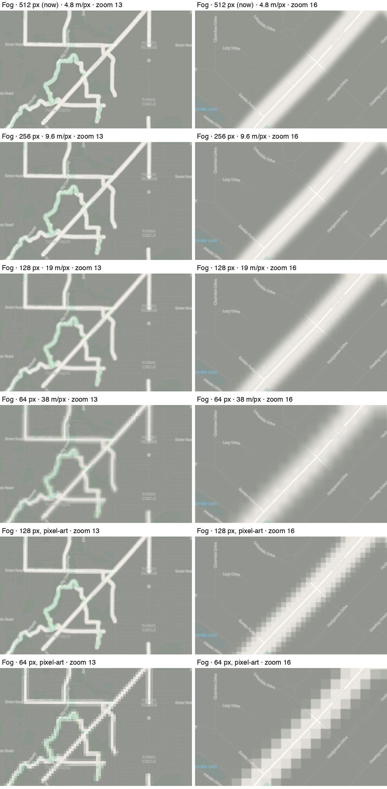
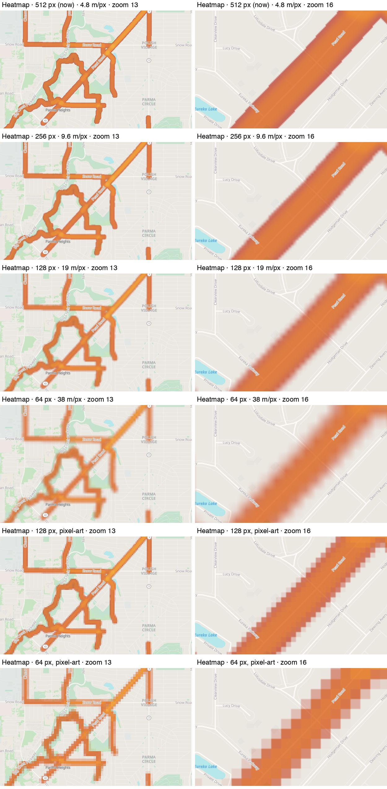

# Performance

What HoldMyTrack's performance has been measured to be, session by session: when each test ran, against what, how, and what it found. How each measured piece works lives in `IMPLEMENTATION.md`; this document holds the numbers and points there. Work a session leads to goes in the pull request that does it; a session here records what it found, not what's left to do.

## Running a session

### Tools

- `services/server/cmd/loadtest`: the driver. Creates test accounts, uploads activities, browses the map the way the web client does and reports latency per tile layer, times a single upload, and deletes the accounts. Its package comment lists the subcommands. The target is always the `-base` flag; tokens and archives go in `-dir`, outside the repo.
- `scripts/loadtest-sampler.sh`: run on the server during a test, every 5 s: host load and memory, each container's CPU and memory, the job queue by kind and state, database size and connections.
- `services/server/cmd/delayproxy`: puts object-storage latency in front of the dev stack's local store, so a render measured on a laptop pays per object what production pays to R2.
- `go test -bench` in `services/server/internal/fog`: per-tile costs (`tilecost_bench_test.go`).

### Test accounts

Production requires a verified email (`SPEC.md` FR-1.8), so test accounts are created while `api` runs with `SKIP_EMAIL_VERIFICATION=true` from a throwaway Compose override, which `compose.prod.yml` doesn't pass through on its own:

1. On the server: write `/tmp/lt-override.yml` adding `SKIP_EMAIL_VERIFICATION: "true"` to `api`'s environment, and recreate `api` with `-f compose.prod.yml -f /tmp/lt-override.yml … up -d --no-deps api`.
2. `loadtest signup 21` (20 load accounts, the last one for `probe`). Each returns a verified session.
3. Recreate `api` without the override straight away and delete the file. Check that no account other than the test ones was created in that window; the bypass has been on for 8–30 s.

Afterwards `loadtest cleanup` deletes them all; the purge (`IMPLEMENTATION.md` §4.28) removes their rows and objects. Check that no deleted account, test row or pending job is left.

### Scenarios

- **Seed**: `seed` uploads every demo track (`internal/httpapi/demo_data`, 45 files) to every account, about 945 jobs, then the queue is timed to empty. It includes the three long tracks (200+ z14 tiles each; the 1,478 km "2026-01-22 Vietnam" drive crosses 756), so it doubles as a worst case for them.
- **Browse ramp**: `browse` with 10, 25, 50, 100 and 200 users for 3 minutes each, the worker idle. Each user opens a 4×3-tile view of every layer the zoom shows (Country fog, Region fog, Fog, Tracks, Spots) every 1–2 s through a zoom-in, pan and zoom-out path, six requests at a time, with no tile cache: a cold-cache worst case, since real browsers keep each tile for good per tile version (`IMPLEMENTATION.md` §4.2.6).
- **Import**: `gen 5 1000` then `import 5`: five accounts upload a 1,000-track archive each at once. Two minutes in, and again deep into the backlog, `probe` uploads one new track from a separate account and times it to processed — the fairness check. A 12-user `browse` runs meanwhile.
- **Stop** a step on more than 2% errors, a p95 over 5 s on two consecutive steps, under 10% memory available, or an out-of-memory kill.

## Sessions

### 2026-10-08 — production, `d07834c`, the baseline

The production VPS (2 vCPU, 4 GB) with one sequential worker. 21 test accounts; the bypass was on for about 30 s.

| Users | Map views/s | Fog p95 | Tracks p95 | Country p95 | Errors |
| :-- | :-- | :-- | :-- | :-- | :-- |
| 10 | 4.0 | 0.61 s | 0.45 s | 0.32 s | 0 |
| 25 | 5.3 | 1.79 s | 1.54 s | 1.35 s | 0 |
| 50 | 5.8 | 3.90 s | 3.27 s | 2.95 s | 0 |
| 100 | 5.6 | 8.69 s | 6.93 s | 6.78 s | 0 |
| 200 | 6.7 | 15.6 s | 14.0 s | 15.4 s | 0 |

- Maps saturated at about 6 views/s from 25 users. The `api` container ran at 110–210% of the 2 vCPUs: each Fog and Heatmap tile was decoded, coloured and PNG-encoded per request. Postgres spiked only occasionally; memory never dropped below 2.4 GB available. Overload showed as latency, never as errors.
- The seed's 945 uploads were accepted in 24 s (p95 1.8 s). The single worker then took about 0.7 s per short activity and 3 min 23 s for the Vietnam track (0.27 s per z14 tile, sequential object-storage round trips); a render ran at about 1.3 tiles/s, 20 minutes for an account of about 1,600 tiles. The queue was heading for over 2 hours; the long-track copies were removed from it.
- A single upload from another account, queued at 21:19 behind other accounts' work, was still unprocessed after 55 minutes: one first-in-first-out worker, no fairness between accounts.
- Deleting the test accounts didn't stop their queued jobs, and the purge never ran: the worker drained the whole queue before its periodic sweeps got a turn. 836 queued jobs were removed by hand.
- The import scenario wasn't reached.

### 2026-10-09 — dev stack, measuring the fixes

A laptop (Apple silicon) running the dev stack.

- **Render in parallel** (`IMPLEMENTATION.md` §4.2 "Invalidation"): with 80 ms added to every object-store round trip by `delayproxy`, the Vietnam track took 93 s to ingest and 780 s to render (1,622 tiles) one tile at a time, and 7.7 s and 52 s sixteen at a time. Every Fog tile was byte-identical between the two runs.
- **Fair, concurrent worker** (`IMPLEMENTATION.md` §3.8): a claim took about 11 ms against a 5,000-job backlog of one account, 20,000 finished jobs and 20 other accounts. With 300 of one account's import jobs queued, another account's single upload was processed in 5 s.
- **Palette tiles** (`IMPLEMENTATION.md` §4.2 "Serving"): serving a Fog tile went from about 6.4 ms of CPU (0.27 ms decode, 1.1 ms colouring, 5 ms encode) to 0.66 µs. A 50-user browse took the API from about 200% CPU to about 27% and Fog's p95 from 28 ms to 3 ms.
- **Two-pass blur and dilate** (`IMPLEMENTATION.md` §4.2 "Rendering a tile"): compositing a three-activity tile went from 20.6 ms to 1.1 ms for Fog and from 62 ms to 3.3 ms for Heatmap, a pyramid tile from 7.5 ms to 1.2 ms. Output byte-identical.

### 2026-10-09 — production, `e86ccee`, stopped early

With the parallel render, the fair worker (4 loops) and palette tiles deployed. Renders were now CPU-bound: about 285–309 s each, about 4 tiles/s across all four loops, nearly all of it the per-pixel box blur. The Vietnam track ingested in 60–75 s with four at once. The run was stopped to fix the blur, and the accounts deleted; the purge dropped their queued jobs within a minute and waited only for the four running renders.

### 2026-10-09 — production, `c040021`

The same VPS with everything above plus the faster blur. 21 test accounts; the bypass was on for 8 s.

| Users | Map views/s | Fog p95 | Tracks p95 | Country p95 | Errors |
| :-- | :-- | :-- | :-- | :-- | :-- |
| 10 | 5.4 | 0.15 s | 0.08 s | 0.18 s | 0 |
| 25 | 12.3 | 0.21 s | 0.23 s | 0.50 s | 0 |
| 50 | 16.3 | 0.50 s | 0.75 s | 1.58 s | 0 |
| 100 | 16.6 | 1.06 s | 2.15 s | 4.29 s | 0 |
| 200 | 16.1 | 2.54 s | 4.04 s | 10.04 s | 0 |

- Maps saturated at about 16.5 views/s from 50 users, three times the baseline. Postgres is now what runs out: 110–145% CPU serving the live Country, Region and Tracks tiles. The API stayed at about 35% and Caddy at about 45%. At least 2.5 GB of memory stayed available.
- The seed drained in 32 minutes. The Vietnam copies took about 66 s each with four at once, CPU-bound in drawing their masks; short tracks went through at up to 4 a second; the closing renders took about 225 s each for about 1,200 dirty tiles.
- The import's five archives (12 MB each) were accepted in about 10.5 s. The queue of about 5,000 activities drained in 49 minutes: ingests at about 240 a minute, four at a time at 0.95 s each with the worker at about 74% CPU, then renders of 1,755–2,284 dirty tiles at about 5 minutes each.
- A single upload from another account was processed in 5 s both times, the second with 4,393 jobs queued ahead of it.
- 12 users browsing during the import: 6.0 views/s, Fog p95 188 ms, Tracks 200 ms, Country 364 ms.
- The database grew from 2,341 to 2,589 MB during the test and stood at 2,452 MB after the purge; Postgres keeps freed space for reuse rather than returning it.
- The purge took about 5.5 minutes per 1,000-activity account, 36 minutes for all 21: it removes each activity's objects in turn.

### 2026-10-09 — Fog and Heatmap tile resolution

Fog and Heatmap tiles are 512×512 at every zoom (about 4.8 m per pixel at z14). To see how far that could drop, the dev demo account's busiest spot was captured at zoom 13 and 16 with every Fog and Heatmap tile shrunk on its way to the browser: 256, 128 and 64 px with the clients' usual smooth stretching, and 128 and 64 px stretched with nearest-neighbour, a pixel-art look. Shrinking finished tiles approximates a render at that size; a true one also scales the stroke and the blur per pixel.

Storage was measured by re-encoding the demo account's 2,529 Fog and 2,529 Heatmap tiles at each size. PNG already compresses empty areas, so it falls by less than the pixel count; z14 tiles and the pyramid shrink by the same ratios.

| Tile size | m/px at z14 | Fog | Heatmap | Share of 512 |
| :-- | :-- | :-- | :-- | :-- |
| 512 | 4.8 | 11.75 MB | 10.21 MB | 100% |
| 256 | 9.6 | 5.00 MB | 4.49 MB | 43–44% |
| 128 | 19 | 2.05 MB | 2.02 MB | 17–20% |
| 64 | 38 | 0.92 MB | 0.94 MB | 8–9% |

256 px looks the same as 512; 128 px is softer up close; 64 px smears thin tracks at zoom 13 and pales the Heatmap; the pixel-art versions are crisp and deliberately blocky. 64 px with smooth stretching was chosen for both layers (ADR-0037).

### 2026-10-09 — dev stack, the true 64 px render

The 64 px code (ADR-0037) on the dev stack, the demo account re-rendered with `rerender-coverage --masks --user`, and its stored bytes summed from the dev object store before and after. The dev store adds a few hundred bytes of metadata per object, which at 64 px outweighs many of the images themselves, so production's R2 saving sits nearer the PNG ratios of the resolution session above.

| Stored for the demo account | 512 px | 64 px |
| :-- | :-- | :-- |
| Fog tiles (2,529) | 14.62 MB | 2.26 MB |
| Heatmap tiles (2,529) | 13.18 MB | 2.37 MB |
| Activity masks (45 activities) | 6.19 MB, 1,691 | 1.51 MB, 1,666 |

| Per tile, laptop | 512 px | 64 px |
| :-- | :-- | :-- |
| Composite, Fog | 1.1 ms | 6.9 µs |
| Composite, Heatmap | 3.3 ms | 13 µs |
| Pyramid step | 1.2 ms | 7.9 µs |
| Decode a mask | 0.58 ms | 16 µs |
| Encode a mask | 1.6 ms | 0.13 ms |
| Serve a tile | 0.66 µs | 0.39 µs |

- Redrawing the account's 45 activities' masks took about a second, and rendering all its tiles 3.6 s.
- Screenshots of the true render at zoom 10, 13 and 16, light and dark, matched the resolution session's shrunk 64 px images closely; the user signed off on them.
- The first true render had lost a whole walk: at 64 px, GPS jitter while standing still makes segments so short that `gg`'s stroker drew nothing for the track. Skipping points within half a pixel of the last one drawn fixed it (`IMPLEMENTATION.md` §4.2 "Rendering a tile"); 300 random jittery walks then all drew.
- 7 of the 1,666 masks are empty, all legitimately: the touched-tile check pads by the stroke radius, and those tracks pass 1.3–1.8 px outside the tile.

### 2026-10-09 — production, `7d013f0`, the 64 px re-render

Deploying ADR-0037 ran `rerender-coverage --masks` once over production's four accounts with coverage, 835 activities. Bucket sizes from `rclone size` before and after:

| R2 prefix | 512 px | 64 px |
| :-- | :-- | :-- |
| `fog/` | 18.06 MiB, 3,276 objects | 1.07 MiB (6%), 3,276 |
| `heatmap/` | 15.28 MiB, 3,276 objects | 1.16 MiB (8%), 3,276 |
| `activity-masks/` | 15.36 MiB, 6,154 objects | 1.57 MiB (10%), 5,997 |
| All three | 48.7 MiB | 3.8 MiB (8%) |

- Redrawing the 835 activities' masks took 6 minutes, about 0.4 s each and one at a time, nearly all of it R2 round trips. The four accounts' renders then took 16–108 s each.
- Fog and Heatmap on the demo account looked as the dev true render did; the walk the half-pixel fix rescued is there.